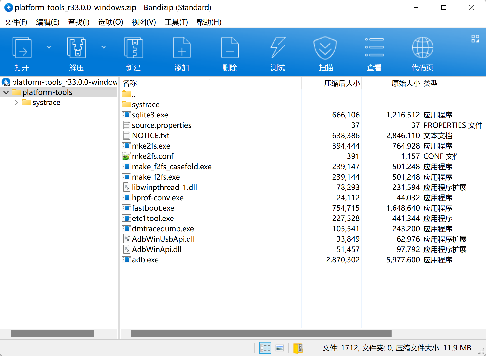
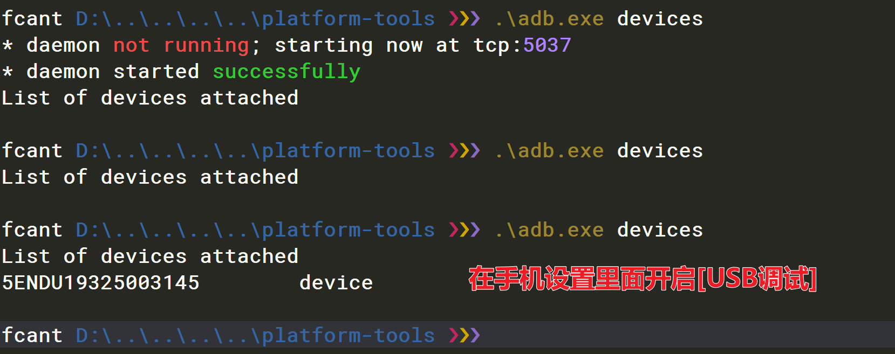
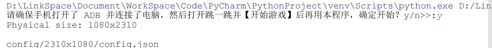

Python
<a name="fL6kC"></a>
## 使用指南
测试PC安装ADB调试工具，用于和Android设备交互，主要完成截图，截图下载，进行按压屏幕模拟。<br />下载后放到合适的位置解压，不要安装。在Win10中，系统目录和之前有所不同，所以旧的安装方法是无效的。<br />Andriod Studio SDK Platform Tools下载地址：[https://developer.android.google.cn/studio/releases/platform-tools?hl=zh_cn](https://developer.android.google.cn/studio/releases/platform-tools?hl=zh_cn)<br /><br />Android设备通过USB连接到测试PC，Android 设备开启调试模式，需要保证ADB能正常和Android连接。<br />在命令行中进入解压后的目录，输入Adb devices如果看到CMD显示一串字符，后面还有一个“device”的字样，那就说明安卓机已经成功以USB调试的形式连接到了Win10中。<br /><br />Android 进入微信跳一跳小程序并开始游戏。<br />在PC上运行脚本程序，脚本程序正常运行，输入y，开始自动游戏。<br />
<a name="SLor1"></a>
## 主要代码
```python
import json
import math
import os
import random
import re
import subprocess
import sys
import time

from PIL.Image import Image


def _get_screen_size():
    """
    获取手机屏幕分辨率
    :return:
    """
    size_str = os.popen('adb shell wm size').read()
    print(size_str)
    if not size_str:
        print('请安装 ADB 及驱动并配置环境变量')
        sys.exit()
    m = re.search(r'(\d+)x(\d+)', size_str)
    if m:
        return "{height}x{width}".format(height=m.group(2), width=m.group(1))


def init():
    """
    初始化
    :return:
    """
    # 获取屏幕分辨率
    screen_size = _get_screen_size()
    config_file_path = 'config/{0}/config.json'.format(screen_size)
    print(config_file_path)
    if os.path.exists(config_file_path):
        with open(config_file_path, 'r') as f:
            print("Load config file from {}".format(config_file_path))
            return json.load(f)
    else:
        with open('config/default.json', 'r') as f:
            print("Load default config")
            return json.load(f)


def get_screenshot():
    global SCREENSHOT_WAY
    if SCREENSHOT_WAY == 2 or SCREENSHOT_WAY == 1:
        process = subprocess.Popen('adb shell screencap -p', shell=True, stdout=subprocess.PIPE)
        screenshot = process.stdout.read()
        if SCREENSHOT_WAY == 2:
            binary_screenshot = screenshot.replace(b'\r\n', b'\n')
        else:
            binary_screenshot = screenshot.replace(b'\r\r\n', b'\n')
        with open('autojump.png', 'wb') as f:
            f.write(binary_screenshot)

    elif SCREENSHOT_WAY == 0:
        os.system('adb shell screencap -p /sdcard/autojump.png')
        os.system('adb pull /sdcard/autojump.png .')


def check_screenshot():
    global SCREENSHOT_WAY
    if os.path.isfile('autojump.png'):
        os.remove('autojump.png')

    if SCREENSHOT_WAY < 0:
        print('暂不支持当前设备')
        sys.exit()
    get_screenshot()
    try:
        Image.open('autojump.png').load()
    except Exception as e:
        print(e)
        SCREENSHOT_WAY -= 1
        check_screenshot()


def find_piece_and_board(img, con):
    w, h = img.size
    # 棋子的底边界
    piece_y_max = 0
    scan_x_side = int(w / 8)  # 扫描棋子的左右边界减少开销
    scan_start_y = 0  # 扫描起始y坐标
    # 图片像素矩阵
    img_pixel = img.load()
    # if not LOOP:  # 是否循环游戏
    #     if sum(img_pixel[5, 5][:-1]) < 150:  # 根据屏幕黑色
    #         exit('游戏结束！')
    # 以50px 步长，尝试探测 scan_start_y
    for i in range(int(h / 3), int(h * 2 / 3), 50):
        first_pixel = img_pixel[0, i]
        for j in range(1, w):
            # 如果不是纯色，说明碰到了新的棋盘，跳出
            pixel = img_pixel[j, i]
            if pixel[0] != first_pixel[0] or pixel[1] != first_pixel[1] or pixel[2] != first_pixel[2]:
                scan_start_y = i - 50
                break
        if scan_start_y:
            break

    # 从上往下开始扫描棋子，棋子位于屏幕上半部分
    left = 0
    right = 0
    for i in range(scan_start_y, int(h * 2 / 3)):
        flag = True

        for j in range(scan_x_side, w - scan_x_side):
            pixel = img_pixel[j, i]
            # 根据棋子的最低行的颜色判断，找最后一行那些点的平均值
            if (50 < pixel[0] < 60) and (53 < pixel[1] < 63) and (95 < pixel[2] < 110):
                if flag:
                    left = j
                    flag = False
                right = j
                piece_y_max = max(i, piece_y_max)
    if not all((left, right)):
        return 0, 0, 0, 0
    piece_x = (left + right) // 2
    piece_y = piece_y_max - con['piece_base_height_1_2']  # 上调高度，根据分辨率自行 调节

    # 限制棋盘扫描横坐标
    if piece_x < w / 2:  # 棋子在左边
        board_x_start = piece_x + con["piece_body_width"]//2
        board_x_end = w
    else:
        board_x_start = 0
        board_x_end = piece_x - con["piece_body_width"]//2

    # 从上往下扫描找到棋盘的顶点
    left = 0
    right = 0
    num = 0
    for i in range(int(h / 3), int(h * 2 / 3)):
        flag = True
        first_pixel = img_pixel[0, i]
        for j in range(board_x_start, board_x_end):
            pixel = img_pixel[j, i]
            # 20是色差阈值可以调节
            if abs(pixel[0] - first_pixel[0]) + abs(pixel[1] - first_pixel[1]) + abs(pixel[2] - first_pixel[2]) > 10:
                if flag:
                    left = j
                    right = j
                    flag = False
                else:
                    right = j
                num += 1
                # print(left, right)
        if not flag:
            break

    board_x = (left + right) // 2
    top_point = img_pixel[board_x, i+1]  # i+1去掉上面一条白线的bug
    # 从上顶点往下 + con['hight'] 的位置开始向上找颜色与上顶点一样的点，为下顶点
    # if num < 5:
    #     # 说明是方形
    #     if abs(top_point[0] - 255) + abs(top_point[1] - 228) + abs(top_point[2] - 226) < 5:
    #         print('唱片图案')
    #         top = 0
    #         bottom = 0
    #         for k in range(i, i + con["hight"]):
    #             pixel = img_pixel[board_x, k]
    #             # 根据唱片中的红色部分判断
    #             # if (155 < pixel[0] < 180) and (141 < pixel[1] < 165) and (113 < pixel[2] < 116):
    #             # print(pixel[0], pixel[1], pixel[2])
    #             if (abs(pixel[0] - 239) < 3) and (abs(pixel[1] - 118) < 3) and (abs(pixel[2] - 119) < 3):
    #
    #                 if not top:
    #                     top = k
    #                 else:
    #                     bottom = k
    #                 # print(top, bottom)
    #         board_y = (top + bottom) // 2
    #         return piece_x, piece_y, board_x, board_y

    # 该方法对所有纯色平面和部分非纯色平面有效
    # print(top_point)
    for k in range(i + con["hight"], i, -1):
        pixel = img_pixel[board_x, k]
        # print(pixel)
        if abs(pixel[0] - top_point[0]) + abs(pixel[1] - top_point[1]) + abs(pixel[2] - top_point[2]) < 10:
            break
    board_y = (i + k) // 2

    if num < 5:
        # 去除有些颜色比较多的误差

        if k - i < 30:
            print('酱红色433----》》》')
            board_y += (k - i)

    # 去掉药瓶

    if top_point[:-1] == (255, 255, 255):
        print('药瓶图案')
        board_y = (i + board_y) // 2

    # 去掉唱片
    if num == 3:
        if top_point[:-1] == (219, 221, 229):
            print('唱片')
            top = 0
            bottom = 0
            for k in range(i, i + con["hight"]):
                pixel = img_pixel[board_x, k]
                # 根据唱片中的红色部分判断
                # if (155 < pixel[0] < 180) and (141 < pixel[1] < 165) and (113 < pixel[2] < 116):
                # print(pixel[0], pixel[1], pixel[2])
                if pixel[:-1] == (118, 118, 118):

                    if not top:
                        top = k
                    else:
                        bottom = k
                        # print(top, bottom)
            board_y = (top + bottom) // 2
            return piece_x, piece_y, board_x, board_y

    if not all((board_x, board_y)):
        return 0, 0, 0, 0

    return piece_x, piece_y, board_x, board_y


def jump(distance, point, ratio):
    press_time = distance * ratio
    press_time = max(press_time, 200)  # 最小按压时间
    press_time = int(press_time)
    cmd = 'adb shell input swipe {x1} {y1} {x2} {y2} {duration}'.format(
        x1=point[0],
        y1=point[1],
        x2=point[0] + random.randint(0, 3),
        y2=point[1] + random.randint(0, 3),
        duration=press_time
    )
    print(cmd)
    os.system(cmd)
    return press_time


def run():
    oper = input('请确保手机打开了 ADB 并连接了电脑，然后打开跳一跳并【开始游戏】后再用本程序，确定开始？y/n>>:')
    if oper != 'y':
        exit('退出')
    # 初始化，获取配置
    config = init()
    # 检测截图方式
    check_screenshot()
    while True:
        # 获取截图
        get_screenshot()
        # 获取棋子，棋盘位置
        img = Image.open('autojump.png')
        piece_x, piece_y, board_x, board_y = find_piece_and_board(img, config)
        ntime = time.time()
        print(piece_x, piece_y, board_x, board_y, '------->')
        distance = math.sqrt((board_x - piece_x) ** 2 + (board_y - piece_y) ** 2)
        # 生成一个随机按压点，防止被ban

        press_point = (random.randint(*config['swipe']['x']),
                       random.randint(*config['swipe']['y']))
        jump(distance, press_point, config['press_ratio'])
        # if DEBUG:
        #     debug.save_debug_screenshot(ntime, img, piece_x, piece_y, board_x, board_y)
        #     debug.backup_screenshot(ntime)
        time.sleep(random.randrange(1, 2))


def test_scrennshot():

    img = Image.open('autojump.png')
    con = init()
    res = find_piece_and_board(img, con)
    print(res)

# def test_time_ratio():
#     config = init()
#
#
#     get_screenshot()
#     img = Image.open('autojump.png')
#     piece_x, piece_y, board_x, board_y = find_piece_and_board(img)
#     print(piece_x, piece_y)
#     point = (random.randint(*config['swipe']['x']),
#                    random.randint(*config['swipe']['y']))
#     t = 600
#
#     cmd = 'adb shell input swipe {x1} {y1} {x2} {y2} {duration}'.format(
#         x1=point[0],
#         y1=point[1],
#         x2=point[0] + random.randint(0, 3),
#         y2=point[1] + random.randint(0, 3),
#         duration=t
#     )
#     print(cmd)
#     os.system(cmd)
#     time.sleep(2)
#     get_screenshot()
#     img = Image.open('autojump.png')
#     piece_2x, piece_2y, board_2x, board_2y = find_piece_and_board(img)
#
#     print(piece_2x, piece_2y)
#     print(t/math.sqrt((piece_x-piece_2x)**2+(piece_y-piece_2y)**2))

if __name__ == '__main__':
    run()
    # test_time_ratio()
    # test_scrennshot()
    # get_screenshot()
    # check_screenshot()
```
