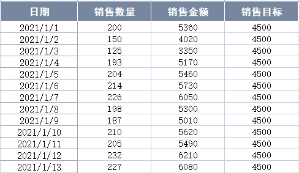
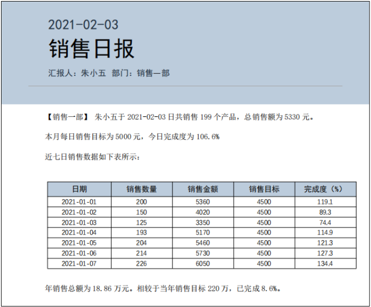
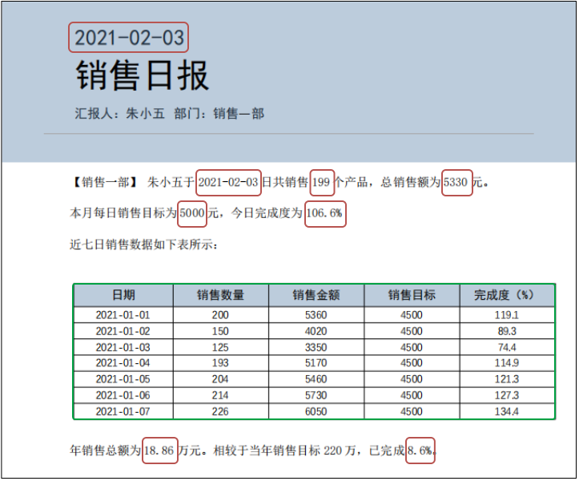
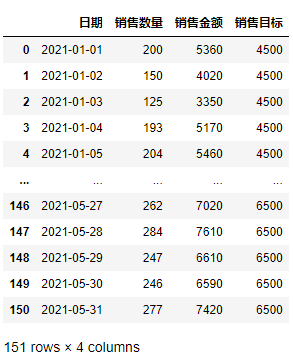
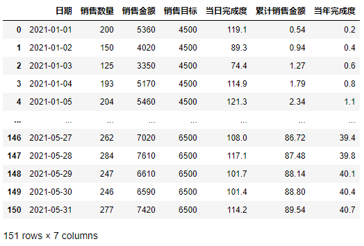
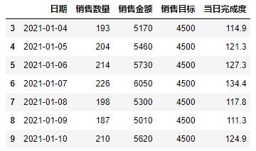
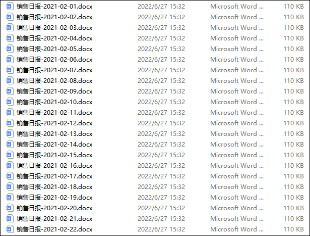

Pyhton
<a name="ETGlh"></a>
## 需求详解
朋友的需求是这样的，平时的销售数据是记录在Excel上，汇总后会按照部门进行统计。但是年初时，领导突然要求写日报，大家写了一个月发现并不检查就没继续写下去。<br /><br />现在突然被要求明天交本月之前的所有日报，这相当于要补2-5月将近120天的日报，如果靠双手复制粘贴，那估计要吐血了。朋友将其写日报的相关文件都发了过来，发现最终日报效果如下所示。<br /><br />所以需求也就是比较简单了，只需要从Excel表格中读取每日的数据，使用Python将其处理后，再依次写入Word文档中，即可实现批量生成日报。
<a name="C03H9"></a>
## 数据处理
在进行数据处理之前，要先了解最终需要哪些数据。如下图所示，在目标日报Word中主要分为两类：红色标记的数值主要是由当日的数据、或者由它们计算后得到的数据构成；绿色标记的表格则更简单了，就是近七日的数据（销售数量、销售金额、销售目标、完成度）。<br /><br />首先导入Pandas模块进行数据处理，。
```python
import pandas as pd
df = pd.read_excel("日报数据.xlsx")
df
```
输出结果<br /><br />导入数据后，接着就可以按照需求，来进行数据运算了。数据运算主要分为两种，一种是利用加 +、减 -、乘 *、除 / 进行数据运算，另一种是利用统计方法进行数据运算。<br />在交互式环境中输入如下命令：
```python
df["日期"] = df["日期"].apply(lambda x:x.strftime("%Y-%m-%d"))
df["当日完成度"] = (df["销售金额"]/df["销售目标"]*100).round(1)
df["累计销售金额"] = df["销售金额"].cumsum()
df["当年完成度"] = (df["累计销售金额"]/2200000*100).round(1)
df["累计销售金额"] = (df["累计销售金额"]/10000).round(2)
df
```
输出结果：<br /><br />可以看到，最终结果截图中红色标记的数据内容已经全部被计算出来。而绿色标记的表格则更加简单了，使用Pandas模块中的数据选取即可。<br />在交互式环境中输入如下命令：
```python
num = 10
df.iloc[num-7:num, :5]
```
输出结果：<br /><br />通过这种方法就可以轻松得到某一日期的过去7日内的日报数据合集。
<a name="hHIEI"></a>
## 自动生成日报
如果想自动生成Word日报。就要使用Python自动化操作Word通常会使用python-docx模块，而批量生成Word文档一般有两种方法：使用`add_ paragraph()`、`add_table()`等方法给Word文档添加各种内容。另一种就是这次要用的，即按照位置替换原Word文档中的文字和表格数据等。<br />在交互式环境中输入如下命令：
```python
for index, rows in df.iterrows():
    if index > 30:
        doc.paragraphs[0].runs[1].text = rows[0]
        doc.paragraphs[4].runs[4].text = rows[0]
        doc.paragraphs[4].runs[6].text = str(rows[1])
        doc.paragraphs[4].runs[8].text = str(rows[2])
        doc.paragraphs[5].runs[1].text = str(rows[3])
        doc.paragraphs[5].runs[3].text = str(rows[4])
        doc.paragraphs[9].runs[2].text = str(rows[5])
        doc.paragraphs[9].runs[7].text = str(rows[6])

        table = doc.tables[0]
        data_table = df.iloc[index-6:index+1,:5]    
        for i in range(7):
            for j in range(5):
                table.cell(i+1,j).text = str(df.iloc[i,j])
        
        doc.save(f"销售日报-{rows[0]}.docx")
```
执行代码，输出结果：<br /><br />如上图所示，120份有记录的销售日报就写好了。<br />
<a name="yUedB"></a>
## 完整代码
[Python自动生成数据日报.zip](https://www.yuque.com/attachments/yuque/0/2022/zip/396745/1657779651281-5ab96f05-5212-4899-8e71-5245e537668d.zip)
