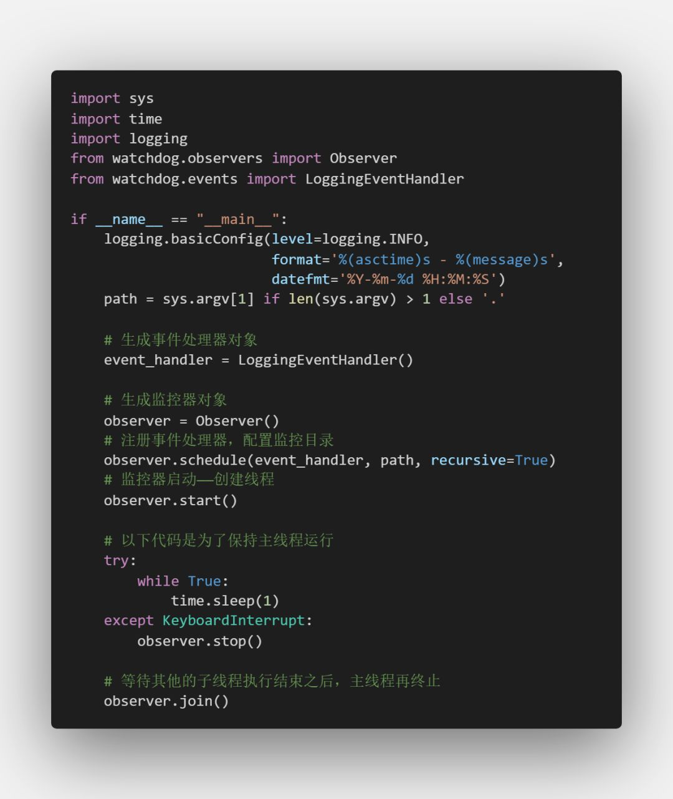
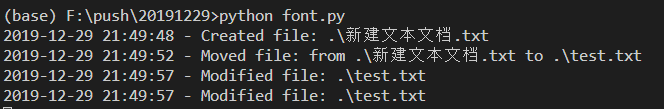
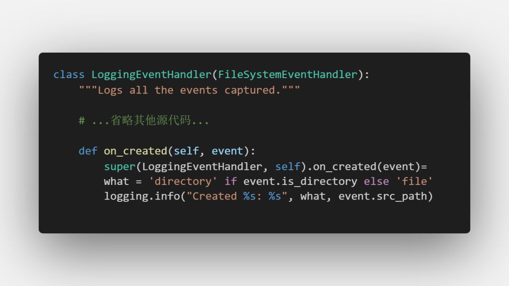
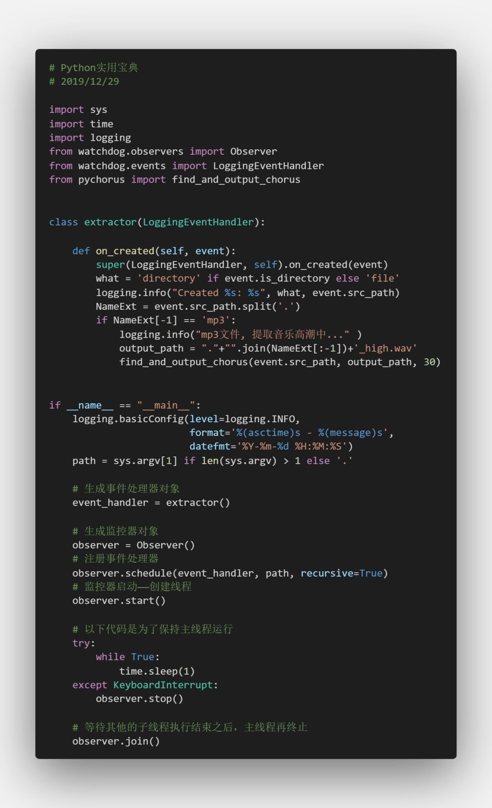
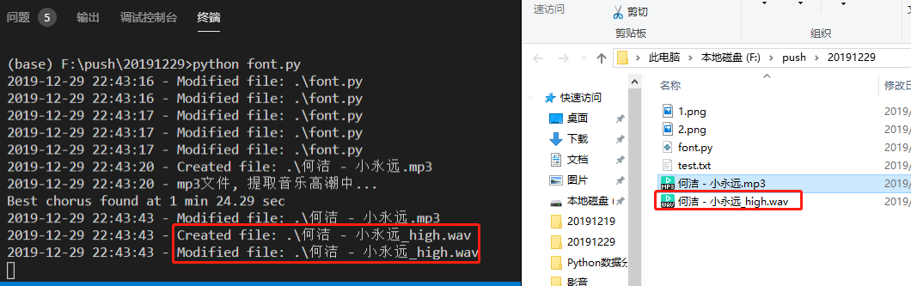

Python<br />假设现在有一个应用场景，需要对文件系统进行监控，发生变化时产生日志，对新增的文件做一些相应的操作。<br />比如说应用到之前的音乐高潮提取器：若当前文件夹下增加了一个音乐文件，监控器就调用音乐高潮提取器，自动提取该音乐文件的高潮部分。<br />这样的监控器写起来也不难，但是很花时间，有许多情况要考虑。不过Python有许多轮子可以使用，这里介绍的就是一个名为 watchdog 的模块，它能帮助实现上述功能。
<a name="nJ5nl"></a>
## 1、准备
开始之前，要确保Python和pip已经成功安装在电脑上。<br />Windows环境下打开Cmd(开始—运行—CMD)，苹果系统环境下请打开Terminal(command+空格输入Terminal)，准备开始输入命令安装依赖。<br />在终端输入以下命令安装所需要的依赖模块:
```bash
pip install watchdog
```
看到 Successfully installed xxx 则说明安装成功。
<a name="S4vaF"></a>
## 2、基本使用
看门狗的使用并不复杂，请认真看以下代码和注释：<br /><br />可以看到代码中有几个关键步骤，

1. 配置各项信息；
2. 生成事件处理器、监控器；
3. 注册事件处理器、配置目录、递归执行（即同时监控子文件夹）；
4. 启动。

其实，看门狗的observer是基于**  **`**threading.Thread**`**  **对象的，所以observer很多属性都继承了 threading.Thread 的属性。<br />如果不带参数地运行该脚本，就是要监控脚本文件所在的文件夹，如果要监控其他文件夹，记得运行时带文件夹的路径参数，如：
```bash
python obserber.py /data/home/ckend/
```
来试着运行看看：<br /><br />可以看到，在当前文件夹下做的所有操作都被记录下来了。接下来就试试怎么自定义一些操作。
<a name="C50mf"></a>
## 3、监控文件变化
要实现这样的功能，有几种方法，一个是在原来log的处理器上做一些新增修改，比如多增一个函数调用音乐高潮提取器。第二个是重新继承 `FileSystemEventHandler` 类，并做相应的修改。这里还是要保留log的样式，只是在log的时候顺便提取音乐高潮，因此采用第一个方法。<br />看看** **`**LoggingEventHandler**`** **源代码中的** **`**on_created**`** **，这就是当文件创建时监控器的操作：<br /><br />仅需要继承这个类并对** on_created **进行修改，就能完成想要的功能：<br /><br />首先声明一个类，继承** **`**LoggingEventHandler**`** **，然后重载** **`**on_created**`** **函数，在这个函数中不仅记录文件事件变化，还要对mp3文件做一次音乐高潮提取。最后别忘了，生成事件处理器时要用新的类名。<br />看看效果，将** 小永远.mp3 **复制过来：<br /><br />成功监控文件变化并提取到音乐高潮，生成高潮文件。这样，只要保持这个Python进程不关闭，它就会一直监控这个文件夹，一旦有音乐文件进入，就会自动提取它的音乐高潮，在Linux系统下，可以搭配supervisor使用，非常好用。
