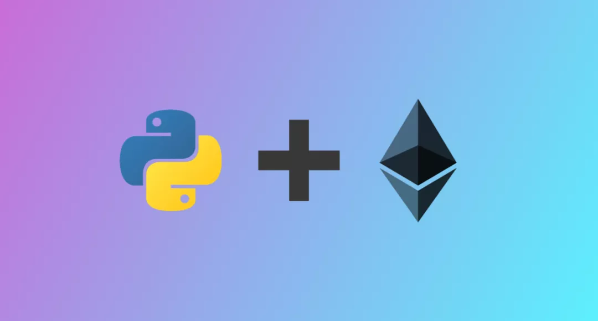

# Python 区块链




## 什么是 DApp
“DApp”代表去中心化应用程序。与传统应用程序一样，去中心化应用程序也有前端（客户端）和后端（服务器端）。DApp 的用户界面可以用任何语言编写（就像传统应用程序一样），并且可以调用其后端。那么，Dapps 与传统应用程序有何不同？DApp 的后端代码运行在分散的对等网络（即区块链）上。可能听说过 BitTorrent、Tor、Popcorn Time——它们是在点对点网络上运行但不在区块链上运行的 DApp。区块链 DApp 有自己的后端代码，称为智能合约，可以部署到区块链（最常见的是以太坊）。智能合约定义了整个 DApp 的逻辑。它是使用区块链作为后端的命脉。那么Python 开发人员可以在哪里利用它？重点来了——[web3.py](https://web3py.readthedocs.io/en/latest/)。Web3 是一组库，允许与本地或远程以太坊区块链进行交互。简单地说，web3 是与后端（区块链）通信的桥梁。幸运的是，以太坊开发人员已经制作了一个 python 库 web3.py 用于与以太坊进行交互。它的 API 源自 web3 的 JavaScript 版本。因此，除了 web3.js，也可以通过 web3.py 库与区块链进行交互。


Dapps 开发包括三个简单的步骤：

- 在区块链网络上部署智能合约
- 从部署的智能合约中读取数据
- 将交易发送到部署的智能合约


​	将在带有 web3.py 库的 python 环境中一步一步地进行这三个操作要与区块链交互，必须连接到任何完全同步的节点。在本教程中，指向一个 Infura 节点。确保有一个以太坊钱包（使用 Metamask chrome 扩展或 myetherwallet 创建以太坊钱包并安全地存储私钥）并在其中添加一些测试 Ether 以进行操作。

## 安装

- Python 2.7 +
- Node.js
- [Truffle](https://archive.trufflesuite.com/docs/)
```bash
npm install -g truffle
```

- Pip
```bash
npm i pip
```

- web3.py
```bash
pip install web3
```

- [Infura项目API](https://docs.infura.io/api)

前往 Infura 网站并注册。创建一个新项目并复制 Ropsten Infura RPC URL。把智能合约部署到 Ropsten 测试网络。

## 智能合约
​	每个程序员都用他们最喜欢的编程语言执行了一个“hello world”程序，以了解运行该语言的基础知识。这是使用 Solidity 语言编写的简单的“hello world”版本的智能合约，可以在区块链上添加问候语并检索它。[Solidity官方文档](https://docs.soliditylang.org/en/v0.8.17/)是编写智能合约最常用的语言，它编译为可以在节点上运行的以太坊虚拟机上执行的字节码。
```solidity
pragma solidity ^0.5.7;
contract greeter{
    string greeting;
    function greet(string memory _greeting)public{
        greeting=_greeting;
    }
    function getGreeting() public view returns(string memory) {
    	return greeting;
    }
}
```
​	可以通过传递字符串值使用 `greet()` 方法添加问候语，并使用 `getGreting()` 方法检索问候语。

### 1、在区块链网络上部署智能合约
#### a) 创建项目：
```bash
mkdir pythonDapp
cd pythonDapp
truffle init
```
成功初始化项目后，转到文件夹并在 /contracts目录中创建 greeter.sol 文件。在网络上部署合约之前，必须编译它并构建工件。


#### b) 智能合约的编译：
因此，对于编译，将使用 Truffle solc 编译器。在主目录中，运行以下命令：
```python
truffle compile

(or)
truffle.cmd compile #(for windows only)
```
上面的命令将在 /contracts 目录中编译合约，并在 /build 目录中创建二进制工件文件 greeter.json。


#### c) 部署合约：
打开 Python IDLE 编辑器，并在主目录 deploy.py 中使用以下代码创建一个新文件，然后在目录中运行 python deploy.py。
```python
import json
from web3 import Web3, HTTPProvider
from web3.contract import ConciseContract

# web3.py instance
w3 = Web3(HTTPProvider("https://ropsten.infura.io/v3/<API key>"))
print(w3.isConnected())

key="<Private Key here with 0x prefix>"
acct = w3.eth.account.privateKeyToAccount(key)

# compile your smart contract with truffle first
truffleFile = json.load(open('./build/contracts/greeter.json'))
abi = truffleFile['abi']
bytecode = truffleFile['bytecode']
contract= w3.eth.contract(bytecode=bytecode, abi=abi)

#building transaction
construct_txn = contract.constructor().buildTransaction({
'from': acct.address,
'nonce': w3.eth.getTransactionCount(acct.address),
'gas': 1728712,
'gasPrice': w3.toWei('21', 'gwei')})

signed = acct.signTransaction(construct_txn)

tx_hash=w3.eth.sendRawTransaction(signed.rawTransaction)
print(tx_hash.hex())
tx_receipt = w3.eth.waitForTransactionReceipt(tx_hash)
print("Contract Deployed At:", tx_receipt['contractAddress'])
```
步骤说明：

- 导入的 web3 库和所有其他必需的模块
- 通过指向 Ropsten Infura 节点启动 web3 提供程序
- 添加了用于签署交易的帐户地址和私钥。不要忘记在代码中添加凭据。
- 通过指向 Truffle 编译的工件文件greeter.json的abi和字节码启动合约实例
- 添加了带有随机数、gas、gasPrice 等参数的construct_txn。此处，gas 是指交易应在以太坊中使用和支付的最大计算资源量。gasPrice 是指在交易中使用该数量的 gas 时的最小 Ether 数量。to 指的是发送交易的地址。仅当将 Ether 发送到帐户或智能合约时才需要 to 参数。
- 使用私钥签署交易并在网络上广播。
- 在控制台中记录交易哈希和部署的合约地址。根据以太坊的说法，事务处理时间 <20 秒。所以必须等待 20 秒才能获得部署的合约地址。后端现在已成功部署在以太坊区块链上。现在可以使用此地址与智能合约进行交互。复制此合约地址。
  

### 2、向部署的合约发送交易
在合约中，有一个方法`greet()`。可以单独使用这种方法在合同中添加问候语。使用 web3.py 来做到这一点。打开的 Python IDLE 编辑器并使用以下代码创建一个新文件 sign.py。然后在目录中运行 py sign.py。
```python
import json
from web3 import Web3, HTTPProvider
from web3.contract import ConciseContract

# compile your smart contract with truffle first
truffleFile = json.load(open('./build/contracts/greeter.json'))
abi = truffleFile['abi']
bytecode = truffleFile['bytecode']

# web3.py instance
w3 = Web3(HTTPProvider("https://ropsten.infura.io/v3/<API key>")) #modify
print(w3.isConnected())
contract_address = Web3.toChecksumAddress("<Deployed Contract Address here>") #modify
key="<Private key with 0x prefix here>"#modify
acct = w3.eth.account.privateKeyToAccount(key)
account_address= acct.address

# Instantiate and deploy contract
contract = w3.eth.contract(abi=abi, bytecode=bytecode)
# Contract instance
contract_instance = w3.eth.contract(abi=abi, address=contract_address)
# Contract instance in concise mode
#contract_instance = w3.eth.contract(abi=abi, address=contract_address, ContractFactoryClass=ConciseContract)

tx = contract_instance.functions.greet("Hello all  my goody people").buildTransaction({'nonce': w3.eth.getTransactionCount(account_address)})
#Get tx receipt to get contract address
signed_tx = w3.eth.account.signTransaction(tx, key)
#tx_receipt = w3.eth.getTransactionReceipt(tx_hash)
hash= w3.eth.sendRawTransaction(signed_tx.rawTransaction)
print(hash.hex())
```
步骤说明：

- 导入的 web3 库和所有其他必需的模块
- 通过指向 Ropsten Infura 节点启动 web3 提供程序
- 添加了用于签署交易的帐户地址和私钥
- 通过指向 Truffle 编译的工件文件greeter.json的abi和字节码启动合约实例
- 创建 tx 对象以添加问候语“hello all my goody people”并建立交易
- 使用私钥签署交易并在网络上广播。
- 在控制台中记录交易哈希。可以使用交易哈希在 etherscan 上检查交易状态。一旦交易被矿工验证，问候语将被添加到区块链上。可以使用 `getGreeting()` 函数检索问候语，如下所述。
### 3、从部署的智能合约中读取数据
在合约中，有一个方法 `getGreeting()` 可以检索在区块链中添加的问候语。使用 web3.py 调用此方法 打开的 Python IDLE 编辑器并使用以下代码创建一个新文件 read.py。运行 py read.py 读取问候语。
```python
import json
from web3 importWeb3, HTTPProvider
from web3.contract importConciseContract

# compile your smart contract with truffle first
truffleFile = json.load(open('./build/contracts/greeter.json'))
abi = truffleFile['abi']
bytecode = truffleFile['bytecode']


# web3.py instance
w3 = Web3(HTTPProvider("https://ropsten.infura.io/<ApI Key here>"))
print(w3.isConnected())
contract_address = Web3.toChecksumAddress("<Deployed Contract Address here>")


# Instantiate and deploy contract
contract = w3.eth.contract(abi=abi, bytecode=bytecode)
# Contract instance
contract_instance = w3.eth.contract(abi=abi, address=contract_address)
# Contract instance in concise mode
#contract_instance = w3.eth.contract(abi=abi, address=contract_address, ContractFactoryClass=ConciseContract)


# Getters + Setters for web3.eth.contract object ConciseContract
#print(format(contract_instance.getGreeting()))


print('Contract value: {}'.format(contract_instance.functions.getGreeting().call()))
```
步骤说明：

- 导入的 web3 库和所有其他必需的模块
- 通过指向 Ropsten Infura 节点启动 web3 提供程序
- 通过指向 abi 和 `contract_Address` 创建合约实例（来自上一步）
- 调用 `getGreeting()` 方法并在控制台打印结果
