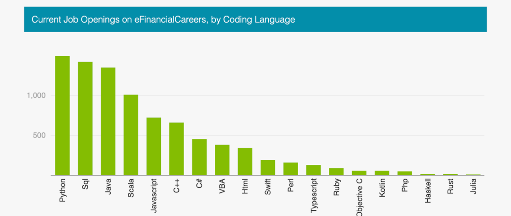
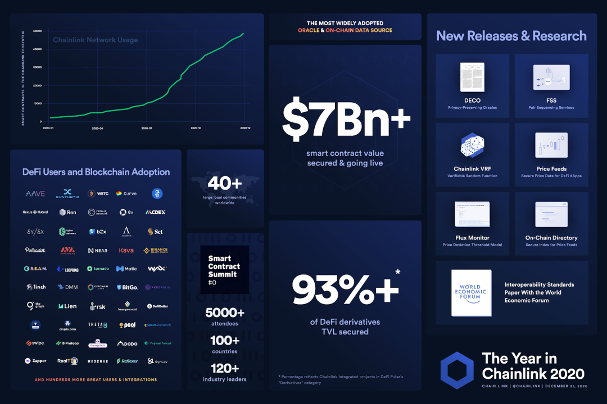

# Python

​	使用 Python 开发 DeFi 项目。去中心化金融 (DeFi) 是区块链和智能合约世界最重要的进步之一，通常被称为“新金融科技”。目前，智能合约开发由 JavaScript 主导，部分原因可能是 JavaScript 是地球上最常用的语言，并且与 Node.js 配合构建全栈应用程序更容易。然而，量化分析师、股票交易员和对冲基金的金融科技世界并非如此。大多数金融科技公司出于各种原因使用 Python：

- 更高效的开发体验
- 强大的人工智能和机器学习
- 捆绑的金融科技包
- 综合分析工具
- 生产环境中的可靠性



​	如此多的数据科学家、学者和金融科技机构使用 Python 是有原因的。DeFi 领域的一些项目，如yearn.finance，分享了这种观点，并使用 Python 和 Solidity 构建了他们的整个 DeFi 平台。正是由于像 web3.py 和 [Brownie ](https://eth-brownie.readthedocs.io/en/stable/) 这样的库和框架，才能看到这些项目变得生动起来。Brownie 是一个类似于 Truffle 的框架（它们都非常“sweet”），它维护部署、脚本、测试，并允许制作端到端的后台。

​	Web3.py和Brownie还提供了“mix”，可以在其中使用一些样板代码预打开项目。这就是将使用的Chainlink Brownie mix 和[chainlink-mix](https://github.com/smartcontractkit/chainlink-mix)以及[Chainlink Documentation](https://docs.chain.link/)

​	为什么要使用 Chainlink + Python？正如 Python 是金融科技事实上的编程语言一样，Chainlink 是将链下数据提供给 DeFi 智能合约的事实上的预言机解决方案，目前为顶级 DeFi 协议提供了超过 7B 美元的价值。这两种技术的结合为去中心化金融科技领域提供了一个安全而强大的框架。

​	以下是 Chainlink 在 2020 年启用的一些功能的快速浏览。



​	要开始使用 Brownie 和 Python 构建 DeFi 应用程序，首先需要安装 Python。此时不建议 Python 低于 3.4 版本，因此如果版本低于 3.4，请升级。可以通过运行以下命令查看 Python 版本并验证它是否已正确安装：

```bash
python --version
```
或者，如果使用 python3：
```bash
python3 --version
```
​	还需要安装 [Ganache](https://archive.trufflesuite.com/docs/ganache/)。Ganache 是一个用 Python 编写的一键式区块链应用，可轻松启动本地区块链。尽管必须使用 npm 和 node.js 下载它，但这将是必须与之交互的唯一 JavaScript 片段。


​	首先，需要安装 node.js 和 npm。Node.js 随 npm 一起安装。下载后，可以通过运行以下命令来检查它是否正确完成：

```bash
npm -v
```
​	然后，可以通过命令行安装 Ganache。
```bash
npm install -g ganache-cli
```
​	安装完成后，像安装所有 Python 存储库一样使用 pip 安装 [eth-brownie](https://eth-brownie.readthedocs.io/en/stable/)
```bash
pip install eth-brownie
```
或者如果使用 pip3：
```bash
pip3 install eth-brownie
```
如果在终端中运行 brownie，会得到类似于以下内容的输出：
```bash
Brownie v1.13.0- Python development framework forEthereum
Usage:  brownie &lt;command> [&lt;args>...] [options &lt;args>]
Commands:
  init               Initialize a new brownie project
  bake               Initializefrom a brownie-mix template
  pm                 Installand manage external packages
  compile            Compile the contract source files
  console            Load the console
  test               Run test cases in the tests/ folder
  run                Run a script in the scripts/ folder
  accounts           Managelocal accounts
  networks           Manage network settings
  gui                Load the GUI to view opcodes and test coverage
  analyze            Find security vulnerabilities using the MythX API
Options:
--help -h          Displaythis message
--version          Show version andexit
Type'brownie &lt;command> --help'for specific options and more information about
each command.
```
​	此外，还需要一个 MetaMask 或其他以太坊钱包。请使用 Kovan测试网获得ETH。请确保 ETH 钱包中有一些 testnet LINK 和 Kovan ETH。可以在 LINK faucet 和 ETH Kovan faucet 中找到一些。

## 启动 Chainlink 项目
​	要开始使用Brownie,，可以使用所谓的Brownie mix 来为提供样板代码。在这个例子中，将部署一个简单的 Chainlink Price Feed 作为了解 Brownie 框架的一种方式。bake chainlink-mix。
```bash
brownie bake chainlink-mix
cd chainlink
```
这将进入一个新项目，其中已经构建了一些默认代码。如果运行 `ls` 可以看到文件的布局是什么样的：

- build ：这是项目跟踪部署的智能合约和编译的合约的地方
- contracts：合同的源代码，通常用 Solidity 或 Vyper 编写
- interfaces ：需要使用已部署合同的接口布局。与合约的每次交互都需要一个 ABI 和一个地址。接口是获取合约 ABI 的好方法
- scripts：创建的脚本来自动化处理合同的过程 测试
- tests：测试
- brownie-config.yaml ：这是为 Brownie 了解如何使用智能合约提供所有信息的地方。要部署到哪个区块链？有没有想要设置的特殊参数？所有这些都在配置文件中设置。

现在可以忽略 requirements.txt 、 README.md 、 LICENSE 和 .gitignore。

## 设置环境变量
​	尽管只是安装了 Ganache 来进行本地测试，但希望能够连接到 ETH 主网和测试网，以便可以将它们部署在真实的测试网上。为此，需要设置 `WEB3_INFURA_PROJECT_ID`。可以从 [infura.io](https://www.infura.io/zh)站点免费获得一个 Infura ID。也可以使用其他 web3 提供程序或自己的节点，必须为此做更多的配置。[Infura API](https://docs.infura.io/api)

​	在 `brownie-config.yaml` 文件中，可以使用主机密钥设置网络，并定义不想使用 MetaMask 时想要连接的 URL。

​	现在有了 web3 ID，需要将私钥作为环境变量，以便可以将帐户与钱包一起使用。如果使用 MetaMask，请查找导出密钥。使用 MetaMask，可能需要在私钥的开头添加 `0x`。建议在测试和导出密钥时使用与主帐户不同的帐户，以防万一。

​	现在，要使它们成为环境变量，只需在终端中运行以下命令：

```bash
export PRIVATE_KEY=0x96789…..
export WEB3_INFURA_PROJECT_ID='dog cat mouse….'
```
​	如果运行 `printenv` 并在那里看到环境变量。

## 部署智能合约
现在已经设置好了一切，甚至可以继续将智能合约部署到 [Kovan](https://kovan-testnet.github.io/website/)测试网！

在脚本文件夹中，有一个名为 `deploy_price_consumer_v3.py`的脚本。这将部署智能合约，以美元读取以太坊的价格。

只需使用 `brownie run` 即可使用部署脚本：

```bash
brownie run scripts/price_feed_scripts/deploy_price_consumer_v3.py --network kovan
```
会看到：
```bash
Running'scripts/price_feed_scripts/deploy_price_consumer_v3.py::main'...
Transaction sent: 0x23d1dfa3937e0cfbab58f8d5ecabe2bfffc28bbe2349527dabe9289e747bac56
Gas price: 20.0 gwei   Gas limit: 145600Nonce: 1339
PriceFeed.constructor confirmed - Block: 22721813Gas used: 132364(90.91%)
PriceFeed deployed at: 0x6B2305935DbC77662811ff817cF3Aa54fc585816
```
如果这工作正常，可以去 Kovan Etherscan 并找到部署的合约。上面的链接显示了此示例中部署的合约。

## 读取智能合约
现在已经部署了一个智能合约，可以从刚刚部署的合约中读取 ETH 的价格。使用另一个脚本：
```bash
brownie run scripts/price_feed_scripts/read_price_feed.py --network kovan
```
得到如下输出：
```bash
Brownie v1.12.2- Python development framework forEthereum
ChainlinkProjectis the active project.
Running'scripts/price_feed_scripts/read_price_feed.py::main'...
Reading data from0x5A….
122322000000
```
其中 122322000000 是 ETH 的当前美元价格！Solidity 不理解小数，Chainlink Price Feeds 有 8 位小数，所以价格是 $1,223.22 。

## 测试智能合约
使用模拟对象在本地进行测试！

只需运行：

```bash
brownie test
```
测试将在本地 Ganache 实例上运行！

还可以使用以下内容在测试网上进行测试：

```bash
brownie test --network kovan
```
这些测试具有一些功能，可以知道是否在测试网络上工作。如果在本地工作，它会部署 虚拟或“模拟”的预言机代码，以便可以对其进行测试。


## 总结
​	现在知道如何使用 Python 部署智能合约，可以开始在此框架之上构建以做更多有趣的事情。Python 拥有强大的软件包，如 [NumPy](https://numpy.org/doc/)、[scikit-learn](https://scikit-learn.org/stable/user_guide.html)、[pandas](https://pandas.pydata.org/pandas-docs/stable/)和 [TensorFlow](https://tensorflow.google.cn/api_docs)，可用于执行定量工作、机器学习等。能够最终将这些技术结合在一起是金融科技新时代成功的秘诀：去中心化金融。

​	Chainlink 是一个灵活的框架，用于将外部金融数据和系统引入链上，并与 Numpy 和 Pandas 等以数据为中心的软件包无缝集成。如果开发人员并希望快速将应用程序连接到 Chainlink，请访问开发人员文档。

[https://docs.chain.link/?_ga=2.263617100.1196435661.1623840137-1423897284.1623840137](https://docs.chain.link/?_ga=2.263617100.1196435661.1623840137-1423897284.1623840137)
