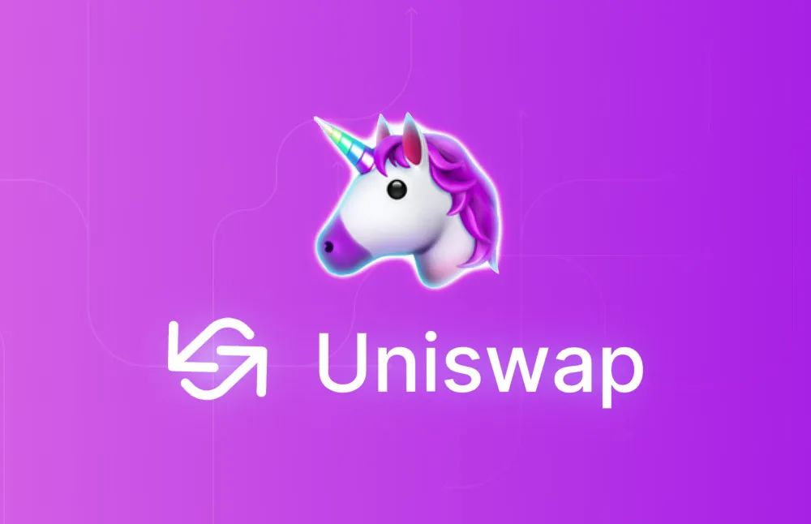
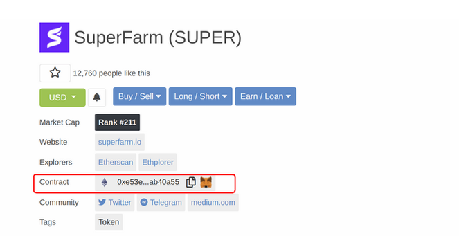
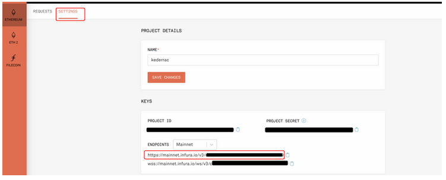
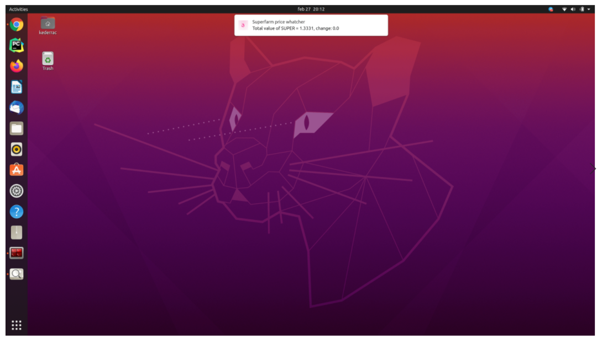
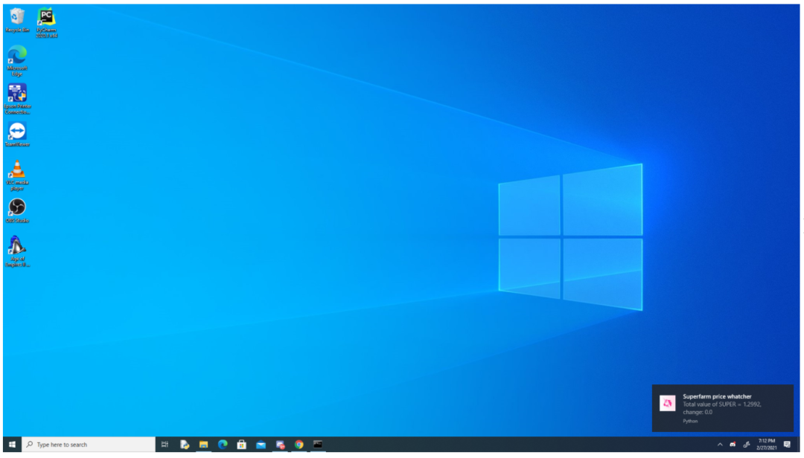
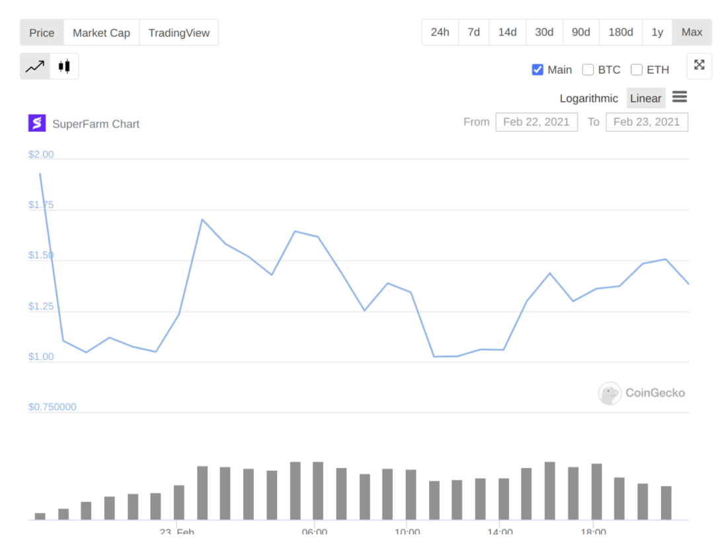

# Python



​	[Uniswap](https://wallet.uniswap.org/)是一个基于以太坊的交易所协议，允许任何人交换ERC20代币。普遍上讲，交易代币要求买卖双方创造委托订单，而Uniswap则是自动创建一个交易市场。Uniswap旨在帮助解决去中心化交易所的流动性问题，是一种去中心化的交易所。

在过去的几个月里，在 [Uniswap](https://www.uniswapfoundation.org/)上新上市的币上观察到了一个非常有趣的规律，尤其是那些被炒作的币种。在新币上市后的前 10-15 分钟内，价格上涨非常高，不过在接下来的几个小时内大幅下跌，然后在接下来的 24 小时内上涨超过 50%。不要以为可以在价格低的时候买进，然后10分钟后高价卖出。因为以太坊网络拥堵的原因，这段时间的gas费用非常高（数百美元）。

<br />Superfarm 是之前比较受欢迎的一个新项目，在 Telegram 上拥有超过 86,000 名成员，在 Twitter 上拥有超过 88,000 名关注者。所以来测试一下这个规律，或者说进行推测。

为了查看 Uniswap 的价格，使用 [uniswap-python documentation](https://uniswap-python.com/) 库。

```python
!pip install uniswap-python
```
`pip` 前面的感叹号是因为已经在 Jupyter Notebook 中进行了编码，并且已经从 Notebook 单元安装了所有必要的 python 库。

```python
eth = "0x0000000000000000000000000000000000000000"
dai = "0x6B175474E89094C44Da98b954EedeAC495271d0F"
sup = "0xe53EC727dbDEB9E2d5456c3be40cFF031AB40A55"

address = "0x0000000000000000000000000000000000000000"  #  if you're not making transactions
private_key = None  # if you're not going to make transactions

provider = <the url of your provider> # if you use Infura 
 will be 
 like 'https://mainnet.infura.io/v3/########'
uniswap_wrapper = Uniswap(address, private_key, version=2, provider=provider)  # use Uniswap v2
```
第一个变量包含想要在 Uniswap 上获得加密货币的以太坊地址校验和。

要获取加密货币的以太坊地址校验和，可以使用 Coingecko 首先获取合约地址：




然后就可以使用下面网站轻松从合约地址中获取以太坊地址校验和。

[https://ethsum.netlify.app/](https://ethsum.netlify.app/)

​	如果不太熟悉什么是以太坊地址校验和，可以将其视为一个标识符，基于这个加密货币标识符 Uniswap 将能够提供价格。

​	[Web3js providers](https://docs.web3js.org/guides/web3_providers_guide/)是一个运行 geth 或 parity 节点的网站，它与以太坊网络交互。要获得provider，可以使用 [infura](https://www.infura.io/zh)。如果使用 Infura，必须注册然后创建一个新项目，在设置选项卡上可以看到提供商 URL：

<br />要获得以 eth 表示的 Superfarm 币价格：

```python
sup_price = uniswap_wrapper.get_token_eth_input_price(sup, 10 ** 18)

print(sup_price / 10**18)
# 0.000901625376604887
```
`10 ** 18`代表Superfarm 币的数量，它必须是一个整数值，如果选择小数量值将是0（由于近似），所以需要一个大数量。将获得 `10 ** 18`个 Superfarm 币的 eth 价格。

如果想以美元计算 1 个 Superfarm 币的价格，可以使用 Dai 稳定币（1 Dai ~= 1 美元）。可以请求相同数量的 Superfarm 和 Dai 币，然后分割它们。

```python
def get_sup_price_in_dollars():
    sup_price = uniswap_wrapper.get_token_eth_input_price(sup, 10 ** 18)
    dai_price = uniswap_wrapper.get_token_eth_input_price(dai, 10 ** 18)
    return round(sup_price / dai_price, 4)

print(get_sup_price_in_dollars())
# 1.357 --> the price in dollars for 1 Superfarm coin
```
为了在桌面上推送通知，使用了[plyer](https://plyer.readthedocs.io/en/latest/)库：
```python
!pip install plyer
```
这是监控 Superfarm 价格和自前一个值以来的变化的函数：
```python
from plyer import notification

def notify(price: int, new_price: int):
    notification.notify(
        title = 'Superfarm price whatcher',
        message = f"Total value of SUPER = {new_price}, change: {round(new_price - price, 3)}",
        timeout = 10,
        app_icon = '/home/kederrac/Pictures/uniswap.ICO',
    )
```
还添加了一个应用程序图标，为了能够使用应用程序图标，还必须将 .png 图片转换为 .ico 格式，安装[dbus-python](https://dbus.freedesktop.org/doc/dbus-python/tutorial.html)库（如果使用的是 Windows，则不需要）。
```python
!pip install  dbus-python
```
现在把它们放在一起：
```python
import time

price = get_sup_price_in_dollars()
notify(price, price)

while True:
    new_price = get_sup_price_in_dollars()
    
    if abs(price - new_price) > 0.05:
        notify(price, new_price)
        
    price = new_price
    time.sleep(10)
```
在这里，每 10 秒调用一次 `get_sup_price_in_dollars()` 函数来检查价格是否发生变化，如果变化大于 0.05 美元，将推送通知，可以更改变化的最小值以获得通知，或者可以设置要通知的最低价格目标。

结果如下：



（在 ubuntu 20.04 上)

（在 windows 10 上）

这对于实时价格通知非常有帮助，这种方法的另一优点是速度，与必须使用 Coingecko 相比，将获得数分钟的时间，如果使用 Uniswap 网络界面，时间将更快。

在这里可以看到一开始所说的规律：


