如今学习应用数据可视化的渠道有很多，可以跟踪一些专家博客，但更重要的一点是实践/实操，必须对目前可用的数据可视化工具有个大致了解。 下面列举的二十个数据可视化工具，无论是准备制作简单的图表还是复杂的图谱或者信息图，这些工具都能满足需要。更加美妙的是，这些工具大多免费。

## **入门级工具**

### 1、Excel
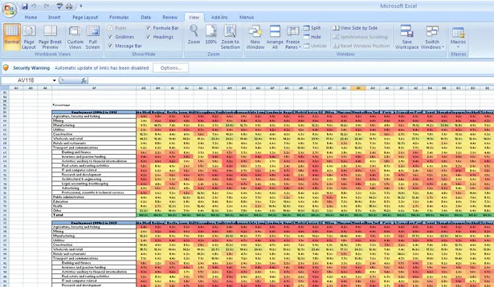 Excel的图形化功能并不强大，但Excel却是分析数据的理想工具，上图是Excel生成的热力地图。 作为一个入门级工具，Excel是快速分析数据的理想工具，也能创建供内部使用的数据图，但是Excel在颜色、线条和样式上可选择的范围有限，这也意味着用Excel很难制作出能符合专业出版物和网站需要的数据图。 不过作为一个高效的内部沟通工具，Excel应当是你百宝箱中必备的工具之一。

### 2、CSV/JSON
CSV(逗号分隔值)和JSON(JavaScript对象注释)虽然并不是真正的可视化工具，但却是常见的数据格式。 必须理解他们的结构，并懂得如何从这些文件中导入或者导出数据**。** 以下将要介绍的所有数据可视化工具都支持CSV、JSON中至少一种格式。

## **在线数据可视化工具**

### 3、Google Chart API  
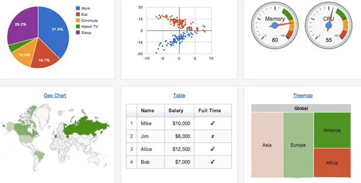 Google Chart API工具集中取消了静态图片功能，目前只提供动态图表工具。 能够在所有支持SVG\Canvas和VML的浏览器中使用，但是Google Chart的一个大问题是：图表在客户端生成，这意味着那些不支持JavaScript的设备将无法使用，此外也无法离线使用或者将结果另存其他格式，之前的静态图片就不存在这个问题。 尽管存在上述问题，不可否认的是Google Chart API的功能异常丰富，如果没有特别的定制化需要，或者对Google视觉风格的抵触，那么大可以从Google Chart开始。

### 4、Flot
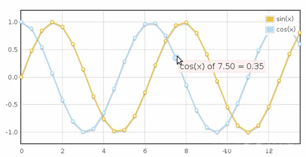 Flot是一个优秀的线框图表库，支持所有支持canvas的浏览器(目前主流的浏览器如火狐、IE、Chrome等都支持)。

### 5、Raphael
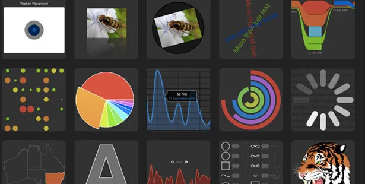 Raphael是创建图表和图形的JavaScript库，与其他库最大的不同是输出格式仅限SVG和VML。 SVG是矢量格式，在任何分辨率下的显示效果都很好。

### 6、D3
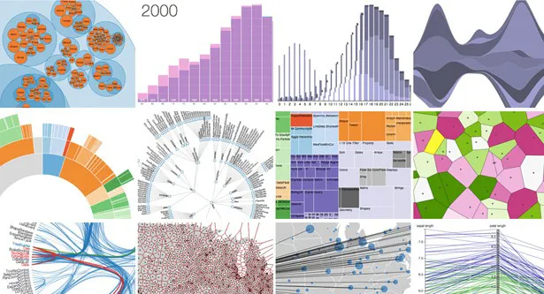 D3(Data Driven Documents)是支持SVG渲染的另一种JavaScript库。 D3能够提供大量线性图和条形图之外的复杂图表样式，例如Voronoi图、树形图、圆形集群和单词云等。 虽然D3能够提供非常花哨的互动图表，但在选择数据可视化工具时，需要牢记的一点是：知道在何时保持简洁。

### 7、Visual.ly
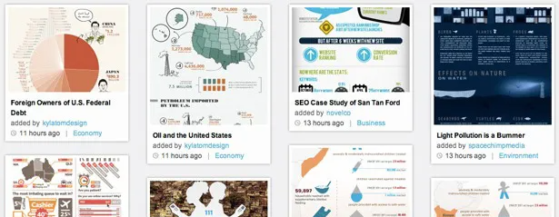 如果需要制作信息图而不仅仅是数据可视化，目前也有大把的工具可用。 Visual.ly就是最流行的一个选择。虽然Visual.ly的主要定位是：“信息图设计师的在线集市”，但是也提供了大量信息图模板。虽然功能还有很多限制，但是Visual.ly绝对是个能激发你灵感的地方。

## **互动图形用户界面(GUI)控制**
如果数据可视化的互动性强大到可以作为GUI界面会怎样？ 随着在线数据可视化的发展，按钮、下拉列表和滑块都在进化成更加复杂的界面元素，例如能够调整数据范围的互动图形元素，推拉这些图形元素时输入参数和输出结果数据会同步改变。 在这种情况下，图形控制和内容已经合为一体。以下这些工具能够实现这些功能：

### 8、Crossfilter
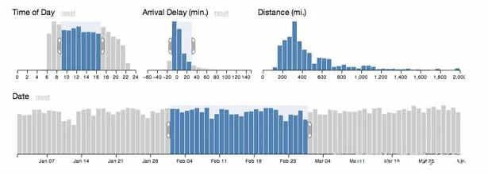 当能为方便客户浏览数据开发出更加复杂的工具时，已经能够创建出既是图表，又是互动图形用户界面的小程序。JavaScript库Crossfilter就是这样的工具。 Crossfilter应用：当调整一个图表中的输入范围时，其他关联图表的数据也会随之改变。

### 9、Tangle
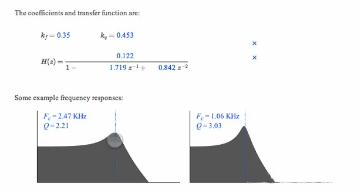 JavaScript库Tangle进一步模糊了内容与控制之间的界限。 在上图的应用实例中，Tangle生成了一个负载的互动方程，读者可以调整输入值获得相应数据。

## **地图工具**
地图生成是web上最困难的任务之一。Google Maps的出现完全颠覆了过去人们对在线地图功能的认识。而Google发布的Maps API则让所有的开发者都能在自己的网站中植入地图功能。 近年来，在线地图的市场成熟了很多，如果需要在数据可视化项目中植入定制化的地图方案，目前市场上已经有很多选择，但是知道在何时选择何种地图方案则成了一个很关键的业务决策。 地图方案看上去功能都很强大，但是切忌：“有了一把锤子，看什么都像钉子”

### 10、Modest Maps
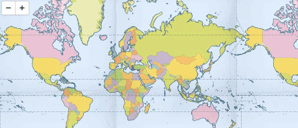

顾名思义，Modest Maps是一个很小的地图库，只有10KB大小，是目前最小的可用地图库。 这似乎意味着Modest Maps只提供一些基本的地图功能，但是不要被这一点迷惑了。在一些扩展库的配合下，例如Wax，Modest Maps立刻会变成一个强大的地图工具。

### 11、Leaflet
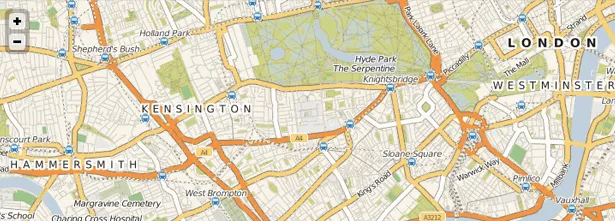

CloudMade团队为大家带来了Leaflet，这是另外一个小型化的地图框架，通过小型化和轻量化来满足移动网页的需要。 Leaflet和Modest Maps都是开源项目，有强大的社区支持，是在网站中整合地图应用的理想选择。

### 12、PolyMaps
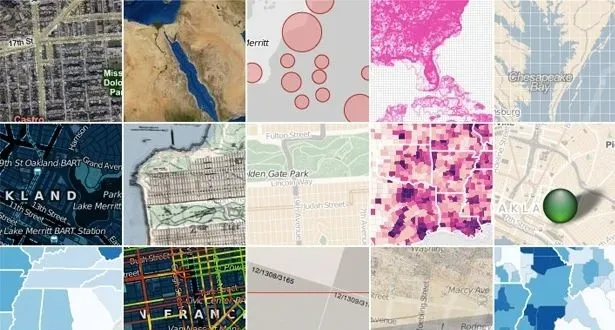 Polymaps是另外一个地图库，但主要面向数据可视化用户。 Polymaps在地图风格化方面有独到之处，类似CSS样式表的选择器，是不可错过的好东西。

### 13、OpenLayers
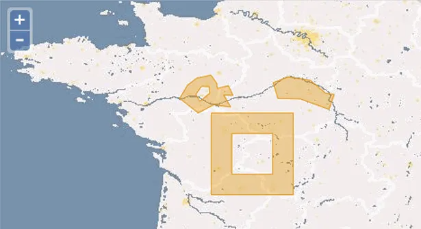 OpenLayers可能是所有地图库中可靠性最高的**一**个。 虽然文档注释并不完善，且学习曲线非常陡峭，但是对于一些特定的任务来说，OpenLayers无可匹敌。例如能够提供一些其他地图库都没有的特殊工具。

### 14、Kartograph
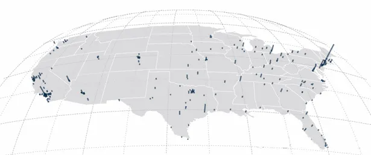 Kartograph的标记线是对地图绘制的重新思考，都已经习惯了莫卡托投影，但是Kartograph带来了更多的选择。 如果不需要调用全球数据，而仅仅是生成某一区域的地图，那么Kartogaph将使你脱颖而出。

### 15、CartoDB
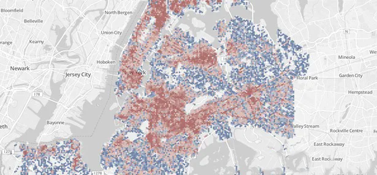 CartoDB是一个不可错过的网站。可以用CartoDB很轻易就把表格数据和地图关联起来，这方面CartoDB是最优秀的选择。 例如，可以输入CSV通讯地址文件，CartDB能将地址字符串自动转化成经度/维度数据并在地图上标记出来。目前CartoDB支持免费生成五张地图数据表，更多使用需要支付月费。 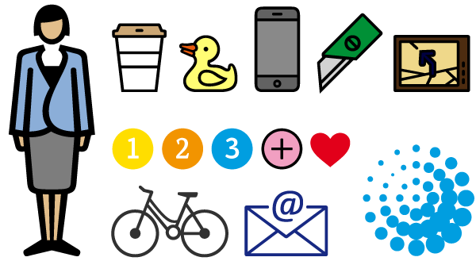

随着高清移动设备的普及，web开发的一个最新趋势是将符号字体与字体整合(把符号变成字体)，创建出漂亮的矢量化图标。 在这些新型字体中，例如FF Chartwell和Chartjunk是专门用来显示图表和图形的。 他们与OpenType碰到的问题一样，就是不能被所有的浏览器支持，但是不久的未来这些矢量字体将是数据可视化工作中需要考虑到的因素。

## **进阶工具**
如果准备用数据可视化做一些“严肃”的工作，那么可能不会对在线可视化工具或者web小程序有太大兴趣，需要的是桌面应用和编程环境。

### 16、Processing
 Processing是数据可视化的招牌工具。只需要编写一些简单的代码，然后编译成Java。 目前还有一个Processing.js项目，可以让网站在没有Java Applets的情况下更容易地使用Processing。 由于端口支持Objective-C，也可以在iOS上使用Processing。 虽然Processing是一个桌面应用，但也可以在几乎所有平台上运行，此外经过数年发展，Processing社区目前已经拥有大量实例和代码。

### 17、NodeBox
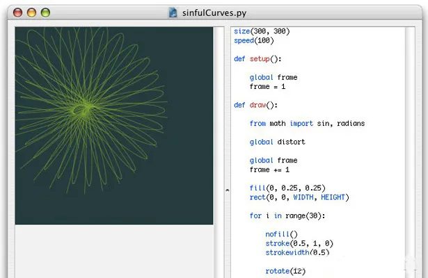 NodeBox是OS X上创建二维图形和可视化的应用程序。 需要了解Python程序，NodeBox与Processing类似，但是没有Processing的互动功能。

## **专家级工具**
与Excel相对的是专业数据分析工具。如果你是一个专业的数据分析师，那么就必须对下面将要介绍的工具有所了解(如果不是精通的话)。 众所周知，SPSS和SAS是数据分析行业的标准工具，但是这些工具的费用不菲，只有大型组织和学术机构才有机会使用。 下面介绍几种免费的替代工具，这些开源工具的共同特征是都有强大的社区支持。开源分析工具性能不输老牌专业工具，插件的支持甚至更好。

### 18、Ｒ
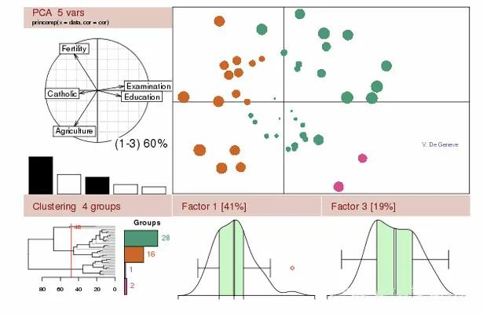 作为用来分析大数据集的统计组件包，Ｒ是一个非常复杂的工具，需要较长的学习实践，学习曲线也是本文所介绍工具中最陡峭的。 但是Ｒ拥有强大的社区和组件库，而且还在不断成长。当你能驾驭Ｒ的时候，一切付出都是物有所值的。

### 19、Weka
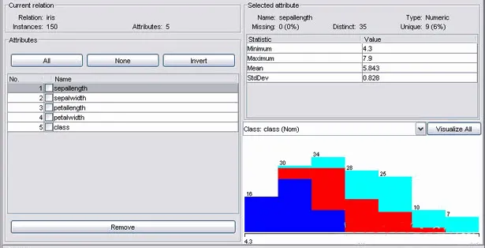 当你成长成一名数据科学家的时候，需要将个人能力从数据可视化扩展到数据挖掘领域。 Weka是一个能根据属性分类和集群大量数据的优秀工具，Weka不但是数据分析的强大工具，还能生成一些简单的图表。

### 20、Gephi
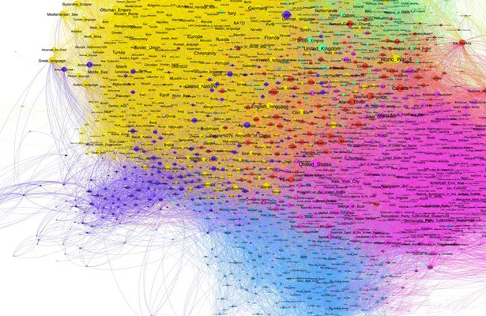 Gephi是进行社交图谱数据可视化分析的工具，不但能处理大规模数据集并生成漂亮的可视化图形，还能对数据进行清洗和分类。 Gephi是一种非常特殊的软件，也非常复杂，先于他人掌握Gephi将使你一骑绝尘。
