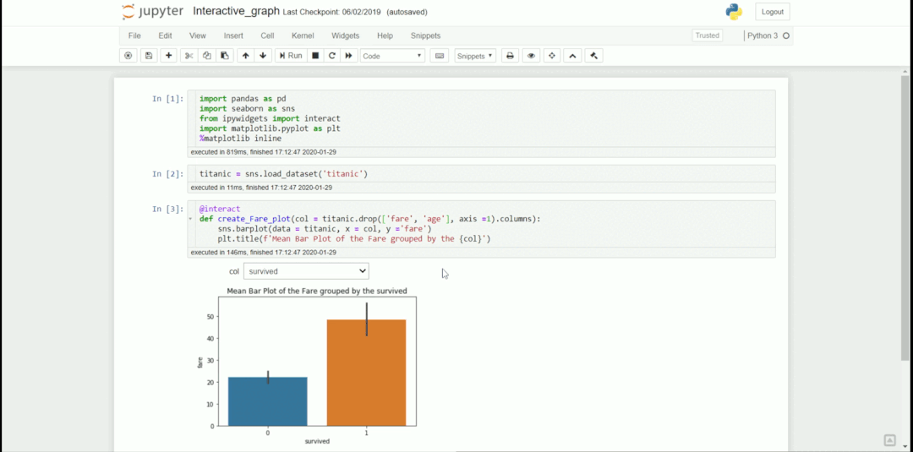
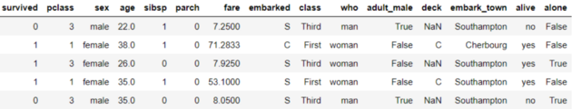
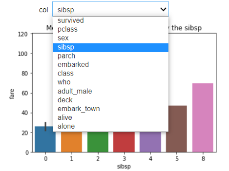
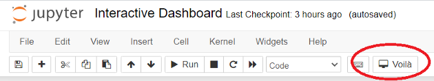
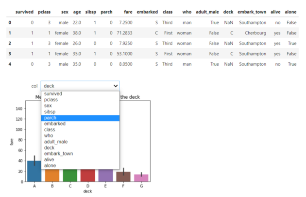
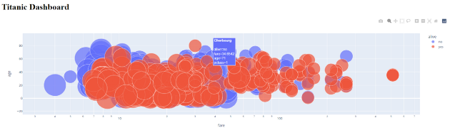
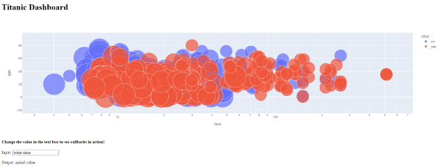
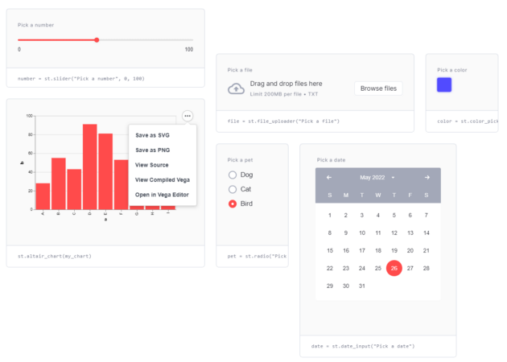
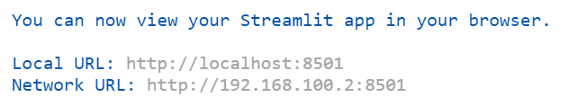
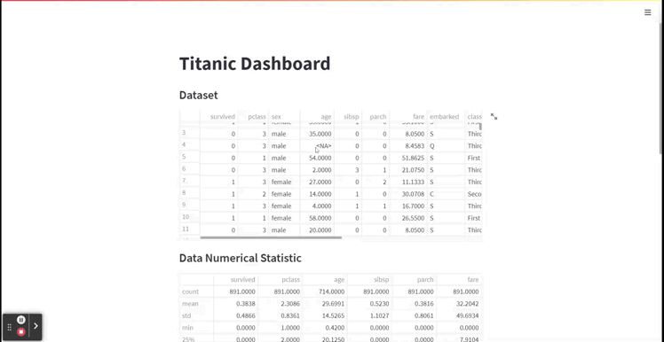

Python
<a name="EHCIR"></a>
## 1、Widgets
Ipywidgets(缩写为 Widgets) 是一个代码简单直观的交互式包，它为 Jupyter Notebooks 中的 GUI 提供 HTML 架构。<br />该包允许直接在 Jupyter Notebook 单元中创建交互式仪表板。<br /><br />只需几行代码，就可以将 Jupyter Notebook 改为仪表板。用几行代码展示如何做到这一点。<br />首先，需要安装所需的包
```bash
pip install ipywidgets
```
然后，需要在 Jupyter Notebook 中启用 Ipywidgets。要启用它，请在命令提示符中传递以下代码。
```bash
jupyter nbextension enable --py widgetsnbextension
```
可以在 Jupyter Notebook 中创建交互式仪表板，并配备所有必要的软件包。使用泰坦尼克号样本数据进行举例。
```python
import seaborn as sns
titanic = sns.load_dataset('titanic')
titanic.head()
```
<br />创建一个交互式仪表板，获取按类别变量分组的泰坦尼克号票价平均值。在这种情况下，使用如下代码:
```python
#Creating the interactive dashboard
from ipywidgets import interact
@interact
def create_fare_plot(col = titanic.drop(['fare', 'age'], axis =1).columns):
    sns.barplot(data = titanic, x = col, y ='fare')
    plt.title(f'Mean Bar Plot of the Fare grouped by the {col}')
```
<br />通过添加`@interact`代码，启动了交互过程。
<a name="pG0KS"></a>
## 2、Voila
Voila-dashboards 是一个简单的 Python 包，它将一个简单的 Jupyter Notebook 变成一个漂亮的 Web 仪表板。<br />只需一行安装代码，就可以快速渲染 Jupyter Notebook。<br />安装 Voila-dashboards
```bash
pip install voila
```
完成 Voila 包的安装后，刷新 Jupyter Notebook 并查看 notebook 选项卡。在那里会发现一个新的 Voila 按钮。<br />现在按下按钮，即可自动生成 Voila 仪表板。
<a name="SCl1u"></a>
## 3、Dash by Plotly
Dash by Plotly 是一个开源 Python 包，它是基于 Plotly 可视化的低代码框架包。<br />要试用 Dash，先安装软件包。
```bash
pip install dash
```
安装完成后，使用以下代码创建一个简单的 Titanic 仪表板。
```python
import dash
from dash import dcc, html
import plotly.express as px
import pandas as pd
import seaborn as sns
app = dash.Dash()
df = sns.load_dataset('titanic')
fig = px.scatter(
	df,
	x="fare",
	y="age",
	size="pclass",
	color="alive",
	hover_name="embark_town",
	log_x=True,
	size_max=60
)
app.layout = html.Div(children = [
	html.H1(children='Titanic Dashboard'),
	dcc.Graph(id="fare_vs_age", figure=fig)])

if __name__ == "__main__":
	app.run_server(debug=True)
```
运行上述代码后，将在默认(http://127.0.0.1:8050/)中启动仪表板<br />可以添加一个回调交互来让用户输入具有特定的输出。
```python
import dash
from dash import dcc, html, Input, Output
import plotly.express as px
import pandas as pd
import seaborn as sns
app = dash.Dash()
df = sns.load_dataset('titanic')
fig = px.scatter(
	df,
	x="fare",
	y="age",
	size="pclass",
	color="alive",
	hover_name="embark_town",
	log_x=True,
	size_max=60
)
app.layout = html.Div(children = [
	html.H1(children='Titanic Dashboard'),
	dcc.Graph(id="fare_vs_age", figure=fig),
	#Add interactive callback here
	html.H4("Change the value in the text box to see callbacks in action"),
	html.Div([
		"Input: ",
		dcc.Input(id='my-input', value='initial value', type='text')
	]),
	html.Br(),
	html.Div(id='my-output'),
])
@app.callback(
	Output(component_id='my-output', component_property='children'),
	Input(component_id='my-input', component_property='value')
)
def update_output_div(input_value):
	return f'Output: {input_value}'
if __name__ == "__main__":
	app.run_server(debug=True)
```
<br />Dash by Plotly 在创建仪表板时非常方便，它提供了许多有用的 API。
<a name="Qfsii"></a>
## 4、Streamlit
Streamlit 是一个开源 Python 包，旨在为数据科学家和机器学习项目创建一个 Web 应用程序。<br />Streamlit 提供的 API 易于任何初学者使用，非常适合希望以交互方式构建其数据组合的任何人。<br />先安装 Streamlit 包。
```bash
pip install streamlit
```
安装过程完成后，可以创建交互式仪表板。<br />代码示例。
```python
import streamlit as st
import pandas as pd
import plotly.express as px
import seaborn as sns
df = sns.load_dataset('titanic')
st.title('Titanic Dashboard')
st.subheader('Dataset')
st.dataframe(df)
st.subheader('Data Numerical Statistic')
st.dataframe(df.describe())
st.subheader('Data Visualization with respect to Survived')
left_column, right_column = st.columns(2)
with left_column:
   'Numerical Plot'
    num_feat = st.selectbox(
   'Select Numerical Feature', df.select_dtypes('number').columns)
    fig = px.histogram(df, x = num_feat, color = 'survived')
    st.plotly_chart(fig, use_container_width=True)
with right_column:
   'Categorical column'
    cat_feat = st.selectbox(
    'Select Categorical Feature', df.select_dtypes(exclude =   'number').columns)
    fig = px.histogram(df, x =cat_feat, color = 'survived' )
st.plotly_chart(fig, use_container_width=True)
```
使用 VScode 将文件保存为 titanic_st.py，然后在终端中运行该代码。
```bash
streamlit run titanic_st.py
```
<br />Streamlit 在上述地址上运行，可以访问仪表板。<br /><br />使用上面的简单代码，创建了一个交互式仪表板，API 并不难理解，只使用最少数量的代码。
