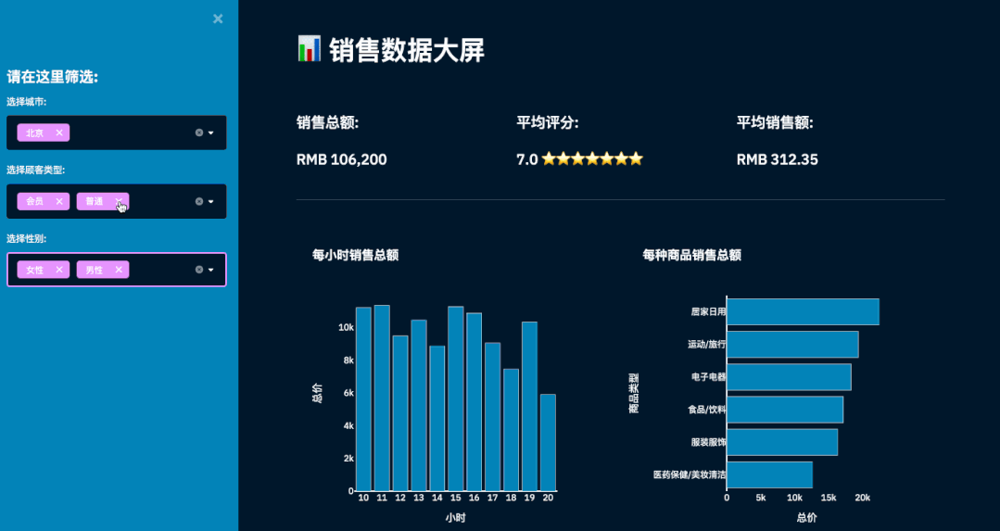
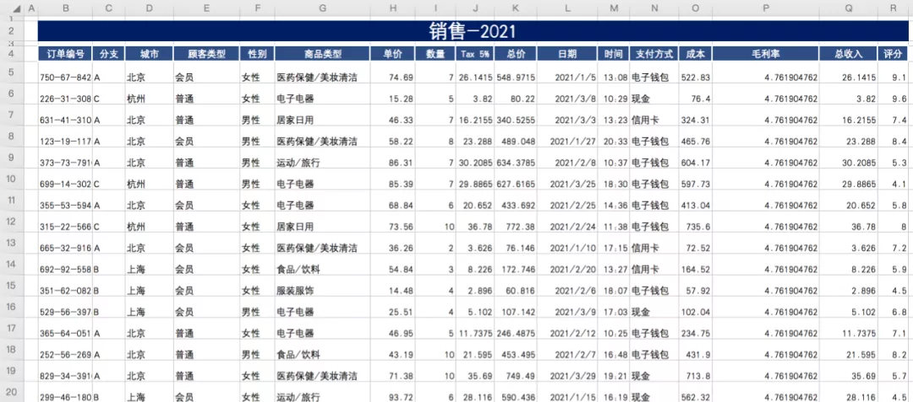
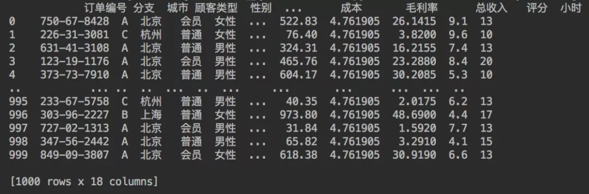
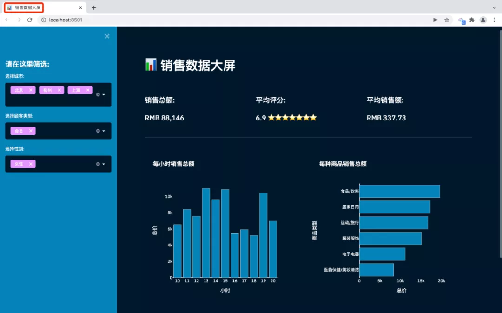
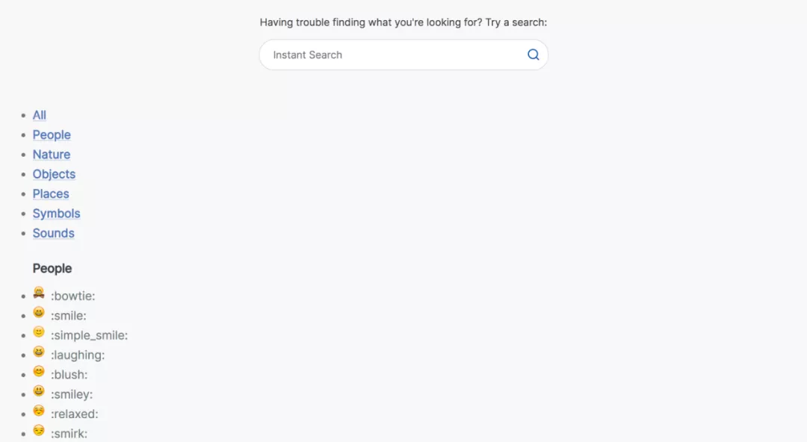
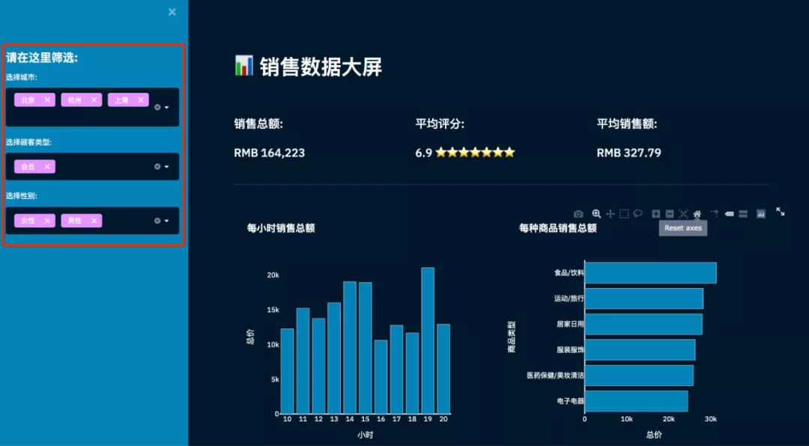
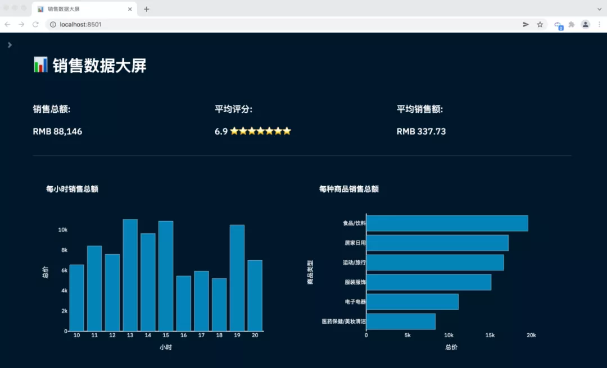
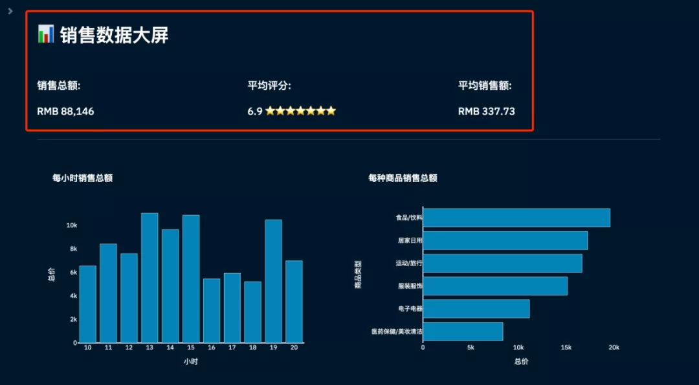
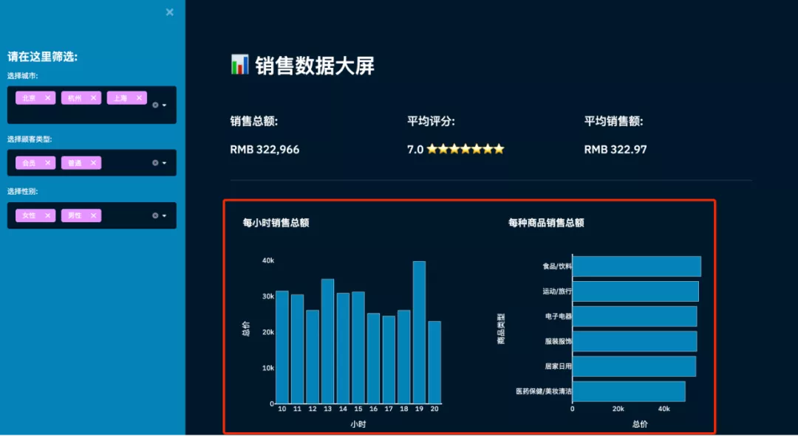
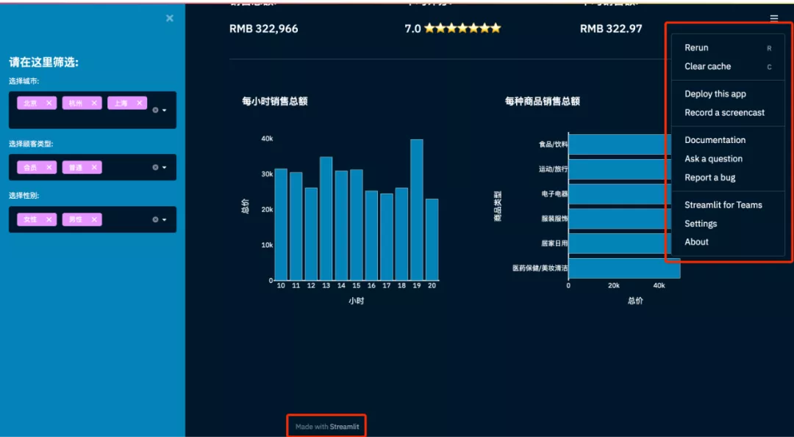

Python<br />Python制作销售数据大屏的方法，主要使用Python的Streamlit库、Plotly库、Pandas库进行搭建。<br /><br />其中Pandas处理数据，Plotly制作可视化图表，Streamlit搭建可视化页面。<br />对于以上三个库，Streamlit库可能大家会比较陌生，简单介绍一下。<br />Streamlit是一个完全免费的开源应用程序框架，它能帮你不用懂得复杂的HTML，CSS等前端技术就能快速做出来一个炫酷的Web页面。<br />文档地址：[https://docs.streamlit.io/](https://docs.streamlit.io/)<br />下面看一下如何搭建销售数据看板～
<a name="yp4nQ"></a>
## 1、数据
使用的数据是虚构数据，某超市2021年销售订单数据，共有1000条的订单数据。<br /><br />城市有三个，分别为北京、上海、杭州。顾客类型有两种，为会员和普通。顾客性别为男性和女性。<br />剩下还包含订单编号、商品类型、单价、数量、总价、日期、时间、支付方式、成本、毛利率、总收入、评分等信息。<br />通用Pandas的`read_excel`方法读取数据。<br />跳过前3行，选取B到R列，1000行数据。
```python
def get_data_from_excel():
    df = pd.read_excel(
        io="supermarkt_sales.xlsx",
        engine="openpyxl",
        sheet_name="Sales",
        skiprows=3,
        usecols="B:R",
        nrows=1000,
    )
    # 添加小时列数据
    df["小时"] = pd.to_datetime(df["时间"], format="%H:%M:%S").dt.hour
    return df

df = get_data_from_excel()
print(df)
```
成功读取数据，结果如下。<br /><br />下面便可以来编写页面了。
<a name="H0DZD"></a>
## 2、网页标题和图标
都知道当浏览器打开一个网页，会有标题和图标。<br /><br />所以需先设置本次网页的名称、图标、布局等。<br />这也是使用Streamlit搭建页面，使用的第一个Streamlit命令，并且只能设置一次。
```python
# 设置网页信息 
st.set_page_config(page_title="销售数据大屏", page_icon=":bar_chart:", layout="wide")
```
其中`page_icon`参数可以使用表情符号代码来显示图标。<br />短代码可从下方链接获取。[https://www.webfx.com/tools/emoji-cheat-sheet/](https://www.webfx.com/tools/emoji-cheat-sheet/)<br /><br />妥妥的表情符号代码大全！
<a name="I7bBB"></a>
## 3、侧边栏和多选框
`st.sidebar(侧边栏)`，每个传递给st.sidebar的元素都会被固定在左边，让用户可以专注于主页中的内容。<br />multiselect(多选框)是一个交互性的部件，可以通过它进行数据筛选。
```python
# 侧边栏
st.sidebar.header("请在这里筛选:")
city = st.sidebar.multiselect(
    "选择城市:",
    options=df["城市"].unique(),
    default=df["城市"].unique()
)

customer_type = st.sidebar.multiselect(
    "选择顾客类型:",
    options=df["顾客类型"].unique(),
    default=df["顾客类型"].unique(),
)

gender = st.sidebar.multiselect(
    "选择性别:",
    options=df["性别"].unique(),
    default=df["性别"].unique()
)

df_selection = df.query(
    "城市 == @city & 顾客类型 ==@customer_type & 性别 == @gender"
)
```
结合Pandas的query查询，就能对数据进行过滤。<br />通过上述代码就搭建成功了，如下图左侧。<br /><br />点击侧边栏的右上角关闭符号，侧边栏即可隐藏。<br />网页将会展示主页面。<br />
<a name="HfU7d"></a>
## 4、主页面信息
接下来编写主页面信息，包含主页标题、销售总额、平均评分、平均销售额信息。<br />和网页的图标一样，通过表情符号代码实现。
```python
# 主页面
st.title(":bar_chart: 销售数据大屏")
st.markdown("##")

# 核心指标, 销售总额、平均评分、星级、平均销售额数据
total_sales = int(df_selection["总价"].sum())
average_rating = round(df_selection["评分"].mean(), 1)
star_rating = ":star:" * int(round(average_rating, 0))
average_sale_by_transaction = round(df_selection["总价"].mean(), 2)


# 3列布局
left_column, middle_column, right_column = st.columns(3)

# 添加相关信息
with left_column:
    st.subheader("销售总额:")
    st.subheader(f"RMB {total_sales:,}")
with middle_column:
    st.subheader("平均评分:")
    st.subheader(f"{average_rating} {star_rating}")
with right_column:
    st.subheader("平均销售额:")
    st.subheader(f"RMB {average_sale_by_transaction}")

# 分隔符
st.markdown("""---""")
```
完成核心指标数据的处理，并将其进行布局显示。<br />
<a name="scFIG"></a>
## 5、主页面图表
包含了两个图表，一个是每小时销售额，一个是各类商品销售总额。通过Plotly Express完成图表的绘制。<br />Plotly Express是一个新的高级Python可视化库，是Plotly.py的高级封装，它为复杂的图表提供了一个简单的语法。<br />文档地址：[https://plot.ly/python/plotly-express/](https://plot.ly/python/plotly-express/)<br />受Seaborn和ggplot2的启发，它专门设计为具有简洁，一致且易于学习的API。只需一次导入，就可以在一个函数调用中创建丰富的交互式绘图。
```python
# 各类商品销售情况(柱状图)
sales_by_product_line = (
    df_selection.groupby(by=["商品类型"]).sum()[["总价"]].sort_values(by="总价")
)
fig_product_sales = px.bar(
    sales_by_product_line,
    x="总价",
    y=sales_by_product_line.index,
    orientation="h",
    title="<b>每种商品销售总额</b>",
    color_discrete_sequence=["#0083B8"] * len(sales_by_product_line),
    template="plotly_white",
)
fig_product_sales.update_layout(
    plot_bgcolor="rgba(0,0,0,0)",
    xaxis=(dict(showgrid=False))
)

# 每小时销售情况(柱状图)
sales_by_hour = df_selection.groupby(by=["小时"]).sum()[["总价"]]
print(sales_by_hour.index)
fig_hourly_sales = px.bar(
    sales_by_hour,
    x=sales_by_hour.index,
    y="总价",
    title="<b>每小时销售总额</b>",
    color_discrete_sequence=["#0083B8"] * len(sales_by_hour),
    template="plotly_white",
)
fig_hourly_sales.update_layout(
    xaxis=dict(tickmode="linear"),
    plot_bgcolor="rgba(0,0,0,0)",
    yaxis=(dict(showgrid=False)),
)


left_column, right_column = st.columns(2)
left_column.plotly_chart(fig_hourly_sales, use_container_width=True)
right_column.plotly_chart(fig_product_sales, use_container_width=True)
```
添加数据，设置图表配置，以及网页布局。<br />得到结果如下。<br />
<a name="PD8DG"></a>
## 6、隐藏部件
当通过Streamlit搭建一个界面，默认就会有红线、菜单、结尾的"Make with Streamlit"。<br /><br />为了美观，这里可以将它们都隐藏掉。
```python
# 隐藏streamlit默认格式信息
hide_st_style = """
            <style>
            #MainMenu {visibility: hidden;}
            footer {visibility: hidden;}
            header {visibility: hidden;}
            </style>
            """

st.markdown(hide_st_style, unsafe_allow_html=True)
```
这样一个可交互的销售数据看板，就完成搭建啦！
```bash
# 安装依赖库
pip install -i https://pypi.tuna.tsinghua.edu.cn/simple plotly==4.14.3
pip install -i https://pypi.tuna.tsinghua.edu.cn/simple pandas==1.1.0
pip install -i https://pypi.tuna.tsinghua.edu.cn/simple streamlit==0.86.0
pip install -i https://pypi.tuna.tsinghua.edu.cn/simple openpyxl==3.0.6

# 运行
streamlit run app.py
```
