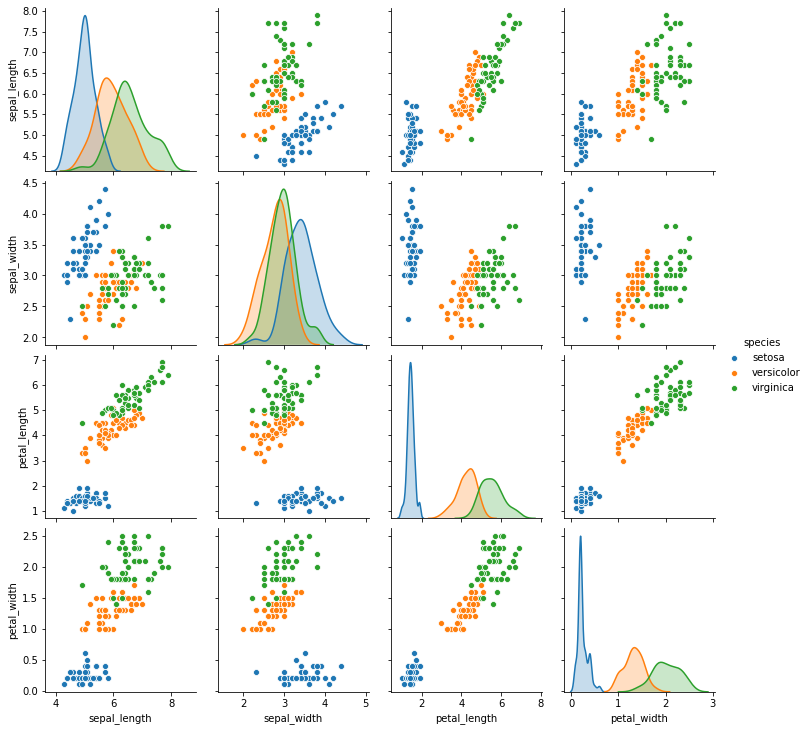
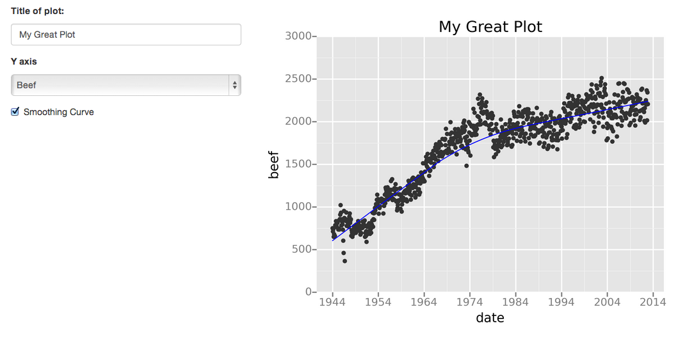
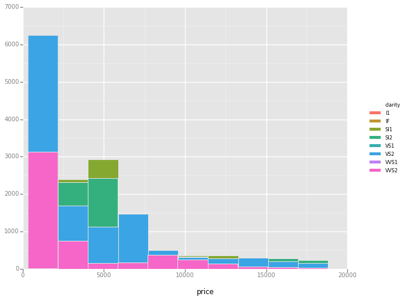
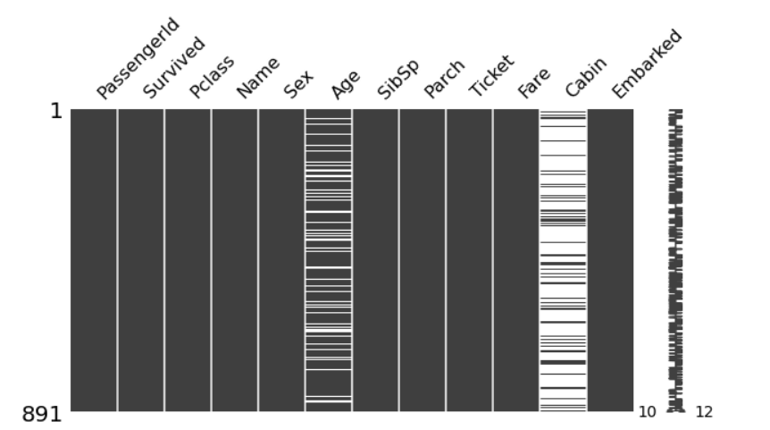

Python 数据可视化
<a name="vDlNk"></a>
## 1、Seaborn
Seaborn 建于 matplotlib 库的之上。它有许多内置函数，使用这些函数，只需简单的代码行就可以创建漂亮的绘图。它提供了多种高级的可视化绘图和简单的语法，如方框图、小提琴图、距离图、关节图、成对图、热图等。
<a name="LOua4"></a>
### 安装
```bash
pip install seaborn
```
<a name="srH00"></a>
### 主要特征

- 可用于确定两个变量之间的关系。
- 在分析单变量或双变量分布时进行区分。
- 绘制因变量的线性回归模型。
- 提供多网格绘图

只需使用几行简单代码就可以绘制出漂亮的图形<br />
<a name="Pp1UW"></a>
### 官方文档
[https://seaborn.pydata.org/](https://seaborn.pydata.org/)
<a name="A1iU4"></a>
## 2、Plotly
Plotly 是一个高级 Python 分析库，有助于构建交互式仪表板。使用 Plotly 构建的图形是交互式图形，这意味着可以轻松找到图形的任何特定点或会话的值。Plotly 生成仪表板并将其部署在服务器上变得非常容易。它支持 Python、R 和 Julia 编程语言。
<a name="tLvtr"></a>
### Plotly 制作简单散点图的代码

<a name="Sz7ql"></a>
### 官方文档
[https://dash.plotly.com/](https://dash.plotly.com/)
<a name="xgWuA"></a>
## 3、Geoplotlib
Geoplotlib 是一个用于可视化地理数据和制作地图的 Python 工具箱。可以使用此库创建各种地图。您可以使用它创建的一些地图示例包括热图、点密度图、地理地图等等。<br />
<a name="rSU9g"></a>
### 安装
```bash
pip install geoplotlib
```
<a name="XwfNz"></a>
### github文档
[https://github.com/andrea-cuttone/geoplotlib/wiki/User-Guide](https://github.com/andrea-cuttone/geoplotlib/wiki/User-Guide)
<a name="QklnA"></a>
## 4、Gleam
Gleam 的灵感来自 R 的Shiny包。它允许仅使用 Python 代码将图形转换为出色的 Web 应用程序。这对不了解 HTML 和 CSS 的人很有帮助。它不是真正的可视化库，而是与任何可视化库一起使用。<br />
<a name="UMfP1"></a>
### github文档
[https://github.com/dgrtwo/gleam](https://github.com/dgrtwo/gleam)
<a name="t4QFg"></a>
## 5、ggplot
ggplot 的工作方式与 matplotlib 不同。它允许添加多个组件作为图层，以在最后创建完整的图形或绘图。例如，在开始时可以添加一个轴，然后添加点和其他组件，如趋势线。
```python
%matplotlib inline
from ggplot import *
ggplot(diamonds, aes(x='price', fill='clarity')) + geom_histogram()
```

<a name="M1cMp"></a>
### github文档
[https://github.com/tidyverse/ggplot2](https://github.com/tidyverse/ggplot2)
<a name="k64lE"></a>
## 6、Bokeh
Bokeh 库由Continuum Analytics创建，用于生成对 Web 界面和浏览器友好的可视化。Bokeh 生成的可视化本质上是交互式的，可让传达更多信息。
```python
# Bokeh Libraries
from bokeh.io import output_file
from bokeh.plotting import figure, show

# The figure will be rendered in a static HTML file called output_file_test.html
output_file('output_file_test.html', 
            title='Empty Bokeh Figure')

# Set up a generic figure() object
fig = figure()

# See what it looks like
show(fig)
```
<a name="bmi52"></a>
### 官方文档
[https://docs.bokeh.org/en/latest/](https://docs.bokeh.org/en/latest/)
<a name="gmlPP"></a>
## 7、Missingo
数据科学就是从给定的数据中找到有用的信息，并使之对所有人可见。最好的方法是将数据可视化。对于所有的数据科学家爱好者来说，这个包可能是一个热潮。它可以找到所有缺失值，并在现实世界的数据集中以漂亮的图形方式显示它们，而无需头疼，只需一行代码。它支持图形表示，如条形图、图表、热图、树状图等。
```python
# Importing Necessary Libraries
import pandas as pd 
import missingno as mi

# Reading the Titanic dataset (From Local Env)
data = pd.read_csv("train.csv")

# Checking missing values Using ()
print(data.isnull().sum()) ## It will display a table with all the missing values

### The best practice is to visualize this so that everyone even a non-tech person
### can understand and find the missing values, Let's use the `missingno` package
#Visualizing using missingno

print("Visualizing missing value using bar graph")
print(mi.bar(data, figsize = (10,5)))
```


 
