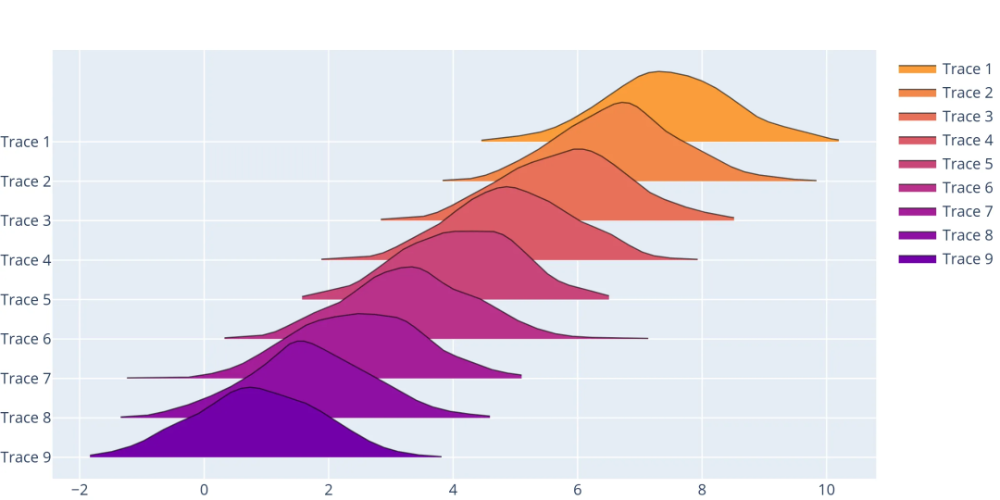
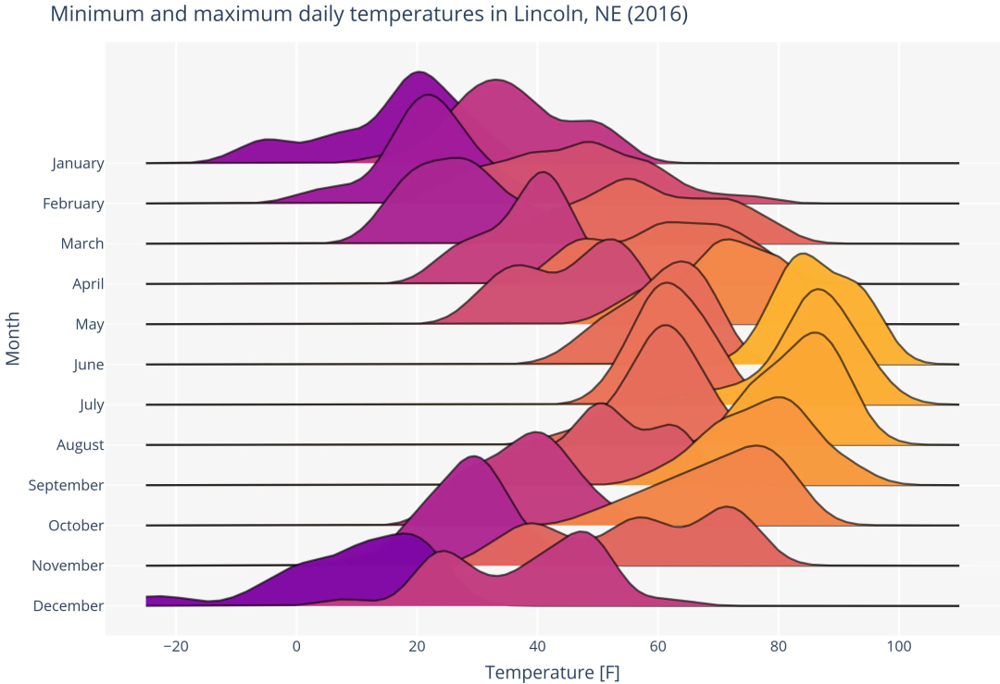

<a name="JAhrM"></a>
## ridgeplot可视化库介绍
一个好用的Python工具包-ridgeplot，绘制山峦图。
<a name="GvbbD"></a>
### ridgeplot库介绍
ridgeplot 是一个 Python 软件包，为在庞大的 Plotly 生态系统中绘制精美的交互式山峦图提供了一个简单的界面。安装语法如下：
```bash
pip install -U ridgeplot
```
<a name="EQ1Y5"></a>
### 基础案例
使用ridgeplot库中的`ridgeplot()`函数就可以快速绘制山峦图，如下：
```python
import numpy as np
from ridgeplot import ridgeplot

my_samples = [np.random.normal(n / 1.2, size=600) for n in range(9, 0, -1)]
fig = ridgeplot(samples=my_samples)
fig.update_layout(height=500, width=800)
fig.show()
```

```python
import numpy as np
from ridgeplot import ridgeplot
from ridgeplot.datasets import load_lincoln_weather

# Load test data
df = load_lincoln_weather()

# Transform the data into a 3D (ragged) array format of
# daily min and max temperature samples per month
months = df.index.month_name().unique()
samples = [
    [
        df[df.index.month_name() == month]["Min Temperature [F]"],
        df[df.index.month_name() == month]["Max Temperature [F]"],
    ]
    for month in months
]

# And finish by styling it up to your liking!
fig = ridgeplot(
    samples=samples,
    labels=months,
    coloralpha=0.98,
    bandwidth=4,
    kde_points=np.linspace(-25, 110, 400),
    spacing=0.33,
    linewidth=2,
)
fig.update_layout(
    title="Minimum and maximum daily temperatures in Lincoln, NE (2016)",
    height=650,
    width=950,
    font_size=14,
    plot_bgcolor="rgb(245, 245, 245)",
    xaxis_gridcolor="white",
    yaxis_gridcolor="white",
    xaxis_gridwidth=2,
    yaxis_title="Month",
    xaxis_title="Temperature [F]",
    showlegend=False,
)
fig.show()
```
<br />除此之外，官网还提供详细的数据处理、可视化展示等步骤式教学，感兴趣的同学可参考[**ridgeplot库官网**](https://ridgeplot.readthedocs.io/en/stable/index.html)
<a name="kK0Ln"></a>
## 参考资料
**ridgeplot库官网:**[**https://ridgeplot.readthedocs.io/en/stable/index.html**](https://ridgeplot.readthedocs.io/en/stable/index.html)
