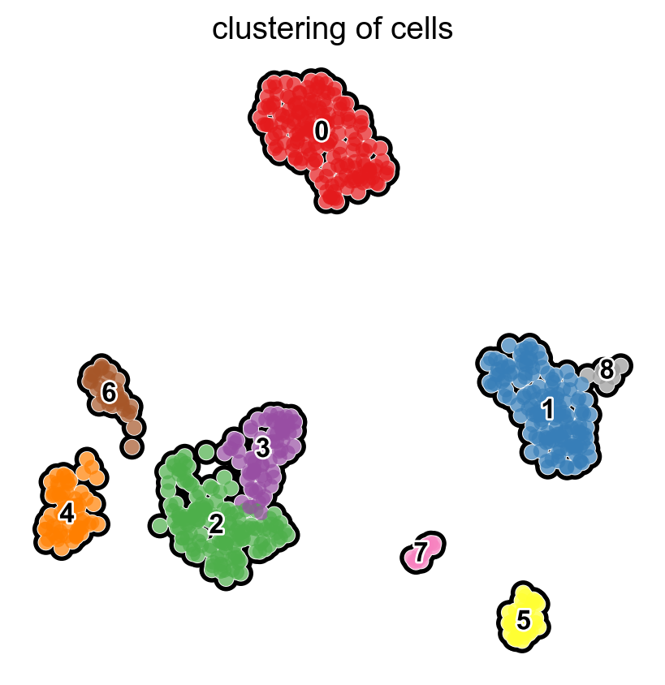
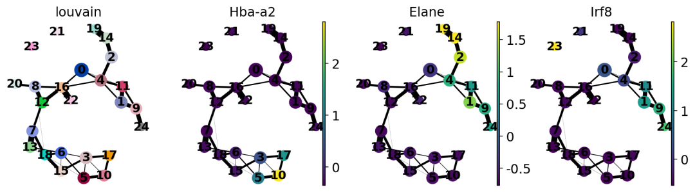
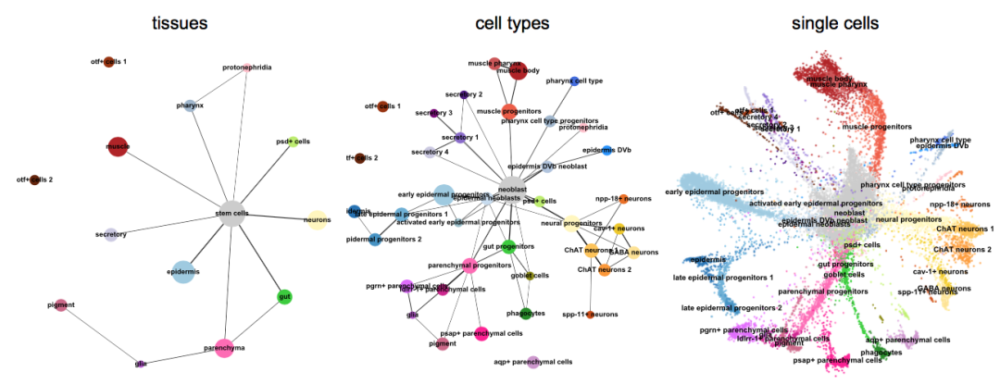
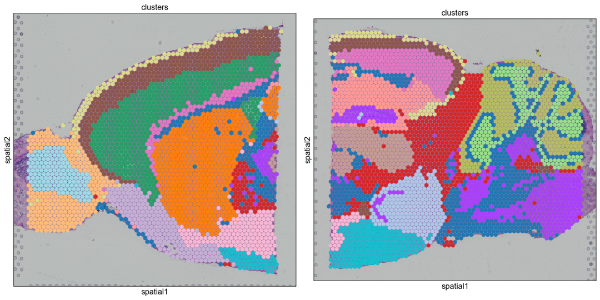

Python<br />介绍一个在单细胞(Single-cell)分析中常用且功能强大的Python拓展工具。Python-Scanpy 一个专门用于单细胞分析的Python工具包，针对很多医疗、生物等领域的同学绝对妥妥的福音工具了~~<br />首先，还是按照常规的顺序对该工具进行介绍，重点也就放在可视化绘制相关的内容，主要内容如下：

- Python-Scanpy主要功能介绍
- Python-Scanpy可视化功能介绍
- Python-Scanpy其他功能
<a name="MHuM9"></a>
## Python-Scanpy主要功能介绍
主要介绍Python-Scanpy的安装方法和主要的功能。首次，可通过如下方法进行安装：
```bash
#建议使用conda安装
conda install -c conda-forge scanpy python-igraph leidenalg
#或者使用pip安装
pip install scanpy
```
Python-Scanpy包的主要功能可分为聚类(Clustering) 、可视化展示(Visualization) 、轨迹推理(Trajectory inference) 、整合数据集(Integrating datasets) 等多个方面。本期推文将重点介绍可视化功能，其他部分，小伙伴们可自行搜索即可~~
<a name="Gg5fJ"></a>
## Python-Scanpy可视化功能介绍
Python-Scanpy包的可视化功能不仅有常规的统计图形(箱线图、小提琴图、散点图等)，而且还有特有的PCA聚类图、点图(dot plot)、堆积小提琴图以及基因、单细胞相关的专业图形。下面就详细的给大家介绍一下~~
<a name="jb6Za"></a>
### 常规统计图形
<a name="T9lZ6"></a>
#### 箱线图
通过Scanpy包的`pl.highest_expr_genes()`函数模块就可以快速绘制基因数据的统计箱线图，如下：
```python
import numpy as np
import pandas as pd
import scanpy as sc
#基本设置
sc.settings.verbosity = 3    
sc.logging.print_header()
sc.settings.set_figure_params(dpi=80, facecolor='white')
#可视化展示
sc.pl.highest_expr_genes(adata, n_top=20, )
```
")
<a name="oTIu9"></a>
#### 小提琴图
使用`sc.pl.violin()`函数就可以快速绘制出小提琴图，如下：
```python
sc.pl.violin(adata, ['n_genes_by_counts', 'total_counts', 'pct_counts_mt'],
             jitter=0.4, multi_panel=True)
```
")
<a name="V65A7"></a>
#### PCA主成分分析图
PCA统计图形是基因分析中最重要且常用的统计图形，使用`sc.pl.pca()`函数即可快速完成，如下：
```python
sc.pl.pca(adata, color='CST3')
```
")
<a name="bSoBo"></a>
#### 邻接图(neighborhood graph)
Scanpy包还可以通过`sc.pp.neighbors()`函数计算主成分之间的邻接数据并通过`sc.pl.umap()`函数进行可视化展示，如下：
```python
sc.pp.neighbors(adata, n_neighbors=10, n_pcs=40)
sc.pl.umap(adata, color=['CST3', 'NKG7', 'PPBP'])
```
")<br />当然，Scanpy包还可以聚类邻接图，如下：
```python
sc.tl.leiden(adata)
sc.pl.umap(adata, color=['leiden', 'CST3', 'NKG7'])
```
")
<a name="Mmuw9"></a>
#### 点图(dot plot)
Scanpy包点图的绘制不仅将数据点的大小变量和其他变量同时进行数据点和颜色条(colorbar)的映射，还可以直接绘制出对应图例，这也是Python可视化绘图的重点内容(一般多图例需单独绘制对应图例)，详细如下：
```python
sc.pl.dotplot(adata, marker_genes, groupby='leiden');
```
")
<a name="aA3cm"></a>
#### 堆积小提琴图(stacked_violin)
Scanpy包还可以绘制堆积小提琴图(stacked_violin)并将数值大小映射到对应的颜色上，如下：
```python
sc.pl.stacked_violin(adata, marker_genes, groupby='leiden', rotation=90)
```
")
<a name="XbJbZ"></a>
#### 矩阵图(matrixplot)
Scanpy包的`sc.pl.matrixplot()`函数就可以快速绘制矩阵图并设置图例的合理位置和基本属性，如下：
```python
sc.pl.matrixplot(pbmc, marker_genes_dict, 'clusters', dendrogram=True, cmap='Blues', standard_scale='var', colorbar_title='column scaled\nexpression')
```
")
<a name="K4DJJ"></a>
#### 相关性矩阵图(Plot correlation)
Scanpy包的`sc.pl.correlation_matrix()`函数既可以绘制相关性矩阵图，如下：
```python
ax = sc.pl.correlation_matrix(pbmc, 'bulk_labels', figsize=(5,3.5))
```
")<br />除了上述介绍的统计图形外，还有与基因、单细胞有关的图形，这里直接列举一下，更多绘制方法，可自行去[**Scanpy包官网**](https://scanpy-tutorials.readthedocs.io/en/latest/index.html) 了解详情。<br /><br /><br /><br />
<a name="DMues"></a>
## 总结
Python-Scanpy包几乎囊括了大部分数据处理、可视化展示等环节，使使用者们大大缩短了分析时间，值得推荐，绝对是生物、医疗领域同学的福音。
