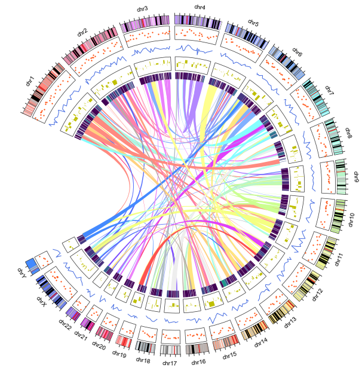
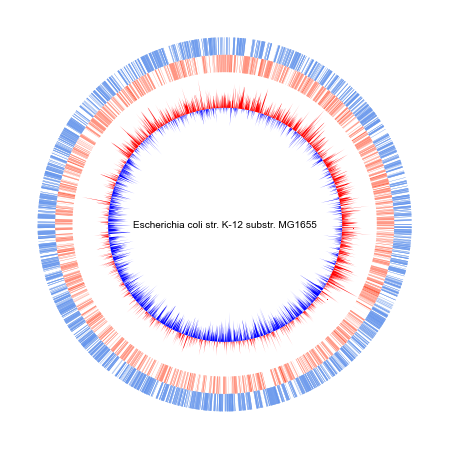
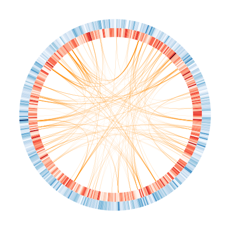

<a name="ScC4b"></a>
## pyCircos可视化包推荐
Circos 是可视化基因组相似性和特征的最流行软件之一。不过，它的执行过程比较复杂，需要多个原始配置文件才能实现可视化。此外，Circos 是用 Perl 编写的，这限制了它与其他生物分析软件的整合。<br />另一方面，Python 已被用于各种生物软件包。因此，结合这些软件包，研究人员可以完成大部分所需的分析工作。然而，尽管 Circos 软件已经开发了十多年，Python 却缺少绘制 Circos 图的库。在此，提供了一个基于 Python Matplotlib 的环形基因组可视化软件包-pyCircos。用户只需指定注释序列文件（如 GenBank 文件），就能方便快捷地可视化基因组特征和比较基因组分析结果。
<a name="in3pW"></a>
## 安装方式
pyCircos可通过如下语句进行快速安装(建议)。
```bash
pip install python-circos
```
如果想安装开发版本，则使用如下语句：
```bash
pip install git+https://github.com/ponnhide/pyCircos.git
```
<a name="Ob5KP"></a>
## 案例教程
<a name="UQliw"></a>
### 案例01
```python
#linkplot
#heatmap
values_all   = [] 
arcdata_dict = collections.defaultdict(dict)
with open("sample_data/example_data_links.csv") as f:
    f.readline()
    for line in f:
        line  = line.rstrip().split(",")
        name1  = line[0]     
        start1 = int(line[1])-1
        end1   = int(line[2])
        name2  = line[3]     
        start2 = int(line[4])-1
        end2   = int(line[5])
        source = (name1, start1, end1, 615)
        destination = (name2, start2, end2, 615)
        circle.chord_plot(source, destination, facecolor=circle.garc_dict[name1].facecolor)
```

<a name="i0VxI"></a>
### 案例02
```python
#Plot GCskew
import copy
skews = garc.calc_nnskew(n1="G", n2="C")  
positive_skews=copy.deepcopy(skews)
positive_skews[skews<0]=0
negative_skews=copy.deepcopy(skews)
negative_skews[skews>=0]=0
gcircle.fillplot("NC_000913", positive_skews, rlim=(min(skews),max(skews)), base_value=0, raxis_range=(400,700), facecolor="r")
gcircle.fillplot("NC_000913", negative_skews, rlim=(min(skews),max(skews)), base_value=0, raxis_range=(400,700), facecolor="b")
```

<a name="IDm3g"></a>
### 案例03
```python
import collections
chord_dict = collections.defaultdict(list)
with open("sample_data/segdup.txt","r") as f:
    for line in f:
        line          = line.rstrip().split("\t")
        chord_dict[line[0]].append((line[1], int(line[2]), int(line[3]), 700)) 

for key in chord_dict:
    gcircle.chord_plot(chord_dict[key][0], chord_dict[key][1], facecolor="#ff8c0080")
```
<br />更多关于pyCircos包的介绍和案例，可参考：[**pyCircos官网**](https://github.com/ponnhide/pyCircos)。<br />当然，也可以使用功能更加强大的pyCirclize拓展包。
<a name="ScNBn"></a>
## 参考资料
**pyCircos官网：**[**https://github.com/ponnhide/pyCircos**](https://github.com/ponnhide/pyCircos)
