介绍一个专门用于材料信息学可视化的Python工具包-pymatviz，它的主要目标是帮助科学家和研究人员可视化材料的结构、性质和相关信息。详细介绍如下：
<a name="lXdt7"></a>
## pymatviz安装
pymatviz包的安装可通过pip快速完成：
```bash
pip install pymatviz
```
<a name="G6lpp"></a>
## 可视化案例
pymatviz包中可提供Matplotlib和plotly两种绘图内核样式。
<a name="SKQEp"></a>
### 案例一：元素周期表图
pymatviz包中提供多个函数和绘图脚本，完成不同样式的元素周期表图的绘制，这里列举几个图形样式，详细绘制代码，可自行查阅。
```python
ptable_heatmap(compositions, log=True)
```
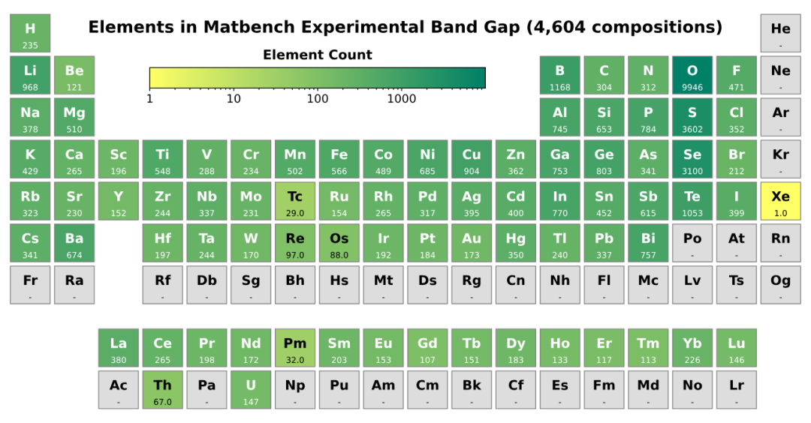
```python
ptable_heatmap_ratio(comps_a, comps_b)
```
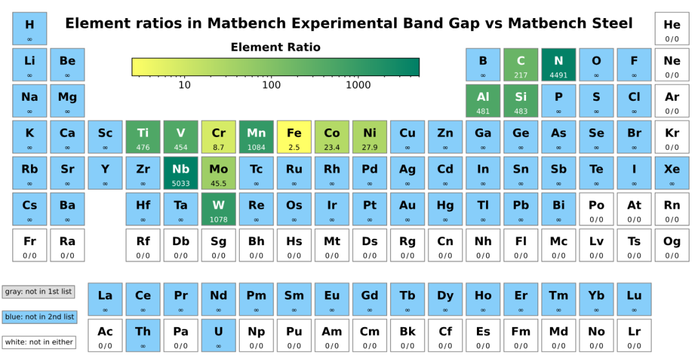
```python
ptable_heatmap_plotly(atomic_masses)
```
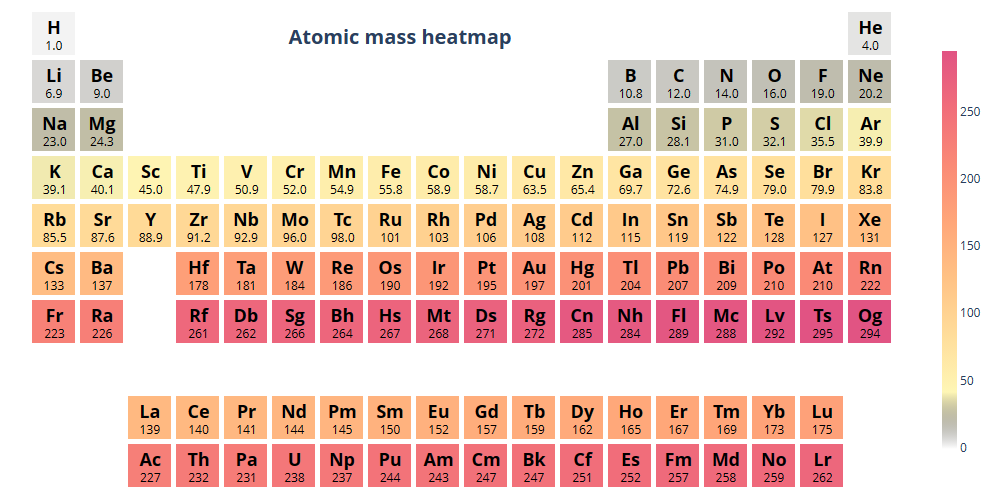
```python
ptable_heatmap_plotly(compositions, log=True)
```
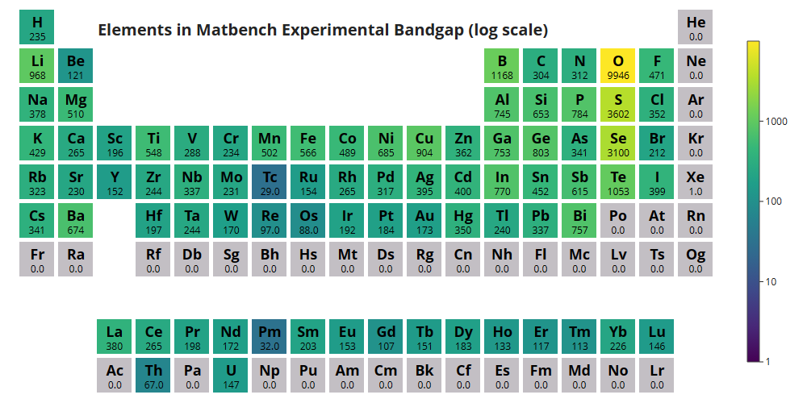
<a name="txjju"></a>
### 案例二：旭日图系列(Sunburst)
```python
spacegroup_sunburst([65, 134, 225, ...])
```
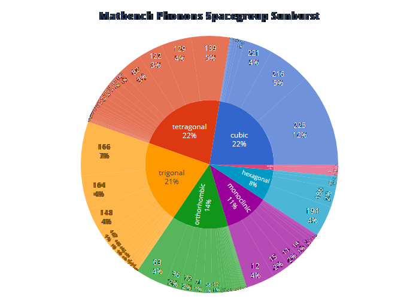
```python
spacegroup_sunburst(["C2/m", "P-43m", "Fm-3m", ...])
```
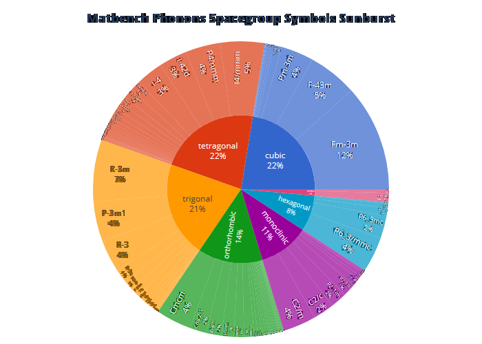
<a name="a2EqV"></a>
### 案例三：桑基图(Sankey)
```python
sankey_from_2_df_cols(df_perovskites)
```
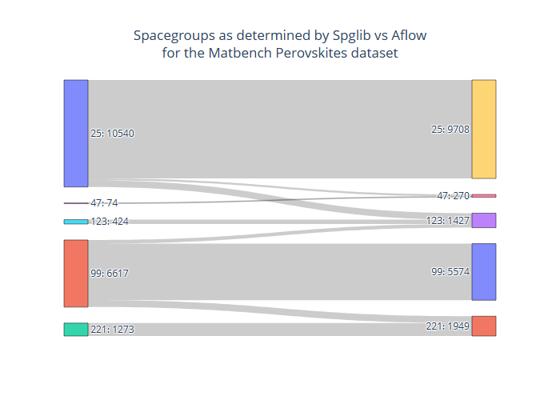
```python
sankey_from_2_df_cols(df_rand_ints)
```
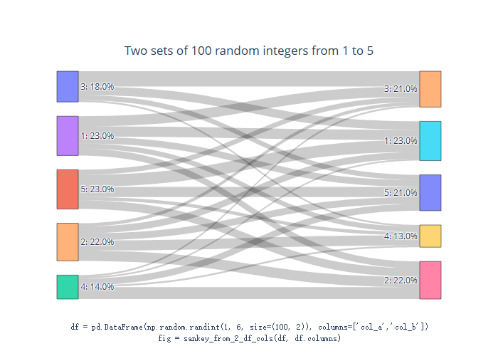
<a name="F6mAe"></a>
### 案例四：结构图(Structure)
目前，pymatviz只支持 2d 结构绘图。通过其`plot_structure_2d()`函数完成操作，下面为pymatviz绘制的一些结构图案例。<br />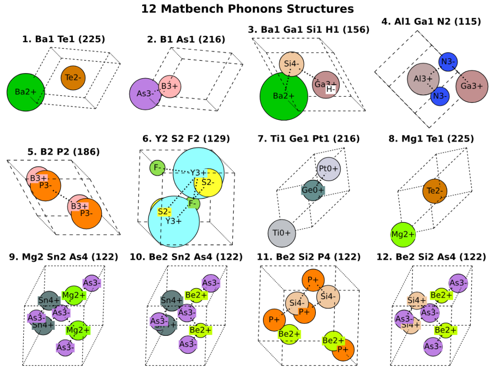
<a name="rY3sW"></a>
### 案例五：统计直方图
通过pymatviz包中的`spacegroup_hist()` 、`residual_hist()` 等函数就可以绘制出不同样式的统计直方图：
```python
spacegroup_hist([65, 134, 225, ...])
```
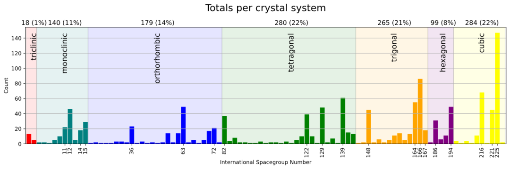
```python
residual_hist(y_true, y_pred)
```
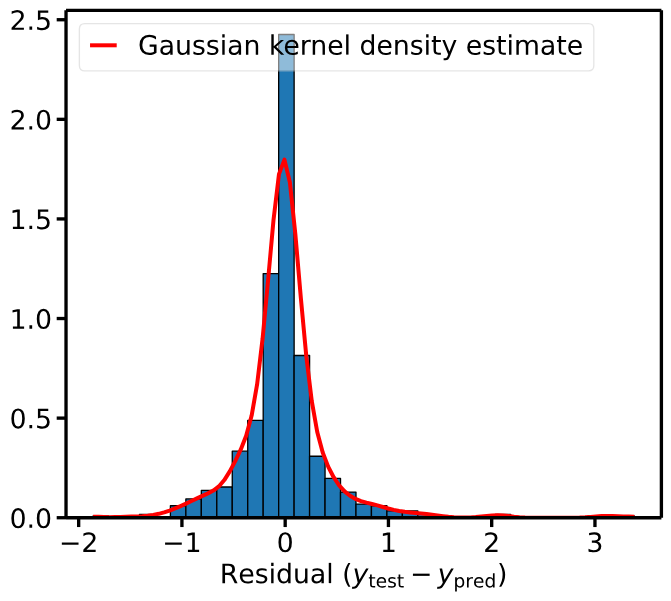
<a name="BFnEM"></a>
### 案例六：奇偶图(Parity Plots)
pymatviz包绘制奇偶图类似于边际组合图，其将散点图和直方图进行组合绘制，如下：
```python
density_scatter_with_hist(xs, ys, ...)
```
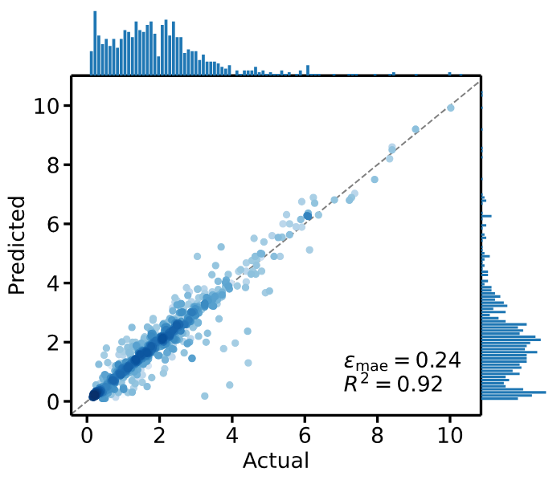
```python
density_hexbin_with_hist(xs, ys, ...)
```
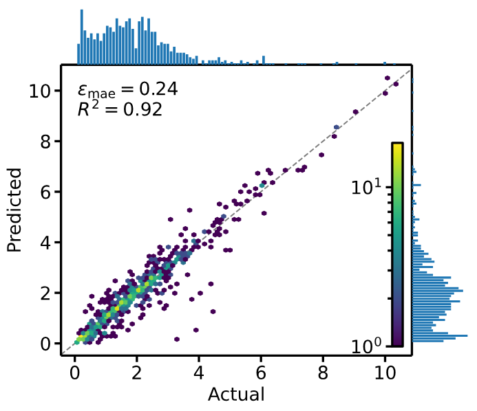
<a name="SUe5l"></a>
### 案例七：不确定性校准(Uncertainty Calibration)系列图形
```python
qq_gaussian(y_true, y_pred, y_std: dict)
```
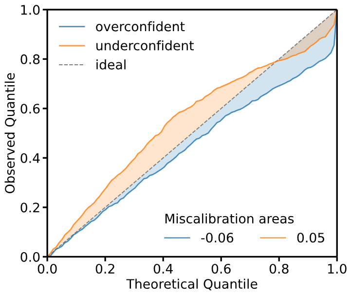
```python
error_decay_with_uncert(y_true, y_pred, y_std: dict)
```
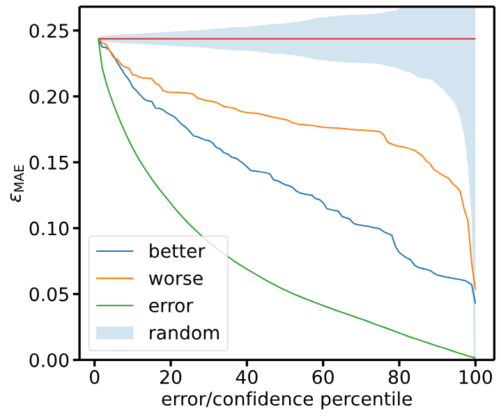<br />其他更多图形样式，可阅读[**pymatviz包官网**](https://pymatviz.janosh.dev/)<br />**「需要注意的是」**：pymatviz包的官网提供了jupyter notebook样例文档，可轻松实现其所能支持的图形类别。
<a name="pLqPS"></a>
## 总结
pymatviz工具包，作为Python语言中的优秀可视化工具，其提供可以绘制多种图形类型的可视化函数，可轻松实现图形绘制。
<a name="AWNd0"></a>
## 参考资料
pymatviz包官网：[https://pymatviz.janosh.dev/](https://pymatviz.janosh.dev/)
