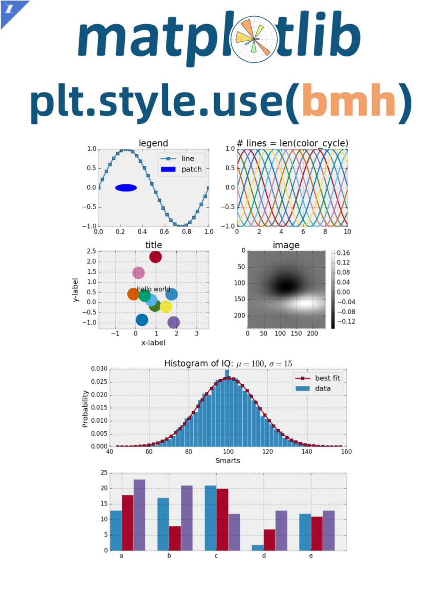
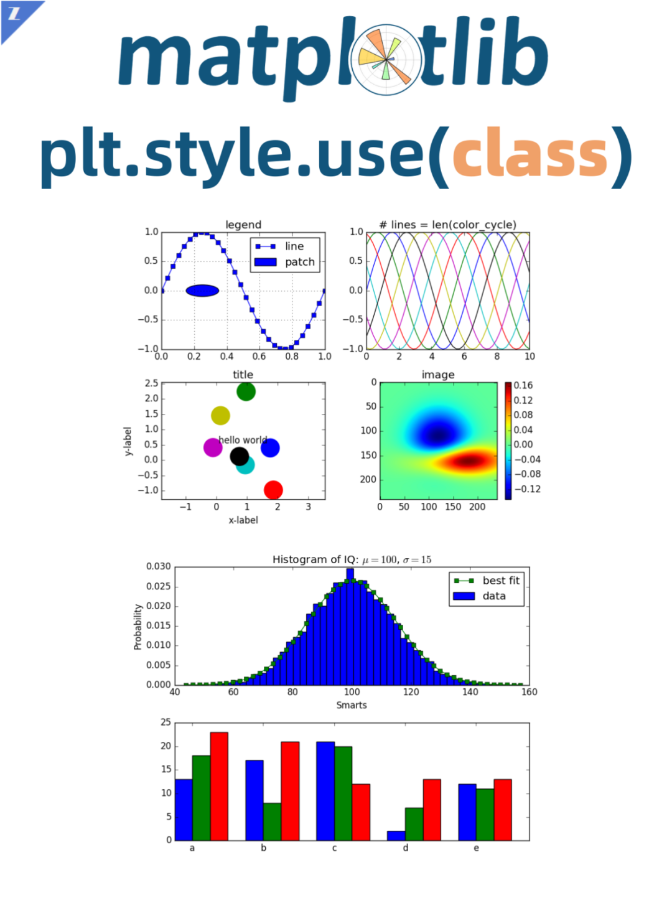
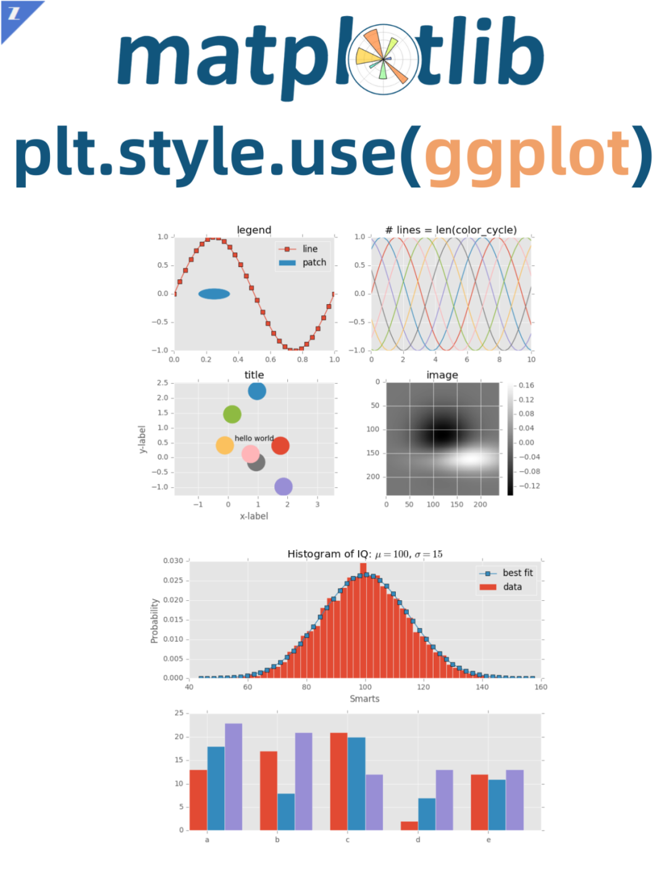
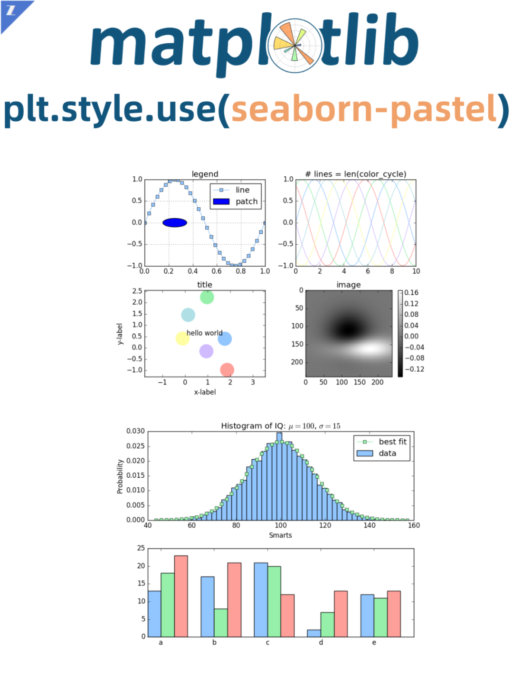
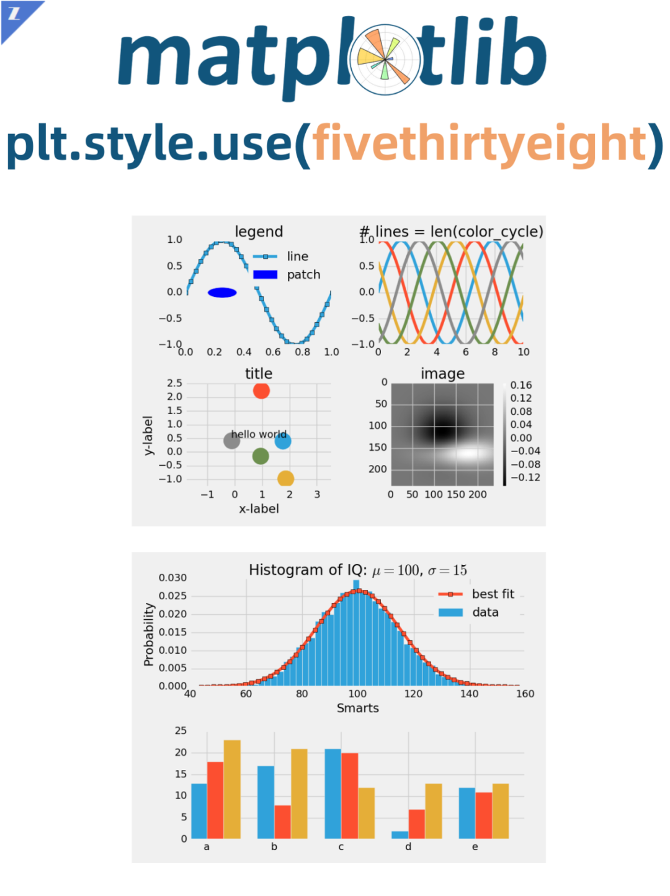
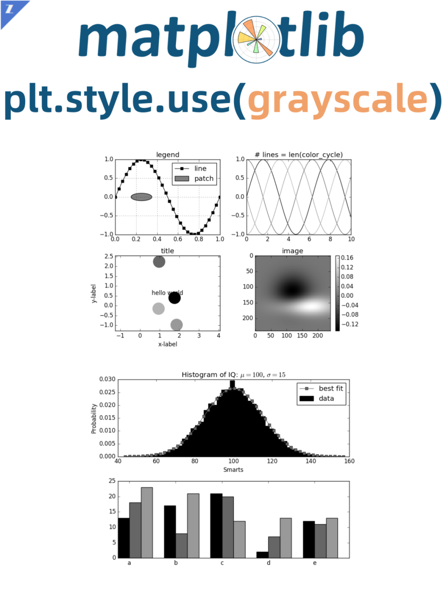
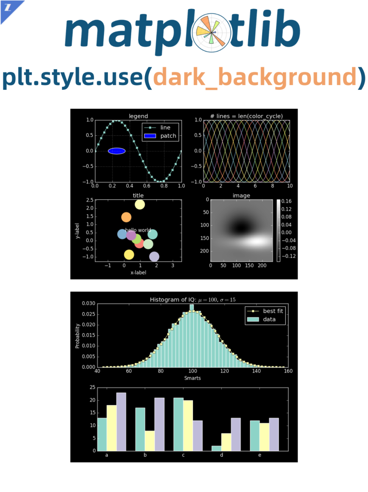
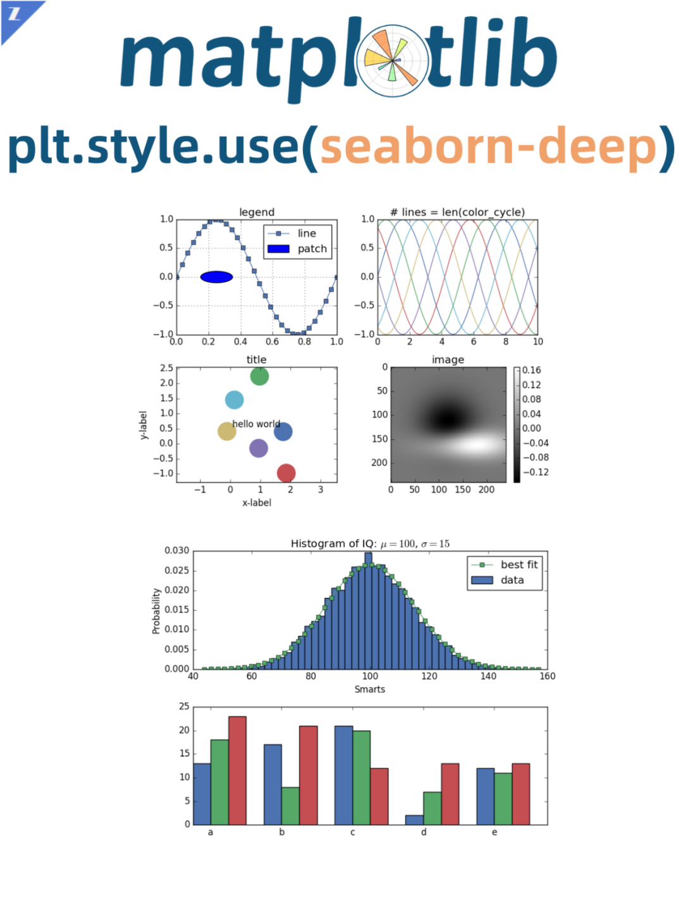
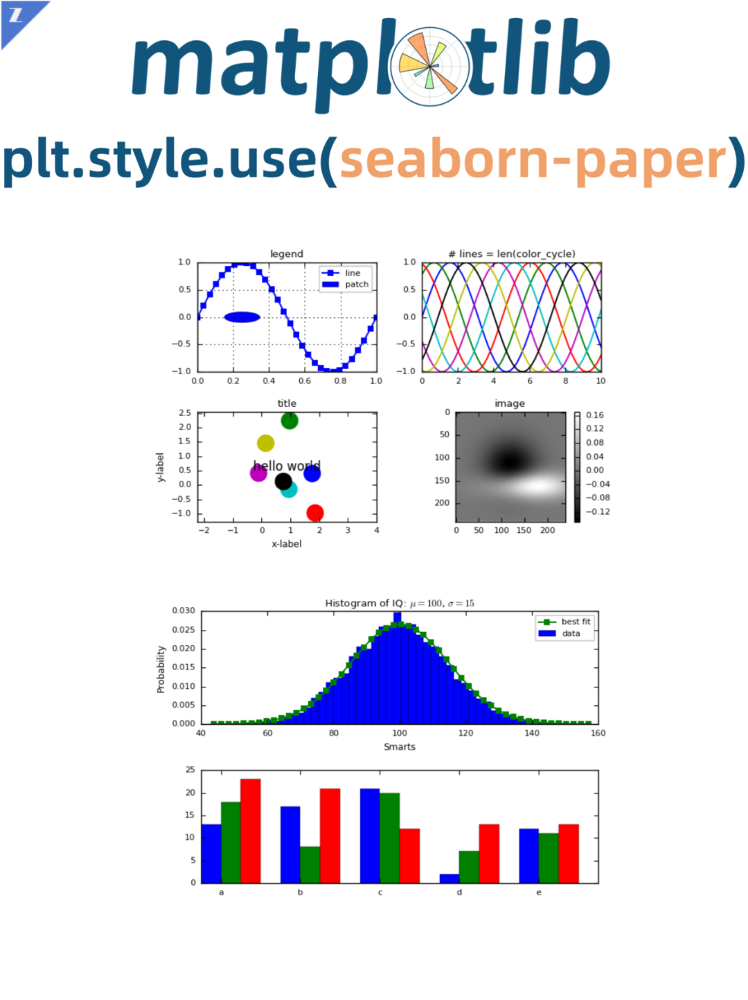

PythonMatplotlib<br />Matplotlib作为高度定制化的绘图工具，它能让使用者很轻松地将数据图形化，并且提供多样化的输出格式。<br />只要使用Python编程便可完美绘制二维统计图表、三维图表、动态图表、交互图表，甚至可以编辑图片，修改各种元素。📊<br />刚接触Matplotlib的小伙伴可能无法绘制出好看的图，这里建议使用内置的style风格，只需要一行代码便可以让图表变得好看。🤩<br />Matplotlib提供了几十种图表样式，满足了不同场景和需求，比如论文用图、会议用图、报告用图等。<br />这里选了9种比较喜欢的分享出来，希望能帮助到需要的小伙伴。<br />style使用方式：👇👇👇 
```python
plt.style.use(style_name) 
```
查看有哪些style：👇👇👇 
```python
plt.style.available
```
<br /><br /><br /><br /><br /><br /><br /><br />
