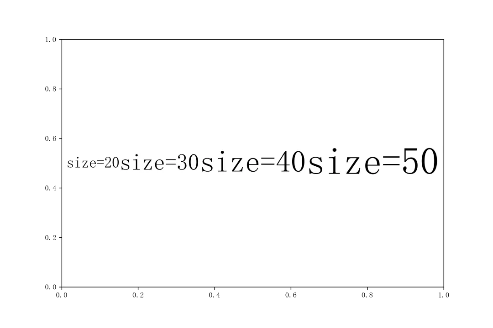
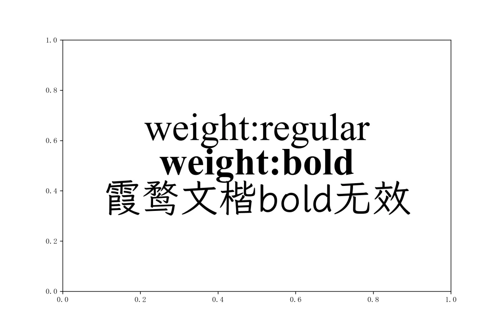

Python Matplotlib 可视化
<a name="hUnDp"></a>
## 1、简介
长久以来，在使用matplotlib进行绘图时，一直都没有比较方便的办法像R中的ggtext那样，向图像中插入整段的混合风格富文本内容，譬如下面的例子：<br /><br />在github发现了一个叫做flexitext的第三方库，它设计了一套类似ggtext的语法方式，使得可以用一种特殊的语法在matplotlib中构建整段富文本。
<a name="zeEdy"></a>
## 2、使用`flexitext`在`matplotlib`中创建富文本
在使用`pip install flexitext`完成安装之后，使用下列语句导入所需模块：
```python
from flexitext import flexitext
```
<a name="OCRL8"></a>
### 2.1 基础用法
flexitext中定义富文本的语法有些类似html标签，需要将施加了特殊样式设置的内容包裹在成对的`<>`与`</>`中，并在`<>`中以属性名:属性值的方式完成各种样式属性的设置，譬如想要插入一段混合了不同粗细、色彩以及字体效果的富文本：
```python
from flexitext import flexitext
import matplotlib.pyplot as plt

# 将幼圆与楷体插入到matplotlib字体库中
plt.rcParams['font.sans-serif'] = ['YouYuan', 'KaiTi'] + plt.rcParams['font.sans-serif']

fig, ax = plt.subplots(figsize=(9, 6))

flexitext(0.5, 
          0.5, 
          '''<size:30>这<color:yellow>是</>一段<weight:bold, name:DejaVu Sans>flexitext</><color: red, name:KaiTi>富文本</>测试</>''', 
          ha="center");
```
<br />很舒服！使用`flexitext()`来替换`ax.text()`方法，它在兼容了`ax.text()`关于文字坐标以及对齐方式等常规参数的同时，以特殊的格式定义文本内容及样式风格，下面就来进一步学习flexitext中支持的各种参数设置。
<a name="Lv7Sr"></a>
### 2.2 flexitext标签中的常用属性参数
在前面的例子中在标签中使用到了size、color、weight以及name等属性参数，而flexitext中标签支持的常用属性参数如下：
<a name="mGxat"></a>
#### 2.2.1 利用size设置文本像素大小
size属性非常简单，其用于定义标签所包裹文本内容的像素尺寸：
```python
fig, ax = plt.subplots(figsize=(9, 6))

flexitext(0.5, 
          0.5, 
          '<size:20>size=20</><size:30>size=30</><size:40>size=40</><size:50>size=50</>', 
          ha="center")

plt.savefig('图3.png', dpi=300)
```

<a name="ao4OD"></a>
#### 2.2.2 利用name设置字体
name属性可以用来设置具体的字体名称，下面分别演示系统自带的字体，以及自行注册导入的自定义字体是如何在flexitext中使用的（其中每种字体的name可以通过`font_manager.fontManager.ttflist`查看）：
```python
from matplotlib import font_manager

# 从本地文件中注册新字体
font_manager.fontManager.addfont('Dark Twenty.otf')
font_manager.fontManager.addfont('Yozai-Regular.ttf')
font_manager.fontManager.addfont('LXGWWenKai-Regular.ttf')

fig, ax = plt.subplots(figsize=(9, 6))

flexitext(0.5, 
          0.5, 
          '<size:60, name:Dark Twenty>Dark Twenty</>\n<size:60, name:Yozai>悠哉字体</>\n<size:60, name:LXGW WenKai>霞鹜文楷</>', 
          ha="center")

plt.savefig('图4.png', dpi=300)
```

<a name="VM9Qu"></a>
#### 2.2.3 利用`weight`设置文本字体粗细
weight属性用于设置文本的粗细程度，可传入0到1000之间的数值，或是ultralight、light、normal、regular、book、medium、roman、semibold、demibold、demi、bold、heavy、extra bold、black中的选项，不过这个属性依赖具体的字体族（`flexitext`中使用family属性来定义）是否包含对应的粗细版本，所以有时候设置无效是正常的，譬如下面的例子中Times New Roman是完整的字体族，因此可以设置粗细：
```python
fig, ax = plt.subplots(figsize=(9, 6))

flexitext(0.5, 
          0.5, 
          (
              '<size:50, family:Times New Roman>weight:regular</>\n'
              '<weight:bold, size:50, family:Times New Roman>weight:bold</>\n'
              '<weight:bold, size:50, name:LXGW WenKai>霞鹜文楷bold无效</>'
          ), 
          ha="center",
          ma='center')

plt.savefig('图5.png', dpi=300)
```

<a name="NfWJT"></a>
#### 2.2.4 利用`color`、`backgroundcolor`设置文本颜色及背景色
`color`与`backgroundcolor`属性接受matplotlib中合法的颜色值输入，可用于对标签所囊括文本的色彩及背景色进行设置，譬如下面配合调色库`palettable`来制作一些花里胡哨的文字：
```python
from palettable.colorbrewer.diverging import Spectral_6

fig, ax = plt.subplots(figsize=(9, 6))

text = ''
for i, s in enumerate(list('制造一场彩虹')):
    text += '<size:50, name:LXGW WenKai, color:{}>{}</>'.format(Spectral_6.hex_colors[i], s)
    
flexitext(0.5, 
          0.6, 
          text, 
          ha="center",
          ma='center')

flexitext(0.5, 
          0.4, 
          '<name:LXGW WenKai, size:50, color:white, backgroundcolor: {}>制造一场彩虹</>'.format(Spectral_6.hex_colors[2]), 
          ha="center",
          ma='center')

plt.savefig('图6.png', dpi=300)
```

<a name="t4685"></a>
#### 2.2.5 利用`alpha`调节文字透明度
`alpha`参数则用于设置文字的透明度，取值在0到1之间，来看一个简单的例子：
```python
import numpy as np

fig, ax = plt.subplots(figsize=(9, 6))

flexitext(0.5, 
          0.4, 
          ('<name:LXGW WenKai, size:50, alpha:{}>绘</>'*9).format(
              *np.linspace(1, 0, 9).tolist()
          ), 
          ha="center",
          ma='center')

plt.savefig('图7.png', dpi=300)
```
<br />关于flexitext的其余可用参数等信息，感兴趣的朋友可以自行前往官方仓库进行查看：[https://github.com/tomicapretto/flexitext](https://github.com/tomicapretto/flexitext)
