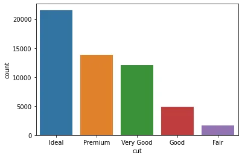

PythonMatplotlib
<a name="knaXx"></a>
## 1、rcParams
rcParams字典。它包含了用于创建图形的默认样式的所有Matplotlib设置。可以直接从Matplotlib命名空间导入它：
```python
from matplotlib import rcParams  
 >>> rcParams  
 ...  
 'axes.grid': False,  
 'axes.grid.axis': 'both',  
 'axes.grid.which': 'major',  
 'axes.labelcolor': 'black',  
 'axes.labelpad': 4.0,  
 'axes.labelsize': 'medium',  
 'axes.labelweight': 'normal',  
 'axes.linewidth': 0.8,  
 ...  
   
 rcParams['figure.figsize'] = 8, 6  
 rcParams['legend.fontsize'] = "large"  
 rcParams['xtick.major.size'] = 4  
 rcParams['xtick.minor.size'] = 1
```
这时所有的Matplotlib设置，如果想修改任何的Matplotlib参数，直接修改这个字典就可以了，甚至可以将他序列化到本地，然后在其他项目中直接加载，这样每一个Matplotlib实例使用的都是相同的配置了。还可以调用PyPlot的`rcdefaults`函数，它会将所有参数重置成默认值。
```python
plt.rcdefaults()
```
<a name="DdURc"></a>
## 2、`get_* functions`
在底层，Matplotlib是完全面向对象的。<br />[](https://matplotlib.org/3.7.2/tutorials/introductory/quick_start.html#parts-of-a-figure)个类的参数都不一样这会给使用带来很大的不方便，所以Matplotlib定制了有许多以`get_`前缀开头的函数，可以直接创建图形中的组件。下面是一个例子：<br />上图中看到的每个单独的组件都是作为一个单独的类实现的。它们都继承自基类Matplotlib Artist。但是类太多，并且每
```python
fig, ax = plt.subplots()  

>>> [func for func in dir(ax) if func.startswith("get")]  

['get_adjustable',  
 'get_label',  
 'get_legend',  
 'get_legend_handles_labels',  
 'get_lines',  
 'get_navigate',  
 'get_title',  
 'get_transform',  
 'get_xmajorticklabels',  
 'get_xminorticklabels',  
 'get_xscale',  
 'get_xticklabels',  
 'get_zorder']
```
假设想自定义一个图形的坐标：
```python
x = np.linspace(0, 2, 100)  

fig, ax = plt.subplots()  # Create a figure and an axes.  

l1 = ax.plot(x, x, label="linear")  
l2 = ax.plot(x, x ** 2, label="quadratic")  
l3 = ax.plot(x, x ** 3, label="cubic")  

ax.set_title("Simple Plot")  

plt.show()
```
<br /> <br />这很简单，只需在axes对象上调用`get_xticklabels`，就可以得到Matplotlib Text实例的列表：
```python
>>> ax.get_xticklabels()  

[Text(0, 0, 'Ideal'),  
 Text(1, 0, 'Premium'),  
 Text(2, 0, 'Very Good'),  
 Text(3, 0, 'Good'),  
 Text(4, 0, 'Fair')]
```
还可以使用`get_xticklines`调整刻度线，或者使用get_xticks调整刻度的位置。已经获得了对象，下面就可以进行调整了。
<a name="IJCiW"></a>
## 3、get / setp
调用`plt.getp`函数，可以查看它当前具有的参数。例如，假设想要样式化下面图的l2：
```python
x = np.linspace(0, 2, 100)  

fig, ax = plt.subplots()  # Create a figure and an axes.  

l1 = ax.plot(x, x, label="linear")  
l2 = ax.plot(x, x ** 2, label="quadratic")  
l3 = ax.plot(x, x ** 3, label="cubic")  

ax.set_title("Simple Plot")  

plt.show()
```
<br />这个方法返回了图表的所有属性
```python
>>> plt.getp(l2)  
...  
drawstyle or ds = default  
figure = Figure(640x480)  
linestyle or ls = -  
linewidth or lw = 1.5  
marker = None  
markeredgecolor or mec = #ff7f0e  
markeredgewidth or mew = 1.0  
markerfacecolor or mfc = #ff7f0e  
markerfacecoloralt or mfcalt = none  
zorder = 2  
...
```
而`plt.setp`可以更改属性在没有任何参数的对象上调用this会打印出该对象可以接受的属性值：
```python
>>> plt.setp(l2)  
...  
linestyle or ls: {'-', '--', '-.', ':', '', (offset, on-off-seq), ...}  
linewidth or lw: float  
sketch_params: (scale: float, length: float, randomness: float)  
snap: bool or None  
zorder: float  
...
```
要打印单个属性的可能值，可以将属性的名称作为字符串输入setp：
```python
>>> plt.setp(l2, "linestyle")  
linestyle: {'-', '--', '-.', ':', '', (offset, on-off-seq), ...}
```
修改属性的方法如下：
```python
>>> plt.setp(l2, linestyle="-.", lw=5, color="red", alpha=0.5)  
[None, None, None, None]
```
要查看更改后的当前图形，只需在图形对象上调用get_figure：
```python
fig.get_figure()
```
<br />第二行的样式已经变了
<a name="XZCun"></a>
## 4、Legends
Legends可以说明图中每个组件的含义，默认是这样显示的：
```python
x = np.linspace(0, 2, 100)  

fig, ax = plt.subplots()  # Create a figure and an axes.  

l1 = ax.plot(x, x, label="linear")  
l2 = ax.plot(x, x ** 2, label="quadratic")  
l3 = ax.plot(x, x ** 3, label="cubic")  

ax.set_title("Simple Plot")  

ax.legend()  

plt.show()
```
<br />可以调整他的参数，例如：图例的位置、字体属性、大小，颜色，样式、图例中的列数，等等可以在创建前设置，也可以在创建后使用`get_legend`提取，并使用`getp`、`setp`函数。
<a name="LZl3l"></a>
## 5、cycler
有没有想过Matplotlib是如何自己改变颜色或循环不同风格的?在底层，Matplotlib使用名为Cyclers的Python内置对象：
```python
from cycler import cycler  

c1 = cycler(arg1=[1, 2, 3, 4])  
>>> c1
```
<br />这个循环函数接受任何键值参数并创建一个字典列表：
```python
c2 = cycler(arg2=list("rgba"))  

for i in c2:  
    print(i)
```
```
------------------------------  

 {'arg2': 'r'}  
 {'arg2': 'g'}  
 {'arg2': 'b'}  
 {'arg2': 'a'}
```
还可以将多个循环器与“plus”和“multiply”操作符组合起来，这样可以获得索引到索引或穷举的参数组合：
```python
for i in c1 + c2:  
    print(i)  
    
--------------------------------  

{'arg1': 1, 'arg2': 'r'}  
{'arg1': 2, 'arg2': 'g'}  
{'arg1': 3, 'arg2': 'b'}  
{'arg1': 4, 'arg2': 'a'}
```
将这个自定义循环器并将其传递给Matplotlib，就可以定制样式。下面，创建四种不同的线条样式，允许Matplotlib循环使用不同的线条颜色，样式和大小：
```python
line_prop_cycler = (  
    cycler(color=list("rgcy"))  
    + cycler(ls=["-", "--", "-.", ":"])  
    + cycler(lw=[3, 6, 9, 12])  
)
```
可以使用axes对象的 `set_prop_cycle` 函数将这个自定义循环器传递给绘图：
```python
x = np.linspace(0, 2 * np.pi, 50)  
offsets = np.linspace(0, 2 * np.pi, 4, endpoint=False)  
yy = np.transpose([np.sin(x + phi) for phi in offsets])  

fig, ax = plt.subplots(figsize=(8, 4))  

ax.set_prop_cycle(line_prop_cycler)  # Set propcycle before plotting  
ax.plot(x, yy)  

plt.show();
```
<br />rcParams字典中默认设置如下：
```python
rcParams["axes.prop_cycle"]
```
<br />可以直接修改
<a name="Ak58k"></a>
## 6、tick_params
轴刻度应该准确地传达数据点及其单位的最小值和最大值，并显示几个关键的检查点，以便在不同的绘图部分之间进行比较。大多数tick属性可以使用axes对象的tick_params函数来控制。以下是文档中的例子：
```python
>>> ax.tick_params()  

Parameters  
----------  
axis : {'x', 'y', 'both'}, default: 'both'  
The axis to which the parameters are applied.  
    which : {'major', 'minor', 'both'}, default: 'major'  
The group of ticks to which the parameters are applied.  
reset : bool, default: False  
Whether to reset the ticks to defaults before updating them.  

Other Parameters  
----------------  
direction : {'in', 'out', 'inout'}  
Puts ticks inside the axes, outside the axes, or both.  
length : float  
Tick length in points.  
width : float  
Tick width in points.  
color : color  
Tick color.
```
首先应该指定的两个参数是axis和which。这些参数将应用于X或Y轴刻度，以及最小和最大刻度。大多数时候，在Matplotlib中不会看到小刻度。如果需要可以使用axes对象上的`minortics_on`函数：
```python
fig, ax = plt.subplots(figsize=(3, 2))  

>>> ax.minorticks_on()
```

<a name="IQBFQ"></a>
## 7、Tickers
如果不像自定义tick参数（因为很麻烦）。可以使用许多内置的Matplotlib的“主题”集合(称为tickers)。
```python
from matplotlib import ticker  
dir(ticker)  
['AutoLocator',  
 'AutoMinorLocator',  
 'EngFormatter',  
 'FixedFormatter',  
 'FixedLocator',  
 'FormatStrFormatter',  
 'Formatter',  
 'FuncFormatter',  
 'IndexFormatter',  
 'IndexLocator',  
 'Integral',  
 'LinearLocator',  
]
```
在ticker模块下有许多这样的子模块。一般情况下标题中带有Locator的控件控制刻度的位置。而Formatters 则表示标签的样式。选择好后可以使用下面的方式进行设置：
```python
from matplotlib.ticker import EngFormatter  

ax.xaxis.set_major_formatter(EngFormatter())
```
使用axes对象的xaxis或yaxis属性，调用`set_major(minor)_formatter(locator)`函数，并传入类名。
<a name="P7q6k"></a>
## 8、grid
自定义网格线可以突出数据范围。在Matplotlib中，可以使用轴线对象的网格函数创建和自定义网格。下面是一个垂直网格的例子：
```python
fig, ax = plt.subplots()  

ax.grid(axis="x", linestyle=":", lw=3, color="r")
```

<a name="Tzg7A"></a>
## 9、bar_label
条形图在数据分析中很常见。它们最重要的地方就是每个条的高度，条形标签可以突出每个条的显示。`bar_label`函数接受一个BarContainer对象作为参数，并自动标注每个bar的高度。下面是Seaborn的一个简单的计数图：
```python
    import seaborn as sns  
    
    diamonds = sns.load_dataset("diamonds")  
    
    ax = sns.countplot(diamonds["cut"])
```
<br />每次使用Seaborn或`ax.bar`等函数创建barplot时，BarContainer对象都会被添加到图中。可以使用axes对象的containers属性来检索这个容器对象：
```python
ax.containers  
[<BarContainer object of 5 artists>]
```
在上面的列表中有一个BarContainer对象有5个bar。只需在创建了plot之后将这个对象传递给`bar_label`：
```python
ax = sns.countplot(diamonds["cut"])  
ax.bar_label(ax.containers[0], padding=1)  
ax.set_ylim(0, 25000)  
plt.show();
```

<a name="cyIC2"></a>
## 10、zorder
当有很多图的时候，显示顺序是非常重要的。需要确保在画布上以适当的顺序绘制每个图形，就需要zorder参数。下面，用不同的zorders创建了三行：
```python
x = np.linspace(0, 7.5, 100)  

plt.plot(x, np.sin(x), label="zorder=2", zorder=2)  # bottom  
plt.plot(x, np.sin(x + 0.5), label="zorder=3", zorder=3)  
plt.axhline(0, label="zorder=2.5", color="lightgrey", zorder=2.5)  

plt.title("Custom order of elements")  

l = plt.legend(loc="upper right")  
l.set_zorder(2.5)  # legend between blue and orange line  

plt.show()
```
<br />可以看到zorder越大，就会在最上方显示，覆盖掉小的组件。
<a name="heilO"></a>
## 总结
Matplotlib在2023年6月的下载量超过3000万，几乎是其最大竞争对手Plotly的4倍。Matplotlib的成功不仅仅在于它的简单（只需要几行代码就能生成简单的图形），还在于他的功能强大，但是要使用这些强大的功能就需要使用他的高级功能，但是这些高级功能往往需要比较复杂的配置或者参数，需要浏览官方的文档。所以才出现了seaborn，他将Matplotlib进行了整合不仅简单而且好看。但是有时需要更深入的定制功能，seaborn也许还达不到目标，只能自己定义的参数，本文总结的是个高级技巧可以轻松的帮你完整自定义Matplotlib的任务。
