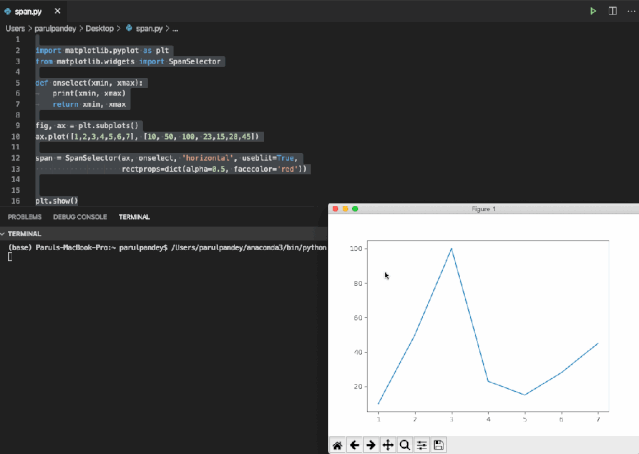
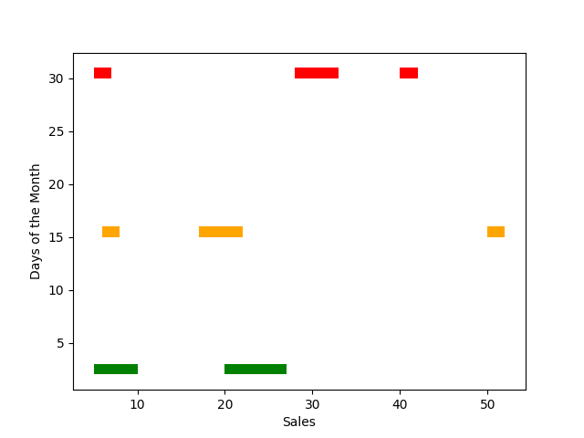
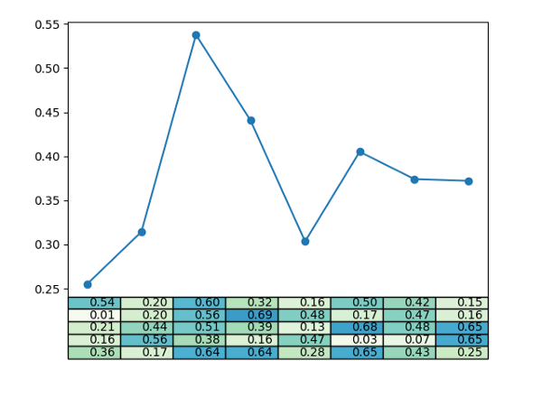
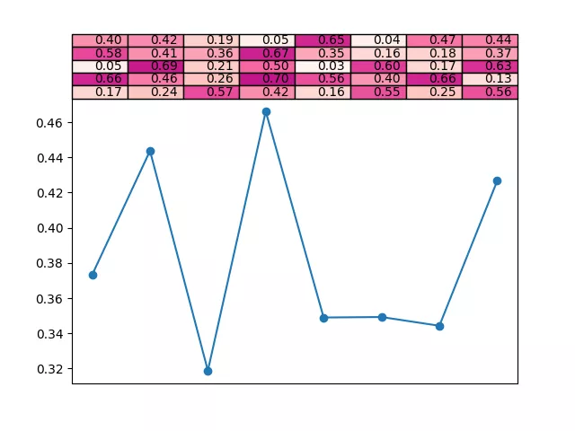
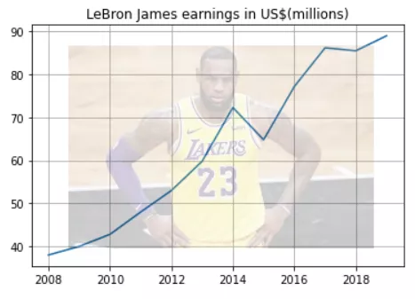
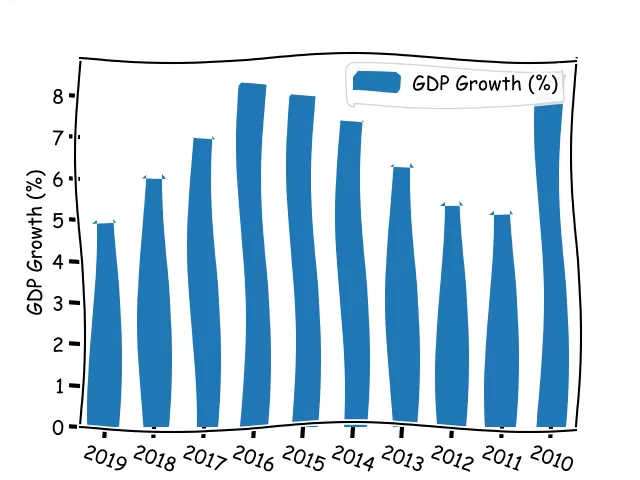

Python Matplotlib
<a name="2hR9A"></a>
## 1. Span Selector
Span Selector是Matplotlib中的鼠标小部件，widgets是用于包含一些交互功能的python对象。Span Selector可以通过鼠标框选，方便地查看选定区域的最大值和最小值。下面是代码，首先创建一个基本折线图作为例子。然后调用SpanSelector方法并使用它来选择一个区域，然后在该区域中显示最大值和最小值。
```python
import matplotlib.pyplot as plt
from matplotlib.widgets import SpanSelector
def onselect(xmin, xmax):
    print(xmin, xmax)
    return xmin, xmax
fig, ax = plt.subplots()
ax.plot([1,2,3,4,5,6,7], [10, 50, 100, 23,15,28,45])
span = SpanSelector(ax, onselect, 'horizontal', useblit=True, rectprops=dict(alpha=0.5, facecolor='red'))       
plt.show()
```
下面是具体操作。
<a name="LXpwQ"></a>
## 2. Broken Barh
Broken的水平条形图是不连续具有间隙的图，它可用于数据值相差很大的情况下，例如，包含极端温度范围的数据集。在这种情况下，Broken的水平条形图非常合适，因为它们可以同时绘制最大和最小范围。Python模块`matplotlib.broken_barh()`用于绘制Broken的水平条形图。
```python
import matplotlib.pyplot as plt 
#Defining the x and y ranges 
xranges = [(5,5), (20,5),(20,7)] 
yrange = (2,1) 
#Plotting the broken bar chart 
plt.broken_barh(xranges, yrange, facecolors='green') 
xranges = [(6,2), (17,5),(50,2)] 
yrange = (15,1) 
plt.broken_barh(xranges, yrange, facecolors='orange') 
xranges = [(5,2), (28,5),(40,2)] 
yrange = (30,1) 
plt.broken_barh(xranges, yrange, facecolors='red') 
plt.xlabel('Sales') 
plt.ylabel('Days of the Month') 
plt.show()
```

<a name="qsY0W"></a>
## 3. Table Demo
Matplotlib的表格功能也是可以在图中显示表格的。当希望以条形图的形式快速查看表格中的值时，这特别方便。表格可以放置在图表的顶部，底部或侧面。
```python
import pandas as pd 
import numpy as np 
import matplotlib.pyplot as plt 
x = np.random.rand(5, 8)*.7
plt.plot(x.mean(axis=0), '-o', label='average per column') 
plt.xticks([]) 
plt.table(cellText=[['%1.2f' % xxx for xxx in xx] for xx in x],cellColours=plt.cm.GnBu(x),loc='bottom') 
plt.show()
```

<a name="OTJfD"></a>
## 4. Watermark Images
给可视化图像添加背景。首先，导入要用的数据集，图片和必要的库pandas。
```python
import numpy as np 
import matplotlib.image as image 
import matplotlib.pyplot as plt 
import pandas as pd 
df = pd.read_csv('income.csv') 
im = image.imread('Lebron_James.jpeg') # Image
```
用pandas过滤掉仅由勒布朗组成的数据。
```python
lebron_james = df[df['Name']=='LeBron James']
```
然后像下面这样操作，使用figimage添加水印就ok了。
```python
fig, ax = plt.subplots() 
ax.grid() 
ax.plot('Year','earnings ($ million)',data=lebron_james) 
ax.set_title("LeBron James earnings in US$(millions)") 
fig.figimage(im, 60, 40,cmap='ocean', alpha=.2) 
plt.show()
```

<a name="L3M6H"></a>
## 5. XKCD Plots
如果想让Matplotlib图上添加一些扭曲，可以简单地`xkcd()`在pyplot对象上调用方法，如下所示。
```python
import pandas as pd 
import matplotlib.pyplot as plt 
df = pd.read_csv('https://raw.githubusercontent.com/parulnith/Website-articles-datasets/master/India%20GDP%20Growth%20Rate%20.csv', parse_dates=['Year']) 
df['Year'] = df['Year'].apply(lambda x: pd.Timestamp(x).strftime('%Y')) 
#calling xkcd() method 
plt.xkcd(scale=5, length=400) 
df.plot(x='Year',y='GDP Growth (%)',kind='bar') 
plt.ylabel('GDP Growth (%)') 
plt.xticks(rotation=-20) 
plt.figure(figsize=(10,8)) 
plt.show()
```

