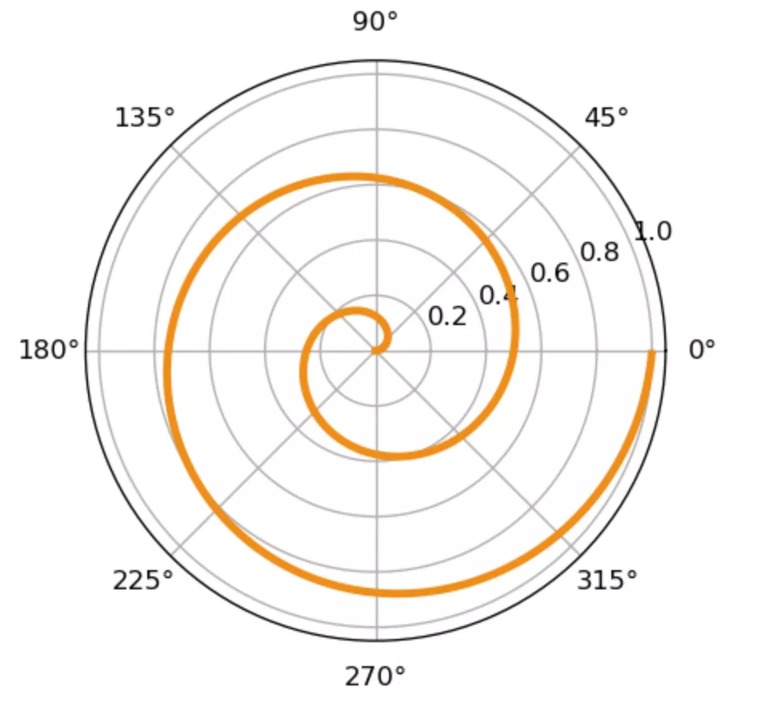
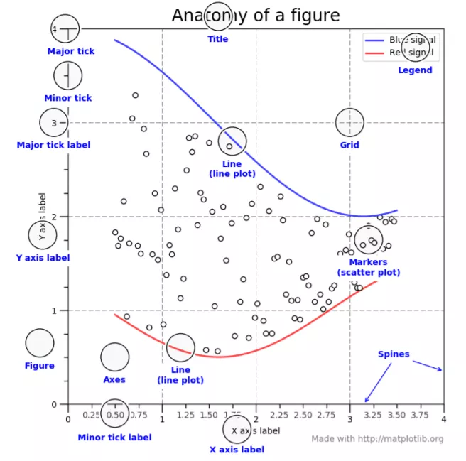
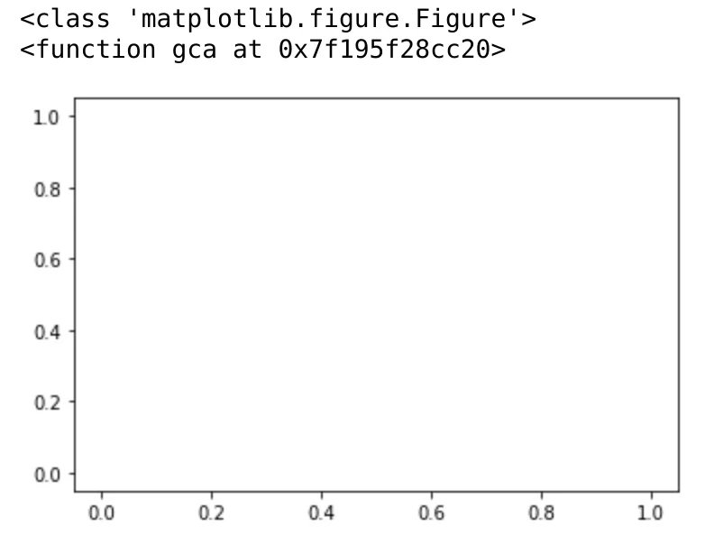
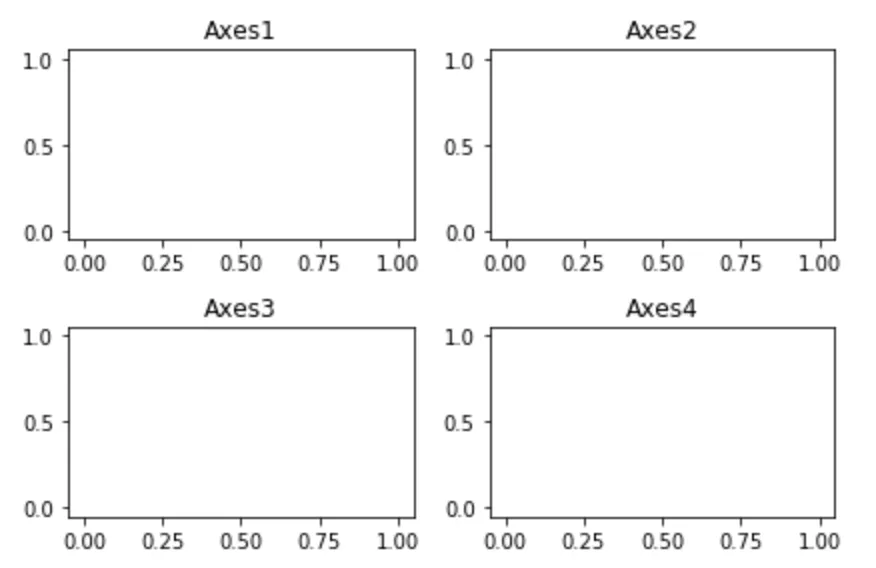
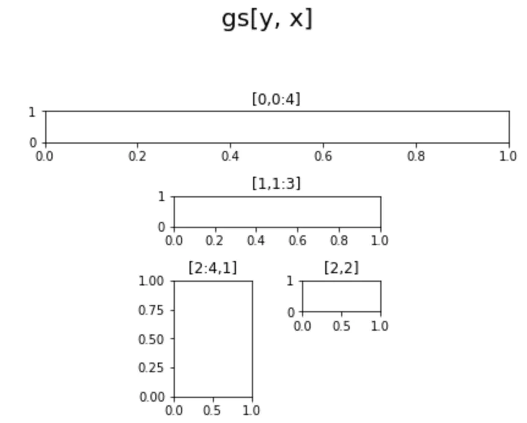
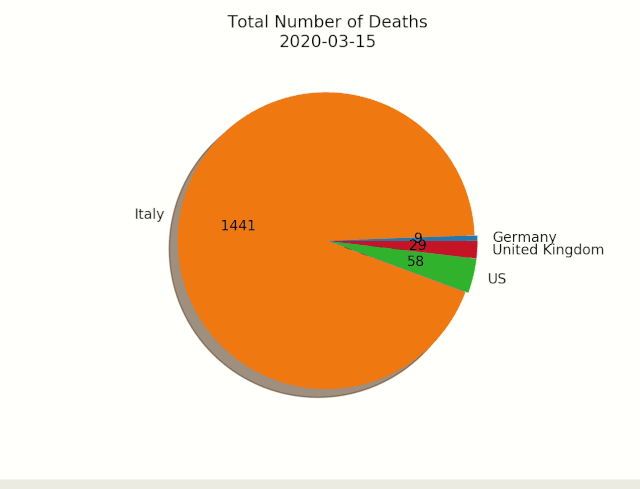

Matplotlib
<a name="QVoMN"></a>
## 1、Matplotlib两套不同的绘图API使用场景是怎样的？
Matplotlib 构建的绘图体系是严谨的，它提供基本的两套绘图API：

1. 基于 `matplotlib.pyplot` 模块，优点：写法简洁，适用交互性强，如Jupyter Notebook，一边写一边出图的场景；缺点：不适宜在大项目中，构建复杂的GUI图形场景。
2. 基于面向对象(OO)的API绘图，需要自己手动创建诸如，`figure` 对象，`axes` 对象，调用它们开放出的API，优点定制能力更强，适应于大型项目，很多行脚本时；缺点：没有`pyplot`那般简洁。
<a name="BA2B1"></a>
## 2、分别如何使用这两套API?
先使用两套绘图方法，绘制一个简单图，重点体会它们书写的不同。<br />使用第一种方法绘图，即`pyplot`模块，在极坐标系下绘制一条螺旋线，完全使用`pyplot`模块内的方法：
```python
# 创建figure
fig = plt.figure(dpi=120)
# 准备好极坐标系的数据
# 半径为[0,1]
r = np.arange(0, 1, 0.001)
theta = 2 * 2*np.pi * r
# 极坐标下绘制
line, = plt.polar(theta, r, color='#ee8d18', lw=3)
plt.show()
```
<br />使用面向对象的方法，调用`axes`对象同样绘制出上图：
```python
fig = plt.figure(dpi=120)
# 添加一个坐标系到figure中，返回这个坐标系
ax = fig.add_subplot(111, polar=True)
r = np.arange(0, 1, 0.001)
theta = 2 * 2*np.pi * r
# 调用坐标系ax对象内的plot绘图
# 而不是pyplot内的plot
line, = ax.plot(theta, r, color='#ee8d18', lw=3)
plt.show()
```
<a name="hAzh5"></a>
## 3、如何解剖图中各个元素？
matplotlib 绘图元素与上一个专题的绘图入门介绍的元素基本对应，基本的元素包括：Figure(整个图形)，Axes(坐标系)，主tick(major tick)，次tick(minor tick)，主tick的标签(major tick)，次tick的标签(minor tick label)，y轴标签(y axis label)，线(line)，标题(title)，网格(Grid)，图例(Legend)，标注点(Markers)，Spines 是连接轴刻度标记的线，而且标明了数据区域的边界。<br />
<a name="E5vNM"></a>
## 4、Figure 和 Axes 的关系是什么？
Figure 是所有绘图元素的最顶层容器， 而 Axes 是 Figure 上的其中一个坐标系，言外之意，一个 Figure 能包括多个 Axes!<br />如下创建 Figure 时，会默认创建一个 Axes
```python
# figure() 创建一个Figure对象
fig = plt.figure()
print(type(fig))
# 并且默认创建一个坐标系Axes
print(plt.gca)
plt.plot()
plt.show()
```
<br />当然也可以一个 Figure 对象中包括多个 Axes 对象，如下包括4个：
```python
fig = plt.figure()
for i in range(1,5):
    ax = fig.add_subplot(220+i)
    ax.plot()
    plt.title('Axes'+str(i))
# 解决元素重叠问题
fig.tight_layout()
plt.show()
```

<a name="wyzsy"></a>
## 5、多图时元素重叠如何解决？
正如上图所示，matplotlib 有2个方法能自动解决重叠问题，一个就是上面用到的`tight_layout`方法，再有一个`subplots_adjust`：
```python
fig.subplots_adjust(0,0,1,1,hspace=0.5,wspace=0.5)
```
那么问题来了，如果实现更加鸡血的布局，该如何做？借助 `GridSpec`，使用方法如下所示：
```python
fig = plt.figure()
fig.suptitle("gs[y, x]", x=0.5, y=1.2, fontsize=20)
# 创建4*4的对象
gs = fig.add_gridspec(4, 4)
# 创建第一行
ax1 = fig.add_subplot(gs[0,0:4])
ax1.set_title('[0,0:4]')
# 创建中间四行
ax2 = fig.add_subplot(gs[1,1:3])
ax2.set_title('[1,1:3]')
ax3 = fig.add_subplot(gs[2:4,1])
ax3.set_title('[2:4,1]')
ax4 = fig.add_subplot(gs[2,2])
ax4.set_title('[2,2]')
plt.tight_layout()
```

<a name="rzzpe"></a>
## 6、图中的汉字总是乱码怎么解决？
借助全局参数配置字典`rcParams`，只需要在代码开头，添加如下两行代码：
```python
#解决中文显示问题
# 指定默认字体
plt.rcParams['font.sans-serif'] = ['KaiTi'] 
# 解决保存图像是负号'-'显示为方块的问题
plt.rcParams['axes.unicode_minus'] = False
```
<a name="Zb0hM"></a>
## 7、matplotlib中如何绘制动画？
使用animation模块，`FuncAnimation`方法，定义好回调函数，入参为整数，代表帧数。<br />如下为绘制饼图的动画，展示逻辑如下：
```python
fig,ax = plt.subplots()
explode=[0.01,0.01,0.01,0.01] 
def getmepie(i):
    def absolute_value(val):
        a = np.round(val/100.*df1.head(i).max().sum(), 0)
        return int(a)
    ax.clear()
    plot = df1.head(i).max().plot.pie(y=df1.columns,autopct=absolute_value, label='',explode = explode, shadow = True)
    plot.set_title('Total Number of Deaths\n' + str(df1.index[min( i, len(df1.index)-1 )].strftime('%Y-%m-%d')), fontsize=12)
```
`animator = ani.FuncAnimation(fig, getmepie, interval = 200) plt.show()` 绘制动画只有这一行，调用`FuncAnimation`，它的第二个参数为上面定义的函数`getmepie`:<br />`animator = ani.FuncAnimation(fig, getmepie, interval = 200) plt.show()` 绘制后的饼图部分 gif 动画，录制效果如下：<br />
