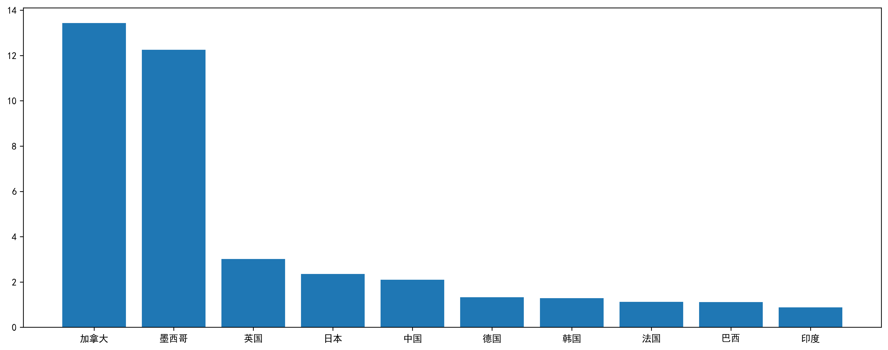
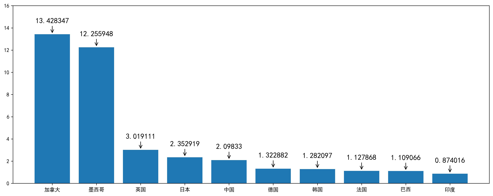
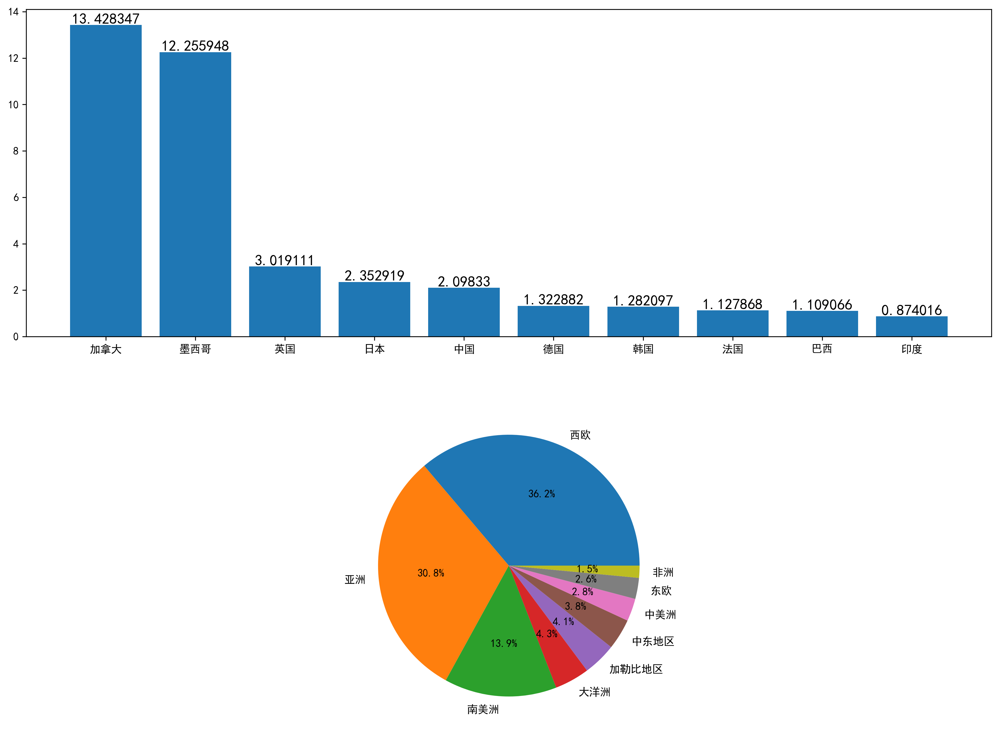
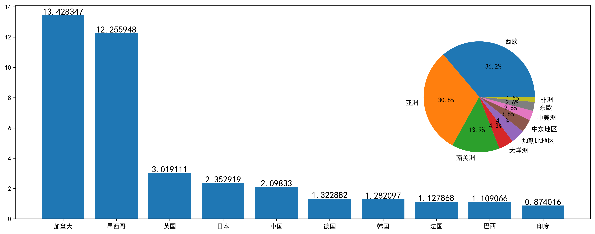
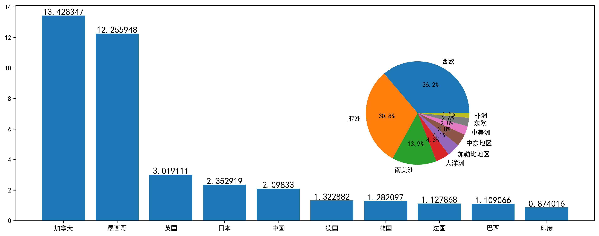

Python Matplotlib
<a name="d5yFD"></a>
# 数据注释
演示的数据集为2016年抵美（到达美国）人数排名前十的国家数据，包含国名和具体入境人数，人数的具体单位为百万人次
```python
import pandas as pd
import numpy as np
import matplotlib.pyplot as plt

plt.rcParams['font.sans-serif'] = 'SimHei'
x_data = ['加拿大','墨西哥','英国','日本','中国','德国','韩国','法国','巴西','印度']
y_data = [13.428347,12.255948,3.019111,2.352919,2.09833,1.322882,1.282097,1.127868,1.109066,0.874016]
```
有了数据后，可以非常快地画出一张柱状图
```python
fig,ax = plt.subplots(figsize=(16,6))
ax.bar(x_data,y_data)
plt.savefig('outbox_legend.png', dpi = 300, bbox_inches = 'tight', pad_inches = .1)
```
<br />接下来开始加注释，即在柱状图上显示具体数值。在`Matplotlib`中，为数据加上注释有两种方式，一种是使用`ax.text()`，另一种则是`ax.annotate()`。
<a name="7E3wG"></a>
## `ax.text()`
`ax.text()`的主要作用是为图中加上一些`text`，也就是文字。不仅是能够加注释，只要指定了坐标，可以在图上的任何坐标加上`text`。<br />函数中的几个重要的参数，具体介绍一下

- `**x**`：x的坐标
- `**y**`：y的坐标
- `**s**`：要加的文字
- `**rotation**`：文字旋转的角度
- `**fontsize**`：文字字体大小
- `**fontweight**`：文字字体粗细

需要注意的是，每次调用`ax.text()`只能生成一个`Text`对象，也就是说**每次只能加一个注释**，多个的话需要**写循环生成**。<br />所以一般加注释是这么一个流程：先确定注释的横纵坐标-->写循环调用`ax.text()`
```python
fig,ax = plt.subplots(figsize=(16,6))
ax.bar(x_data,y_data)
# 循环生成text
# horizontalalignment参数设置注释居中显示
for x,y in zip(x_data,y_data):
    ax.text(x,y+0.05,y,fontsize=14,horizontalalignment='center')
plt.savefig('outbox_legend.png', dpi = 300, bbox_inches = 'tight', pad_inches = .1)
```

<a name="mC81P"></a>
## `ax.annotate()`
相比于`ax.text()`，`ax.annotate()`更像是专门为做注释而生的，`annotate`便是注释的意思。<br />`ax.annotate()`的注释功能更强大，除了加入文本注释外，如果有需要还能够**加上箭头→**进行指示。<br />一些主要的参数如下：

- **s**：注释文本
- **xy**：要加注释的数据点位置
- **xytext**：文本注释的位置，默认情况下为`xy`
- **arrowprops**：一个控制箭头的属性的dict，如果需要显示箭头，必须要设置

这里比较有意思的两个参数是`xy`和`xytext`，二者貌似没啥区别的样子，这个地方确实很容易产生困惑。<br />一般情况下，`s`和`xy`是必须要设置的参数，如果不指定，`xytext`默认和`xy`一致。<br />但如果要**设置箭头**的话，`xy`的坐标则定义了**箭头的头部**，`xytext`则指定**箭头的尾部和文本注释的位置**，实际画图来理解看看。<br />`ax.annotate()`和`ax.text()`的画图流程是一致的，都需要循环生成注释。<br />不设置箭头，简单加上注释
```python
fig,ax = plt.subplots(figsize=(16,6))
ax.bar(x_data,y_data)
for x,y in zip(x_data,y_data):
    ax.annotate(y,(x,y+0.05),fontsize=14,horizontalalignment='center')
plt.savefig('outbox_legend.png', dpi = 300, bbox_inches = 'tight', pad_inches = .1)
```
<br />加上注释并设置箭头
```python
fig,ax = plt.subplots(figsize=(16,6))
ax.bar(x_data,y_data)
# 箭头头部坐标(x,y)
# 箭头尾部坐标（注释坐标）为(x,y+1)
for x,y in zip(x_data,y_data):
    ax.annotate(y,xy = (x,y),xytext = (x,y+1),fontsize=14,horizontalalignment='center',
               arrowprops =dict(arrowstyle='->'))
# 将纵坐标范围扩大
ax.set_ylim([0,16])
plt.savefig('outbox_legend.png', dpi = 300, bbox_inches = 'tight', pad_inches = .1)
```
<br />设置了显示箭头之后，可以明显地看出，箭头是由`xytext`坐标指向`xy`的坐标的，所以，当你不需要设置箭头的时候，`xytext`设置的意义并不大。
<a name="7Hidk"></a>
# 内嵌图
内嵌图大家可能用的比较少，但这种图其实还是挺有用的。<br />拿上面的数据例子来说，柱状图显示了2016年抵美人数排名前十的国家的具体人数，如果这时想结合各大地域抵美人数的占比数据进行分析，该如何绘图？<br />一个比较直接的想法是用`subplots`子图来实现，比如**上边显示柱状图，下边显示饼图**，如下：
```python
zhou_name = ['西欧','亚洲','南美洲','大洋洲','加勒比地区','中东地区','中美洲','东欧','非洲']
zhou_percent = [36.2,30.8,13.9,4.3,4.1,3.8,2.8,2.6,1.5]
fig,ax = plt.subplots(2,1,figsize=(16,12))
ax[0].bar(x_data,y_data)
for x,y in zip(x_data,y_data):
    ax[0].annotate(y,(x,y+0.05),fontsize=14,horizontalalignment='center')
ax[1].pie(zhou_percent,labels=zhou_name,autopct='%1.1f%%')
plt.savefig('outbox_legend.png', dpi = 300, bbox_inches = 'tight', pad_inches = .1)
```
<br />这当然是可行的，但还有更好的方案，那便是内嵌图。注意到这里的柱状图右侧**有很大的留白部分**，如果**把饼图放到柱状图右侧的留白部分**会显得更加直观。<br />内嵌图有两种生成方式，一种是`fig.add_axes()`，另一种则是使用`inset_axes()`。
<a name="wZSwV"></a>
## `fig.add_axes()`
`fig.add_axes()`就是在原有的`Figure`上加上一个新的区域`Axes`，然后在这个区域中绘制图形。<br />使用这个方法的话需要指定新增的这个区域`Axes`在`Figure`中的相对位置和区域大小，输入参数均为相对于原来`Figure`的比例值，如下：
```python
# left和bottom控制新Axes的位置
# width和height控制新Axes的大小（长宽）
# 这些均用相对数来表示，大小在0-1之间
left,bottom,width,height = [0.5,0.3,0.5,0.5]
fig,ax1 = plt.subplots(figsize=(16,6))
ax1.bar(x_data,y_data)
for x,y in zip(x_data,y_data):
    ax1.annotate(y,(x,y+0.05),fontsize=14,horizontalalignment='center')
# 运用fig.add_axes()新增一个区域Axes绘图
ax2 = fig.add_axes([left,bottom,width,height])
ax2.pie(zhou_percent,labels=zhou_name,autopct='%1.1f%%')
plt.savefig('outbox_legend.png', dpi = 300, bbox_inches = 'tight', pad_inches = .1)
```

<a name="DNs7A"></a>
## `inset_axes`
相比于`fig.add_axes()`需要对相对位置进行调试，使用`inset_axes()`进行绘图则可以方便进行定位。<br />`inset_axes`中的位置由参数`loc`设置，可以用字符串控制，也可以输入数字，具体如下：
> 'upper right'  : 1
> 'upper left'   : 2
> 'lower left'   : 3
> ......
> 'upper center' : 9
> 'center'       : 10

```python
# 使用前需要先导包
from mpl_toolkits.axes_grid1.inset_locator import inset_axes
fig,ax1 = plt.subplots(figsize=(16,6))
ax1.bar(x_data,y_data)
for x,y in zip(x_data,y_data):
    ax1.annotate(y,(x,y+0.05),fontsize=14,horizontalalignment='center')
# 将内嵌图置于右侧，宽度和长度分别为相对长度
ax2 = inset_axes(ax1,width = '60%',height = '60%',loc='right')
ax2.pie(zhou_percent,labels=zhou_name,autopct='%1.1f%%')
plt.savefig('outbox_legend.png', dpi = 300, bbox_inches = 'tight', pad_inches = .1)
```

