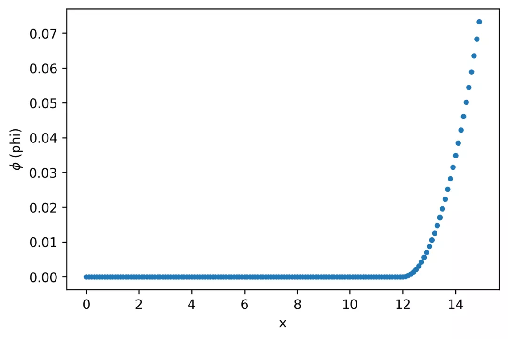
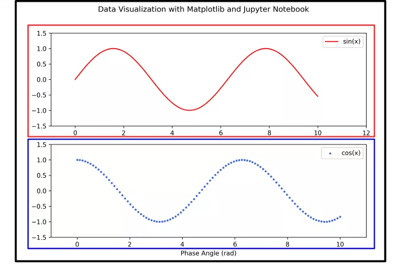
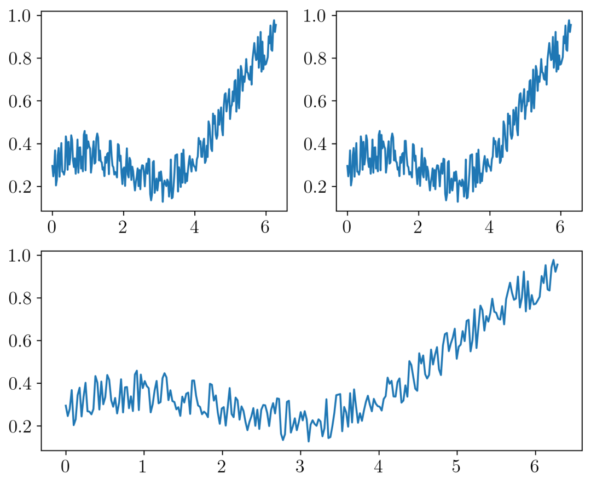
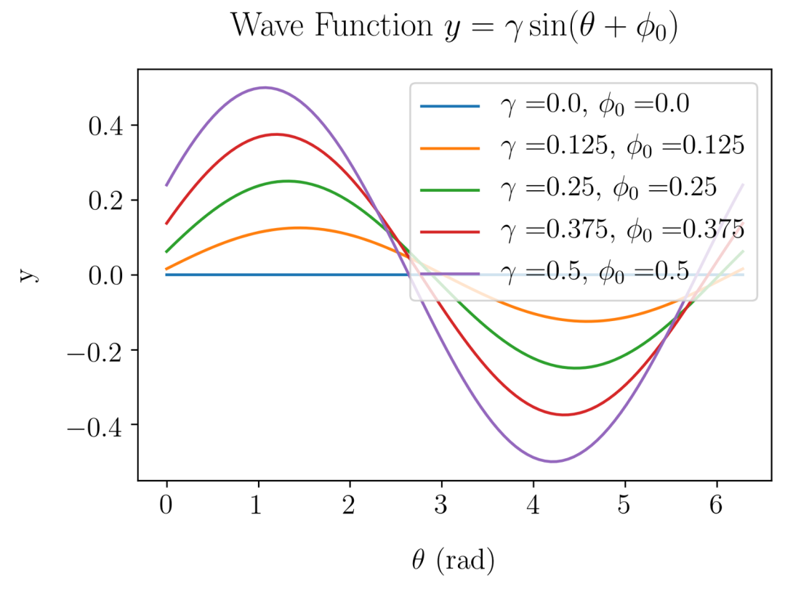
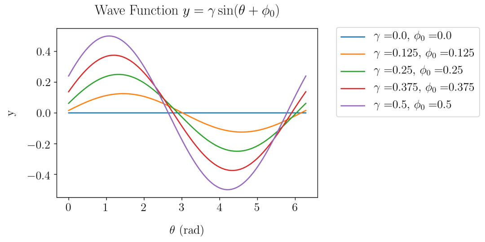
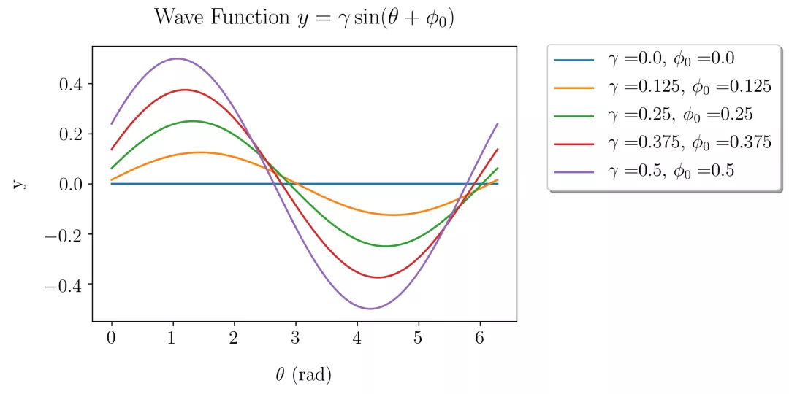
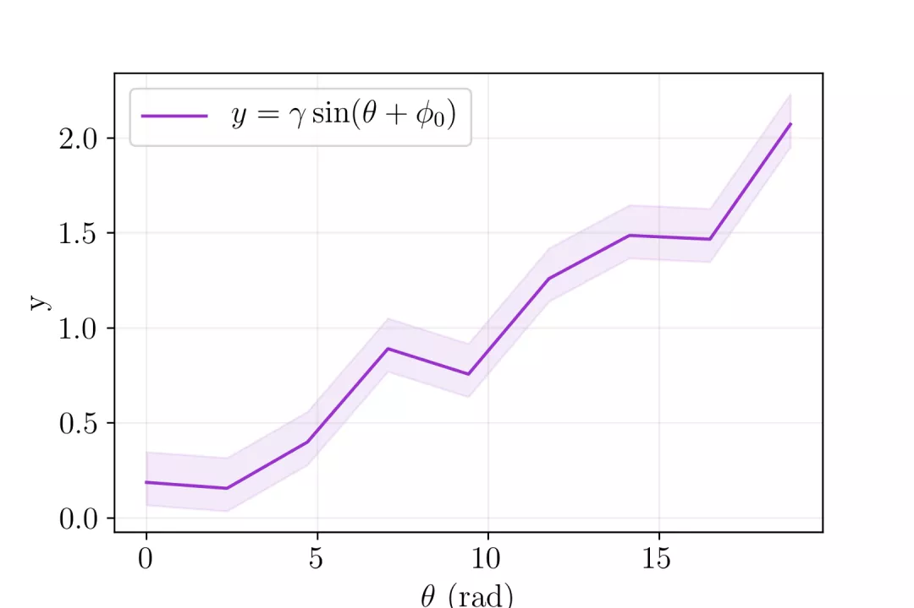
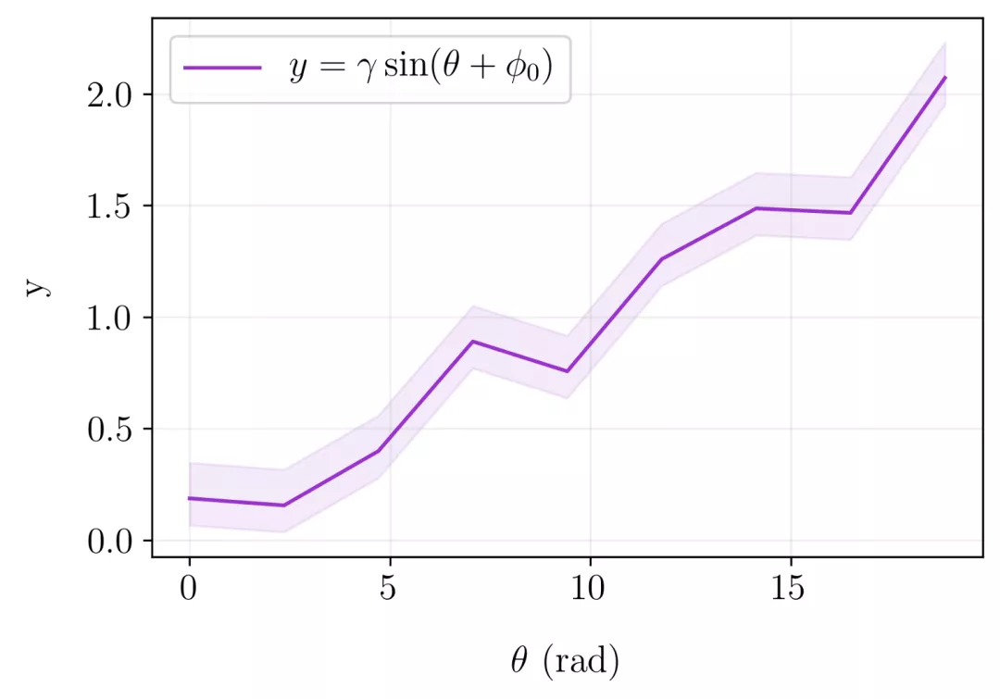
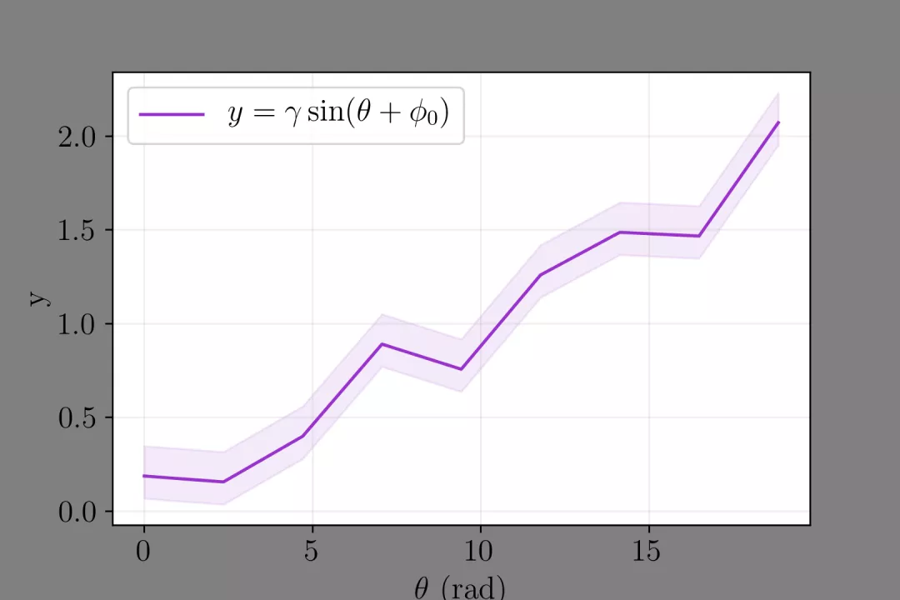

Python 可视化 Matplotlib
<a name="etTLQ"></a>
#### 1. 使用Latex字体
默认情况下，可以使用Matplotlib提供的一些不错的字体。但是，有些符号不够好，不能由Matplotlib创建。例如，符号phi（φ），如图1所示。<br /><br />图1<br />正如在y-label中看到的，它仍然是phi（φ）的符号，但是对于某些人来说，它还不足以作为绘图标签。为了使它更漂亮，可以使用Latex字体。如何使用它？看代码。
```python
plt.rcParams['text.usetex'] = True
plt.rcParams['font.size'] = 18
```
可以在python代码的开头添加上面的代码。第1行定义绘图中使用的LaTeX字体。还需要定义大于默认大小的字体大小。如果不换，它会有一个小标签。这里设置了18。应用上述代码后的结果如图2所示。<br /><br />图2<br />需要在符号的开头和结尾写上双美元符号，像这样（）
```python
plt.xlabel('x')
plt.ylabel('$\phi$ (phi)')
```
如果有一些错误或没有安装使用LaTeX字体所需的库，则需要通过在Jupyter notebook中运行以下代码来安装这些库。
```python
!apt install texlive-fonts-recommended texlive-fonts-extra cm-super dvipng
```
如果通过终端安装，可以输入
```bash
apt install texlive-fonts-recommended texlive-fonts-extra cm-super dvipng
```
当然，可以使用一些不同的字体系列，如serif、sans-serif（上面的示例）等。要更改字体系列，可以使用以下代码。
```python
plt.rcParams['font.family'] = "serif"
```
如果将上面的代码添加到代码中，它将给你一个图，如图3所示。<br /><br />图3<br />看到理解图3和图2之间的区别吗？如果仔细分析，区别在于字体的尾部。后一个图形使用serif，而前者使用sans-serif。简而言之，serif表示尾，sans表示没有。<br />如果希望插入复杂文本，如图4的标题所示。<br /><br />图4<br />如果想创建图4，完整的代码
```python
# 导入库
import numpy as np
import matplotlib.pyplot as plt
# 调整matplotlib参数
plt.rcParams.update(plt.rcParamsDefault)
plt.rcParams['text.usetex'] = True
plt.rcParams['font.size'] = 18
plt.rcParams['font.family'] = "serif"
# 创建模拟数据
r = 15
theta = 5
rw = 12
gamma = 0.1
err = np.arange(0., r, .1)
z = np.where(err < rw, 0, gamma * (err-rw)**2 * np.sin(np.deg2rad(theta)))
    
# 可视化数据
plt.scatter(err, z, s = 10)
plt.title(r'$\Sigma(x) = \gamma x^2 \sin(\theta)$', pad = 20)
plt.xlabel('x')
plt.ylabel('$\phi$')
# 保存图表
plt.savefig('latex.png', dpi = 300, pad_inches = .1, bbox_inches = 'tight')
```
<a name="O2kO8"></a>
#### 2.创建缩放效果
如图5所示。<br /><br />图5<br />首先，需要了解**「plt.axes」**()和**「plt.figure()」** 可以在下面的链接中查看它。代码**「plt.figure()」** 覆盖单个容器中的所有对象，包括轴、图形、文本和标签。代码**「plt.axes」**()只包含特定的部分。图6可以给你一个简单的理解。<br /><br />图6<br />黑盒子使用**「plt.figure()」**，红色和蓝色的盒子使用**「plt.axes()」**. 在图6中，有两个轴，红色和蓝色。<br />理解之后，可以分析如何创建图5。简单地说，图5中有两个轴。第一个轴是一个大的绘图，放大版本从580到650，第二个是缩小版本。下面是创建图5的代码。
```python
# 创建主容器
fig = plt.figure()
# 设置随机种子
np.random.seed(100)
# 创建模拟数据
x = np.random.normal(400, 50, 10_000)
y = np.random.normal(300, 50, 10_000)
c = np.random.rand(10_000)
# 创建放大图
ax = plt.scatter(x, y, s = 5, c = c)
plt.xlim(400, 500)
plt.ylim(350, 400)
plt.xlabel('x', labelpad = 15)
plt.ylabel('y', labelpad = 15)
# 创建放大图
ax_new = fig.add_axes([0.6, 0.6, 0.2, 0.2]) # 放大图的位置与放大图的比例比较
plt.scatter(x, y, s = 1, c = c)
# 保存图形，留好边距
plt.savefig('zoom.png', dpi = 300, bbox_inches = 'tight', pad_inches = .1)
```
另一个版本的缩放效果，如图7所示。<br /><br />图7<br />要创建图7，需要在Matplotlib中使用add_subblot或其他语法（subblot）创建三个轴。为了更容易使用，在这里加上。要创建它们，可以使用以下代码。
```python
fig = plt.figure(figsize=(6, 5))
plt.subplots_adjust(bottom = 0., left = 0, top = 1., right = 1)
# 创建第一个轴，左上角的图用绿色的图
sub1 = fig.add_subplot(2,2,1) # 两行两列，第一单元格
# 创建第二个轴，即左上角的橙色轴
sub2 = fig.add_subplot(2,2,2) # 两行两列，第二个单元格
# 创建第三个轴，第三和第四个单元格的组合
sub3 = fig.add_subplot(2,2,(3,4)) # 两行两列，合并第三和第四单元格
```
代码将生成一个图，如图8所示。它将生成2行2列。轴sub1（2，2，1）是子图（第一行，第一列）中的第一个轴。顺序从左上侧到右开始。轴sub2（2，2，2）被放置在第一行第二列中。轴sub3（2，2，（3，4）），是第二行第一列和第二行第二列之间的合并轴。<br /><br />图8<br />当然，需要定义一个模拟数据，以便在绘图中可视化。在这里，定义了线性函数和正弦函数的简单组合，如下面的代码所示。
```python
# 使用lambda定义函数
stock = lambda A, amp, angle, phase: A * angle + amp * np.sin(angle + phase)
# 定义参数
theta = np.linspace(0., 2 * np.pi, 250) # x轴
np.random.seed(100)
noise = 0.2 * np.random.random(250)
y = stock(.1, .2, theta, 1.2) + noise # y轴
```
如果将代码应用到前面的代码中，将得到一个图，如图9所示。<br /><br />图9<br />下一步是限制第一个和第二个轴（sub1和sub2）的x轴和y轴，为sub3中的两个轴创建阻塞区域，并创建代表缩放效果的ConnectionPatch。可以使用以下完整的代码来完成（为了简单起见，没有使用循环）。
```python
# 使用lambda定义函数
stock = lambda A, amp, angle, phase: A * angle + amp * np.sin(angle + phase)
# 定义参数
theta = np.linspace(0., 2 * np.pi, 250) # x轴
np.random.seed(100)
noise = 0.2 * np.random.random(250)
y = stock(.1, .2, theta, 1.2) + noise # y轴
# 创建大小为6x5的主容器
fig = plt.figure(figsize=(6, 5))
plt.subplots_adjust(bottom = 0., left = 0, top = 1., right = 1)
# 创建第一个轴，左上角的图用绿色的图
sub1 = fig.add_subplot(2,2,1) # 两行两列，第一单元格
sub1.plot(theta, y, color = 'green')
sub1.set_xlim(1, 2)
sub1.set_ylim(0.2, .5)
sub1.set_ylabel('y', labelpad = 15)
# 创建第二个轴，即左上角的橙色轴
sub2 = fig.add_subplot(2,2,2) # 两行两列，第二个单元格
sub2.plot(theta, y, color = 'orange')
sub2.set_xlim(5, 6)
sub2.set_ylim(.4, 1)
# 创建第三个轴，第三和第四个单元格的组合
sub3 = fig.add_subplot(2,2,(3,4)) # 两行两列，合并第三和第四单元格
sub3.plot(theta, y, color = 'darkorchid', alpha = .7)
sub3.set_xlim(0, 6.5)
sub3.set_ylim(0, 1)
sub3.set_xlabel(r'$\theta$ (rad)', labelpad = 15)
sub3.set_ylabel('y', labelpad = 15)
# 在第三个轴中创建阻塞区域
sub3.fill_between((1,2), 0, 1, facecolor='green', alpha=0.2) # 第一个轴的阻塞区域
sub3.fill_between((5,6), 0, 1, facecolor='orange', alpha=0.2) # 第二轴的阻塞区域
# 在左侧创建第一个轴的ConnectionPatch
con1 = ConnectionPatch(xyA=(1, .2), coordsA=sub1.transData, 
                       xyB=(1, .3), coordsB=sub3.transData, color = 'green')
# 添加到左侧
fig.add_artist(con1)
# 在右侧创建第一个轴的ConnectionPatch
con2 = ConnectionPatch(xyA=(2, .2), coordsA=sub1.transData, 
                       xyB=(2, .3), coordsB=sub3.transData, color = 'green')
# 添加到右侧
fig.add_artist(con2)
# 在左侧创建第二个轴的ConnectionPatch
con3 = ConnectionPatch(xyA=(5, .4), coordsA=sub2.transData, 
                       xyB=(5, .5), coordsB=sub3.transData, color = 'orange')
# 添加到左侧
fig.add_artist(con3)
# 在右侧创建第二个轴的ConnectionPatch
con4 = ConnectionPatch(xyA=(6, .4), coordsA=sub2.transData, 
                       xyB=(6, .9), coordsB=sub3.transData, color = 'orange')
# 添加到右侧
fig.add_artist(con4)
# 保存图形，留好边距
plt.savefig('zoom_effect_2.png', dpi = 300, bbox_inches = 'tight', pad_inches = .1)
```
代码将提供一个出色的缩放效果图，如图7所示。
<a name="fH65g"></a>
#### 3.创建图例
如果想在图中显示多图例，则需要将它们放置在主轴之外。<br /><br />图10<br />要将图例放置在主容器之外，需要使用此代码调整位置
```python
plt.legend(bbox_to_anchor=(1.05, 1.04)) # 图例的位置
```
值1.05和1.04位于朝向主容器的x和y轴坐标中。可以改变它。现在，把上面的代码应用到代码中，
```python
# 使用lambda创建wave函数
wave = lambda amp, angle, phase: amp * np.sin(angle + phase)
# 设置参数值
theta = np.linspace(0., 2 * np.pi, 100)
amp = np.linspace(0, .5, 5)
phase = np.linspace(0, .5, 5)
# 创建主容器及其标题
plt.figure()
plt.title(r'Wave Function $y = \gamma \sin(\theta + \phi_0) $', pad = 15)
# 为每个放大器和阶段创建绘图
for i in range(len(amp)):
    lgd1 = str(amp[i])
    lgd2 = str(phase[i])
    plt.plot(theta, wave(amp[i], theta, phase[i]), label = (r'$\gamma = $'+lgd1+', $\phi = $' +lgd2))
    
plt.xlabel(r'$\theta$ (rad)', labelpad = 15)
plt.ylabel('y', labelpad = 15)
# 调整图例
plt.legend(bbox_to_anchor=(1.05, 1.04))
# 保存图形，留好边距
plt.savefig('outbox_legend.png', dpi = 300, bbox_inches = 'tight', pad_inches = .1)
```
运行代码后，它将给出一个图，如图11所示。<br /><br />图11<br />如果要使图例框更漂亮，可以使用以下代码添加阴影效果。它将显示一个图，如图12所示。
```python
plt.legend(bbox_to_anchor=(1.05, 1.04), shadow=True)
```
<br />图12
<a name="nqbxU"></a>
#### 4.创建连续误差图
在过去的十年里，数据可视化的风格被转移到一个干净的绘图主题上。通过阅读国际期刊或网页上的一些新论文，可以看到这种转变。最流行的方法之一是用连续的误差可视化数据，而不是使用误差条。可以在图13中看到它。<br /><br />图13<br />图13是通过使用**「fill_between」**生成的。在fill_between语法中，需要定义上限和下限，如图14所示。<br /><br />图14<br />要应用它，可以使用以下代码。
```python
plt.fill_between(x, upper_limit, lower_limit)
```
参数上限和下限可以互换。这是完整的代码。
```python
N = 9
x = np.linspace(0, 6*np.pi, N)
mean_stock = (stock(.1, .2, x, 1.2))
np.random.seed(100)
upper_stock = mean_stock + np.random.randint(N) * 0.02
lower_stock = mean_stock - np.random.randint(N) * 0.015
plt.plot(x, mean_stock, color = 'darkorchid', label = r'$y = \gamma \sin(\theta + \phi_0)$')
plt.fill_between(x, upper_stock, lower_stock, alpha = .1, color = 'darkorchid')
plt.grid(alpha = .2)
plt.xlabel(r'$\theta$ (rad)', labelpad = 15)
plt.ylabel('y', labelpad = 15)
plt.legend()
plt.savefig('fill_between.png', dpi = 300, bbox_inches = 'tight', pad_inches = .1)
```
<a name="9hi9u"></a>
#### 5.调整边距
如果分析上面的每一行代码，`plt.savefig()` 后面会是一个复杂的参数：`bbox_inches` 和 `pad_inches` 。当在撰写一篇期刊或文章时，它们会提供边距。如果不包括它们，则保存后，绘图的边距将更大。图15展示了有 `bbox_inches` 和 `pad_inches` 以及没有它们的不同绘图。<br /><br />图15<br />如果看不出图15中两个图之间的区别。用不同的背景色来显示它，如图16所示。<br /><br />图16<br />同样，在一篇论文或一篇文章中插入图表时，这个技巧会帮助你。不需要裁剪它来节省空间。
