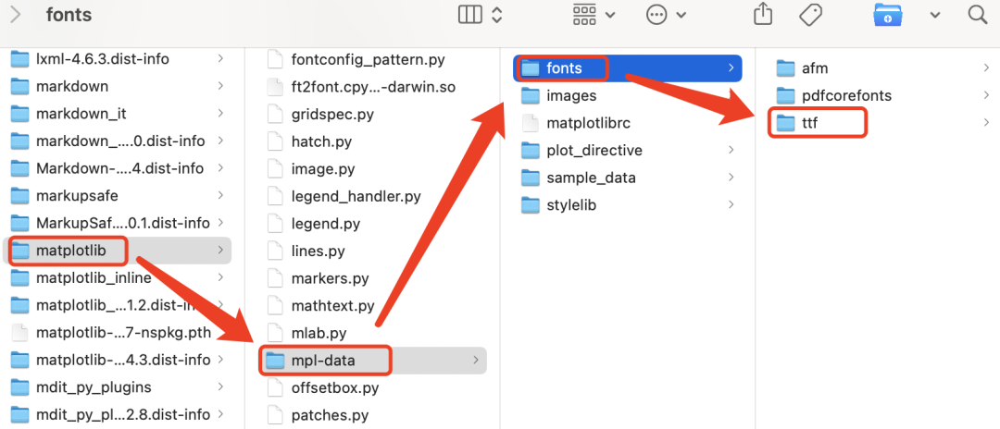
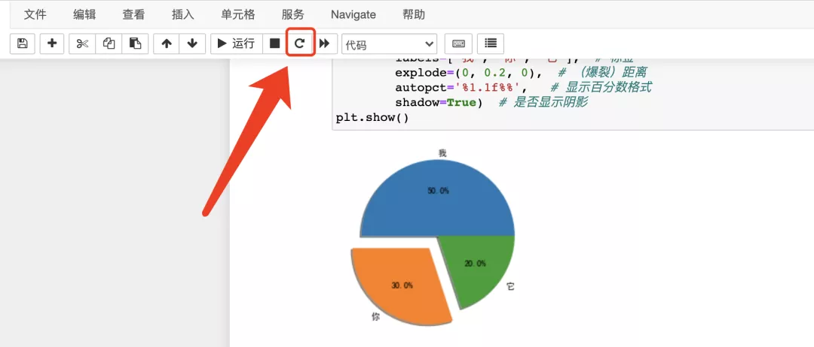

Python Matplotlib 
<a name="c0Y1B"></a>
### 查看matplotlib安装目录
```python
import matplotlib
# 查了安装路径
print(matplotlib.get_data_path()) 

'''
/Users/hhh/Library/Python/3.7/lib/python/site-packages/matplotlib/mpl-data
'''
```
<a name="sO1PF"></a>
### 将下载好的字体复制到`mpl-data/fonts/ttf`目录下

<a name="hUphh"></a>
### 修改matplotlib设置文件，在`mpl-data/matplotlibrc`，利用文本模式打开即可，修改三个地方，修改好后保存即可：
```python
# 第一个地方：font.family: sans-serif这一句前面的#去掉
font.family:  sans-serif  
# 第二个地方：在:(冒号)后加一个SimHei
font.sans-serif: SimHei, DejaVu Sans, Bitstream ...
# 第三个地方：axes.unicode_minus后的值改为False
axes.unicode_minus: False
```
<a name="qBA3C"></a>
### 需要重新加载字体配置 如果matplotlib是3+以下，可以使用以下代码实现该步操作：
```python
from matplotlib.font_manager import _rebuild
_rebuild()
```
如果matplotlib是3+及以上，在这些版本中私有方法`_rebuild`已被弃用，所以没法使用上面方法进行重新加载，不过更简单的，只需要重新启动下python环境就可以了。<br />以jupyter为例子，点一下图中按钮重启内核，再运行代码即可显示中文。要是还是不行，查看下matplotlib缓存存放位置，然后删除，再重启jupyter notebook试试。
```python
# matplotlib缓存的目录 
import matplotlib 
print(matplotlib.get_cachedir())
'''
/Users/hhh/.matplotlib
'''
```
这个小绘图示例也方便检测设置是否有效。
```python
# 随便绘制一个饼图
import matplotlib.pyplot as plt

fig1 = plt.figure()  # 先创建一个图像对象
plt.pie([0.5, 0.3, 0.2],  # 值
        labels=['我', '你', '它'],  # 标签
        explode=(0, 0.2, 0),  # （爆裂）距离
        autopct='%1.1f%%',   # 显示百分数格式
        shadow=True)  # 是否显示阴影
plt.show() 
```
