Python 可视化 Matplotlib<br />原始数据结构如下图所示，需要对学历分组求平均工资后画柱状图，顺序应为按学历由低到高，即 `['大专', '本科', '硕士', '博士']`。<br />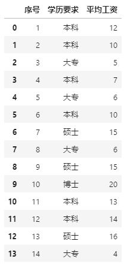<br />原始数据预览<br />看到案例数据，感觉先分组求均值，如何再进行绘图就行了。但是似乎直接这样得到的可视化图不满足需求，坐标轴标签顺序与期望的不一致。怎么回事呢？
<a name="X5BTn"></a>
## 1、直接作图
先看一下分组求均值后结果数据的情况：
```python
grp = df.groupby('学历要求')['平均工资'].mean().reset_index()
grp
```
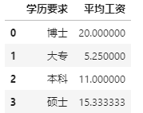<br />结果数据预览<br />可以发现，在分组后学历要求分组里的排序是博士、大专、本科和硕士，与期望的`['大专', '本科', '硕士', '博士']`其实不一样。<br />这种情况下直接作图结果如下：
```python
import matplotlib.pyplot as plt

plt.rcParams['font.sans-serif'] = ['SimHei']
plt.rcParams['axes.unicode_minus'] = False 

x = grp['学历要求']
y = grp['平均工资']
plt.bar(x, y)
plt.show()
```
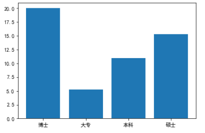<br />直接作图<br />很明显，这个图并非期望的，那么如何按照期望的x轴坐标轴标签顺序作图呢？<br />以下将介绍多种方式，希望能供大家参考~
<a name="JobXb"></a>
## 2、绘图时设置坐标轴标签顺序
简单直接的处理：
```python
plt.bar([3, 0, 1, 2], grp['平均工资'], tick_label=grp['学历要求'])
```
<br />直接设置标签顺序<br />在以上作图代码中，简单讲解下三个参数作用：

- 第1个参数[3,0,1,2]含义可以理解为将原图里第0个数据也就是博士对应数据放在第3个位置，将1-3个数据放到0-2位置，从而可以得到需要的结果；
- 第2个参数`y = grp['平均工资']`就是柱状图高度数据，也就是会根据第1个参数设置的位置进行显示；
- 第3个参数`tick_label`就是设置坐标轴标签，这里就是`grp['学历要求']`。

核心是第1个参数，可以简单理解为它就是期望的坐标轴标签顺序。<br />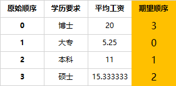<br />指定顺序<br />如果遇到标签较多的情况，已知期望顺序列表但是人均排序似乎有点累，这里可以用列表位置索引快速找到期望顺序。
```python
# 期望标签列表顺序（变量，自己决定顺序）
index_list = ['大专','本科','硕士','博士']
# 期望顺序列表
index = [index_list.index(x) for x in grp.学历要求.to_list()]
index

[3, 0, 1, 2]
```
<a name="urBi8"></a>
## 3、绘图前先对x,y数据进行排序
当然，除了上述在绘图时对坐标轴标签指定顺序外，还可以在绘图前将绘图核心参数`x,y`的值进行指定排序。
```python
# Series数据
grp = df.groupby('学历要求')['平均工资'].mean()
grp
```
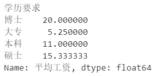<br />Series数据
```python
# 指定期望的标签列表顺序
x = ['大专', '本科', '硕士', '博士']
# 根据x 获取对应 y值
y = [grp[label] for label in x]
plt.bar(x, y)
```
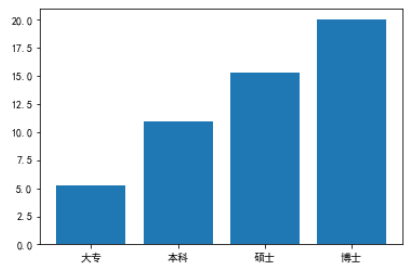<br />绘图结果<br />一开始打算先得到需求顺序的 `x = ['大专', '本科', '硕士', '博士']` 和 `y = [ 具体的值 ]` 再通过 `plt.bar(x, y)` 制图，因此在数据整理上跑偏了，比如：
```python
y = [grp.at[label] for label in x]
```
<a name="aWlix"></a>
## 4、自定义文本排序
计算机系统中存在一些默认顺序，比如数字顺序 `0123456`，字母顺序 `abcdefg`，还有 `ASCII 码`表顺序等，但对于中文习惯的顺序，比如学历，可能就需要自己制定了。专注排序本身，先来看看分组后的数据：<br />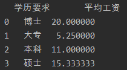<br />分组数据<br />`x = grp['学历要求']` 和 `y = grp['平均工资']` 分别得到两个 Series 对象。那么应该如何将它们绑定在一起，根据 x 按照指定的 `order_x = ['大专', '本科', '硕士', '博士']` 排序呢？
<a name="Sjh12"></a>
### 4.1. 打包排序
可以通过 `zip()` 函数将其打包使之成为一个整体，然后通过列表生成式，得到修改顺序后的 y 轴值列表 `order_y` ，将 `order_x` 和 `order_y` 传入制图即可。
```python
order_y = [t[1] for i in order_x for t in list(zip(x, y)) if i == t[0]]
```
其中：

- `list(zip(x, y))` 的打印结果为：`[('博士', 20.0), ('大专', 5.25), ('本科', 11.0), ('硕士', 15.33)]` ；
- 列表生成式重新取出的元组列表为：`[('大专', 5.25), ('本科', 11.0), ('硕士', 15.33), ('博士', 20.0)]` ；
- `order_y` 为：`[5.25, 11.0, 15.33, 20.0]` 。
<a name="S3Db1"></a>
### 4.2. 利用 pandas 重设索引排序
整体代码：
```python
grp = df.groupby('学历要求')['平均工资'].mean().reset_index()
df_map = pd.DataFrame({'学历要求': ['大专', '本科', '硕士', '博士']}).reset_index().set_index('学历要求')
grp['order'] = grp['学历要求'].map(df_map['index'])
grp.sort_values('order', inplace=True)
x = grp['学历要求']
y = grp['平均工资']
```
首先制作了一个 df_map ，相当于是排序对照表，将索引作为新的顺序列。<br />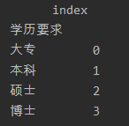<br />df_map<br />将上面的顺序列，按照原 `grp` 的学历要求列，映射添加到新的 order 列 。<br />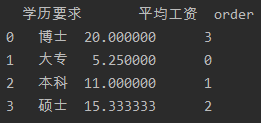<br />添加排序<br />再按照 `order` 列排序即可。<br />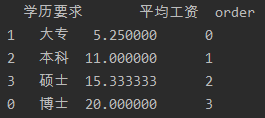<br />进行排序
<a name="o4LXP"></a>
### 4.3. 利用 `CategoricalDtype` 自定义顺序
`CategoricalDtype` 是 pandas 中一种用于处理【类别】的数据类型，可以指定类别是否有序。<br />通过这个方法创建了一个有序 “类别类”，并修改学历要求列的数据类型为此类，此时各类学历文本便具有了其默认顺序，之后便可以对其直接排序。
```python
from pandas.api.types import CategoricalDtype

grp = df.groupby('学历要求')['平均工资'].mean().reset_index()
cat_order = CategoricalDtype(['大专', '本科', '硕士', '博士'], ordered=True)
grp['学历要求'] = grp['学历要求'].astype(cat_order)
grp['学历要求']
```
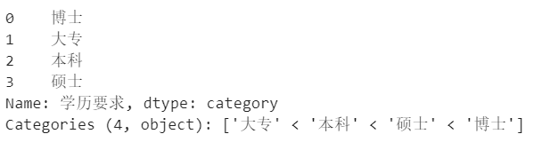<br />CategoricalDtype带有可排序属性<br />可以看到 类别下有排序属性'大专' < '本科' < '硕士' < '博士'，然后排序作图即可。
```python
grp.sort_values('学历要求', inplace=True)
x = grp['学历要求']
y = grp['平均工资']
plt.bar(x,y)
```
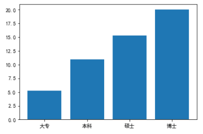<br />CategoricalDtype
