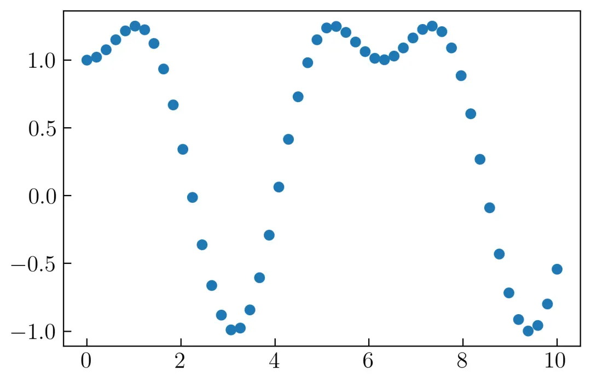
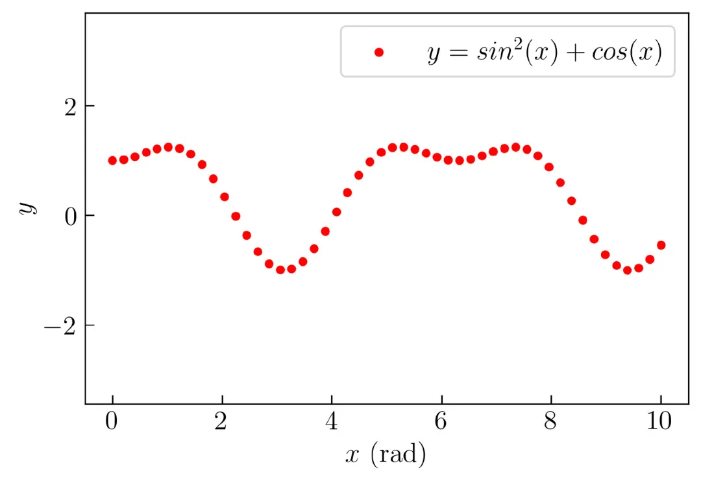
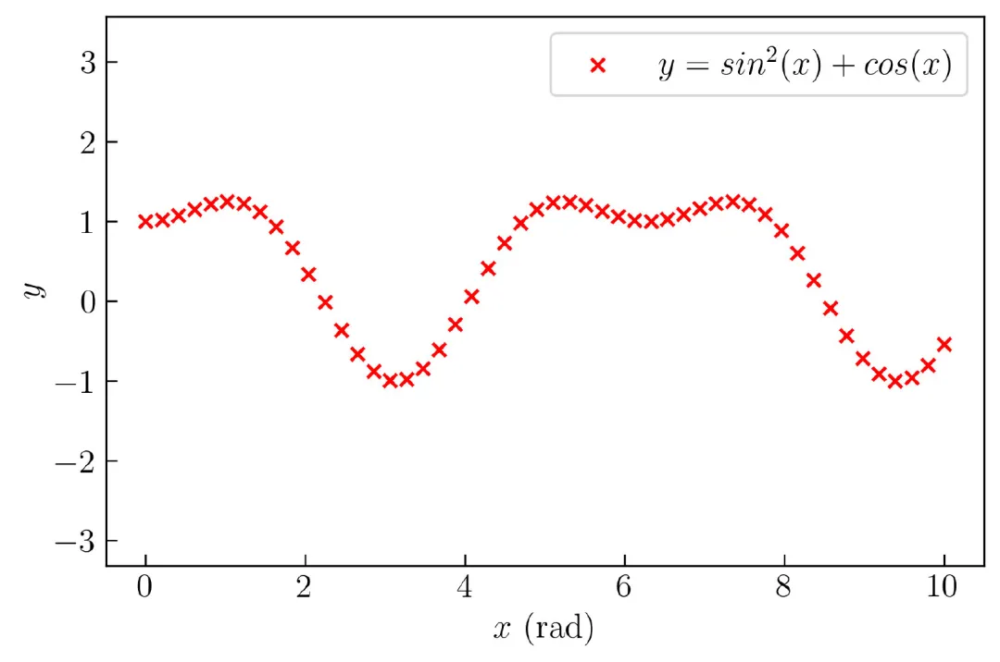
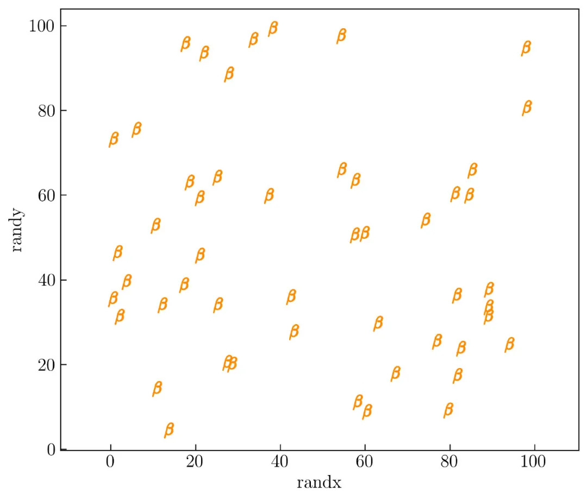
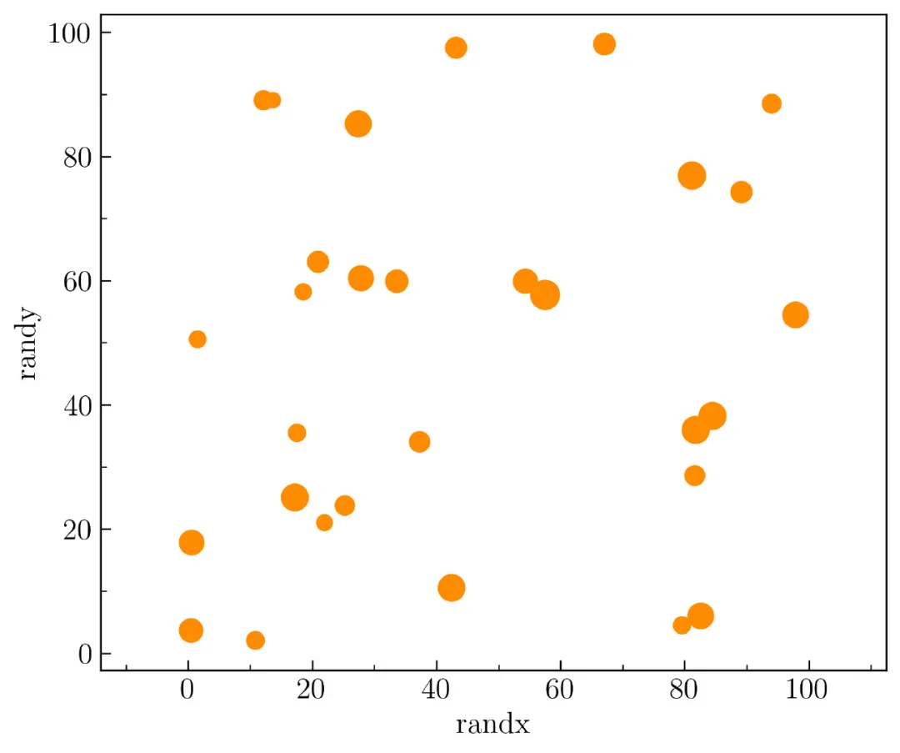
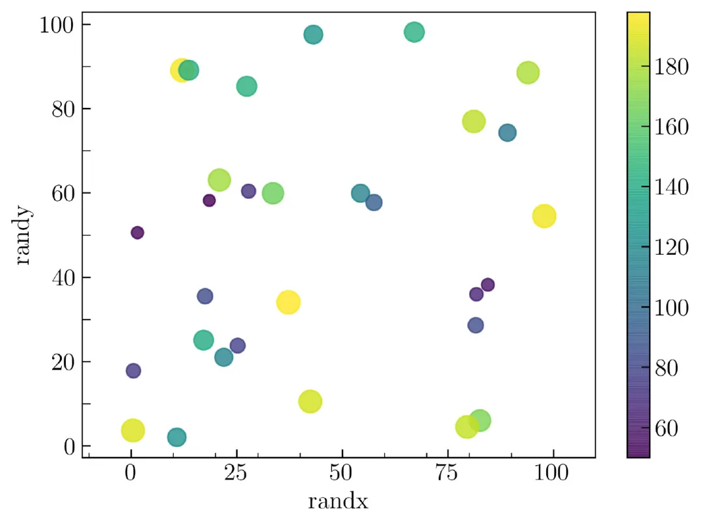
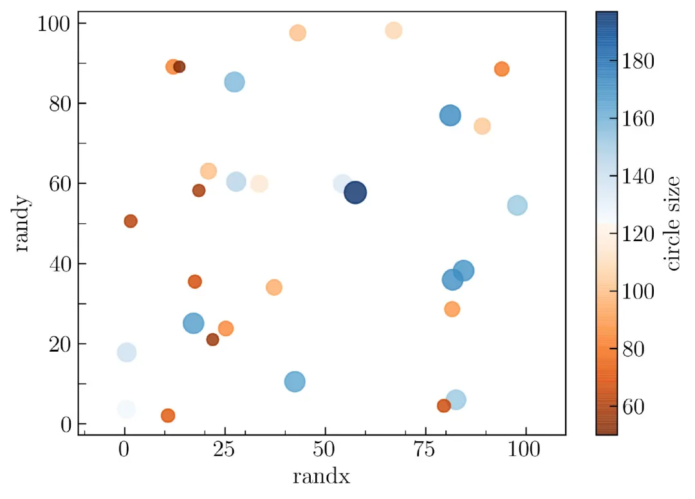

Matplotlib Scatter plot 散点图<br />在创建散点图之前，需要使用下面的代码生成模拟数据：
```python
import numpy as np
import matplotlib.pyplot as plt
N = 50
x = np.linspace(0., 10., N)
y = np.sin(x)**2 + np.cos(x)
```
变量 x 是从 0 到 10 的 50 个数据的数组。变量 y 是 `sin(x)` 和 `cos(x)` 的平方之和。可以使用以下代码以散点图的形式可视化 x 轴上的变量 x 和 y 轴上的变量 y ：
```python
plt.figure()
plt.scatter(x, y)
```
上面的内容很简单，结果如下图所示：<br />Matplotlib中的默认散点图<br />为了使其更美观，可以减少每个数据的大小并给标签添加下面的代码：
```python
plt.scatter(x, y, s = 15, label = r'$y  = sin^2(x) + cos(x)$')
```
要更改颜色，需要在代码中添加 color 参数：
```python
color = 'r' # r means red
```
如果要使轴比例尺相同，可以使用下面的代码：
```python
plt.axis('equal')
```
要为 x 轴和 y 轴创建轴标签，可以添加以下代码：
```python
plt.xlabel(r'$x$ (rad)')
plt.ylabel(r'$y$')
```
要显示图例，可以使用下面的代码：
```python
plt.legend()
```
要保存图形，可以使用以下代码：
```python
plt.savefig('scatter2.png', dpi = 300, bbox_inches = 'tight', facecolor='w')
```
完整的代码如下：
```python
N = 50
x = np.linspace(0., 10., N)
y = np.sin(x)**2 + np.cos(x)
plt.figure()
plt.scatter(x, y, s = 15, label = r'$ y  = sin^2(x) + cos(x)$', color = 'r')
plt.axis('equal')
plt.legend()
plt.xlabel(r'$x$ (rad)')
plt.ylabel(r'$y$')
plt.savefig('scatter2.png', dpi = 300, bbox_inches = 'tight', facecolor='w')
```
创建的散点图如下图所示：<br />修改后的散点图<br />上面可以看到轴内部的 x 轴和 y 轴的刻度方向，并且使用的字体为 LaTeX 格式。如果要更改图形尺寸，可以在 `plt.figure()` 中添加图形尺寸参数
```python
plt.figure(figsize=(7, 4.5))
```
<a name="nKEmY"></a>
### 更改标记样式
要更改标记样式，例如，要从点更改为十字，可以在 `plt.scatter` 中添加此参数：
```python
marker = 'x'
```
下图是更改为十字后的结果：<br />修改样式后的散点图<br />Matplotlib 中有各种各样的样式，可以通过下面的链接来进行了解：<br />[https://matplotlib.org/api/markers_api.html](https://matplotlib.org/api/markers_api.html)<br />还可以将字母用作标记样式。下面将展示将字母用作标记的示例，如下图所示：<br />Matplotlib 中使用字母为标记样式<br />为了生成上图，这里为 x 轴和 y 轴的参数创建了一个不同的函数。以下是生成它的代码：
```python
np.random.seed(100)
N = 50
randx = np.random.random(N) * 100
randy = np.random.random(N) * 100
```
为了可视化变量 randx 和 randy ，可以运行以下代码：
```python
plt.figure(figsize=(7, 6))
plt.scatter(randx, randy, marker=r'$\beta$', s = 150, color = 'darkorange')
plt.axis('equal')
plt.xlabel('randx')
plt.ylabel('randy')
plt.tight_layout()
```
这里使用希腊符号 beta 作为标记样式。也可以使用其他字母来更改它，例如  **a，B，C，d** 或  1、2、3 等。
<a name="4d528ac4"></a>
### 自定义每个数据的大小
这里将展示如何为每个数据创建大小不同的散点图，如下图所示。<br />自定义散点图中数据点的大小<br />为了创建它，使用以下代码为变量 randx 和 randy 生成了一个随机数据，从 0 到 100
```python
np.random.seed(100)
N = 30
randx = np.random.random(N) * 100
randy = np.random.random(N) * 100
```
之后，使用下面的代码为 50 到 200 之间的每个数据生成一个随机整数。
```python
size = np.random.randint(50, 200, size=N)
```
进行可视化，只需添加下面的参数：
```python
plt.scatter(randx, randy, s = size, color = 'darkorange')
```
创建上图时需要在 x 轴和 y 轴上插入次刻度。要插入它，需要使用以下代码导入子模块 `MultipleLocator` ：
```python
from matplotlib.ticker import MultipleLocator
```
之后，可以添加以下代码，以插入辅助轴：
```python
ax = plt.gca()ax.xaxis.set_minor_locator(MultipleLocator(10))
ax.yaxis.set_minor_locator(MultipleLocator(10))
```
下面是生成上图的完整代码：
```python
np.random.seed(100)
N = 30
plt.figure(figsize=(7, 6))
randx = np.random.random(N) * 100
randy = np.random.random(N) * 100
size = np.random.randint(50, 200, size=N)
plt.scatter(randx, randy, s = size, color = 'darkorange')
plt.axis('equal')
ax = plt.gca()
ax.xaxis.set_minor_locator(MultipleLocator(10))
ax.yaxis.set_minor_locator(MultipleLocator(10))
plt.xlabel('randx')
plt.ylabel('randy')
plt.savefig('scatter5.png', dpi = 300, bbox_inches = 'tight', facecolor='w')
```
<a name="lLuo0"></a>
### 以颜色编码的散点图
可以使用颜色图更改颜色，这意味着具有不同大小的数据将以不同的颜色进行颜色编码。可以像下面这样在 `plt.scatter（）` 中添加颜色参数:
```python
c = size
```
要嵌入颜色条，可以使用以下代码:
```python
plt.colorbar()
```
得到的结果如下图所示：<br />不同颜色标注的散点图<br />以下是创建上图完整的代码：
```python
np.random.seed(100)
N = 30
randx = np.random.random(N) * 100
randy = np.random.random(N) * 100
ranking = np.random.random(N) * 200
size = np.random.randint(50, 200, size=N)
plt.figure(figsize=(7, 5))
plt.scatter(randx, randy, s = size, c = size, alpha = .8)
plt.axis('equal')
ax = plt.gca()
ax.xaxis.set_minor_locator(MultipleLocator(10))
ax.yaxis.set_minor_locator(MultipleLocator(10))
plt.xlabel('randx')
plt.ylabel('randy')
plt.colorbar()
plt.savefig('scatter6.png', dpi = 300, bbox_inches = 'tight', facecolor='w')
```
<a name="Mzs05"></a>
### 自定义颜色图
可以使用以下参数更改颜色图：
```python
cmap = 'inferno'
```
Matplotlib 官方文档对颜色图进行了详细的讲解，可以通过下面链接来访问：<br />[https://matplotlib.org/3.3.2/tutorials/colors/colormaps.html](https://matplotlib.org/3.3.2/tutorials/colors/colormaps.html)<br />通过组合蓝色和橙色的颜色图创建了自己的颜色图，如下图所示：<br /><br />自定义颜色图<br />使用下面的代码，可以将两种颜色结合起来：
```python
from matplotlib import cm
from matplotlib.colors import ListedColormap, LinearSegmentedColormap
top = cm.get_cmap('Oranges_r', 128)
bottom = cm.get_cmap('Blues', 128)
newcolors = np.vstack((top(np.linspace(0, 1, 128)),
                       bottom(np.linspace(0, 1, 128))))
orange_blue = ListedColormap(newcolors, name='OrangeBlue')
```
创建自己的颜色图，名为 **orange_blue** 。要了解如何在 Matplotlib 中创建和自定义自己的颜色图，可以访问以下链接：<br />[https://towardsdatascience.com/creating-colormaps-in-matplotlib-4d4de78a04b8](https://towardsdatascience.com/creating-colormaps-in-matplotlib-4d4de78a04b8)<br />要应用它，只需更改颜色参数 `c = orange_blue` ，可以在下图中检查结果：<br />自定义颜色<br />以下是创建上图的完整代码：
```python
from matplotlib import cm
from matplotlib.colors import ListedColormap, LinearSegmentedColormap
top = cm.get_cmap('Oranges_r', 128)
bottom = cm.get_cmap('Blues', 128)
newcolors = np.vstack((top(np.linspace(0, 1, 128)),
                       bottom(np.linspace(0, 1, 128))))
orange_blue = ListedColormap(newcolors, name='OrangeBlue')
np.random.seed(100)
N = 30
randx = np.random.random(N) * 100
randy = np.random.random(N) * 100
size = np.random.randint(50, 200, size=N)
plt.figure(figsize=(7, 5))
plt.scatter(randx, randy, s = size, c = size, alpha = .8, cmap = orange_blue)
plt.axis('equal')
ax = plt.gca()
ax.xaxis.set_minor_locator(MultipleLocator(10))
ax.yaxis.set_minor_locator(MultipleLocator(10))
plt.xlabel('randx')
plt.ylabel('randy')
plt.colorbar(label = 'circle size')
plt.savefig('scatter7.png', dpi = 300, bbox_inches = 'tight', facecolor='w')
```

