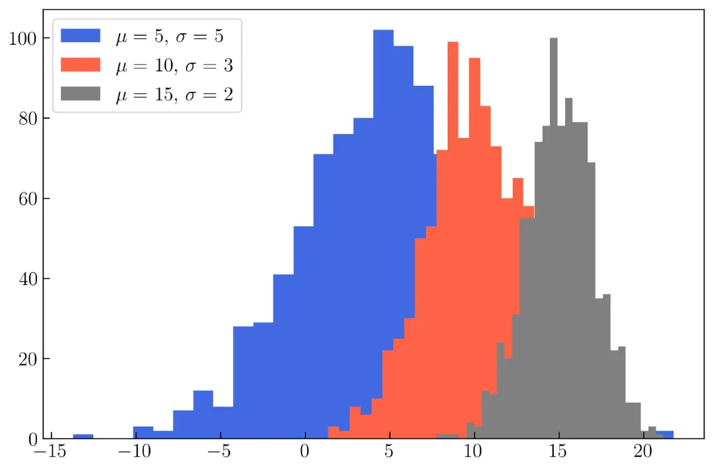

Matplotlib Histogram 直方图
<a name="EHExg"></a>
### 一维直方图
在 1D 和 2D 中制作直方图。首先，将介绍一维直方图。在可视化一维直方图之前，将使用以下代码制作一个模拟数据，即正态分布随机数。
```python
N = 1000
np.random.seed(10021)
x = np.random.randn(N) * 2 + 15
```
默认情况下，Numpy 将生成一个正态分布随机数，其均值/中位数（mu）等于 0 ，方差（sigma）等于 1 。在上面的代码中，将 mu 更改为15，将 sigma 更改为 2 。要在一维直方图中可视化变量 x  ，可以使用以下代码：
```python
plt.hist(x)
```
结果如图所示：<br />Matplotlib 中默认的一维直方图<br />在 Matplotlib 中， 一维直方图中 bins 的默认值为 10， 如果要更改 bins 的默认值，可以修改下面的参数：
```python
bins = 40
```
将 `bins` 设置为 40 后，结果如图所示：<br />修改后的一维直方图<br />以下是创建上图的完整代码：
```python
N = 1000
np.random.seed(10021)
x = np.random.randn(N) * 2 + 15
plt.figure(figsize=(9, 6))
plt.hist(x, bins = 40, label = r'$\mu = 15, \sigma = 2$')
plt.legend()
```
<a name="02907968"></a>
#### 限制范围的直方图
还可以使用以下参数限制直方图的范围：
```python
range = (12, 18)
```
该参数将使直方图仅显示 12 到 18 之间的数据，如下图所示：<br />限制范围的一维直方图<br />创建上图的完整代码如下：
```python
N = 1000
np.random.seed(10021)
x = np.random.randn(N) * 2 + 15
plt.figure(figsize=(9, 6))
plt.hist(x, bins = 40, range = (12, 18), color = 'darkorange', label = r'$\mu = 15, \sigma = 2$')
plt.legend()
plt.savefig('hist3.png', dpi = 300, bbox_inches = 'tight', facecolor='w')
```
这里还使用 `color` 参数更改直方图的颜色。
<a name="uf79S"></a>
#### 水平直方图
可以创建一个水平直方图，如下图所示：<br />水平直方图<br />使用以下参数来创建水平直方图：
```python
orientation = 'horizontal'
```
创建上图的完整代码如下：
```python
N = 1000
np.random.seed(10021)
x = np.random.randn(N) * 2 + 15
plt.figure(figsize=(9, 6))
plt.hist(x, bins = 25, range = (12, 18), color = 'royalblue', orientation='horizontal', label = r'$\mu = 15, \sigma = 2$')
plt.legend()
plt.savefig('hist4.png', dpi = 300, bbox_inches = 'tight', facecolor='w')
```
<a name="6oJtl"></a>
#### 自定义直方图的框
如果要显示每个直方图的边框，可以使用下面的参数。
```python
edgecolor = 'k'
```
将直方图边框设为黑色，如下图所示：<br />自定义直方图的边框<br />创建上图的完整代码如下：
```python
N = 1000
np.random.seed(10021)
x = np.random.randn(N) * 2 + 15
plt.figure(figsize=(9, 6))
plt.hist(x, bins = 25, range = (12, 18), color = 'royalblue', orientation='horizontal',  edgecolor='k', label = r'$\mu = 15, \sigma = 2$')
plt.legend()
plt.savefig('hist5.png', dpi = 300, bbox_inches = 'tight', facecolor='w')
```
<a name="QI7h6"></a>
#### 重叠的直方图
可以在一个图中显示许多个直方图，如下图所示：<br />创建重叠的直方图<br />在上图中，生成了三个正态分布，分别具有不同的 mu 和 sigma ，代码如下：
```python
N = 1000
mu1 = 5
mu2 = 10
mu3 = 15
sigma1 = 5
sigma2 = 3
sigma3 = 2
x1 = np.random.randn(N) * sigma1 + mu1
x2 = np.random.randn(N) * sigma2 + mu2
x3 = np.random.randn(N) * sigma3 + mu3
plt.figure(figsize=(9, 6))
plt.hist(x1, bins = 30, color = 'royalblue', label = r'$\mu = $ ' + str(mu1) + ', $\sigma = $ ' + str(sigma1))
plt.hist(x2, bins = 30, color = 'tomato', label = r'$\mu = $ ' + str(mu2) + ', $\sigma = $ ' + str(sigma2))
plt.hist(x3, bins = 30, color = 'gray', label = r'$\mu = $ ' + str(mu3) + ', $\sigma = $ ' + str(sigma3))
plt.legend()
plt.savefig('hist6.png', dpi = 300, bbox_inches = 'tight', facecolor='w')
```
可以通过更改直方图的透明度使其更美观，如下图所示：<br />更改直方图的透明度<br />创建上图的完整代码如下，与之前的代码的不同之处，在于增加了 `alpha` 参数：
```python
N = 1000
mu1 = 5
mu2 = 10
mu3 = 15
sigma1 = 5
sigma2 = 3
sigma3 = 2
x1 = np.random.randn(N) * sigma1 + mu1
x2 = np.random.randn(N) * sigma2 + mu2
x3 = np.random.randn(N) * sigma3 + mu3
plt.figure(figsize=(9, 6))
plt.hist(x1, bins = 30, color = 'royalblue', label = r'$\mu = $ ' + str(mu1) + ', $\sigma = $ ' + str(sigma1), alpha = .7)
plt.hist(x2, bins = 30, color = 'tomato', label = r'$\mu = $ ' + str(mu2) + ', $\sigma = $ ' + str(sigma2), alpha = .7)
plt.hist(x3, bins = 30, color = 'gray', label = r'$\mu = $ ' + str(mu3) + ', $\sigma = $ ' + str(sigma3), alpha = .7)
plt.legend()
plt.savefig('hist7.png', dpi = 300, bbox_inches = 'tight', facecolor='w')
```
还可以使用循环生成，如代码所示：
```python
N = 1000
mu1 = 5
mu2 = 10
mu3 = 15
sigma1 = 5
sigma2 = 3
sigma3 = 2
x1 = np.random.randn(N) * sigma1 + mu1
x2 = np.random.randn(N) * sigma2 + mu2
x3 = np.random.randn(N) * sigma3 + mu3
mu = np.array([mu1, mu2, mu3])
sigma = np.array([sigma1, sigma2, sigma3])
x = np.array([x1, x2, x3])
colors = ['royalblue', 'tomato', 'gray']
plt.figure(figsize=(9, 6))
for i in range(len(x)):
    plt.hist(x[i], bins = 30, color = colors[i], 
             label = r'$\mu = $ ' + str(mu[i]) + 
             ', $\sigma = $ ' + str(sigma[i]), alpha = .7)
plt.legend()
```
<a name="nqlxc"></a>
#### 创建多个直方图
看完上面的代码后，也许想试试在单个图形中创建很多直方图（超过 3 个）。下面这个是在单个图形中创建和可视化 10 个直方图的代码：
```python
N_func = 10
N_data = 1000
np.random.seed(1000)
mu = np.random.randint(low = -5, high = 5, size = N_func)
sigma = np.random.randint(low = 1, high = 5, size = N_func)
x = []
for i in range(len(mu)):
    xi = np.random.randn(N_data) * sigma[i] + mu[i]
    x.append(xi) 
colors = ['#00429d', '#7f40a2', '#a653a1', '#c76a9f', '#e4849c', '#d0e848', 
          '#b6cf54', '#a9b356', '#b2914b', '#ff0001']
    
plt.figure(figsize=(9, 6))
for i in range(len(mu)):
    plt.hist(x[i], bins = 30, color = colors[i], label = r'$\mu = $ ' + str(mu[i]) + ', $\sigma = $ ' + str(sigma[i]), alpha = .7)
plt.legend(bbox_to_anchor=(1.33, 1.03))
```
运行代码后，结果如下图所示：<br />创建多个直方图<br />颜色的选择参考以下链接：[https://gka.github.io/palettes/](https://gka.github.io/palettes/)<br />生成调色板的详细过程可以参考以下内容：[https://towardsdatascience.com/create-professional-plots-using-matplotlib-63a6863b7363](https://towardsdatascience.com/create-professional-plots-using-matplotlib-63a6863b7363)
<a name="v7HcV"></a>
### 二维直方图
可以使用 Matplotlib 生成 2D 直方图，如下图所示。<br />二维直方图<br />要创建上图，需要使用以下代码生成 2 个正态分布。
```python
N = 1_000
np.random.seed(100)
x = np.random.randn(N)
y = np.random.randn(N)
```
要在 2D 直方图中可视化变量 x 和 y ，可以使用以下代码：
```python
plt.hist2d(x, y)
```
与一维直方图一样，Matplotlib 中 bins 的默认值为 10 。要对其进行更改，可以应用与一维直方图中相同的参数，如下面的代码所示：
```python
bins = (25, 25)
```
可以在下图中看到二维直方图的修改效果：<br />修改二维直方图的bins值
<a name="awRNc"></a>
#### 修改二维直方图的颜色
还可以使用下面的参数更改二维直方图的颜色图：
```python
cmap = orange_blue
```
将 Viridis 的颜色图（ Matplotlib 中的默认颜色图）更改为自己的名为 orange_blue 的颜色图。在上文中说明了如何创建自己的颜色图。<br />以下是修改了颜色图后的完整代码：
```python
from matplotlib import cm
from matplotlib.colors import ListedColormap, LinearSegmentedColormap
top = cm.get_cmap('Oranges_r', 128)
bottom = cm.get_cmap('Blues', 128)
newcolors = np.vstack((top(np.linspace(0, 1, 128)),
                       bottom(np.linspace(0, 1, 128))))
orange_blue = ListedColormap(newcolors, name='OrangeBlue')
N = 10_000
np.random.seed(100)
x = np.random.randn(N)
y = np.random.randn(N)
plt.figure(figsize=(8.5, 7))
plt.hist2d(x, y, bins=(75, 75), cmap = orange_blue)
cb = plt.colorbar()
cb.set_label('counts each bin', labelpad = 10)
plt.savefig('hist12.png', dpi = 300, bbox_inches = 'tight', facecolor='w')
```
运行上述代码，结果如下图所示：<br />修改二维直方图的颜色
<a name="9a8ad0fa"></a>
#### 直方图中设置限制范围
同样的，可以通过设置参数应用于 `plt.hist2d（）` 来限制每个计数的范围（更改颜色条的限制）。
```python
cmin = 5, cmax = 25
```
以下是完整的代码：
```python
N = 10_000
np.random.seed(100)
x = np.random.randn(N)
y = np.random.randn(N)
plt.figure(figsize=(8.5, 7))
plt.hist2d(x, y, bins=(75, 75), cmap = 'jet', cmin = 5, cmax = 25)
cb = plt.colorbar()
cb.set_label('counts each bin', labelpad = 10)
```
这里使用 “jet” 颜色图，颜色条的下限等于 5 ，上限为 25 。结果如下图所示：<br />直方图中设置限制范围<br />还可以尝试使用以下代码将生成的随机数计数从 10000 更改为 100000 。
```python
N = 100_000
np.random.seed(100)
x = np.random.randn(N)
y = np.random.randn(N)
plt.figure(figsize=(8.5, 7))
plt.hist2d(x, y, bins=(75, 75), cmap = 'Spectral')
cb = plt.colorbar()
cb.set_label('counts each bin', labelpad = 10)
```
结果如下图所示：<br />使用 Matplotlib 可视化二维直方图中的正态分布<br />上图在 0 处达到峰值，在 -1 到 1 处分布，因为没有改变 mu 和 sigma 的值。
<a name="jcGDm"></a>
### 边际图（Marginal plot）
> 注：边际图（Marginal plot），在有些地方也成为 联合分布图 （Joint plot）。

这里将介绍如何创建边际分布，如下图所示：<br />散点图和直方图的边际图<br />上图由散点图和 2 个直方图构建。要创建它，需要了解如何在单个图形中自定义子图或轴。
<a name="gzOq1"></a>
### 多子图
下图由 25 个轴（ 5 列 5 行）构成。详细信息如下图所示。<br />可以使用以下代码创建下图：<br />可能需要阅读下面的内容，才能更好的理解：[https://towardsdatascience.com/customizing-multiple-subplots-in-matplotlib-a3e1c2e099bc](https://towardsdatascience.com/customizing-multiple-subplots-in-matplotlib-a3e1c2e099bc)
```python
rows = 5
columns = 5
grid = plt.GridSpec(rows, columns, wspace = .4, hspace = .4)
plt.figure(figsize=(10, 10))
for i in range(rows * columns):
    plt.subplot(grid[i])   
    plt.annotate('grid '+ str(i), xy = (.5, .5), ha = 'center', 
                 va = 'center')
for i in range(rows):
    exec (f"plt.subplot(grid[{i}, 0])")
    plt.ylabel('rows ' + str(i), labelpad = 15)
for i in range(columns):
    exec (f"plt.subplot(grid[-1, {i}])")
    plt.xlabel('column ' + str(i), labelpad = 15)
```
多子图<br />将上图中的一些网格合并为仅 3 个较大的网格。第一个网格将网格0 合并到网格3（行1 ，列0 到列 ）。用直方图填充第一个网格。第二个网格合并从第 1 行到第 4 行以及从第 0 列到第 3 列的 16 个网格。最后一个网格是通过合并网格9、14、19 和 24（行1、2、3、4和列4）构建的。<br />要创建第一个网格，可以使用以下代码：
```python
rows = 5
columns = 5
grid = plt.GridSpec(rows, columns, wspace = .4, hspace = .4)
plt.figure(figsize=(10, 10))
plt.subplot(grid[0, 0:-1])
```
之后，添加以下代码以插入一维直方图：
```python
plt.hist(x, bins = 30, color = 'royalblue', alpha = .7)
```
要创建第二个网格，可以将以下代码添加到上面的代码中：
```python
plt.subplot(grid[1:rows+1, 0:-1])
```
添加下面的代码以在第二个网格中生成散点图：
```python
plt.scatter(x, y, color = 'royalblue', s = 10)
plt.axis('equal')
```
以下是生成第三个网格及其直方图的代码，需要将下面的代码插入第一个网格代码中：
```python
plt.subplot(grid[1:rows+1, -1])
plt.hist(y, bins = 30, orientation='horizontal', 
         color = 'royalblue', alpha = .7)
```
合并上面的代码，完整的代码如下：
```python
N = 10_000
np.random.seed(100)
x = np.random.randn(N)
y = np.random.randn(N)
rows = 5
columns = 5
grid = plt.GridSpec(rows, columns, wspace = .4, hspace = .4)
plt.figure(figsize=(10, 10))
plt.subplot(grid[0, 0:-1])
plt.hist(x, bins = 30, color = 'royalblue', alpha = .7)
plt.subplot(grid[1:rows+1, 0:-1])
plt.scatter(x, y, color = 'royalblue', s = 10)
plt.axis('equal')
plt.subplot(grid[1:rows+1, -1])
plt.hist(y, bins = 30, orientation='horizontal', color = 'royalblue', alpha = .7)
```
接下来，将使用二维直方图更改第二个网格中的散点图，如下图所示：<br />边际图<br />创建上图的完整代码如下：
```python
N = 10_000
np.random.seed(100)
x = np.random.randn(N)
y = np.random.randn(N)
rows = 5
columns = 5
grid = plt.GridSpec(rows, columns, wspace = .4, hspace = .4)
plt.figure(figsize=(10, 10))
plt.subplot(grid[0, 0:-1])
plt.hist(x, bins = 40, color = 'royalblue', alpha = .3)
plt.annotate('Normal 1', xy = (2, 500), va = 'center', ha = 'left')
plt.subplot(grid[1:rows+1, 0:-1])
plt.hist2d(x, y, cmap = 'Blues', bins = (40, 40))
plt.axis('equal')
plt.subplot(grid[1:rows+1, -1])
plt.hist(y, bins = 40, orientation='horizontal', color = 'royalblue', alpha = .3)
plt.annotate('Normal 2', xy = (500, 2), va = 'bottom', ha = 'center', rotation = -90)
```
> 注：使用 Matplotlib 来创建边际图，相对来说比较繁琐些，建议可以使用 seaborn 来创建联合分布图 （Joint plot），其效果是差不多的。

