Matplotlib Line plot 线图<br />为了在 Matplotlib 中绘制线图，将使用以下代码生成模拟数据：
```python
N = 50
x = np.linspace(0., 10., N)
y = np.sin(x)**2 + np.cos(x)
```
要以线图的形式可视化变量 x 和 y ，需要使用以下代码：
```python
plt.plot(x, y)
```
上面的代码将生成一个图形，如下图所示：<br />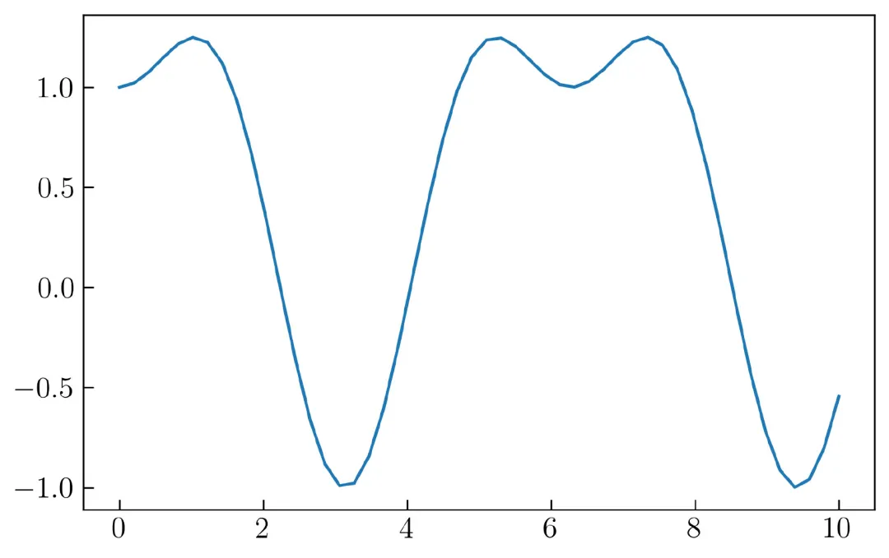Matplotlib 中默认的线形图
<a name="Y9FVx"></a>
### 自定义线条的样式
可以使用下面的参数在 Matplotlib 中更改线条图的线条样式：
```python
linestyle = '-'
```
上面的参数应在 `plt.plot()` 中插入。展示四种不同的线条样式。它们是
```python
['-', '--', '-.', ':']
```
为了自动生成它，使用循环将使其变得简单，以下是完整的代码：
```python
N = 50
x = np.linspace(0., 10., N)
y = np.sin(x)**2 + np.cos(x)
rows = 2
columns = 2
grid = plt.GridSpec(rows, columns, wspace = .25, hspace = .25)
linestyles = ['-', '--', '-.', ':']
plt.figure(figsize=(15, 10))
for i in range(len(linestyles)):
    plt.subplot(grid[i])
    plt.plot(x, y, linestyle = linestyles[i], label = r'$ y  = sin^2(x) + cos(x)$')
    plt.axis('equal')
    plt.xlabel('$x$ (rad)')
    plt.legend()
    plt.annotate("linestyle '" + str(linestyles[i]) + "'", xy = (0.5, -2.5), va = 'center', ha = 'left')
    
plt.savefig('line2.png', dpi = 300, bbox_inches = 'tight', facecolor='w')
```
这里将在一张图中分配 4 种不同的线型，这意味着需要在一个图中创建 4 个轴。在 Matplotlib 中，可以通过使用 `GridSpec()` ，`subplot()` 和 `add_subplot()` 自定义子图来生成它。使用 `GridSpec()` ，创建了 4 个轴（ 2 行 2 列），宽度和高度间距等于 0.25。<br />如果在 Matplotlib 中自定义子图时需要更多说明，则可以访问下面的链接：<br />[https://towardsdatascience.com/customizing-multiple-subplots-in-matplotlib-a3e1c2e099bc](https://towardsdatascience.com/customizing-multiple-subplots-in-matplotlib-a3e1c2e099bc)<br />上面代码运行后的结果如下图所示：<br />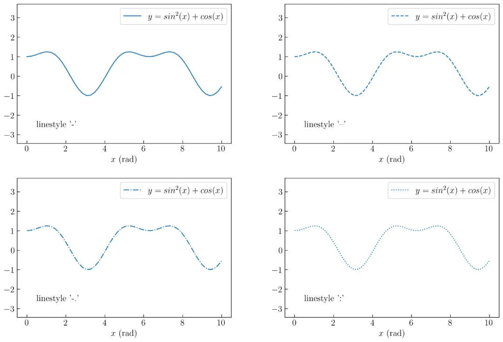自定义线条样式<br />该代码将简单地生成 4 种不同的线型，并为每种线型添加标签和注释。Matplotlib 提供了许多可以使用的线型，可以通过下面链接选择自己喜欢的线条样式：<br />[https://matplotlib.org/2.1.2/api/_as_gen/matplotlib.pyplot.plot.html](https://matplotlib.org/2.1.2/api/_as_gen/matplotlib.pyplot.plot.html)
<a name="ZW9rd"></a>
### 自定义线条宽度
自定义线条宽度，可以使用下面的代码：
```python
lw = 2.0
```
四种不同宽度的线条图，如下图所示：<br />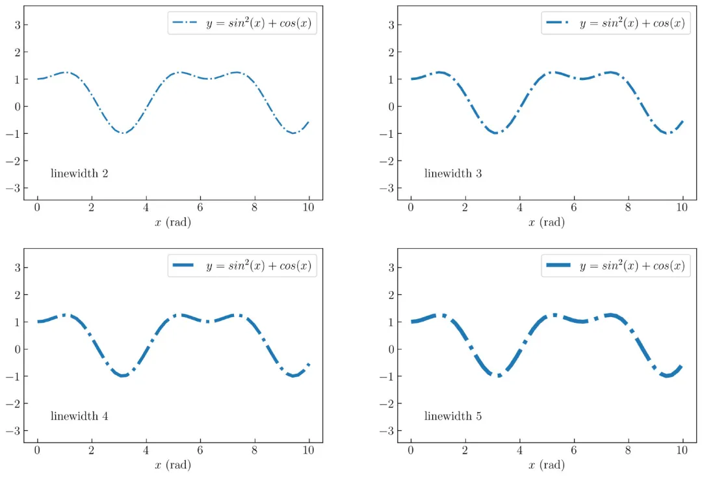自定义线条宽度<br />创建上图的完整代码如下：
```python
N = 50
rows = 2
columns = 2
x = np.linspace(0., 10., N)
y = np.sin(x)**2 + np.cos(x)
grid = plt.GridSpec(rows, columns, wspace = .25, hspace = .25)
linewidth = [2, 3, 4, 5]
plt.figure(figsize=(15, 10))
for i in range(len(linestyles)):
    plt.subplot(grid[i])
    plt.plot(x, y, linestyle = '-.', lw = linewidth[i], label = r'$ y  = sin^2(x) + cos(x)$')
    plt.axis('equal')
    plt.xlabel('$x$ (rad)')
    plt.legend()
    plt.annotate("linewidth " + str(linewidth[i]), xy = (0.5, -2.5), va = 'center', ha = 'left')
    
plt.savefig('line3.png', dpi = 300, bbox_inches = 'tight', facecolor='w')
```
<a name="13b01580"></a>
### 创建间隔标记
这里将创建间隔标记（mark every）。为了理解它，将首先显示结果，如下图所示：<br />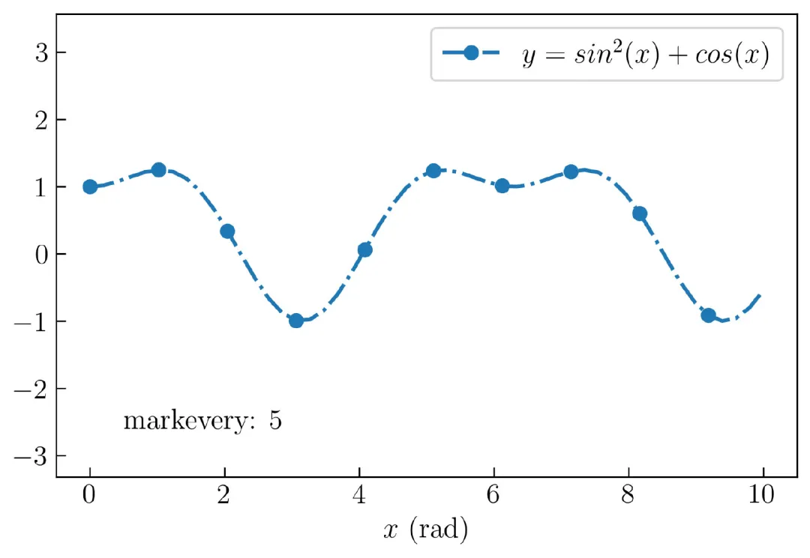Matplotlib 中创建间隔标记<br />在上图中，为每 5 个数据创建一个圆圈标记。可以使用以下参数创建：
```
'o'            # shape for each 5 data
markevery = 5  # mark every 
ms = 7         # size of the circle in mark every
```
以下是完整的代码：
```python
N = 50
x = np.linspace(0., 10., N)
y = np.sin(x)**2 + np.cos(x)
plt.figure(figsize=(7, 4.5))
plt.plot(x, y, 'o', ls = '-.', lw = 2, ms = 7, markevery = 5, label = r'$ y  = sin^2(x) + cos(x)$')
plt.axis('equal')
plt.xlabel('$x$ (rad)')
plt.legend()
plt.annotate("markevery: 5", xy = (0.5, -2.5), va = 'center', ha = 'left')
plt.savefig('line4.png', dpi = 300, bbox_inches = 'tight', facecolor='w')
```
这里需要将参数 `"o"`  放在第三个参数位置上。
<a name="LiNfG"></a>
### 更改线条颜色
更改线条颜色，可以使用以下代码：
```python
color = 'royalblue'
```
下面将展示如何使用循环生成 4 种不同的颜色和 4 种不同的标记，如下图所示：<br />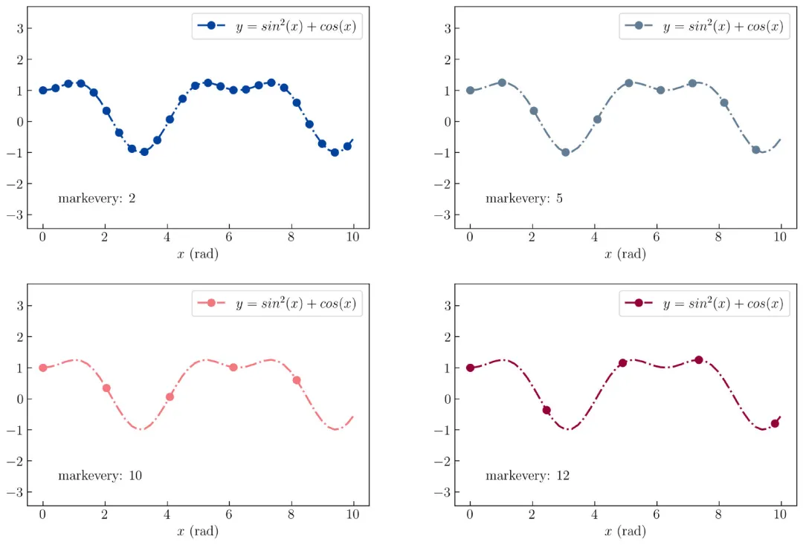自定义线条颜色<br />创建上图的代码如下：
```python
N = 50
x = np.linspace(0., 10., N)
y = np.sin(x)**2 + np.cos(x)
rows = 2
columns = 2
grid = plt.GridSpec(rows, columns, wspace = .25, hspace = .25)
mark = [2, 5, 10, 12]
color = ['#00429d', '#627c94', '#f4777f', '#93003a']
plt.figure(figsize=(15, 10))
for i in range(len(linestyles)):
    plt.subplot(grid[i])
    plt.plot(x, y, 'o', ls='-.', lw = 2, ms = 8, markevery=mark[i], color = color[i], label = r'$ y  = sin^2(x) + cos(x)$')
    plt.axis('equal')
    plt.annotate("markevery: " + str(mark[i]), xy = (0.5, -2.5), va = 'center', ha = 'left')
    plt.xlabel('$x$ (rad)')
    plt.legend()
plt.savefig('line5.png', dpi = 300, bbox_inches = 'tight', facecolor='w')
```
<a name="653j8"></a>
### 线条图中添加误差
为了演示折线图中的误差线，需要使用以下代码生成误差：
```python
np.random.seed(100)
noise_x = np.random.random(N) * .2 + .1
noise_y = np.random.random(N) * .7 + .4
```
该代码将为 noise_x 生成从 0.1 到 0.3 的随机数，为 noise_y 生成从 0.3 到 0.7 的随机数。要为 y 轴插入误差线，可以使用以下代码：
```python
plt.errorbar(x, y, yerr = noise_y)
```
包含误差的线条图，如下图所示：<br />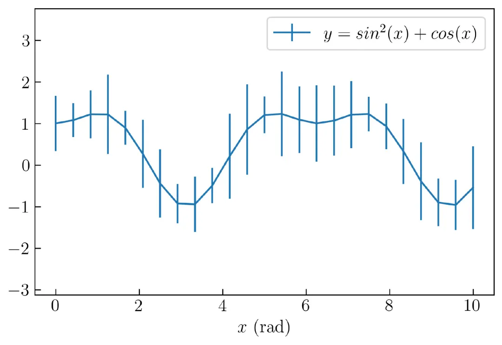创建添加误差的线形图<br />创建上图的完整代码如下：
```python
N = 25
x = np.linspace(0., 10., N)
y = np.sin(x)**2 + np.cos(x)
np.random.seed(100)
noise_x = np.random.random(N) * .2 + .1
noise_y = np.random.random(N) * .7 + .4
plt.figure(figsize=(7, 4.5))
plt.errorbar(x, y, yerr = noise_y, xerr = noise_x, label = r'$ y  = sin^2(x) + cos(x)$')
plt.axis('equal')
plt.legend()
plt.xlabel('$x$ (rad)')
plt.savefig('line7.png', dpi = 300, bbox_inches = 'tight', facecolor='w')
```
在 x 轴添加误差，可以使用以下参数：
```python
xerr = noise_x
```
可以看到在下图的 x 和 y 轴上插入误差线的示例：<br />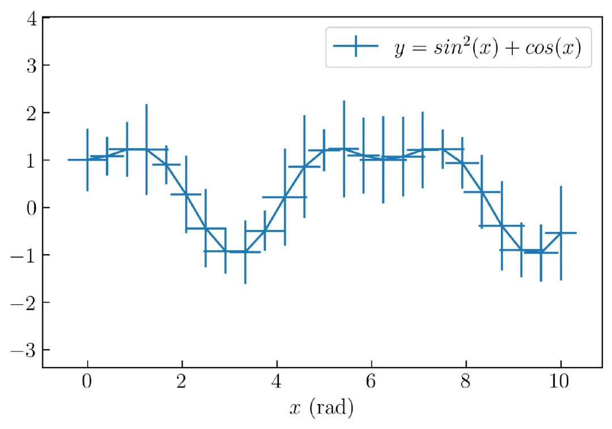创建添加误差线的线形图<br />创建上图的完整代码如下：
```python
N = 25
x = np.linspace(0., 10., N)
y = np.sin(x)**2 + np.cos(x)
np.random.seed(100)
noise_x = np.random.random(N) * .2 + .1
noise_y = np.random.random(N) * .7 + .4
plt.figure(figsize=(7, 4.5))
plt.errorbar(x, y, yerr = noise_y, xerr = noise_x, label = r'$ y  = sin^2(x) + cos(x)$')
plt.axis('equal')
plt.legend()
plt.xlabel('$x$ (rad)')
plt.savefig('line7.png', dpi = 300, bbox_inches = 'tight', facecolor='w')
```
如果只想显示数据而不显示线图，而仅显示误差线，则可以使用以下参数：
```
fmt = 'o'    # shape of the data point
color = 'r'  # color of the data point
ecolor ='k'   # color of the error bar
```
完整代码如下：
```python
N = 25
x = np.linspace(0., 10., N)
y = np.sin(x)**2 + np.cos(x)
np.random.seed(100)
noise_x = np.random.random(N) * .2 + .1
noise_y = np.random.random(N) * .7 + .4
plt.figure(figsize=(7, 4.5))
plt.errorbar(x, y, xerr = noise_x, yerr = noise_y, label = r'$ y  = sin^2(x) + cos(x)$', color = 'r', fmt = 'o', ecolor='k', )
plt.axis('equal')
plt.legend()
plt.xlabel('$x$ (rad)')
plt.savefig('line8.png', dpi = 300, bbox_inches = 'tight', facecolor='w')
```
效果如下图所示：<br />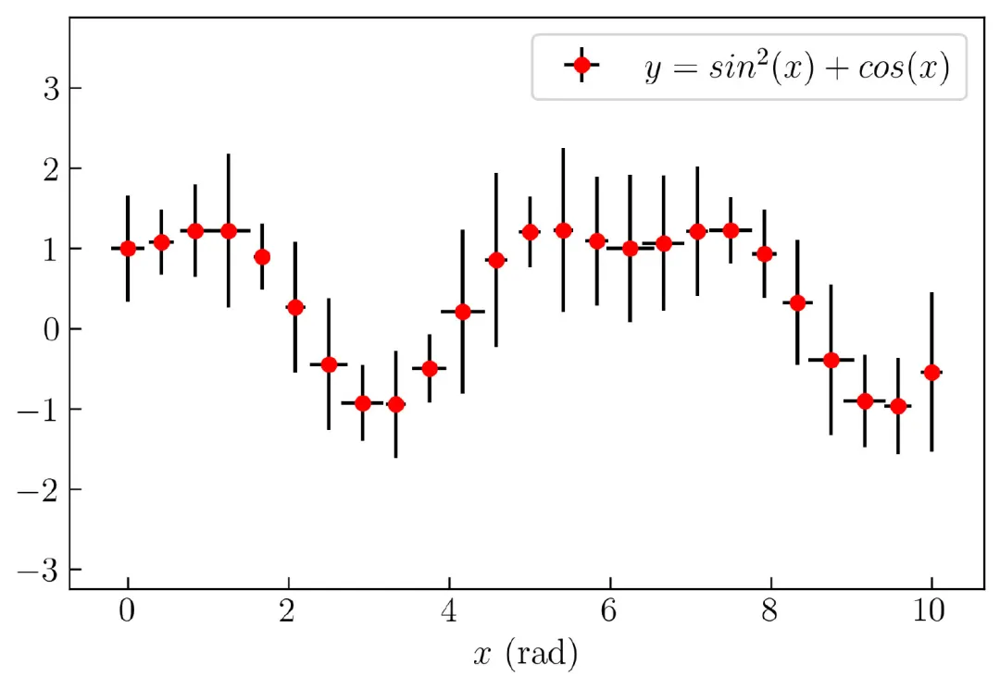自定义创建误差线
<a name="4uk4c"></a>
### 填充误差区域
如需要填充误差范围区域，可以使用以下代码：
```python
plt.fill_between(x, y + noise, y - noise, alpha = .5)
```
`fill_between` 参数是 x 轴的数据，填充区域的上限和下限。在上面的代码中，用 `y + noise`  和 `y-noise` 表示。此外，还需要降低填充区域的透明度。以下是完整的代码：
```python
N = 25
x = np.linspace(0., 10., N)
y = np.sin(x)**2 + np.cos(x)
np.random.seed(100)
noise = np.random.random(N) * .7 + .4
plt.figure(figsize=(7, 4.5))
plt.plot(x, y, ls='-', label = r'$ y  = sin^2(x) + cos(x)$')
plt.fill_between(x, y + noise, y - noise, alpha = .5)
plt.axis('equal')
plt.legend()
plt.xlabel('$x$ (rad)')
plt.savefig('line9.png', dpi = 300, bbox_inches = 'tight', facecolor='w')
```
上述代码运行后，结果如下图所示：<br />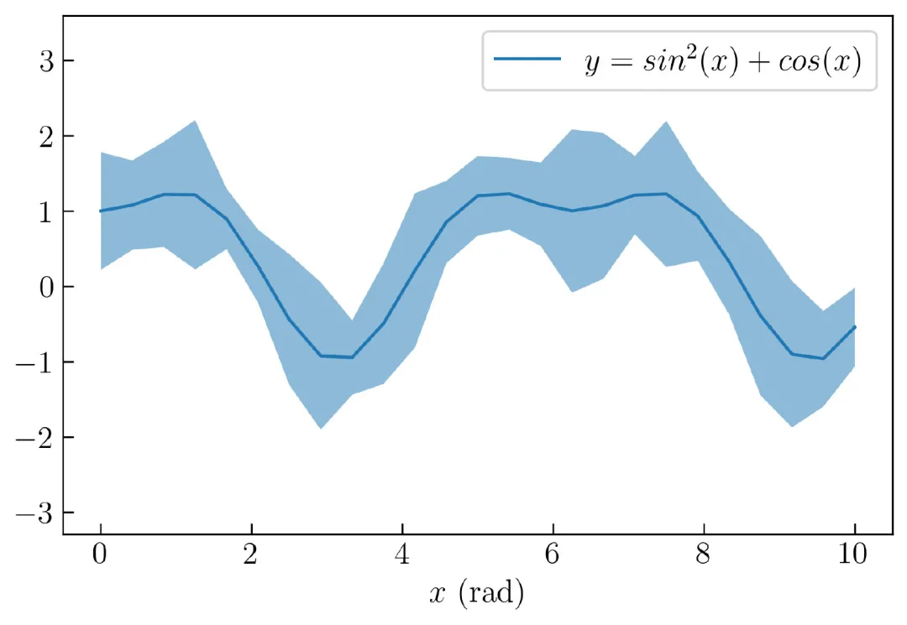创建填充区域
<a name="94e10d27"></a>
### 插入水平线和垂直线
可以使用以下代码插入水平线和垂直线：
```python
plt.hlines(0, xmin = 0, xmax = 10)
plt.vlines(2, ymin = -3, ymax = 3)
```
需要在第一个参数中定义水平线，包括水平线的起点和终点。对于垂直线，它具有类似的参数。<br />下图是添加了水平线和垂直线的示例：<br />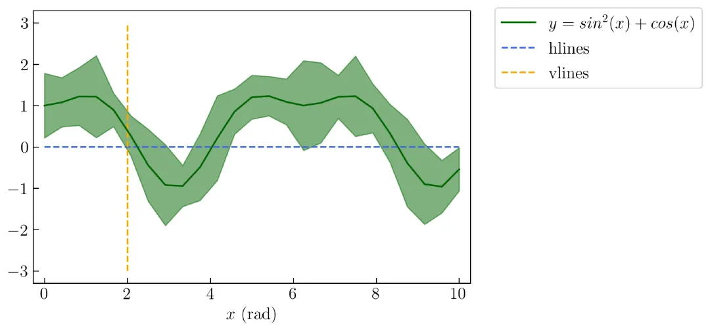水平线和垂直线<br />创建上图的完整代码如下：
```python
N = 25
x = np.linspace(0., 10., N)
y = np.sin(x)**2 + np.cos(x)
np.random.seed(100)
noise = np.random.random(N) * .7 + .4
plt.figure(figsize=(7, 4.5))
plt.plot(x, y, ls = '-', label = r'$ y  = sin^2(x) + cos(x)$', color = 'darkgreen')
plt.fill_between(x, y + noise, y - noise, color = 'darkgreen', alpha = .5)
plt.axis('equal')
plt.hlines(0, xmin = 0, xmax = 10, ls = '--', color = 'royalblue', label = 'hlines')
plt.vlines(2, ymin = -3, ymax = 3, ls = '--', color = 'orange', label = 'vlines')
plt.legend(bbox_to_anchor=(1.55, 1.04)) # position of the legend
plt.xlabel('$x$ (rad)')
plt.savefig('line10.png', dpi = 300, bbox_inches = 'tight', facecolor='w')
```
<a name="nRysh"></a>
### 垂直填充
下面将在两条垂直线之间绘制一个填充区域，如下图所示：<br />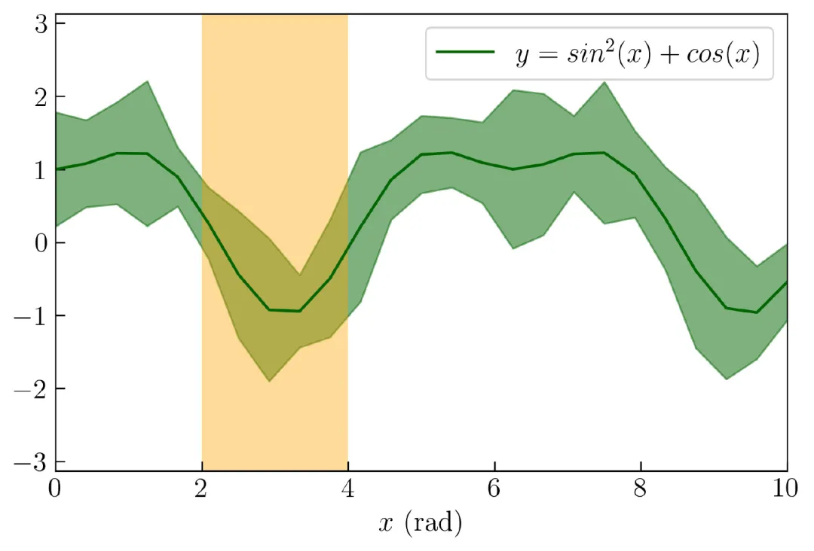<br />创建上图的完整代码如下：
```python
N = 25
x = np.linspace(0., 10., N)
y = np.sin(x)**2 + np.cos(x)
np.random.seed(100)
noise = np.random.random(N) * .7 + .4
plt.figure(figsize=(7, 4.5))
plt.plot(x, y, ls='-', label = r'$ y  = sin^2(x) + cos(x)$', color = 'darkgreen')
plt.fill_between(x, y + noise, y - noise, color = 'darkgreen', alpha = .5)
plt.axis('equal')
plt.fill_between((2,4), -3.2, 3.2, facecolor='orange', alpha = 0.4)
plt.xlim(0, 10)
plt.ylim(-3, 3)
plt.legend()
plt.xlabel('$x$ (rad)')
plt.savefig('line11.png', dpi = 300, bbox_inches = 'tight', facecolor='w')
```

