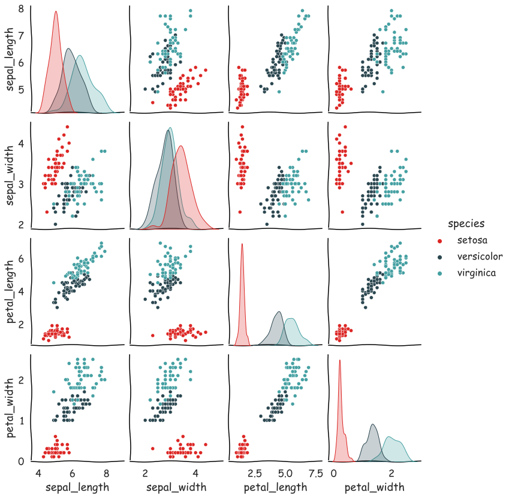
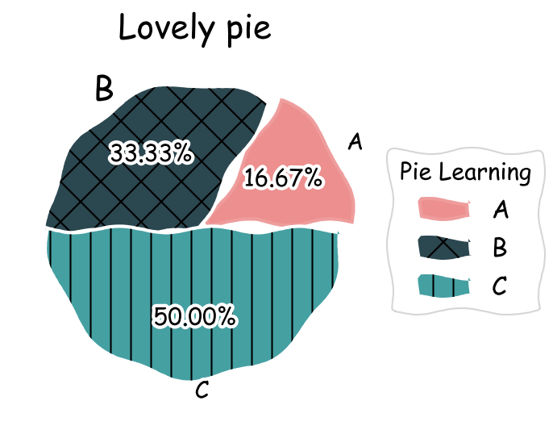
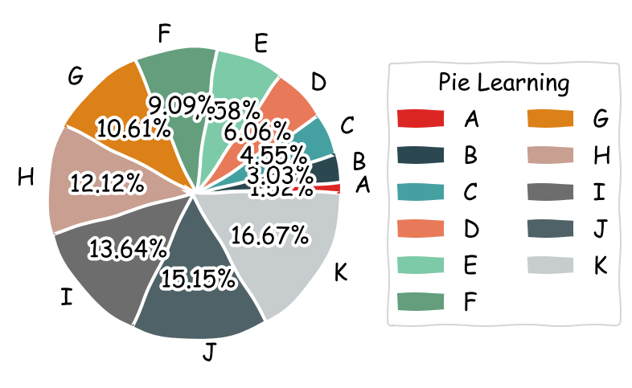
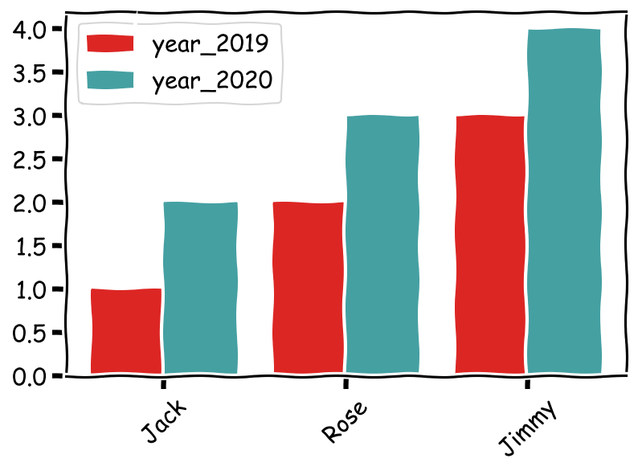
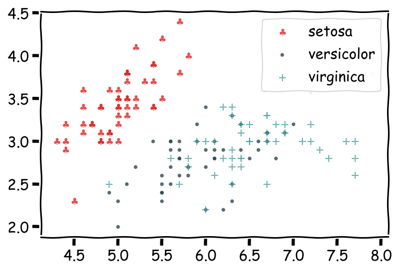

PythonMatplotlib<br />介绍一个手绘工具（matplotlib.pyplot.xkcd()），一行代码可将所有Matplotlib和Seaborn绘制的图形变为手绘风格。
<a name="C8810"></a>
### `matplotlib.pyplot.xkcd()`简介
这个Matplotlib子函数特别简单，只有三个参数，别看参数少，但功能可不小
```python
matplotlib.pyplot.xkcd(scale=1, #相对于不使用xkcd的风格图，褶皱的幅度
                       length=100, #褶皱长度
                       randomness=2#褶皱的随机性
                      )
```
<a name="UDJ0w"></a>
### `matplotlib.pyplot.xkcd()`使用
如下，加`with`行代码即可，括号中参数按个人喜好决定是否设置～
```python
with plt.xkcd(scale=1, length=100, randomness=2):
#with是临时使用一下，不影响其它图使用正常样式
    绘图代码
    。。。。。。
    plt.show()
```
<a name="LzGJF"></a>
### `matplotlib.pyplot.xkcd()`使用实例
```python
#支持seaborn
import seaborn as sns
iris_sns = sns.load_dataset("iris")
with plt.xkcd():
    g = sns.pairplot(
        iris_sns,
        hue='species',  #按照三种花分类
        palette=['#dc2624', '#2b4750', '#45a0a2'])
    sns.set(style='whitegrid')
    g.fig.set_size_inches(12, 12)
    sns.set(style='whitegrid', font_scale=1.5)
```

```python
import matplotlib.pyplot as plt
with plt.xkcd(
        scale=4,  #相对于不使用xkcd的风格图，褶皱的幅度
        length=120,  #褶皱长度
        randomness=2):  #褶皱的随机性
    plt.figure(dpi=150)
    patches, texts, autotexts = plt.pie(
        x=[1, 2, 3],  #返回三个对象
        labels=['A', 'B', 'C'],
        colors=['#dc2624', '#2b4750', '#45a0a2'],
        autopct='%.2f%%',
        explode=(0.1, 0, 0))
    texts[1].set_size('20')  #修改B的大小

    #matplotlib.patches.Wedge
    patches[0].set_alpha(0.3)  #A组分设置透明度
    patches[2].set_hatch('|')  #C组分添加网格线
    patches[1].set_hatch('x')

    plt.legend(
        patches,
        ['A', 'B', 'C'],  #添加图例
        title="Pie Learning",
        loc="center left",
        fontsize=15,
        bbox_to_anchor=(1, 0, 0.5, 1))

    plt.title('Lovely pie', size=20)
    plt.show()
```

```python
with plt.xkcd():
    from string import ascii_letters
    plt.figure(dpi=150)
    patches, texts, autotexts = plt.pie(
        x=range(1, 12),
        labels=list(ascii_letters[26:])[0:11],
        colors=[
            '#dc2624', '#2b4750', '#45a0a2', '#e87a59', '#7dcaa9', '#649E7D',
            '#dc8018', '#C89F91', '#6c6d6c', '#4f6268', '#c7cccf'
        ],
        autopct='%.2f%%',
    )
    plt.legend(
        patches,
        list(ascii_letters[26:])[0:11],  #添加图例
        title="Pie Learning",
        loc="center left",
        bbox_to_anchor=(1, 0, 0.5, 1),
        ncol=2,  #控制图例中按照两列显示，默认为一列显示，
    )
```

```python
import matplotlib.pyplot as plt
import numpy as np
with plt.xkcd():
    plt.figure(dpi=150)
    labels = ['Jack', 'Rose', 'Jimmy']
    year_2019 = np.arange(1, 4)
    year_2020 = np.arange(1, 4) + 1
    bar_width = 0.4

    plt.bar(
        np.arange(len(labels)) - bar_width / 2,  #为了两个柱子一样宽
        year_2019,
        color='#dc2624',
        width=bar_width,
        label='year_2019'  #图例
    )
    plt.bar(
        np.arange(len(labels)) + bar_width / 2,
        year_2020,
        color='#45a0a2',
        width=bar_width,
        label='year_2020'  #图例
    )
    plt.xticks(np.arange(0, 3, step=1), labels, rotation=45)  #定义柱子名称
    plt.legend(loc=2)  #图例在左边
```

```python
import matplotlib.pyplot as plt
import numpy as np
import pandas as pd
from pandas import Series, DataFrame
#数据准备
from sklearn import datasets

iris = datasets.load_iris()
x, y = iris.data, iris.target
pd_iris = pd.DataFrame(np.hstack((x, y.reshape(150, 1))),
                       columns=[
                           'sepal length(cm)', 'sepal width(cm)',
                           'petal length(cm)', 'petal width(cm)', 'class'
                       ])
with plt.xkcd():

    plt.figure(dpi=150)  #设置图的分辨率
    #plt.style.use('Solarize_Light2')  #使用Solarize_Light2风格绘图
    iris_type = pd_iris['class'].unique()  #根据class列将点分为三类
    iris_name = iris.target_names  #获取每一类的名称
    colors = ['#dc2624', '#2b4750', '#45a0a2']  #三种不同颜色
    markers = ['$\clubsuit, '.', '+']  #三种不同图形

    for i in range(len(iris_type)):
        plt.scatter(
            pd_iris.loc[pd_iris['class'] == iris_type[i],
                        'sepal length(cm)'],  #传入数据x
            pd_iris.loc[pd_iris['class'] == iris_type[i],
                        'sepal width(cm)'],  #传入数据y
            s=50,  #散点图形（marker）的大小
            c=colors[i],  #marker颜色
            marker=markers[i],  #marker形状
            #marker=matplotlib.markers.MarkerStyle(marker = markers[i],fillstyle='full'),#设置marker的填充
            alpha=0.8,  #marker透明度，范围为0-1
            facecolors='r',  #marker的填充颜色，当上面c参数设置了颜色，优先c
            edgecolors='none',  #marker的边缘线色
            linewidths=1,  #marker边缘线宽度，edgecolors不设置时，该参数不起作用
            label=iris_name[i])  #后面图例的名称取自label

    plt.legend(loc='upper right')
```
<br />**Ref:** [https://matplotlib.org/stable/api/_as_gen/matplotlib.pyplot.xkcd.html#matplotlib.pyplot.xkcd](https://matplotlib.org/stable/api/_as_gen/matplotlib.pyplot.xkcd.html#matplotlib.pyplot.xkcd)
