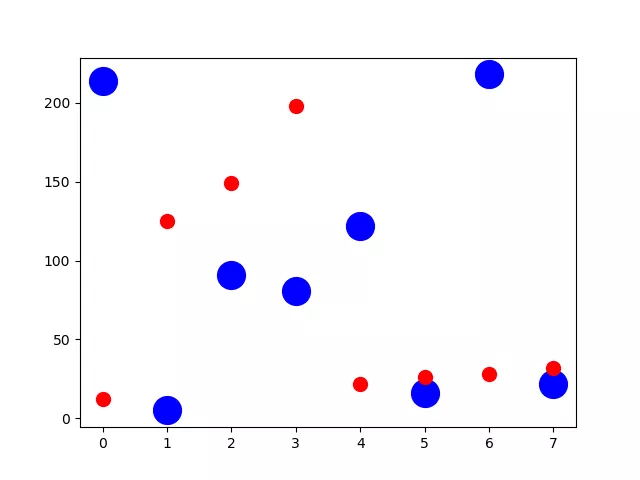
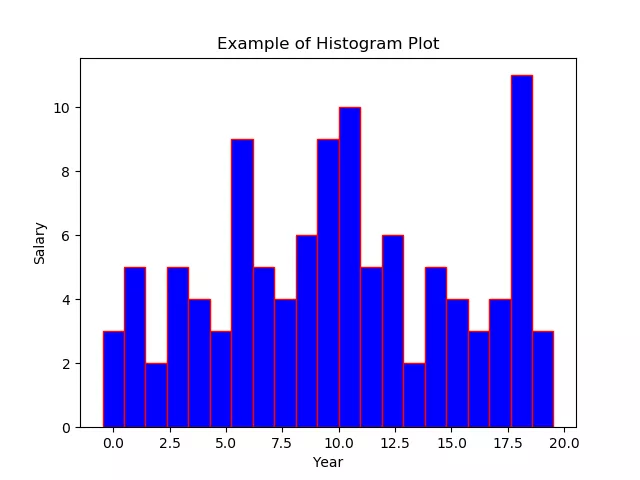

Python 可视化 Matplotlib

- 启用和检查交互模式
- 在 Matplotlib 中绘制折线图
- 绘制带有标签和图例的多条线的折线图
- 在 Matplotlib 中绘制带有标记的折线图
- 改变 Matplotlib 中绘制的图形的大小
- 在 Matplotlib 中设置轴限制
- 使用 Python Matplotlib 显示背景网格
- 使用 Python Matplotlib 将绘图保存到图像文件
- 将图例放在 plot 的不同位置
- 绘制具有不同标记大小的线条
- 用灰度线绘制折线图
- 以高 dpi 绘制 PDF 输出
- 绘制不同颜色的多线图
- 语料库创建词云
- 使用特定颜色在 Matplotlib Python 中绘制图形
- NLTK 词汇色散图
- 绘制具有不同线条图案的折线图
- 更新 Matplotlib 折线图中的字体外观
- 用颜色名称绘制虚线和点状图
- 以随机坐标绘制所有可用标记
- 绘制一个非常简单的条形图
- 在 X 轴上绘制带有组数据的条形图
- 具有不同颜色条形的条形图
- 使用 Matplotlib 中的特定值改变条形图中每个条的颜色
- 在 Matplotlib 中绘制散点图
- 使用单个标签绘制散点图
- 用标记大小绘制散点图
- 在散点图中调整标记大小和颜色
- 在 Matplotlib 中应用样式表
- 自定义网格颜色和样式
- 在 Python Matplotlib 中绘制饼图
- 在 Matplotlib 饼图中为楔形设置边框
- 在 Python Matplotlib 中设置饼图的方向
- 在 Matplotlib 中绘制具有不同颜色主题的饼图
- 在 Python Matplotlib 中打开饼图的轴
- 具有特定颜色和位置的饼图
- 在 Matplotlib 中绘制极坐标图
- 在 Matplotlib 中绘制半极坐标图
- Matplotlib 中的极坐标等值线图
- 绘制直方图
- 在 Matplotlib 直方图中选择 bins
- 在 Matplotlib 中绘制没有条形的直方图
- 使用 Matplotlib 同时绘制两个直方图
- 绘制具有特定颜色、边缘颜色和线宽的直方图
- 用颜色图绘制直方图
- 更改直方图上特定条的颜色
- 箱线图
- 箱型图按列数据分组
- 更改箱线图中的箱体颜色
- 更改 Boxplot 标记样式、标记颜色和标记大小
- 用数据系列绘制水平箱线图
- 箱线图调整底部和左侧
- 使用 Pandas 数据在 Matplotlib 中生成热图
- 带有中间颜色文本注释的热图
- 热图显示列和行的标签并以正确的方向显示数据
- 将 NA cells 与 HeatMap 中的其他 cells 区分开来
- 在 matplotlib 中创建径向热图
- 在 Matplotlib 中组合两个热图
- 使用 Numpy 和 Matplotlib 创建热图日历
- 在 Python 中创建分类气泡图
- 使用 Numpy 和 Matplotlib 创建方形气泡图
- 使用 Numpy 和 Matplotlib 创建具有气泡大小的图例
- 使用 Matplotlib 堆叠条形图
- 在同一图中绘制多个堆叠条
- Matplotlib 中的水平堆积条形图
<a name="b5ujY"></a>
## 1、启用和检查交互模式
```python
import matplotlib as mpl
import matplotlib.pyplot as plt

# Set the interactive mode to ON
plt.ion()

# Check the current status of interactive mode
print(mpl.is_interactive())
```
Output:
```python
True
```
<a name="qXlpW"></a>
## 2、在 Matplotlib 中绘制折线图
```python
import matplotlib.pyplot as plt

#Plot a line graph
plt.plot([5, 15])

# Add labels and title
plt.title("Interactive Plot")
plt.xlabel("X-axis")
plt.ylabel("Y-axis")
plt.show()
```
Output:<br />
<a name="iTjYq"></a>
## 3、绘制带有标签和图例的多条线的折线图
```python
import matplotlib.pyplot as plt

#Plot a line graph
plt.plot([5, 15], label='Rice')
plt.plot([3, 6], label='Oil')
plt.plot([8.0010, 14.2], label='Wheat')
plt.plot([1.95412, 6.98547, 5.41411, 5.99, 7.9999], label='Coffee')

# Add labels and title
plt.title("Interactive Plot")
plt.xlabel("X-axis")
plt.ylabel("Y-axis")

plt.legend()
plt.show()
```
Output:<br />
<a name="fkYgE"></a>
## 4、在 Matplotlib 中绘制带有标记的折线图
```python
import matplotlib.pyplot as plt

# Changing default values for parameters individually
plt.rc('lines', linewidth=2, linestyle='-', marker='*')
plt.rcParams['lines.markersize'] = 25
plt.rcParams['font.size'] = '10.0'

#Plot a line graph
plt.plot([10, 20, 30, 40, 50])
# Add labels and title
plt.title("Interactive Plot")
plt.xlabel("X-axis")
plt.ylabel("Y-axis")

plt.show()
```
Output:<br />
<a name="RHVCw"></a>
## 5、改变 Matplotlib 中绘制的图形的大小
```python
import matplotlib.pyplot as plt

# Changing default values for parameters individually
plt.rc('lines', linewidth=2, linestyle='-', marker='*')

plt.rcParams["figure.figsize"] = (4, 8)

# Plot a line graph
plt.plot([10, 20, 30, 40, 50, 60, 70, 80])
# Add labels and title
plt.title("Interactive Plot")
plt.xlabel("X-axis")
plt.ylabel("Y-axis")

plt.show()
```
Output:<br />
<a name="FFN8x"></a>
## 6、在 Matplotlib 中设置轴限制
```python
import matplotlib.pyplot as plt

data1 = [11, 12, 13, 14, 15, 16, 17]
data2 = [15.5, 12.5, 11.7, 9.50, 12.50, 11.50, 14.75]

# Add labels and title
plt.title("Interactive Plot")
plt.xlabel("X-axis")
plt.ylabel("Y-axis")

# Set the limit for each axis
plt.xlim(11, 17)
plt.ylim(9, 16)

# Plot a line graph
plt.plot(data1, data2)

plt.show()
```
Output:<br />
<a name="dWt45"></a>
## 7、使用 Python Matplotlib 显示背景网格
```python
import matplotlib.pyplot as plt

plt.grid(True, linewidth=0.5, color='#ff0000', linestyle='-')

#Plot a line graph
plt.plot([10, 20, 30, 40, 50])
# Add labels and title
plt.title("Interactive Plot")
plt.xlabel("X-axis")
plt.ylabel("Y-axis")

plt.show()
```
Output:<br />
<a name="nYu85"></a>
## 8、使用 Python Matplotlib 将绘图保存到图像文件
```python
import matplotlib.pyplot as plt

plt.grid(True, linewidth=0.5, color='#ff0000', linestyle='-')

#Plot a line graph
plt.plot([10, 20, 30, 40, 50])
# Add labels and title
plt.title("Interactive Plot")
plt.xlabel("X-axis")
plt.ylabel("Y-axis")

plt.savefig("foo.png", bbox_inches='tight')
```
Output:<br />
<a name="GTteJ"></a>
## 9、将图例放在 plot 的不同位置
```python
import matplotlib.pyplot as plt

#Plot a line graph
plt.plot([5, 15], label='Rice')
plt.plot([3, 6], label='Oil')
plt.plot([8.0010, 14.2], label='Wheat')
plt.plot([1.95412, 6.98547, 5.41411, 5.99, 7.9999], label='Coffee')

# Add labels and title
plt.title("Interactive Plot")
plt.xlabel("X-axis")
plt.ylabel("Y-axis")

plt.legend(bbox_to_anchor=(1.1, 1.05))

plt.show()
```
Output:<br />
<a name="jKG7l"></a>
## 10、绘制具有不同标记大小的线条
```python
import matplotlib.pyplot as plt

y1 = [12, 14, 15, 18, 19, 13, 15, 16]
y2 = [22, 24, 25, 28, 29, 23, 25, 26]
y3 = [32, 34, 35, 38, 39, 33, 35, 36]
y4 = [42, 44, 45, 48, 49, 43, 45, 46]
y5 = [52, 54, 55, 58, 59, 53, 55, 56]

# Plot lines with different marker sizes
plt.plot(y1, y2, label = 'Y1-Y2', lw=2, marker='s', ms=10) # square
plt.plot(y1, y3, label = 'Y1-Y3', lw=2, marker='^', ms=10) # triangle
plt.plot(y1, y4, label = 'Y1-Y4', lw=2, marker='o', ms=10) # circle
plt.plot(y1, y5, label = 'Y1-Y5', lw=2, marker='D', ms=10) # diamond
plt.plot(y2, y5, label = 'Y2-Y5', lw=2, marker='P', ms=10) # filled plus sign

plt.legend()
plt.show()
```
Output:<br />
<a name="QpDak"></a>
## 11、用灰度线绘制折线图
```python
import matplotlib.pyplot as plt

# Plot a line graph with grayscale lines 
plt.plot([5, 15], label='Rice', c='0.15')
plt.plot([3, 6], label='Oil', c='0.35')
plt.plot([8.0010, 14.2], label='Wheat',  c='0.55')
plt.plot([1.95412, 6.98547, 5.41411, 5.99, 7.9999], label='Coffee',  c='0.85')

# Add labels and title
plt.title("Interactive Plot")
plt.xlabel("X-axis")
plt.ylabel("Y-axis")

plt.legend()
plt.show()
```
Output:<br />
<a name="Jo75C"></a>
## 12、以高 dpi 绘制 PDF 输出
```python
import matplotlib.pyplot as plt

#Plot a line graph
plt.plot([5, 15], label='Rice')
plt.plot([3, 6], label='Oil')
plt.plot([8.0010, 14.2], label='Wheat')
plt.plot([1.95412, 6.98547, 5.41411, 5.99, 7.9999], label='Coffee')

# Add labels and title
plt.title("Interactive Plot")
plt.xlabel("X-axis")
plt.ylabel("Y-axis")

plt.savefig('output.pdf', dpi=1200, format='pdf', bbox_inches='tight')
```
Output:<br />生成带有图片的pdf文件

<a name="QmFZ4"></a>
## 13、绘制不同颜色的多线图
```python
import matplotlib.pyplot as plt

for i in range(10):
    plt.plot([i]*5, c='C'+str(i), label='C'+str(i))

# Plot a line graph
plt.xlim(0, 5)

# Add legend
plt.legend()

# Display the graph on the screen
plt.show()
```
Output:<br />
<a name="v9sud"></a>
## 14、语料库创建词云
```python
import nltk
from nltk.corpus import webtext
from nltk.probability import FreqDist
from wordcloud import WordCloud
import matplotlib.pyplot as plt

nltk.download('webtext')
wt_words = webtext.words('testing.txt')  # Sample data
data_analysis = nltk.FreqDist(wt_words)

filter_words = dict([(m, n) for m, n in data_analysis.items() if len(m) > 3])

wcloud = WordCloud().generate_from_frequencies(filter_words)

# Plotting the wordcloud
plt.imshow(wcloud, interpolation="bilinear")

plt.axis("off")
(-0.5, 399.5, 199.5, -0.5)
plt.show()
```
Output:<br />
<a name="fDdRp"></a>
## 15、使用特定颜色在 Matplotlib Python 中绘制图形
```python
import matplotlib.pyplot as plt

#Plot a line graph with specific colors
plt.plot([5, 15], label='Rice', c='C7')
plt.plot([3, 6], label='Oil', c='C8')
plt.plot([8.0010, 14.2], label='Wheat',  c='C4')
plt.plot([1.95412, 6.98547, 5.41411, 5.99, 7.9999], label='Coffee',  c='C6')

# Add labels and title
plt.title("Interactive Plot")
plt.xlabel("X-axis")
plt.ylabel("Y-axis")

plt.legend()
plt.show()
```
Output<br />
<a name="JzPIJ"></a>
## 16、NLTK 词汇色散图
```python
import nltk
from nltk.corpus import webtext
from nltk.probability import FreqDist
from wordcloud import WordCloud
import matplotlib.pyplot as plt

words = ['data', 'science', 'dataset']

nltk.download('webtext')
wt_words = webtext.words('testing.txt')  # Sample data

points = [(x, y) for x in range(len(wt_words))
          for y in range(len(words)) if wt_words[x] == words[y]]

if points:
    x, y = zip(*points)
else:
    x = y = ()

plt.plot(x, y, "rx", scalex=.1)
plt.yticks(range(len(words)), words, color="b")
plt.ylim(-1, len(words))
plt.title("Lexical Dispersion Plot")
plt.xlabel("Word Offset")
plt.show()
```
Output:<br />
<a name="zNDkV"></a>
## 17、绘制具有不同线条图案的折线图
```python
import matplotlib.pyplot as plt

# Plot a line graph with grayscale lines 
plt.plot([5, 11], label='Rice', c='C1', ls='--')
plt.plot([2, 16], label='Oil', c='C4', ls='-.')
plt.plot([8, 14], label='Wheat', c='C7', ls=':')

# Add labels and title
plt.title("Interactive Plot")
plt.xlabel("X-axis")
plt.ylabel("Y-axis")

plt.legend()
plt.show()
```
Output:<br />
<a name="mhjCQ"></a>
## 18、更新 Matplotlib 折线图中的字体外观
```python
import matplotlib.pyplot as plt

fontparams = {'font.size': 12, 'font.weight':'bold',
              'font.family':'arial', 'font.style':'italic'}

plt.rcParams.update(fontparams)

# Plot a line graph with specific font style
plt.plot([5, 11], label='Rice')
plt.plot([2, 16], label='Oil')
plt.plot([8, 14], label='Wheat')

labelparams = {'size': 20, 'weight':'semibold',
              'family':'serif', 'style':'italic'}

# Add labels and title
plt.title("Interactive Plot", labelparams)
plt.xlabel("X-axis", labelparams)
plt.ylabel("Y-axis", labelparams)

plt.legend()
plt.show()
```
Output:<br />
<a name="itm4U"></a>
## 19、用颜色名称绘制虚线和点状图
```python
import matplotlib.pyplot as plt
 
x = [2, 4, 5, 8, 9, 13, 15, 16]
y = [1, 3, 4, 7, 10, 11, 14, 17]
 
# Plot a line graph with dashed and maroon color
plt.plot(x, y, label='Price', c='maroon', ls=('dashed'), lw=2)
 
# Plot a line graph with dotted and teal color
plt.plot(y, x, label='Rank', c='teal', ls=('dotted'), lw=2)
 
plt.legend()
plt.show()
```
Output:<br />
<a name="zu8go"></a>
## 20、以随机坐标绘制所有可用标记
```python
import numpy as np
import matplotlib.pyplot as plt
from matplotlib.lines import Line2D

# Prepare 50 random numbers to plot
n1 = np.random.rand(50)
n2 = np.random.rand(50)

markerindex = np.random.randint(0, len(Line2D.markers), 50)

for x, y in enumerate(Line2D.markers):
    i = (markerindex == x)
    plt.scatter(n1[i], n2[i], marker=y)

plt.show()
```
Output:<br />
<a name="UsLnD"></a>
## 21、绘制一个非常简单的条形图
```python
import matplotlib.pyplot as plt

year = [2001, 2002, 2003, 2004, 2005, 2006]
unit = [50, 60, 75, 45, 70, 105]

# Plot the bar graph
plot = plt.bar(year, unit)

# Add the data value on head of the bar
for value in plot:
    height = value.get_height()
    plt.text(value.get_x() + value.get_width()/2.,
             1.002*height,'%d' % int(height), ha='center', va='bottom')

# Add labels and title
plt.title("Bar Chart")
plt.xlabel("Year")
plt.ylabel("Unit")

# Display the graph on the screen
plt.show()
```
Output:<br />
<a name="RulKp"></a>
## 22、在 X 轴上绘制带有组数据的条形图
```python
import pandas as pd
import matplotlib.pyplot as plt
 
df = pd.DataFrame([[1, 2, 3, 4], [7, 1.4, 2.1, 2.8], [5.5, 1.5, 8, 1.2],
                   [1.5, 1.4, 1, 8], [7, 1, 1, 8], [5, 4, 9, 2]],
                  columns=['Apple', 'Orange', 'Banana', 'Pear'],
                  index=[1, 7, 13, 20, 28, 35])
width = 2
bottom = 0
 
for i in df.columns:
    plt.bar(df.index, df[i], width=width, bottom=bottom)
    bottom += df[i]

plt.legend(df.columns)
plt.tight_layout()

# Display the graph on the screen
plt.show()
```
Output:<br />
<a name="duN5y"></a>
## 23、具有不同颜色条形的条形图
```python
import matplotlib.pyplot as plt
import matplotlib as mp
import numpy as np

data = [8, 6, 7, 12, 9, 10, 5, 8, 9]

# Colorize the graph based on likeability:
likeability_scores = np.array(data)

data_normalizer = mp.colors.Normalize()
color_map = mp.colors.LinearSegmentedColormap(
    "my_map",
    {
        "red": [(0, 1.0, 1.0),
                (1.0, .5, .5)],
        "green": [(0, 0.5, 0.5),
                  (1.0, 0, 0)],
        "blue": [(0, 0.50, 0.5),
                 (1.0, 0, 0)]
    }
)

# Map xs to numbers:
N = len(data)
x_nums = np.arange(1, N+1)
 
# Plot a bar graph:
plt.bar(
    x_nums,
    data,
    align="center",
    color=color_map(data_normalizer(likeability_scores))
)

plt.xticks(x_nums, data)
plt.show()
```
Output:<br />
<a name="TqBce"></a>
## 24、使用 Matplotlib 中的特定值改变条形图中每个条的颜色
```python
import matplotlib.pyplot as plt
import matplotlib.cm as cm
from matplotlib.colors import Normalize
from numpy.random import rand

data = [2, 3, 5, 6, 8, 12, 7, 5]
fig, ax = plt.subplots(1, 1)

# Get a color map
my_cmap = cm.get_cmap('jet')

# Get normalize function (takes data in range [vmin, vmax] -> [0, 1])
my_norm = Normalize(vmin=0, vmax=8)

ax.bar(range(8), rand(8), color=my_cmap(my_norm(data)))
plt.show()
```
Output:<br />
<a name="guXVF"></a>
## 25、在 Matplotlib 中绘制散点图
```python
import matplotlib.pyplot as plt

x1 = [214, 5, 91, 81, 122, 16, 218, 22]
x2 = [12, 125, 149, 198, 22, 26, 28, 32]

plt.scatter(x1, x2)

# Set X and Y axis labels
plt.xlabel('Demand')
plt.ylabel('Price')

#Display the graph
plt.show()
```
Output:<br />
<a name="Z8WV7"></a>
## 26、使用单个标签绘制散点图
```python
import numpy as np
import matplotlib.pyplot as plt

N = 6
data = np.random.random((N, 4))
labels = ['point{0}'.format(i) for i in range(N)]

plt.subplots_adjust(bottom=0.1)
plt.scatter(
    data[:, 0], data[:, 1], marker='o', c=data[:, 2], s=data[:, 3] * 1500,
    cmap=plt.get_cmap('Spectral'))

for label, x, y in zip(labels, data[:, 0], data[:, 1]):
    plt.annotate(
        label,
        xy=(x, y), xytext=(-20, 20),
        textcoords='offset points', ha='right', va='bottom',
        bbox=dict(boxstyle='round,pad=0.5', fc='yellow', alpha=0.5),
        arrowprops=dict(arrowstyle='->', connectionstyle='arc3,rad=0'))

plt.show()
```
Output:<br />
<a name="zZnbV"></a>
## 27、用标记大小绘制散点图
```python
import matplotlib.pyplot as plt

x1 = [214, 5, 91, 81, 122, 16, 218, 22]
x2 = [12, 125, 149, 198, 22, 26, 28, 32]

plt.figure(1)
# You can specify the marker size two ways directly:
plt.plot(x1, 'bo', markersize=20)  # blue circle with size 10 
plt.plot(x2, 'ro', ms=10,)  # ms is just an alias for markersize
plt.show()
```
Output:<br />
<a name="GDulP"></a>
## 28、在散点图中调整标记大小和颜色
```python
import matplotlib.pyplot as plt
import matplotlib.colors

# Prepare a list of integers
val = [2, 3, 6, 9, 14]

# Prepare a list of sizes that increases with values in val
sizevalues = [i**2*50+50 for i in val]

# Prepare a list of colors
plotcolor = ['red','orange','yellow','green','blue']

# Draw a scatter plot of val points with sizes in sizevalues and
# colors in plotcolor
plt.scatter(val, val, s=sizevalues, c=plotcolor)

# Set axis limits to show the markers completely
plt.xlim(0, 20)
plt.ylim(0, 20)

plt.show()
```
Output:<br />
<a name="wzGII"></a>
## 29、在 Matplotlib 中应用样式表
```python
import matplotlib.pyplot as plt
import matplotlib.colors
import matplotlib as mpl

mpl.style.use('seaborn-darkgrid')

# Prepare a list of integers
val = [2, 3, 6, 9, 14]

# Prepare a list of sizes that increases with values in val
sizevalues = [i**2*50+50 for i in val]

# Prepare a list of colors
plotcolor = ['red','orange','yellow','green','blue']

# Draw a scatter plot of val points with sizes in sizevalues and
# colors in plotcolor
plt.scatter(val, val, s=sizevalues, c=plotcolor)

# Draw grid lines with red color and dashed style
plt.grid(color='blue', linestyle='-.', linewidth=0.7)

# Set axis limits to show the markers completely
plt.xlim(0, 20)
plt.ylim(0, 20)

plt.show()
```
Output:<br />
<a name="MDkAu"></a>
## 30、自定义网格颜色和样式
```python
import matplotlib.pyplot as plt
import matplotlib.colors

# Prepare a list of integers
val = [2, 3, 6, 9, 14]

# Prepare a list of sizes that increases with values in val
sizevalues = [i**2*50+50 for i in val]

# Prepare a list of colors
plotcolor = ['red','orange','yellow','green','blue']

# Draw a scatter plot of val points with sizes in sizevalues and
# colors in plotcolor
plt.scatter(val, val, s=sizevalues, c=plotcolor)

# Draw grid lines with red color and dashed style
plt.grid(color='red', linestyle='-.', linewidth=0.7)

# Set axis limits to show the markers completely
plt.xlim(0, 20)
plt.ylim(0, 20)

plt.show()
```
Output:<br />
<a name="PPZuH"></a>
## 31、在 Python Matplotlib 中绘制饼图
```python
import matplotlib.pyplot as plt


labels = ['India', 'Canada', 'Japan', 'Australia', 'Russia']
sizes = [31, 19, 15, 14, 21]  # Add upto 100%

# Plot the pie chart
plt.pie(sizes, labels=labels, autopct='%1.1f%%', startangle=90)

# Equal aspect ratio ensures that pie is drawn as a circle.
plt.axis('equal')

# Display the graph onto the screen
plt.show()
```
Output:<br />
<a name="jW6y8"></a>
## 32、在 Matplotlib 饼图中为楔形设置边框
```python
import matplotlib.pyplot as plt

labels = ['India', 'Canada', 'Japan', 'Australia', 'Russia']
sizes = [31, 19, 15, 14, 21]  # Add upto 100%
 
# Plot the pie chart
plt.pie(sizes, labels=labels, autopct='%1.1f%%', startangle=90,
        wedgeprops={"edgecolor":"0",'linewidth': 1,
                    'linestyle': 'dashed', 'antialiased': True})

# Equal aspect ratio ensures that pie is drawn as a circle.
plt.axis('equal')

# Display the graph onto the screen
plt.show()
```
Output:<br />
<a name="ulpRV"></a>
## 33、在 Python Matplotlib 中设置饼图的方向
```python
import matplotlib.pyplot as plt

labels = ['India', 'Canada', 'Japan', 'Australia', 'Russia']
sizes = [31, 19, 15, 14, 21]  # Add upto 100%

# Plot the pie chart
plt.pie(sizes, labels=labels, counterclock=False, startangle=90)

# Equal aspect ratio ensures that pie is drawn as a circle.
plt.axis('equal')

# Display the graph onto the screen
plt.show()
```
Output:<br />
<a name="GPOSD"></a>
## 34、在 Matplotlib 中绘制具有不同颜色主题的饼图
```python
import matplotlib.pyplot as plt

sizes = [12, 23, 11, 17, 19, 24, 29, 11, 12, 9, 7, 5, 3, 2, 1]
labels = ["Market %s" % i for i in sizes]

fig1, ax1 = plt.subplots(figsize=(5, 5))
fig1.subplots_adjust(0.3, 0, 1, 1)

theme = plt.get_cmap('copper')
ax1.set_prop_cycle("color", [theme(1. * i / len(sizes))
                             for i in range(len(sizes))])

_, _ = ax1.pie(sizes, startangle=90, radius=1800)

ax1.axis('equal')

total = sum(sizes)
plt.legend(
    loc='upper left',
    labels=['%s, %1.1f%%' % (
        l, (float(s) / total) * 100)
            for l, s in zip(labels, sizes)],
    prop={'size': 11},
    bbox_to_anchor=(0.0, 1),
    bbox_transform=fig1.transFigure
)

plt.show()
```
Output:<br />
<a name="DQvA9"></a>
## 35、在 Python Matplotlib 中打开饼图的轴
```python
import matplotlib.pyplot as plt

sizes = [12, 23, 11, 17, 19, 24, 29, 11, 12, 9, 7, 5, 3, 2, 1]
labels = ["Market %s" % i for i in sizes]

fig1, ax1 = plt.subplots(figsize=(5, 5))
fig1.subplots_adjust(0.1, 0.1, 1, 1)

theme = plt.get_cmap('jet')
ax1.set_prop_cycle("color", [theme(1. * i / len(sizes))
                             for i in range(len(sizes))])

_, _ = ax1.pie(sizes, startangle=90, radius=1800, frame=True)

ax1.axis('equal')
plt.show()
```
Output:<br />
<a name="i4yiq"></a>
## 36、具有特定颜色和位置的饼图
```python
import numpy as np
import matplotlib.pyplot as plt

fig =plt.figure(figsize = (4,4))
ax11 = fig.add_subplot(111)
# Data to plot
labels = 'Python', 'C++', 'Ruby', 'Java'
sizes = [250, 130, 75, 200]
colors = ['gold', 'yellowgreen', 'lightcoral', 'lightskyblue']

# Plot
w,l,p = ax11.pie(sizes,  labels=labels, colors=colors,
                 autopct='%1.1f%%', startangle=140, pctdistance=1, radius=0.5)

pctdists = [.8, .5, .4, .2]

for t,d in zip(p, pctdists):
    xi,yi = t.get_position()
    ri = np.sqrt(xi**2+yi**2)
    phi = np.arctan2(yi,xi)
    x = d*ri*np.cos(phi)
    y = d*ri*np.sin(phi)
    t.set_position((x,y))

plt.axis('equal')
plt.show()
```
Output:<br />
<a name="ch9AZ"></a>
## 37、在 Matplotlib 中绘制极坐标图
```python
import matplotlib.pyplot as plt
import numpy as np

employee = ["Sam", "Rony", "Albert", "Chris", "Jahrum"]
actual = [45, 53, 55, 61, 57, 45]
expected = [50, 55, 60, 65, 55, 50]

# Initialise the spider plot by setting figure size and polar projection
plt.figure(figsize=(10, 6))
plt.subplot(polar=True)

theta = np.linspace(0, 2 * np.pi, len(actual))

# Arrange the grid into number of sales equal parts in degrees
lines, labels = plt.thetagrids(range(0, 360, int(360/len(employee))), (employee))

# Plot actual sales graph
plt.plot(theta, actual)
plt.fill(theta, actual, 'b', alpha=0.1)

# Plot expected sales graph
plt.plot(theta, expected)

# Add legend and title for the plot
plt.legend(labels=('Actual', 'Expected'), loc=1)
plt.title("Actual vs Expected sales by Employee")

# Dsiplay the plot on the screen
plt.show()
```
Output:<br />
<a name="GATPD"></a>
## 38、在 Matplotlib 中绘制半极坐标图
```python
import matplotlib.pyplot as plt
import numpy as np

theta = np.linspace(0, np.pi)
r = np.sin(theta)

fig = plt.figure()
ax = fig.add_subplot(111, polar=True)
c = ax.scatter(theta, r, c=r, s=10, cmap='hsv', alpha=0.75)

ax.set_thetamin(0)
ax.set_thetamax(180)

plt.show()
```
Output:<br />
<a name="atHhg"></a>
## 39、Matplotlib 中的极坐标等值线图
```python
import numpy as np
import matplotlib.pyplot as plt

# Using linspace so that the endpoint of 360 is included
actual = np.radians(np.linspace(0, 360, 20))
expected = np.arange(0, 70, 10)

r, theta = np.meshgrid(expected, actual)
values = np.random.random((actual.size, expected.size))

fig, ax = plt.subplots(subplot_kw=dict(projection='polar'))
ax.contourf(theta, r, values)

plt.show()
```
Output:<br />
<a name="n0Ltm"></a>
## 40、绘制直方图
```python
import numpy as np
import matplotlib.pyplot as plt

# Data in numpy array
exp_data = np.array([12, 15, 13, 20, 19, 20, 11, 19, 11, 12, 19, 13, 
                    12, 10, 6, 19, 3, 1, 1, 0, 4, 4, 6, 5, 3, 7, 
                    12, 7, 9, 8, 12, 11, 11, 18, 19, 18, 19, 3, 6, 
                    5, 6, 9, 11, 10, 14, 14, 16, 17, 17, 19, 0, 2, 
                    0, 3, 1, 4, 6, 6, 8, 7, 7, 6, 7, 11, 11, 10, 
                    11, 10, 13, 13, 15, 18, 20, 19, 1, 10, 8, 16, 
                    19, 19, 17, 16, 11, 1, 10, 13, 15, 3, 8, 6, 9, 
                    10, 15, 19, 2, 4, 5, 6, 9, 11, 10, 9, 10, 9, 
                    15, 16, 18, 13])

# Plot the distribution of numpy data
plt.hist(exp_data, bins = 19)

# Add axis labels
plt.xlabel("Year")
plt.ylabel("Salary")
plt.title("Example of Histogram Plot")

plt.show()
```
Output:<br />
<a name="MEswi"></a>
## 41、在 Matplotlib 直方图中选择 bins
```python
import numpy as np
import matplotlib.pyplot as plt

# Data in numpy array
data = np.array([12, 15, 13, 20, 19, 20, 11, 19, 11, 12, 19, 13, 
                    12, 10, 6, 19, 3, 1, 1, 0, 4, 4, 6, 5, 3, 7, 
                    12, 7, 9, 8, 12, 11, 11, 18, 19, 18, 19, 3, 6, 
                    5, 6, 9, 11, 10, 14, 14, 16, 17, 17, 19, 0, 2, 
                    0, 3, 1, 4, 6, 6, 8, 7, 7, 6, 7, 11, 11, 10, 
                    11, 10, 13, 13, 15, 18, 20, 19, 1, 10, 8, 16, 
                    19, 19, 17, 16, 11, 1, 10, 13, 15, 3, 8, 6, 9, 
                    10, 15, 19, 2, 4, 5, 6, 9, 11, 10, 9, 10, 9, 
                    15, 16, 18, 13])

# Plot the distribution of numpy data
ax = plt.hist(data, bins=np.arange(min(data), max(data) + 0.25, 0.25), align='left')
# Add axis labels
plt.xlabel("Year")
plt.ylabel("Salary")
plt.title("Example of Histogram Plot")

plt.show()
```
Output:<br />
<a name="pENbE"></a>
## 42、在 Matplotlib 中绘制没有条形的直方图
```python
import numpy as np
import matplotlib.pyplot as plt

# Data in numpy array
data = np.array([12, 15, 13, 20, 19, 20, 11, 19, 11, 12, 19, 13,
                 12, 10, 6, 19, 3, 1, 1, 0, 4, 4, 6, 5, 3, 7,
                 12, 7, 9, 8, 12, 11, 11, 18, 19, 18, 19, 3, 6,
                 5, 6, 9, 11, 10, 14, 14, 16, 17, 17, 19, 0, 2,
                 0, 3, 1, 4, 6, 6, 8, 7, 7, 6, 7, 11, 11, 10,
                 11, 10, 13, 13, 15, 18, 20, 19, 1, 10, 8, 16,
                 19, 19, 17, 16, 11, 1, 10, 13, 15, 3, 8, 6, 9,
                 10, 15, 19, 2, 4, 5, 6, 9, 11, 10, 9, 10, 9,
                 15, 16, 18, 13])

bins, edges = np.histogram(data, 21, normed=1)
left, right = edges[:-1], edges[1:]
X = np.array([left, right]).T.flatten()
Y = np.array([bins, bins]).T.flatten()

plt.plot(X, Y)
plt.show()
```
Output:<br />
<a name="TPrk7"></a>
## 43、使用 Matplotlib 同时绘制两个直方图
```python
import numpy as np
import matplotlib.pyplot as plt

age = np.random.normal(loc=1, size=100) # a normal distribution
salaray = np.random.normal(loc=-1, size=10000) # a normal distribution

_, bins, _ = plt.hist(age, bins=50, range=[-6, 6], density=True)
_ = plt.hist(salaray, bins=bins, alpha=0.5, density=True)
plt.show()
```
Output:<br />
<a name="Mniek"></a>
## 44、绘制具有特定颜色、边缘颜色和线宽的直方图
```python
import numpy as np
import matplotlib.pyplot as plt

# Data in numpy array
exp_data = np.array([12, 15, 13, 20, 19, 20, 11, 19, 11, 12, 19, 13, 
                    12, 10, 6, 19, 3, 1, 1, 0, 4, 4, 6, 5, 3, 7, 
                    12, 7, 9, 8, 12, 11, 11, 18, 19, 18, 19, 3, 6, 
                    5, 6, 9, 11, 10, 14, 14, 16, 17, 17, 19, 0, 2, 
                    0, 3, 1, 4, 6, 6, 8, 7, 7, 6, 7, 11, 11, 10, 
                    11, 10, 13, 13, 15, 18, 20, 19, 1, 10, 8, 16, 
                    19, 19, 17, 16, 11, 1, 10, 13, 15, 3, 8, 6, 9, 
                    10, 15, 19, 2, 4, 5, 6, 9, 11, 10, 9, 10, 9, 
                    15, 16, 18, 13])

# Plot the distribution of numpy data
plt.hist(exp_data, bins=21, align='left', color='b', edgecolor='red',
              linewidth=1)

# Add axis labels
plt.xlabel("Year")
plt.ylabel("Salary")
plt.title("Example of Histogram Plot")

plt.show()
```
Output:<br />
<a name="RVMAP"></a>
## 45、用颜色图绘制直方图
```python
import numpy as np
import matplotlib.pyplot as plt

# Data in numpy array
data = np.array([12, 15, 13, 20, 19, 20, 11, 19, 11, 12, 19, 13, 
                    12, 10, 6, 19, 3, 1, 1, 0, 4, 4, 6, 5, 3, 7, 
                    12, 7, 9, 8, 12, 11, 11, 18, 19, 18, 19, 3, 6, 
                    5, 6, 9, 11, 10, 14, 14, 16, 17, 17, 19, 0, 2, 
                    0, 3, 1, 4, 6, 6, 8, 7, 7, 6, 7, 11, 11, 10, 
                    11, 10, 13, 13, 15, 18, 20, 19, 1, 10, 8, 16, 
                    19, 19, 17, 16, 11, 1, 10, 13, 15, 3, 8, 6, 9, 
                    10, 15, 19, 2, 4, 5, 6, 9, 11, 10, 9, 10, 9, 
                    15, 16, 18, 13])

cm = plt.cm.RdBu_r

n, bins, patches = plt.hist(data, 25, normed=1, color='green')
for i, p in enumerate(patches):
    plt.setp(p, 'facecolor', cm(i/25)) # notice the i/25

plt.show()
```
Output:<br />
<a name="Jzpbb"></a>
## 46、更改直方图上特定条的颜色
```python
import pandas as pd
import matplotlib.pyplot as plt

s = pd.Series([12, 15, 13, 20, 19, 20, 11, 19, 11, 12, 19, 13, 
                    12, 10, 6, 19, 3, 1, 1, 0, 4, 4, 6, 5, 3, 7, 
                    12, 7, 9, 8, 12, 11, 11, 18, 19, 18, 19, 3, 6, 
                    5, 6, 9, 11, 10, 14, 14, 16, 17, 17, 19, 0, 2, 
                    0, 3, 1, 4, 6, 6, 8, 7, 7, 6, 7, 11, 11, 10, 
                    11, 10, 13, 13, 15, 18, 20, 19, 1, 10, 8, 16, 
                    19, 19, 17, 16, 11, 1, 10, 13, 15, 3, 8, 6, 9, 
                    10, 15, 19, 2, 4, 5, 6, 9, 11, 10, 9, 10, 9, 
                    15, 16, 18, 13])

p = s.plot(kind='hist', bins=50, color='orange')

bar_value_to_label = 5

min_distance = float("inf")  # initialize min_distance with infinity
index_of_bar_to_label = 0
for i, rectangle in enumerate(p.patches):  # iterate over every bar
    tmp = abs(  # tmp = distance from middle of the bar to bar_value_to_label
        (rectangle.get_x() +
            (rectangle.get_width() * (1 / 2))) - bar_value_to_label)
    if tmp < min_distance:  # we are searching for the bar with x cordinate
                            # closest to bar_value_to_label
        min_distance = tmp
        index_of_bar_to_label = i
p.patches[index_of_bar_to_label].set_color('b')

plt.show()
```
Output:<br />
<a name="T7F24"></a>
## 47、箱线图
```python
import matplotlib.pyplot as plt
import pandas as pd

df = pd.DataFrame([[10, 20, 30, 40], [7, 14, 21, 28], [15, 15, 8, 12],
                   [15, 14, 1, 8], [7, 1, 1, 8], [5, 4, 9, 2]],
                  columns=['Apple', 'Orange', 'Banana', 'Pear'],
                  index=['Basket1', 'Basket2', 'Basket3', 'Basket4',
                         'Basket5', 'Basket6'])

df.boxplot(['Apple', 'Orange', 'Banana', 'Pear'])
plt.show()
```
Output:<br />
<a name="Snyz7"></a>
## 48、箱型图按列数据分组
```python
import matplotlib.pyplot as plt
import pandas as pd

employees = pd.DataFrame({
    'EmpCode': ['Emp001', 'Emp002', 'Emp003', 'Emp004', 'Emp005', 'Emp006'
                , 'Emp007', 'Emp008', 'Emp009', 'Emp010', 'Emp011', 'Emp012'
                , 'Emp013', 'Emp014', 'Emp015', 'Emp016', 'Emp017', 'Emp018'
                , 'Emp019', 'Emp020'],
    'Occupation': ['Chemist', 'Statistician', 'Statistician', 'Statistician',
                   'Programmer', 'Chemist', 'Statistician', 'Statistician',
                   'Statistician', 'Programmer', 'Chemist', 'Statistician',
                   'Statistician', 'Statistician', 'Programmer', 'Chemist',
                   'Statistician', 'Statistician', 'Statistician', 'Programmer'
                   ],
    'Age': [23, 24, 34, 29, 40, 25, 26, 29, 40, 41, 40, 35, 41, 29, 33, 35,
            29, 30, 36, 37]})
 
employees.boxplot(column=['Age'], by=['Occupation'])

plt.show()
```
Output:<br />
<a name="WXYW9"></a>
## 49、更改箱线图中的箱体颜色
```python
import matplotlib.pyplot as plt
import pandas as pd

df = pd.DataFrame([[10, 20, 30, 40], [7, 14, 21, 28], [15, 15, 8, 12],
                   [15, 14, 1, 8], [7, 1, 1, 8], [5, 4, 9, 2]],
                  columns=['Apple', 'Orange', 'Banana', 'Pear'],
                  index=['Basket1', 'Basket2', 'Basket3', 'Basket4',
                         'Basket5', 'Basket6'])

box = plt.boxplot(df, patch_artist=True)

colors = ['blue', 'green', 'purple', 'tan', 'pink', 'red']

for patch, color in zip(box['boxes'], colors):
    patch.set_facecolor(color)

plt.show()
```
Output:<br />
<a name="gKz1c"></a>
## 50、更改 Boxplot 标记样式、标记颜色和标记大小
```python
import matplotlib.pyplot as plt
import pandas as pd

df = pd.DataFrame([[10, 20, 30, 40], [7, 14, 21, 128], [15, 15, 89, 12],
                   [-15, 14, 1, 8], [7, -11, 1, 8], [5, 4, 9, 2]],
                  columns=['Apple', 'Orange', 'Banana', 'Pear'],
                  index=['Basket1', 'Basket2', 'Basket3', 'Basket4',
                         'Basket5', 'Basket6'])


flierprops = dict(marker='+', markerfacecolor='g', markersize=15,
                  linestyle='none', markeredgecolor='r')

df.boxplot(['Apple', 'Orange', 'Banana', 'Pear'], flierprops=flierprops)

plt.show()
```
Output:<br />
<a name="JRVcR"></a>
## 51、用数据系列绘制水平箱线图
```python
import matplotlib.pyplot as plt

data = [-12, 15, 13, -20, 19, 20, 11, 19, -11, 12, 19, 10, 
                    12, 10, 6, 19, 3, 1, 1, 0, 4, 49, 6, 5, 3, 7, 
                    12, 77, 9, 8, 12, 11, 11, 18, 19, 18, 19, 3, 6, 
                    5, 6, 9, 11, 10, 18, 14, 16, 17, 17, 19, 0, 2, 
                    0, 3, 1, 4, 6, 6, 8, 7, 7, 69, 79, 11, 11, 10, 
                    11, 10, 13, 13, 15, 18, 20, 19, 1, 11, 8, 16, 
                    19, 89, 17, 16, 11, 1, 110, 13, 15, 3, 8, 6, 99, 
                    10, 15, 19, 2, 4, 5, 6, 9, 11, 10, 9, 10, 99, 
                    15, 16, 18, 13]

fig = plt.figure(figsize=(7, 3), dpi=100)
ax = plt.subplot(2, 1,2)

ax.boxplot(data, False, sym='rs', vert=False, whis=0.75, positions=[0], widths=[0.5])

plt.tight_layout()
plt.show()
```
Output:<br />
<a name="Bl8UB"></a>
## 52、箱线图调整底部和左侧
```python
import matplotlib.pyplot as plt
import pandas as pd

x = [[1.2, 2.3, 3.0, 4.5],
     [1.1, 2.2, 2.9, 5.0]]

df = pd.DataFrame(x, index=['Apple', 'Orange'])
df.T.boxplot()

plt.subplots_adjust(bottom=0.25)

plt.show()
```
Output:<br />
<a name="pMqhL"></a>
## 53、使用 Pandas 数据在 Matplotlib 中生成热图
```python
import matplotlib.pyplot as plt
import pandas as pd

df = pd.DataFrame([[10, 20, 30, 40], [7, 14, 21, 28], [55, 15, 8, 12],
                    [15, 14, 1, 8]],
                  columns=['Apple', 'Orange', 'Banana', 'Pear'],
                  index=['Basket1', 'Basket2', 'Basket3', 'Basket4']
                  )

plt.imshow(df, cmap="YlGnBu")
plt.colorbar()
plt.xticks(range(len(df)),df.columns, rotation=20)
plt.yticks(range(len(df)),df.index)
plt.show()
```
Output:<br />
<a name="Q50uj"></a>
## 54、带有中间颜色文本注释的热图
```python
import pandas as pd
import matplotlib.pyplot as plt

data = {
        'Basket1': [90, 95, 99, 50, 50, 45, 81],
        'Basket2': [91, 98, 89, 75, 98, 49, 80],
        'Basket3': [92, 97, 99, 85, 96, 75, 88],
        'Basket4': [94, 96, 88, 79, 98, 69, 86]
        }

fig, ax = plt.subplots(figsize=(9, 4))
df = pd.DataFrame.from_dict(data, orient='index')

im = ax.imshow(df.values, cmap="YlGnBu")
fig.colorbar(im)

# Loop over data dimensions and create text annotations
textcolors = ["k", "w"]
threshold = 55
for i in range(len(df)):
    for j in range(len(df.columns)):
        text = ax.text(j, i, df.values[i, j],
                       ha="center", va="center",
                       color=textcolors[df.values[i, j] > threshold])

plt.show()
```
Output:<br />
<a name="JNybz"></a>
## 55、热图显示列和行的标签并以正确的方向显示数据
```python
import matplotlib.pyplot as plt
import numpy as np

column_labels = list('ABCDEFGH')
row_labels = list('12345678')

data = np.random.rand(8, 8)

fig, ax = plt.subplots()
heatmap = ax.pcolor(data, cmap=plt.cm.Reds)

# Put the major ticks at the middle of each cell
ax.set_xticks(np.arange(data.shape[0]), minor=False)
ax.set_yticks(np.arange(data.shape[0]), minor=False)

# Want a more natural, table-like display
ax.invert_yaxis()
ax.xaxis.tick_top()

ax.set_xticklabels(row_labels, minor=False)
ax.set_yticklabels(column_labels, minor=False)

plt.show()
```
Output:<br />
<a name="DHkga"></a>
## 56、将 NA cells 与 HeatMap 中的其他 cells 区分开来
```python
import matplotlib.pyplot as plt
import matplotlib.patches as patches

import numpy as np

column_labels = list('ABCDEFGH')
row_labels = list('12345678')

data = np.random.rand(8, 8)
data = np.ma.masked_greater(data, 0.8)

fig, ax = plt.subplots()
heatmap = ax.pcolor(data, cmap=plt.cm.gray, edgecolors='blue', linewidths=1,
                   antialiased=True)

fig.colorbar(heatmap)
ax.patch.set(hatch='..', edgecolor='red')

# Put the major ticks at the middle of each cell
ax.set_xticks(np.arange(data.shape[0]), minor=False)
ax.set_yticks(np.arange(data.shape[0]), minor=False)

# Want a more natural, table-like display
ax.invert_yaxis()
ax.xaxis.tick_top()

ax.set_xticklabels(row_labels, minor=False)
ax.set_yticklabels(column_labels, minor=False)

plt.show()
```
Output:<br />
<a name="ucqlK"></a>
## 57、在 matplotlib 中创建径向热图
```python
import matplotlib.pyplot as plt
from mpl_toolkits.mplot3d import Axes3D
import numpy as np

fig = plt.figure()
ax = Axes3D(fig)

n = 12
m = 24
rad = np.linspace(0, 10, m)
a = np.linspace(0, 2 * np.pi, n)
r, th = np.meshgrid(rad, a)

z = np.random.uniform(-1, 1, (n,m))
plt.subplot(projection="polar")

plt.pcolormesh(th, r, z, cmap = 'Blues')

plt.plot(a, r, ls='none', color = 'k') 
plt.grid()
plt.colorbar()
plt.show()
```
Output:<br />
<a name="xkRny"></a>
## 58、在 Matplotlib 中组合两个热图
```python
import matplotlib.pyplot as plt
import numpy as np
import pandas as pd
import seaborn as sns

df1 = pd.DataFrame(np.random.rand(20, 4), columns=list("ABCD"))
df2 = pd.DataFrame(np.random.rand(20, 4), columns=list("WXYZ"))

fig, (ax1, ax2) = plt.subplots(ncols=2)
fig.subplots_adjust(wspace=0.01)

sns.heatmap(df1, cmap="rocket", ax=ax1, cbar=False)
fig.colorbar(ax1.collections[0], ax=ax1, location="left", use_gridspec=False, pad=0.2)

sns.heatmap(df2, cmap="icefire", ax=ax2, cbar=False)
fig.colorbar(ax2.collections[0], ax=ax2, location="right", use_gridspec=False, pad=0.2)

ax2.yaxis.tick_right()
ax2.tick_params(rotation=0)
plt.show()
```
Output:<br />
<a name="cXqfH"></a>
## 59、使用 Numpy 和 Matplotlib 创建热图日历
```python
import datetime as dt
import matplotlib.pyplot as plt
import numpy as np


def main():
    dates, data = generate_data()
    fig, ax = plt.subplots(figsize=(6, 10))
    calendar_heatmap(ax, dates, data)
    plt.show()


def generate_data():
    num = 60
    data = np.random.randint(0, 20, num)
    start = dt.datetime(2018, 1, 1)
    dates = [start + dt.timedelta(days=i) for i in range(num)]
    return dates, data


def calendar_array(dates, data):
    i, j = zip(*[d.isocalendar()[1:] for d in dates])
    i = np.array(i) - min(i)
    j = np.array(j) - 1
    ni = max(i) + 1

    calendar = np.nan * np.zeros((ni, 7))
    calendar[i, j] = data
    return i, j, calendar


def calendar_heatmap(ax, dates, data):
    i, j, calendar = calendar_array(dates, data)
    im = ax.imshow(calendar, interpolation='none', cmap='summer')
    label_days(ax, dates, i, j, calendar)
    label_months(ax, dates, i, j, calendar)
    ax.figure.colorbar(im)


def label_days(ax, dates, i, j, calendar):
    ni, nj = calendar.shape
    day_of_month = np.nan * np.zeros((ni, 7))
    day_of_month[i, j] = [d.day for d in dates]

    for (i, j), day in np.ndenumerate(day_of_month):
        if np.isfinite(day):
            ax.text(j, i, int(day), ha='center', va='center')

    ax.set(xticks=np.arange(7),
           xticklabels=['M', 'T', 'W', 'R', 'F', 'S', 'S'])
    ax.xaxis.tick_top()


def label_months(ax, dates, i, j, calendar):
    month_labels = np.array(['Jan', 'Feb', 'Mar', 'Apr', 'May', 'Jun', 'Jul',
                             'Aug', 'Sep', 'Oct', 'Nov', 'Dec'])
    months = np.array([d.month for d in dates])
    uniq_months = sorted(set(months))
    yticks = [i[months == m].mean() for m in uniq_months]
    labels = [month_labels[m - 1] for m in uniq_months]
    ax.set(yticks=yticks)
    ax.set_yticklabels(labels, rotation=90)


main()
```
Output:<br />
<a name="RSfTz"></a>
## 60、在 Python 中创建分类气泡图
```python
import numpy as np
import matplotlib.pyplot as plt
import pandas as pd

df = pd.DataFrame({'Company1':['Chemist', 'Scientist', 'Worker',
                               'Accountant', 'Programmer', 'Chemist',
                              'Scientist', 'Worker', 'Statistician',
                              'Programmer', 'Chemist', 'Accountant', 'Statistician',
                               'Scientist', 'Accountant', 'Chemist',
                              'Scientist', 'Statistician', 'Statistician',
                              'Programmer'],                   
                   'Company2':['Programmer', 'Statistician', 'Scientist',
                               'Statistician', 'Worker', 'Chemist',
                              'Accountant', 'Accountant', 'Statistician',
                              'Chemist', 'Programmer', 'Scientist', 'Scientist',
                               'Accountant', 'Programmer', 'Chemist',
                              'Accountant', 'Scientist', 'Scientist',
                              'Worker'],
                   'Count':[53, 15, 1, 2, 4, 22, 6, 1, 15, 15,
                             1,  1, 2, 2, 4, 4, 22, 22, 6, 6]
                   })

# Create padding column from values for circles that are neither too small nor too large
df["padd"] = 2.5 * (df.Count - df.Count.min()) / (df.Count.max() - df.Count.min()) + 0.5

fig = plt.figure()
# Prepare the axes for the plot - you can also order your categories at this step
s = plt.scatter(sorted(df.Company1.unique()),
                sorted(df.Company2.unique(), reverse = True), s = 0)
s.remove
# Plot data row-wise as text with circle radius according to Count
for row in df.itertuples():
    bbox_props = dict(boxstyle = "circle, pad = {}".format(row.padd),
                      fc = "w", ec = "b", lw = 2)
    plt.annotate(str(row.Count), xy = (row.Company1, row.Company2),
                 bbox = bbox_props, ha="center", va="center", zorder = 2,
                 clip_on = True)

# Plot grid behind markers
plt.grid(ls = "--", zorder = 1)

# Take care of long labels
fig.autofmt_xdate()
plt.tight_layout()
plt.show()
```
Output:<br />
<a name="AQUx6"></a>
## 61、使用 Numpy 和 Matplotlib 创建方形气泡图
```python
import matplotlib.pyplot as plt
import numpy as np
import random

xs = np.arange(1, 5, 1)
ys = np.arange(0.5, 6, 1)

colors = ["red", "blue", "green"]


def square_size_color(value):

    square_color = random.choice(colors)

    if value < 1:
        square_size = random.choice(range(1, 10))
    if 3 > value > 1:
        square_size = random.choice(range(10, 25))
    else:
        square_size = random.choice(range(25, 35))

    return square_size, square_color


for x in xs:
    for y in ys:
        square_size, square_color = square_size_color(y)
        plt.plot(x, y, linestyle="None", marker="s",
                 markersize=square_size, mfc=square_color, mec=square_color)

plt.grid(visible=True, axis='y')
plt.xlim(0.5, 4.5)
plt.ylim(-0.5, 6.5)
plt.show()
```
Output:<br />
<a name="w6zNU"></a>
## 62、使用 Numpy 和 Matplotlib 创建具有气泡大小的图例
```python
import numpy as np
import matplotlib.pyplot as plt
import pandas as pd
 
N = 50
M = 5 # Number of bins
 
x = np.random.rand(N)
y = np.random.rand(N)
a2 = 400*np.random.rand(N)
 
# Create the DataFrame from your randomised data and bin it using groupby.
df = pd.DataFrame(data=dict(x=x, y=y, a2=a2))
bins = np.linspace(df.a2.min(), df.a2.max(), M)
grouped = df.groupby(np.digitize(df.a2, bins))
 
# Create some sizes and some labels.
sizes = [50*(i+1.) for i in range(M)]
labels = ['Tiny', 'Small', 'Medium', 'Large', 'Huge']
 
for i, (name, group) in enumerate(grouped):
    plt.scatter(group.x, group.y, s=sizes[i], alpha=0.5, label=labels[i])

plt.legend()
plt.show()
```
Output:<br />
<a name="Tx7OE"></a>
## 63、使用 Matplotlib 堆叠条形图
```python
import pandas as pd
import numpy as np
import matplotlib.pyplot as plt

df = pd.DataFrame([[10, 20, 30, 40], [7, 14, 21, 28], [5, 5, 0, 0]],
                  columns=['Apple', 'Orange', 'Banana', 'Pear'],
                  index=['Basket1', 'Basket2', 'Basket3'])

ax = df.plot(kind='bar', stacked=True)
ax.set_xlabel('DataFrame Values')
ax.set_ylabel('Basket')
plt.show()
```
Output:<br />
<a name="vsRMP"></a>
## 64、在同一图中绘制多个堆叠条
```python
import pandas as pd
import matplotlib.pyplot as plt

df = pd.DataFrame(dict(
    A=[1, 2, 3, 4],
    B=[2, 3, 4, 5],
    C=[3, 4, 5, 6]
))

fig, axes = plt.subplots(1, 2, figsize=(10, 4), sharey=True)

df.plot.bar(ax=axes[0])
df.diff(axis=1).fillna(df).astype(df.dtypes).plot.bar(ax=axes[1], stacked=True)

plt.show()
```
Output:<br />
<a name="qumk2"></a>
## 65、Matplotlib 中的水平堆积条形图
```python
import numpy as np
import matplotlib.pyplot as plt

people = ('A','B','C','D','E','F','G','H')
segments = 4

# generate some multi-dimensional data & arbitrary labels
data = 3 + 10* np.random.rand(segments, len(people))
percentages = (np.random.randint(5,20, (len(people), segments)))
y_pos = np.arange(len(people))

fig = plt.figure(figsize=(10,8))
ax = fig.add_subplot(111)

colors ='rgbwmc'
patch_handles = []
left = np.zeros(len(people)) # left alignment of data starts at zero
for i, d in enumerate(data):
    patch_handles.append(ax.barh(y_pos, d, 
      color=colors[i%len(colors)], align='center', 
      left=left))
    # accumulate the left-hand offsets
    left += d

# go through all of the bar segments and annotate
for j in range(len(patch_handles)):
    for i, patch in enumerate(patch_handles[j].get_children()):
        bl = patch.get_xy()
        x = 0.5*patch.get_width() + bl[0]
        y = 0.5*patch.get_height() + bl[1]
        ax.text(x,y, "%d%%" % (percentages[i,j]), ha='center')

ax.set_yticks(y_pos)
ax.set_yticklabels(people)
ax.set_xlabel('Distance')

plt.show()
```
Output:<br />
