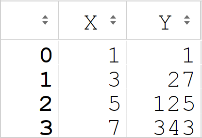
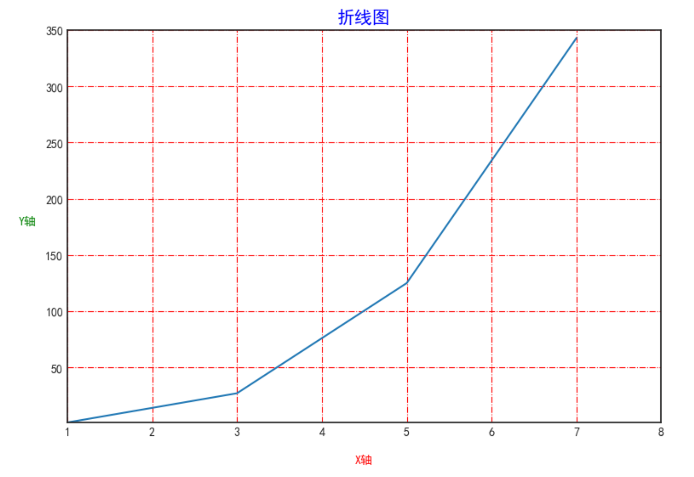
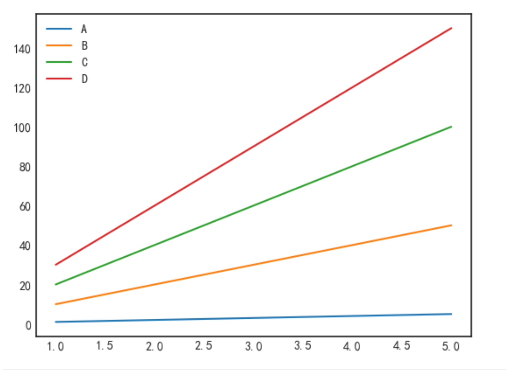
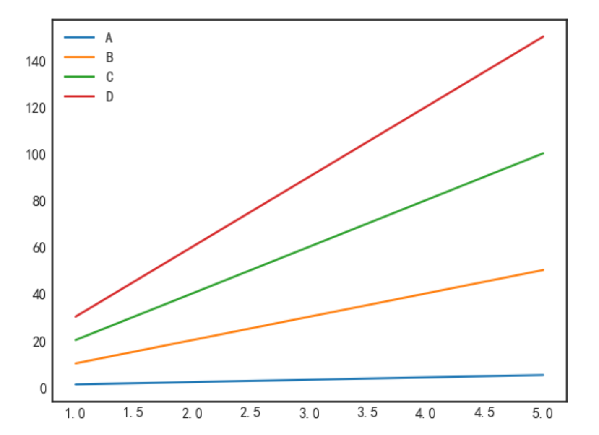
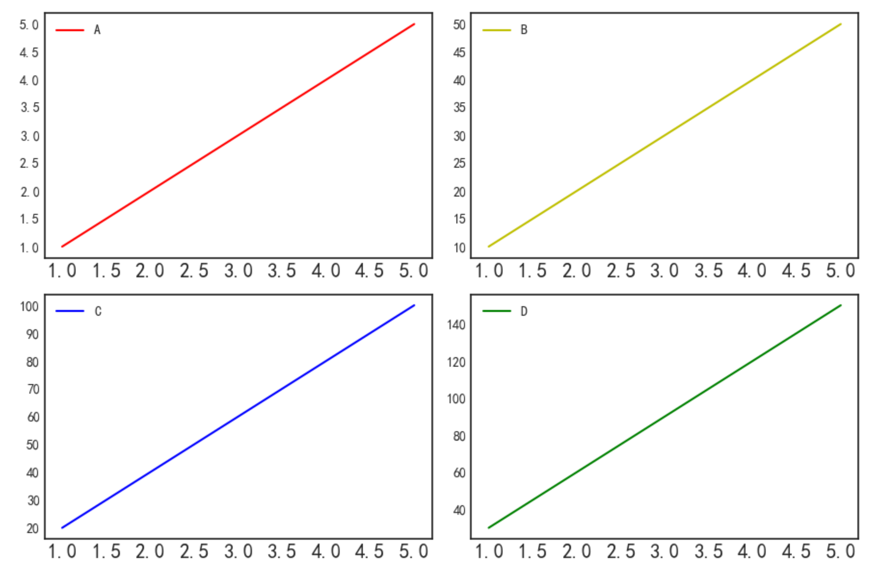
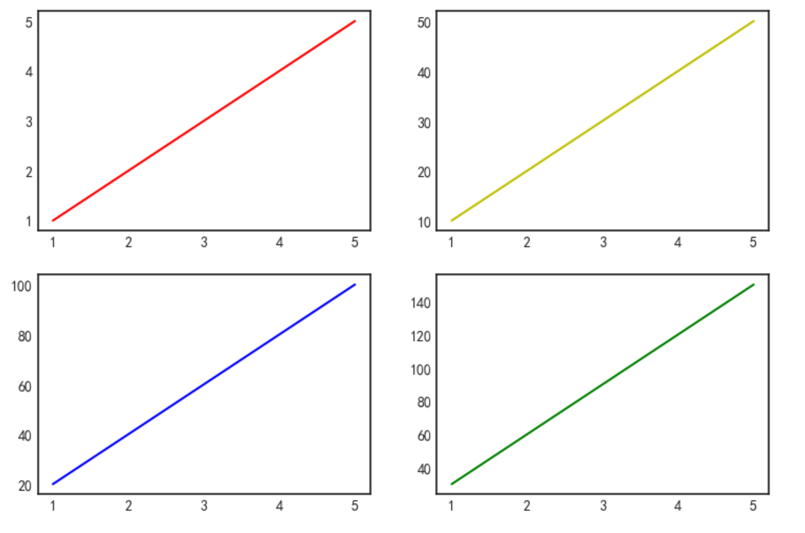
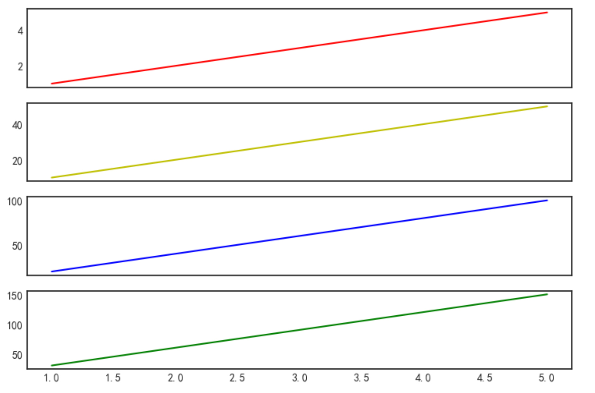
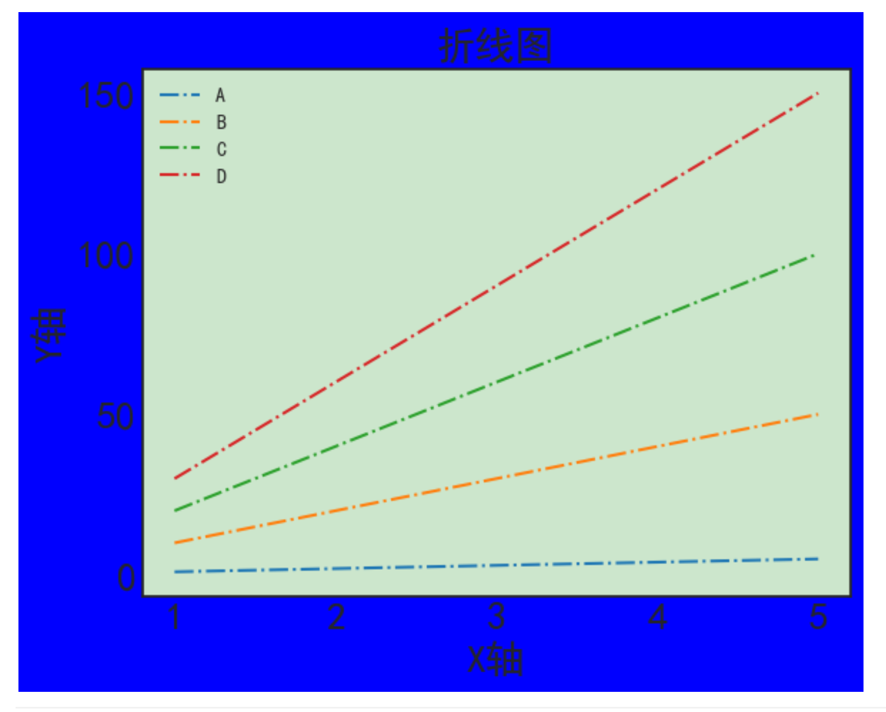

PythonMatplotlib<br />官网：[https://www.matplotlib.org.cn/](https://www.matplotlib.org.cn/)<br />Matplotlib是一个Python 2D绘图库，它以多种硬拷贝格式和跨平台的交互式环境生成出版物质量的图形。Matplotlib可用于Python脚本，Python和IPython Shell、Jupyter笔记本，Web应用程序服务器和四个图形用户界面工具包。<br />Matplotlib 尝试使容易的事情变得更容易，使困难的事情变得可能，只需几行代码就可以生成图表、直方图、功率谱、条形图、误差图、散点图等。<br />为了简单绘图，该 pyplot 模块提供了类似于MATLAB的界面，尤其是与IPython结合使用时，对于高级用户，可以通过面向对象的界面或MATLAB用户熟悉的一组功能来完全控制线型，字体属性，轴属性等。<br /><br />下面介绍matplotlib的用法，使用matplotlib除了可以作图外，还可以对于图表的参数做一些调整，使得图表更加美观，关于使用matplotlib的建议，可以做一些常用的图表模板，更换代码的数据源就可以生成图表，而不用一点一点的去调整参数。
```python
#导入模块  
import matplotlib.pyplot as plt  

#设置风格  
plt.style.use('seaborn-white')  

#中文显示问题，如果没有这段代码，图表不显示中文汉字   
plt.rcParams['font.sans-serif'] =['SimHei']
```
这里首先导入matplotlib库，并使用了seaborn-white的图表风格，可以使用plt.style.available 查看图表的风格，选择一个自己喜欢的图表风格，在图表中不能显示汉字，使用一段代码就可以显示了。
```python
#构建一个DataFrame 
import pandas as pd  
import matplotlib.pyplot as plt
  
df=pd.DataFrame({'X':[1,3,5,7]})  
df['Y']=df['X']**3  
df
```

```python
#设置图像的大小 
plt.figure(facecolor='white',figsize=(9,6),dpi=100)  
plt.plot(df['X'],df['Y'])

#设置图像的标题 
plt.title('折线图',fontsize=15,color='b') 

#设置图像的X、Y轴标题大小，颜色，与坐标轴的距离  
plt.xlabel('X轴',fontsize=10,color='r',labelpad=15)  
plt.ylabel('Y轴',fontsize=10,color='g',rotation=0,labelpad=15)   

#设置起始坐标点 
plt.xlim([1,8])  
plt.ylim([1,350]) 
#plt.xticks([1,2,3,4])只显示1,2,3,4  
#plt.yticks([50,150,250,300])只显示50,150,250,300 

#图像的网格线进行设置 
plt.grid(color='r', linestyle='-.')
```
这里首先设置图像的大小，跟画画一样，选择多大的纸张去作图，一样的道理，然后设置坐标轴，起始坐标，网格线等。<br /><br />有时候，要在一张图表上绘制多条线。
```python
#多个图的绘图方法  
import numpy as np  
import matplotlib.pyplot as plt  

x=np.array([1,3,5])  
y1=x  
y2=x * 10  
y3=x * 20  
y4=x * 30
```
可以在一个`plt.plot`命令后继续加另一个`plt.plot`命令，可以在一张图上做另一条线。
```python
plt.figure(facecolor='white')  
plt.plot(x,y1,label='A')  
plt.plot(x,y2,label='B')  
plt.plot(x,y3,label='C')  
plt.plot(x,y4,label='D')   

plt.legend()#显示图例
```
<br />使用`plt.subplots`命令也可以作出同样的图。
```python
#使用面向对象绘图  
fig,ax=plt.subplots(facecolor='white')  
plt.plot(x,y1,label='A')  
plt.plot(x,y2,label='B')  
plt.plot(x,y3,label='C')  
plt.plot(x,y4,label='D')   

plt.legend()#显示图例
```

<a name="CZHyA"></a>
## 多表绘制
下面介绍在一张图表的不同位置绘制不同的线型，使用plt.subplot命令首先确定绘图的位置，比如`plt.subplot(223)`表示在2*2分布的图表中第三个位置，其余的绘图命令相似。
```python
plt.figure(facecolor='white',figsize=(9,6)) 

plt.subplot(221)  
plt.plot(x,y1,label='A',color='r')  
plt.xticks(fontsize=15)  
plt.legend()#显示图例   

plt.subplot(222)  
plt.plot(x,y2,label='B',color='y')  
plt.xticks(fontsize=15)  
plt.legend()#显示图例   

plt.subplot(223)  
plt.plot(x,y3,label='C',color='b')  
plt.xticks(fontsize=15)  
plt.legend()#显示图例 
  
plt.subplot(224)  
plt.plot(x,y4,label='D',color='g')  
plt.xticks(fontsize=15)  
plt.legend()#显示图例   

plt.tight_layout()#密集显示
```
<br />除了使用`plt.subplot`命令确定绘图区域外，还可以用`axs[ ]`命令绘图，这种绘图方式是面向对象的绘图方式。
```python
#面向对象绘制多图  
fig,axs=plt.subplots(2,2,facecolor='white',figsize=(9,6))  

axs[0,0].plot(x,y1,label='A',color='r')  
axs[0,1].plot(x,y2,label='B',color='y')  
axs[1,0].plot(x,y3,label='C',color='b')  
axs[1,1].plot(x,y4,label='D',color='g')
```
<br />有时候绘制多张表时需共享一个坐标轴，可以使用sharex='all'命令。
```python
#sharex='all'共享X轴  
fig,axs=plt.subplots(4,1,facecolor='white', figsize=(9,6), sharex='all')   
axs[0].plot(x,y1,label='A',color='r')  
axs[1].plot(x,y2,label='B',color='y')  
axs[2].plot(x,y3,label='C',color='b')  
axs[3].plot(x,y4,label='D',color='g')
```

<a name="aXAq2"></a>
## 设置全局变量
使用`plt.rcParams`命令对全局变量设置，包括字符显示、中文显示、背景颜色、标题大小、坐标轴字体大小，线型等。
```python
#导入模块  
import matplotlib.pyplot as plt  

#设置风格  
plt.style.use('seaborn-white')  

#设置全局变量  
plt.rcParams['axes.unicode_minus'] = False #字符显示 
plt.rcParams['font.sans-serif'] =['SimHei'] #中文显示  
plt.rcParams['figure.facecolor'] = 'b' #设置图表背景颜色 
plt.rcParams['axes.facecolor'] = (0.8,0.9,0.8) #设置RGB颜色  
plt.rcParams['axes.titlesize'] = 20 #设置标题大小  
plt.rcParams['axes.labelsize'] = 20 #设置轴大小  
plt.rcParams['xtick.labelsize'] = 20 #设置X坐标大小  
plt.rcParams['ytick.labelsize'] = 20 #设置Y坐标大小  
plt.rcParams['lines.linestyle'] = '-.' #设置线型  

plt.plot(x,y1,label='A')  
plt.plot(x,y2,label='B')  
plt.plot(x,y3,label='C')  
plt.plot(x,y4,label='D')   
plt.title('折线图')  
plt.xlabel('X轴')  
plt.ylabel('Y轴')  
plt.legend()#显示图例
```
下图就是通过设置全局变量做的图，对于其他图表全局变量的设置，大家可以探索，做出更好看的图表。<br />
