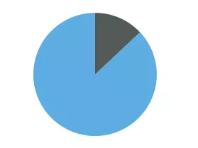
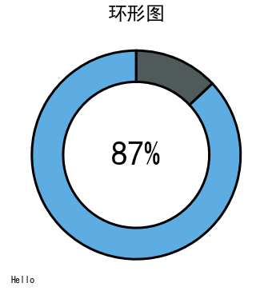
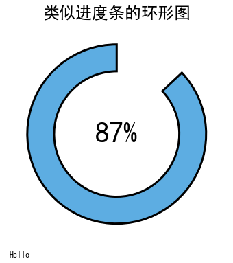
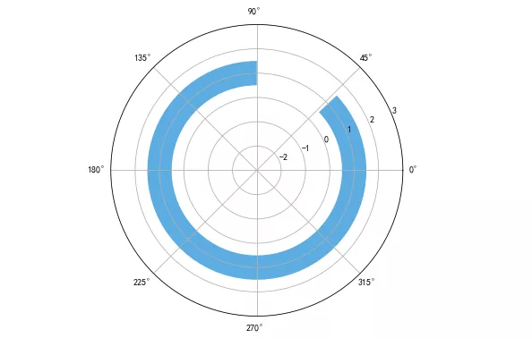
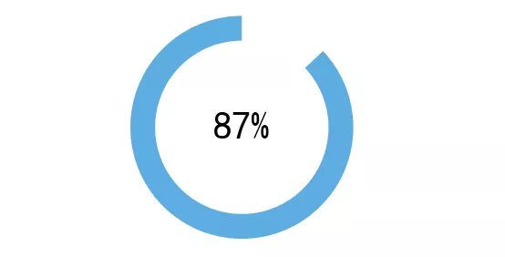
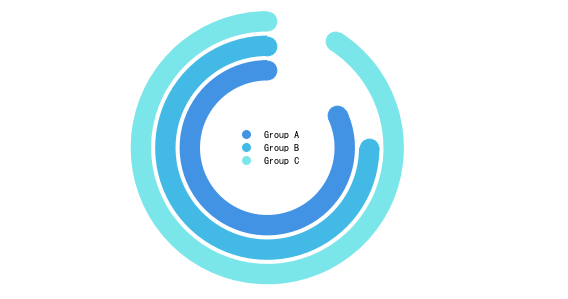

Python Matplotlib 可视化<br />环形图，也被称为圆环图。它在功能上与饼图相同，只是中间有一个空白，并且能够同时支持多个统计数据。与标准饼图相比，环形图提供了一个更好的数据强度，因为空白中心可以用来显示额外的、相关的数据。<br /><br />使用场景：适合展示分类的占比情况，不适合展示分类过多（超过9条数据）或者差别不明显的场景。<br />这里介绍两种使用 Matplotlib 绘制环形图的方法。一种是使用饼图和参数 wedgeprops 的简单方法；另一种是使用极坐标轴和水平条形图的方法。
<a name="H5Uzj"></a>
## 方法一：饼图
Matplotlib 中没有绘制环形图的方法，但是可以使用参数 wedgeprops 快速转换饼图为环形图。<br />下面，先绘制一个简单的让小号用一个简单的饼图。
```python
import matplotlib.pyplot as plt
plt.pie([87,13], startangle=90, colors=['#5DADE2', '#515A5A'])
plt.show()
```
<br />接下来，可以添加参数 wedgeprops ，并定义边缘的宽度。
```python
fig, ax = plt.subplots(figsize=(6, 6))
 
ax.pie([87,13], 
       wedgeprops={'width':0.3}, 
       startangle=90, 
       colors=['#5DADE2', '#515A5A'])
```
<br />是不是非常简单，其实还可以添加一些文字，使得数据可视化更有表现力。
```python
fig, ax = plt.subplots(figsize=(6, 6))
wedgeprops = {'width':0.3, 'edgecolor':'black', 'linewidth':3}
ax.pie([87,13], wedgeprops=wedgeprops, startangle=90, colors=['#5DADE2', '#515A5A'])
plt.title('环形图', fontsize=24, loc='center')
plt.text(0, 0, "87%", ha='center', va='center', fontsize=42)
plt.text(-1.2, -1.2, "来源: Thiago Carvalho", ha='left', va='center', fontsize=12)
```
<br />为了支持中文，需要增加这两行Python代码。
```python
plt.rcParams['font.sans-serif'] = ['SimHei']  # 用来正常显示中文标签
plt.rcParams['axes.unicode_minus'] = False  # 用来正常显示负号
```
当要显示简单的比例时，环形图特别有用。<br />圆环图最适合用来展示进度条！而要制作类似进度条一样的圆环图，可以可以进一步简化图表。
```python
fig, ax = plt.subplots(figsize=(6, 6))
data = [87, 13]
wedgeprops = {'width': 0.3, 'edgecolor': 'black', 'lw': 3}
patches, _ = ax.pie(data, wedgeprops=wedgeprops, startangle=90, colors=['#5DADE2', 'white'])
patches[1].set_zorder(0)
patches[1].set_edgecolor('white')
plt.title('类似进度条的环形图', fontsize=24, loc='center')
plt.text(0, 0, f"{data[0]}%", ha='center', va='center', fontsize=42)
plt.text(-1.2, -1.3, "来源: Thiago Carvalho", ha='left', va='top', fontsize=12)
```

<a name="qR6Cx"></a>
## 方法二：条形图
相对于前一个方法，该方案较为复杂，但也提供了更多的自定义选项。<br />先从绘制基础图形开始。
```python
fig, ax = plt.subplots(figsize=(6, 6), subplot_kw={'projection':'polar'})
data = 87 
startangle = 90
x = (data * pi *2)/ 100
left = (startangle * pi *2)/ 360 # 转换起始角度
ax.barh(1, x, left=left, height=1, color='#5DADE2')
plt.ylim(-3, 3)
```
<br />如果想制作成前面一样的进度条，还需要进行更多的操作。
```python
fig, ax = plt.subplots(figsize=(6, 6), subplot_kw={'projection':'polar'})
data = 87
startangle = 90
x = (data * pi *2)/ 100
left = (startangle * pi *2)/ 360 #控制起始位置
plt.xticks([])
plt.yticks([])
ax.spines.clear()
ax.barh(1, x, left=left, height=1, color='#5DADE2') 
plt.ylim(-3, 3)
plt.text(0, -3, "87%", ha='center', va='center', fontsize=42)
```
<br />使用这种方法的话，拥有更多的自定义选择。比如可以添加多个进度条、定义它们之间的距离等等。
```python
# 在末尾标出线条和点来使它们变圆
for i, x in enumerate(xs):
    ax.barh(ys[i], x, left=left, height=1, color=colors[i])
    ax.scatter(x+left, ys[i], s=350, color=colors[i], zorder=2)
    ax.scatter(left, ys[i], s=350, color=colors[i], zorder=2)

plt.ylim(-4, 4)

legend_elements = [Line2D([0], [0], marker='o', color='w', label='Group A', markerfacecolor='#4393E5', markersize=10),
                   Line2D([0], [0], marker='o', color='w', label='Group B',
                          markerfacecolor='#43BAE5', markersize=10),
                   Line2D([0], [0], marker='o', color='w', label='Group C', markerfacecolor='#7AE6EA', markersize=10)]
ax.legend(handles=legend_elements, loc='center', frameon=False)

plt.xticks([])
plt.yticks([])
ax.spines.clear()
```

