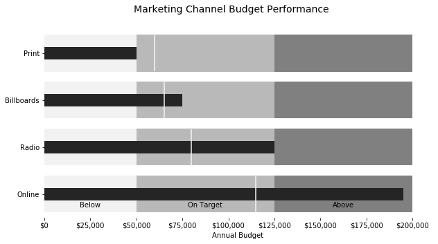
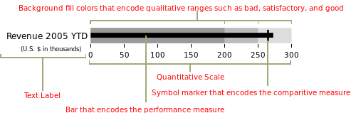
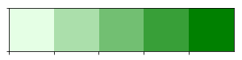
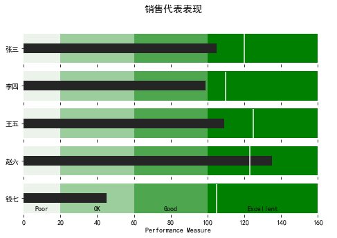
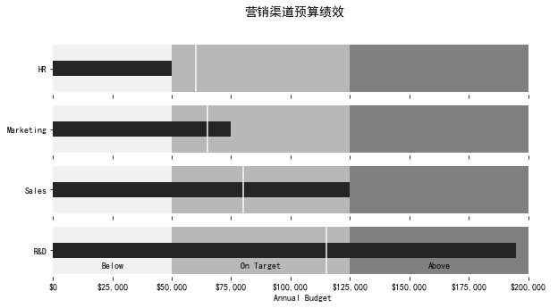

Python<br />Python 的应用是非常广泛的，通过 matplotlib 库学习下如何制作精美的子弹图<br />
<a name="Rx7Tr"></a>
## 1、什么是子弹图
一个子弹图约定俗成的定义<br />子弹图使用长度/高度、位置和颜色对数据进行编码，以显示与目标和性能带相比的实际情况<br />先来看下子弹图大概长什么样子<br /><br />子弹图具有单一的主要度量（例如，当前年初至今的收入），将该度量与一个或多个其他度量进行比较以丰富其含义（例如，与目标相比），并将其显示在性能的定性范围的背景，例如差、满意和好。定性范围显示为单一色调的不同强度，使色盲者可以辨别它们，并将仪表板上的颜色使用限制在最低限度<br />好了，差不多这就是子弹图的应用场景和绘制标准了，下面就开始制作吧
<a name="n0B5y"></a>
## 2、构建图表
思路大致是，可以使用堆叠条形图来表示各种范围，并使用另一个较小的条形图来表示值，最后，用一条垂直线标记目标<br />可以看出，需要多个组件图层，使用 matplotlib 来实现会比较方便
```python
import matplotlib.pyplot as plt
import seaborn as sns
from matplotlib.ticker import FuncFormatter

%matplotlib inline
```
这里还导入了 Seaborn，是因为 Seaborn 有一些非常有用的工具来管理调色板，利用这种功能比尝试以其他方式复制它更容易<br />需要生成调色板的主要原因是很可能希望为各种定性范围生成视觉上吸引人的配色方案，直接使用 seaborn 来完成会方便很多<br />在下面的例子中，可以使用 palplot 便利函数来显示 5 种绿色色调的调色板
```python
sns.palplot(sns.light_palette("green", 5))
```

```python
sns.palplot(sns.light_palette("purple",8, reverse=True))
```
以相反的顺序制作 8 种不同深浅的紫色<br /><br />现在知道了如何设置调色板，接下来使用 Matplotlib 根据上面列出的原则创建一个简单的子弹图<br />首先，定义要绘制的值
```python
limits = [80, 100, 150]
data_to_plot = ("Example 1", 105, 120)
```
这个将创建 3 个范围：0-80、81-100、101-150 和一个值为 105 和目标线为 120 的“示例”线 接下来，构建一个蓝色调色板：
```python
palette = sns.color_palette("Blues_r", len(limits))
```
接下来是构建范围的堆积条形图：
```python
fig, ax = plt.subplots()
ax.set_aspect('equal')
ax.set_yticks([1])
ax.set_yticklabels([data_to_plot[0]])

prev_limit = 0
for idx, lim in enumerate(limits):
    ax.barh([1], lim-prev_limit, left=prev_limit, height=15, color=palette[idx])
    prev_limit = lim
```
<br />然后可以添加一个较小的条形图来表示 105 的值：
```python
ax.barh([1], data_to_plot[1], color='black', height=5)
```
<br />已经初见雏形了<br />最后一步是使用 axvline 添加目标标记：
```python
ax.axvline(data_to_plot[2], color="gray", ymin=0.10, ymax=0.9)
```
<br />上面就完成了子弹图的简单制作，但是所有的测试数值都是写死的，下面编写一个可以填写任意数值的代码
<a name="WSOEn"></a>
## 3、最终代码
```python
def bulletgraph(data=None, limits=None, labels=None, axis_label=None, title=None,
                size=(5, 3), palette=None, formatter=None, target_color="gray",
                bar_color="black", label_color="gray"):
    # Determine the max value for adjusting the bar height
    # Dividing by 10 seems to work pretty well
    h = limits[-1] / 10

    # Use the green palette as a sensible default
    if palette is None:
        palette = sns.light_palette("green", len(limits), reverse=False)

    # Must be able to handle one or many data sets via multiple subplots
    if len(data) == 1:
        fig, ax = plt.subplots(figsize=size, sharex=True)
    else:
        fig, axarr = plt.subplots(len(data), figsize=size, sharex=True)

    # Add each bullet graph bar to a subplot
    for idx, item in enumerate(data):

        # Get the axis from the array of axes returned when the plot is created
        if len(data) > 1:
            ax = axarr[idx]

        # Formatting to get rid of extra marking clutter
        ax.set_aspect('equal')
        ax.set_yticklabels([item[0]])
        ax.set_yticks([1])
        ax.spines['bottom'].set_visible(False)
        ax.spines['top'].set_visible(False)
        ax.spines['right'].set_visible(False)
        ax.spines['left'].set_visible(False)

        prev_limit = 0
        for idx2, lim in enumerate(limits):
            # Draw the bar
            ax.barh([1], lim - prev_limit, left=prev_limit, height=h,
                    color=palette[idx2])
            prev_limit = lim
        rects = ax.patches
        # The last item in the list is the value we're measuring
        # Draw the value we're measuring
        ax.barh([1], item[1], height=(h / 3), color=bar_color)

        # Need the ymin and max in order to make sure the target marker
        # fits
        ymin, ymax = ax.get_ylim()
        ax.vlines(
            item[2], ymin * .9, ymax * .9, linewidth=1.5, color=target_color)

    # Now make some labels
    if labels is not None:
        for rect, label in zip(rects, labels):
            height = rect.get_height()
            ax.text(
                rect.get_x() + rect.get_width() / 2,
                -height * .4,
                label,
                ha='center',
                va='bottom',
                color=label_color)
    if formatter:
        ax.xaxis.set_major_formatter(formatter)
    if axis_label:
        ax.set_xlabel(axis_label)
    if title:
        fig.suptitle(title, fontsize=14)
    fig.subplots_adjust(hspace=0)
```
代码虽然看起来有点长，但是其实都是上面步骤的叠加，都比较简单，就不再重复说明了<br />直接调用一下看看效果
```python
data_to_plot2 = [("张三", 105, 120),
                 ("李四", 99, 110),
                 ("王五", 109, 125),
                 ("赵六", 135, 123),
                 ("钱七", 45, 105)]

bulletgraph(data_to_plot2, limits=[20, 60, 100, 160],
            labels=["Poor", "OK", "Good", "Excellent"], size=(8,5),
            axis_label="Performance Measure", label_color="black",
            bar_color="#252525", target_color='#f7f7f7',
            title="销售代表表现")
```
<br />还可以进行一些优化，格式化 x 轴以便更一致地显示信息<br />在下面这个例子中，可以衡量一家假设公司的营销预算绩效
```python
def money(x, pos):
    'The two args are the value and tick position'
    return "${:,.0f}".format(x)

money_fmt = FuncFormatter(money)
data_to_plot3 = [("HR", 50000, 60000),
                 ("Marketing", 75000, 65000),
                 ("Sales", 125000, 80000),
                 ("R&D", 195000, 115000)]
palette = sns.light_palette("grey", 3, reverse=False)
bulletgraph(data_to_plot3, limits=[50000, 125000, 200000],
            labels=["Below", "On Target", "Above"], size=(10,5),
            axis_label="Annual Budget", label_color="black",
            bar_color="#252525", target_color='#f7f7f7', palette=palette,
            title="营销渠道预算绩效",
            formatter=money_fmt)
```

