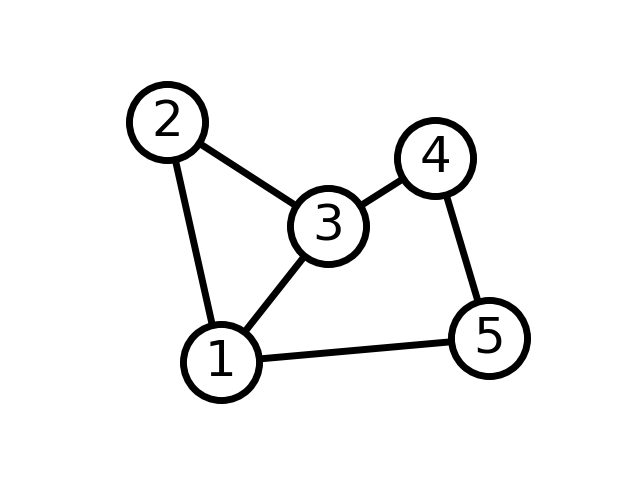
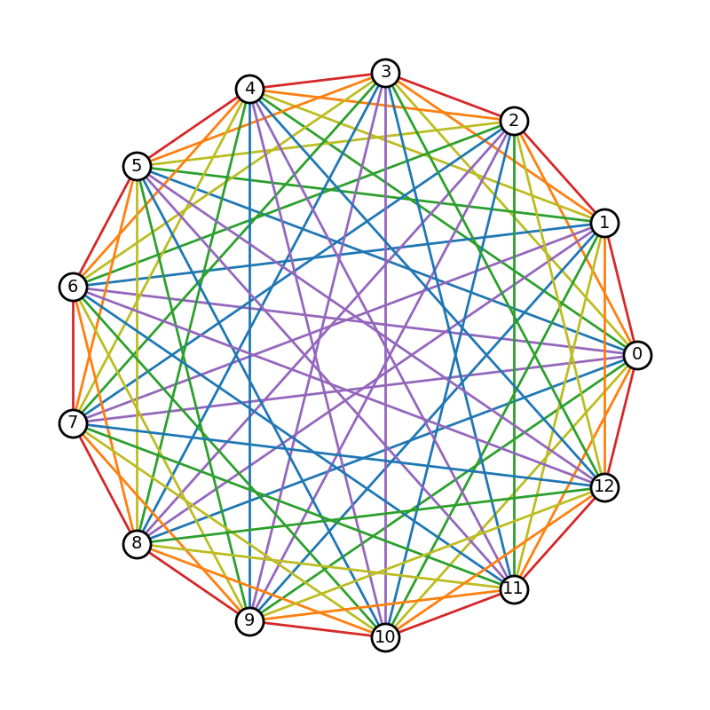
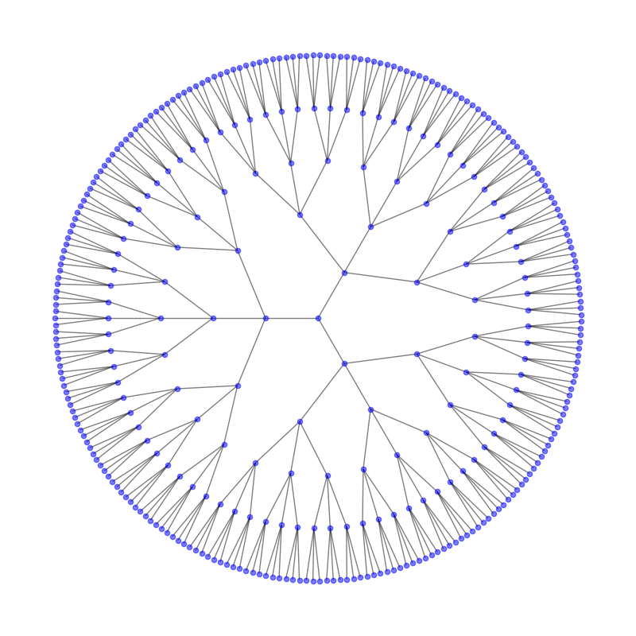
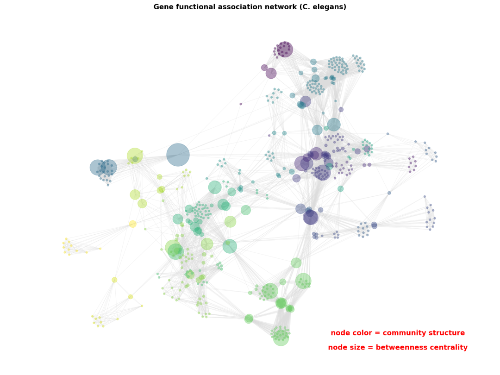
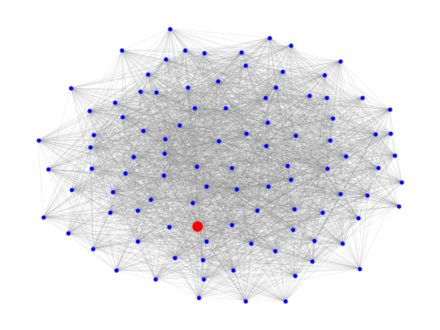
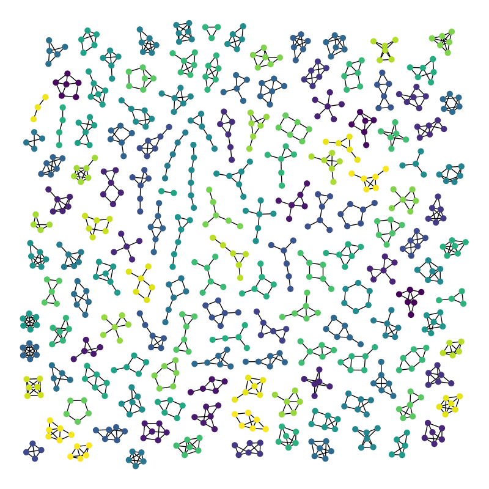

<a name="gdmEB"></a>
## Python-NetworkX包介绍
Python语言中绘制网络结构图的可视化拓展工具-NetworkX包。NetworkX提供了丰富的数据结构和函数，使得用户能够轻松地构建、分析和可视化复杂网络。
<a name="WK3ZD"></a>
### 安装 NetworkX
可以使用 pip 命令来安装 NetworkX：
```bash
pip install networkx
```
<a name="ItnuK"></a>
### 创建图结构
NetworkX 允许创建不带权重或带权重的图，有向图或无向图。例如，创建一个简单的无向图：
```python
import networkx as nx

# 创建一个无向图
G = nx.Graph()
G.add_nodes_from([1, 2, 3])
G.add_edges_from([(1, 2), (2, 3)])
```
<a name="w9ajM"></a>
### 可视化图结构
NetworkX 提供了多种方法来可视化图结构。其中，`networkx.draw()` 函数是最基本的方法：
```python
import matplotlib.pyplot as plt

# 可视化无向图
nx.draw(G, with_labels=True, node_color='skyblue', node_size=2000, font_size=20)
plt.show()
```
<a name="F8R94"></a>
### 自定义图的可视化
可以自定义图的可视化，包括节点颜色、大小、标签等。例如，设置节点颜色、标签和边的样式：
```python
# 自定义节点颜色和标签
node_color = ['red', 'green', 'blue']
labels = {1: 'Node 1', 2: 'Node 2', 3: 'Node 3'}

# 绘制自定义样式的图
nx.draw(G, with_labels=True, labels=labels, node_color=node_color, node_size=2000, font_size=20, font_color='white', edge_color='gray')
plt.show()
```
<a name="Q9yE6"></a>
### 可视化案例
```python
import networkx as nx
import matplotlib.pyplot as plt

G = nx.Graph()
G.add_edge(1, 2)
G.add_edge(1, 3)
G.add_edge(1, 5)
G.add_edge(2, 3)
G.add_edge(3, 4)
G.add_edge(4, 5)

# explicitly set positions
pos = {1: (0, 0), 2: (-1, 0.3), 3: (2, 0.17), 4: (4, 0.255), 5: (5, 0.03)}

options = {
    "font_size": 36,
    "node_size": 3000,
    "node_color": "white",
    "edgecolors": "black",
    "linewidths": 5,
    "width": 5,
}
nx.draw_networkx(G, pos, **options)

# Set margins for the axes so that nodes aren't clipped
ax = plt.gca()
ax.margins(0.20)
plt.axis("off")
plt.show()
```

```python
import matplotlib.pyplot as plt
import networkx as nx

# A rainbow color mapping using matplotlib's tableau colors
node_dist_to_color = {
    1: "tab:red",
    2: "tab:orange",
    3: "tab:olive",
    4: "tab:green",
    5: "tab:blue",
    6: "tab:purple",
}

# Create a complete graph with an odd number of nodes
nnodes = 13
G = nx.complete_graph(nnodes)

# A graph with (2n + 1) nodes requires n colors for the edges
n = (nnodes - 1) // 2
ndist_iter = list(range(1, n + 1))

# Take advantage of circular symmetry in determining node distances
ndist_iter += ndist_iter[::-1]


def cycle(nlist, n):
    return nlist[-n:] + nlist[:-n]


# Rotate nodes around the circle and assign colors for each edge based on
# node distance
nodes = list(G.nodes())
for i, nd in enumerate(ndist_iter):
    for u, v in zip(nodes, cycle(nodes, i + 1)):
        G[u][v]["color"] = node_dist_to_color[nd]

pos = nx.circular_layout(G)
# Create a figure with 1:1 aspect ratio to preserve the circle.
fig, ax = plt.subplots(figsize=(8, 8))
node_opts = {"node_size": 500, "node_color": "w", "edgecolors": "k", "linewidths": 2.0}
nx.draw_networkx_nodes(G, pos, **node_opts)
nx.draw_networkx_labels(G, pos, font_size=14)
# Extract color from edge data
edge_colors = [edgedata["color"] for _, _, edgedata in G.edges(data=True)]
nx.draw_networkx_edges(G, pos, width=2.0, edge_color=edge_colors)

ax.set_axis_off()
fig.tight_layout()
plt.show()
```

```python
import matplotlib.pyplot as plt
import networkx as nx

G = nx.balanced_tree(3, 5)
pos = nx.nx_agraph.graphviz_layout(G, prog="twopi", args="")
plt.figure(figsize=(8, 8))
nx.draw(G, pos, node_size=20, alpha=0.5, node_color="blue", with_labels=False)
plt.axis("equal")
plt.show()
```
<br />其他案例如下：<br /><br /><br /><br />更多关于NetworkX包的用法和案例可参考：**NetworkX包官网**
<a name="qb8fx"></a>
## 参考资料
**NetworkX包官网：**[**https://networkx.org/documentation/stable/index.html#**](https://networkx.org/documentation/stable/index.html#)
