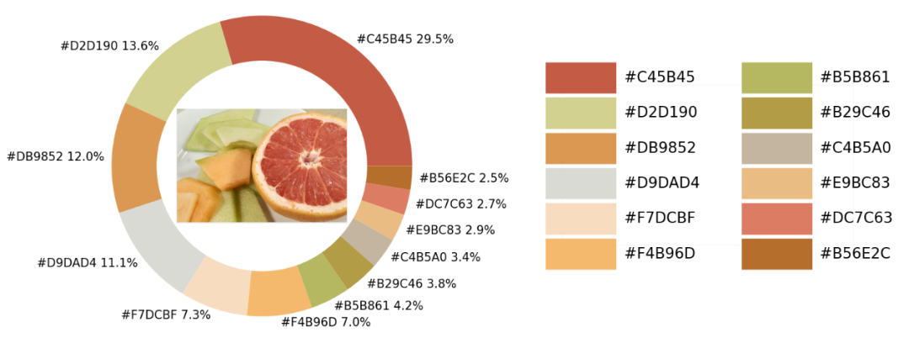
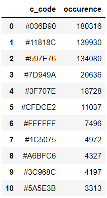
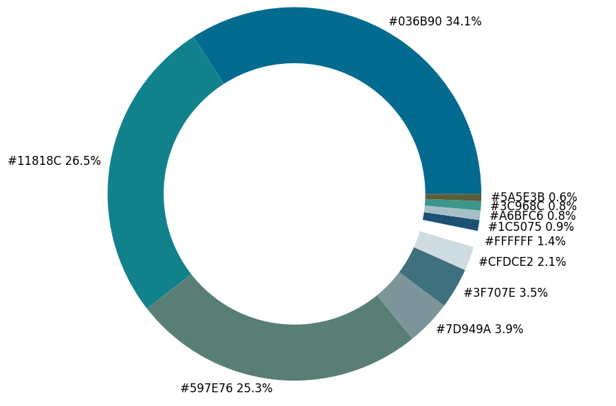
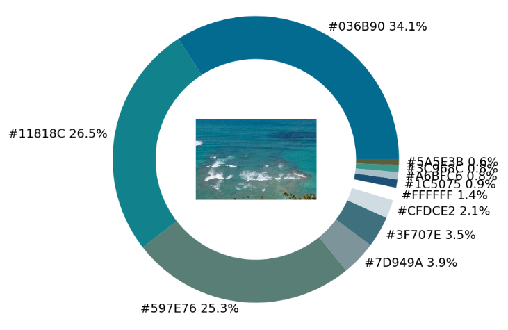
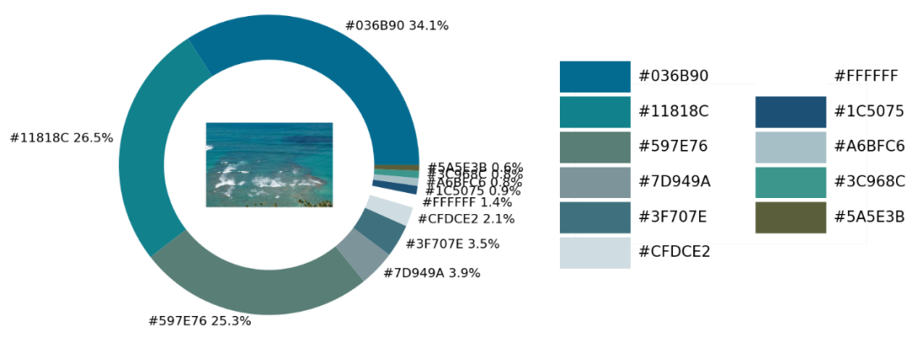

PythonMatplotlib可视化<br />分享一个有趣的可视化技巧，如何从图片中提取颜色然后绘制成可视化图表，如下图所示<br /><br />在示例照片当中有着各种各样的颜色，将通过Python中的可视化模块以及opencv模块来识别出图片当中所有的颜色要素，并且将其添加到可视化图表的配色当中
<a name="rVxwX"></a>
## 导入模块并加载图片
那么按照惯例，第一步一般都是导入模块，可视化用到的模块是matplotlib模块，将图片中的颜色抽取出来之后会保存在颜色映射表中，所以要使用到colormap模块，同样也需要导入进来
```python
import numpy as np
import pandas as pd
import matplotlib.pyplot as plt
import matplotlib.patches as patches
import matplotlib.image as mpimg

from PIL import Image
from matplotlib.offsetbox import OffsetImage, AnnotationBbox

import cv2
import extcolors
from colormap import rgb2hex
```
然后先来加载一下图片，代码如下
```python
input_name = 'test_1.png'
img = plt.imread(input_name)
plt.imshow(img)
plt.axis('off')
plt.show()
```
output<br />
<a name="CneGn"></a>
## 提取颜色并整合成表格
调用的是`extcolors`模块来从图片中提取颜色，输出的结果是RGB形式呈现出来的颜色，代码如下
```python
colors_x = extcolors.extract_from_path(img_url, tolerance=12, limit = 12)
colors_x
```
output
```python
([((3, 107, 144), 180316),
  ((17, 129, 140), 139930),
  ((89, 126, 118), 134080),
  ((125, 148, 154), 20636),
  ((63, 112, 126), 18728),
  ((207, 220, 226), 11037),
  ((255, 255, 255), 7496),
  ((28, 80, 117), 4972),
  ((166, 191, 198), 4327),
  ((60, 150, 140), 4197),
  ((90, 94, 59), 3313),
  ((56, 66, 39), 1669)],
 538200)
```
将上述的结果整合成一个DataFrame数据集，代码如下
```python
def color_to_df(input_color):
    colors_pre_list = str(input_color).replace('([(', '').split(', (')[0:-1]
    df_rgb = [i.split('), ')[0] + ')' for i in colors_pre_list]
    df_percent = [i.split('), ')[1].replace(')', '') for i in colors_pre_list]

    # 将RGB转换成十六进制的颜色
    df_color_up = [rgb2hex(int(i.split(", ")[0].replace("(", "")),
                           int(i.split(", ")[1]),
                           int(i.split(", ")[2].replace(")", ""))) for i in df_rgb]

    df = pd.DataFrame(zip(df_color_up, df_percent), columns=['c_code', 'occurence'])
    return df
```
尝试调用上面自定义的函数，输出的结果至DataFrame数据集当中
```python
df_color = color_to_df(colors_x)
df_color
```
output<br />
<a name="nJgYr"></a>
## 绘制图表
接下来便是绘制图表的阶段了，用到的是matplotlib模块，代码如下
```python
fig, ax = plt.subplots(figsize=(90,90),dpi=10)
wedges, text = ax.pie(list_precent,
					  labels= text_c,
					  labeldistance= 1.05,
					  colors = list_color,
					  textprops={'fontsize': 120, 'color':'black'}
					 )
plt.setp(wedges, width=0.3)
ax.set_aspect("equal")
fig.set_facecolor('white')
plt.show()
```
output<br /><br />从出来的饼图中显示了每种不同颜色的占比，更进一步将原图放置在圆环当中，
```python
imagebox = OffsetImage(img, zoom=2.3)
ab = AnnotationBbox(imagebox, (0, 0))
ax1.add_artist(ab)
```
output<br /><br />最后制作一张调色盘，将原图中的各种不同颜色都罗列开来，代码如下
```python
## 调色盘
x_posi, y_posi, y_posi2 = 160, -170, -170
for c in list_color:
    if list_color.index(c) <= 5:
        y_posi += 180
        rect = patches.Rectangle((x_posi, y_posi), 360, 160, facecolor = c)
        ax2.add_patch(rect)
        ax2.text(x = x_posi+400, y = y_posi+100, s = c, fontdict={'fontsize': 190})
    else:
        y_posi2 += 180
        rect = patches.Rectangle((x_posi + 1000, y_posi2), 360, 160, facecolor = c)
        ax2.add_artist(rect)
        ax2.text(x = x_posi+1400, y = y_posi2+100, s = c, fontdict={'fontsize': 190})

ax2.axis('off')
fig.set_facecolor('white')
plt.imshow(bg)       
plt.tight_layout()
```
output<br />
<a name="iaM1i"></a>
## 实战环节
这一块儿是实战环节，将上述所有的代码封装成一个完整的函数
```python
def exact_color(input_image, resize, tolerance, zoom):
    
    output_width = resize
    img = Image.open(input_image)
    if img.size[0] >= resize:
        wpercent = (output_width/float(img.size[0]))
        hsize = int((float(img.size[1])*float(wpercent)))
        img = img.resize((output_width,hsize), Image.ANTIALIAS)
        resize_name = 'resize_'+ input_image
        img.save(resize_name)
    else:
        resize_name = input_image
    
    fig.set_facecolor('white')
    ax2.axis('off')
    bg = plt.imread('bg.png')
    plt.imshow(bg)       
    plt.tight_layout()
    return plt.show()
    
exact_color('test_2.png', 900, 12, 2.5)
```
output<br />
