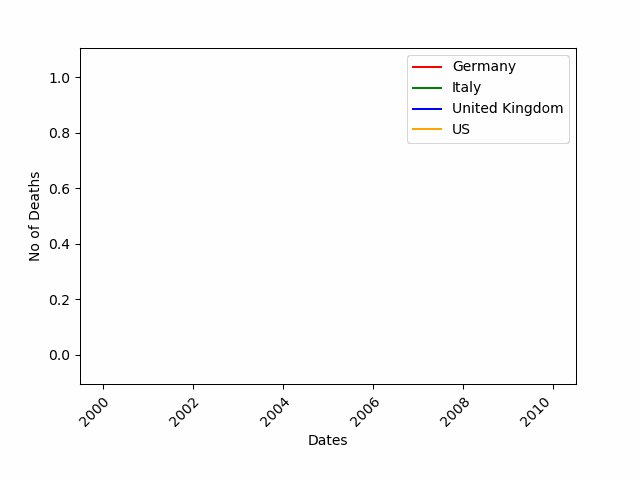
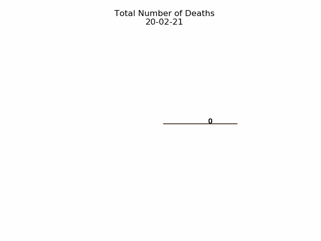

Python 可视化动图 Matplotlib FuncAnimation
<a name="9y4Wy"></a>
## FuncAnimation
<a name="M5YjP"></a>
### FuncAnimation说明
Matplotlib 是一个基于 Python 的开源数据绘图包，仅需几行代码就可以帮助开发者生成直方图、功率谱、条形图、散点图等。这个库里有个非常实用的扩展包——FuncAnimation，它可以让静态图表动起来。<br />FuncAnimation 是 Matplotlib 库中 Animation 类的一部分，后续会展示多个示例。如果是首次接触，可以将这个函数简单地理解为一个 While 循环，不停地在 “画布” 上重新绘制目标数据图。
<a name="MeD1M"></a>
### FuncAnimation函数API参考
FuncAnimation API更多参考：[https://matplotlib.org/3.1.1/api/animation_api.html](https://matplotlib.org/3.1.1/api/animation_api.html)
<a name="heimn"></a>
### 使用 FuncAnimation
这个过程始于以下两行代码：
```python
import matplotlib.animation as ani
animator = ani.FuncAnimation(fig, chartfunc, interval = 100)
```
从中可以看到 FuncAnimation 的几个输入：

- fig 是用来 「绘制图表」的 figure 对象；
- chartfunc 是一个以数字为输入的函数，其含义为时间序列上的时间；
- interval 这个更好理解，是帧之间的间隔延迟，以毫秒为单位，默认值为 200。

这是三个关键输入，当然还有更多可选输入，感兴趣的读者可查看原文档，这里不再赘述。<br />下一步要做的就是将数据图表参数化，从而转换为一个函数，然后将该函数时间序列中的点作为输入，设置完成后就可以正式开始了。<br />在开始之前依旧需要确认你是否对基本的数据可视化有所了解。也就是说，先要将数据进行可视化处理，再进行动态处理。<br />按照以下代码进行基本调用。另外，这里将采用大型流行病的传播数据作为案例数据（包括每天的死亡人数）。
```python
import matplotlib.animation as ani
import matplotlib.pyplot as plt
import numpy as np
import pandas as pdurl = 'https://raw.githubusercontent.com/CSSEGISandData/COVID-19/master/csse_covid_19_data/csse_covid_19_time_series/time_series_covid19_deaths_global.csv'
df = pd.read_csv(url, delimiter=',', header='infer')df_interest = df.loc[
    df['Country/Region'].isin(['United Kingdom', 'US', 'Italy', 'Germany'])
    & df['Province/State'].isna()]df_interest.rename(
    index=lambda x: df_interest.at[x, 'Country/Region'], inplace=True)
df1 = df_interest.transpose()df1 = df1.drop(['Province/State', 'Country/Region', 'Lat', 'Long'])
df1 = df1.loc[(df1 != 0).any(1)]
df1.index = pd.to_datetime(df1.index)
```
<a name="48924ecf"></a>
## 绘制三种常见动态图表
<a name="GGwJk"></a>
### 绘制动态线型图
<br />如下所示，首先需要做的第一件事是定义图的各项，这些基础项设定之后就会保持不变。它们包括：创建 figure 对象，x 标和 y 标，设置线条颜色和 figure 边距等：
```python
import numpy as np
import matplotlib.pyplot as pltcolor = ['red', 'green', 'blue', 'orange']
fig = plt.figure()
plt.xticks(rotation=45, ha="right", rotation_mode="anchor") #rotate the x-axis values
plt.subplots_adjust(bottom = 0.2, top = 0.9) #ensuring the dates (on the x-axis) fit in the screen
plt.ylabel('No of Deaths')
plt.xlabel('Dates')
```
接下来设置 curve 函数，进而使用 .FuncAnimation 让它动起来：
```python
def buildmebarchart(i=int):
    plt.legend(df1.columns)
    p = plt.plot(df1[:i].index, df1[:i].values) #note it only returns the dataset, up to the point i
    for i in range(0,4):
        p[i].set_color(color[i]) #set the colour of each curveimport matplotlib.animation as ani
animator = ani.FuncAnimation(fig, buildmebarchart, interval = 100)
plt.show()
```
<a name="a08e1f02"></a>
### 动态饼状图
<br />可以观察到，其代码结构看起来与线型图并无太大差异，但依旧有细小的差别。
```python
import numpy as np
import matplotlib.pyplot as pltfig,ax = plt.subplots()
explode=[0.01,0.01,0.01,0.01] #pop out each slice from the piedef getmepie(i):
    def absolute_value(val): #turn % back to a number
        a  = np.round(val/100.*df1.head(i).max().sum(), 0)
        return int(a)
    ax.clear()
    plot = df1.head(i).max().plot.pie(y=df1.columns,autopct=absolute_value, label='',explode = explode, shadow = True)
    plot.set_title('Total Number of Deaths\n' + str(df1.index[min( i, len(df1.index)-1 )].strftime('%y-%m-%d')), fontsize=12)import matplotlib.animation as ani
animator = ani.FuncAnimation(fig, getmepie, interval = 200)
plt.show()
```
主要区别在于，动态饼状图的代码每次循环都会返回一组数值，但在线型图中返回的是所在点之前的整个时间序列。返回时间序列通过 `df1.head(i)` 来实现，而`.max()`则保证了仅获得最新的数据，因为流行病导致死亡的总数只有两种变化：维持现有数量或持续上升。
```python
df1.head(i).max()
```
<a name="080cd8ac"></a>
### 动态条形图
<br />创建动态条形图的难度与上述两个案例并无太大差别。在这个案例中，作者定义了水平和垂直两种条形图，读者可以根据自己的实际需求来选择图表类型并定义变量栏。
```python
fig = plt.figure()
bar = ''def buildmebarchart(i=int):
    iv = min(i, len(df1.index)-1) #the loop iterates an extra one time, which causes the dataframes to go out of bounds. This was the easiest (most lazy) way to solve this :)
    objects = df1.max().index
    y_pos = np.arange(len(objects))
    performance = df1.iloc[[iv]].values.tolist()[0]
    if bar == 'vertical':
        plt.bar(y_pos, performance, align='center', color=['red', 'green', 'blue', 'orange'])
        plt.xticks(y_pos, objects)
        plt.ylabel('Deaths')
        plt.xlabel('Countries')
        plt.title('Deaths per Country \n' + str(df1.index[iv].strftime('%y-%m-%d')))
    else:
        plt.barh(y_pos, performance, align='center', color=['red', 'green', 'blue', 'orange'])
        plt.yticks(y_pos, objects)
        plt.xlabel('Deaths')
        plt.ylabel('Countries')animator = ani.FuncAnimation(fig, buildmebarchart, interval=100)plt.show()
```
在制作完成后，存储这些动态图就非常简单了，可直接使用以下代码：
```python
animator.save(r'C:\temp\myfirstAnimation.gif')
```
感兴趣的读者如想获得详细信息可参考：[https://matplotlib.org/3.1.1/api/animation_api.html](https://matplotlib.org/3.1.1/api/animation_api.html)。
