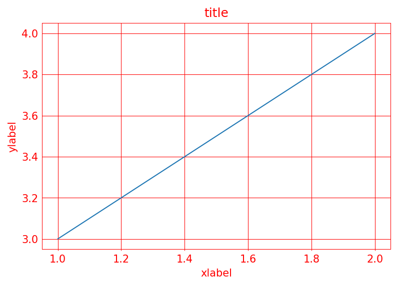
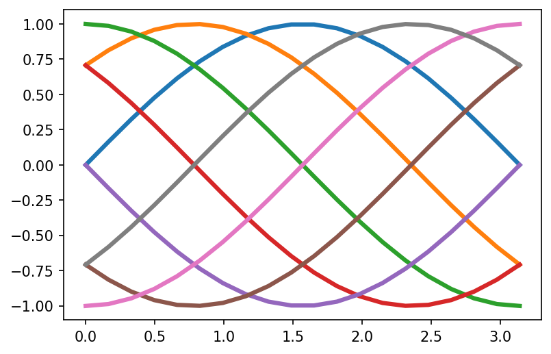
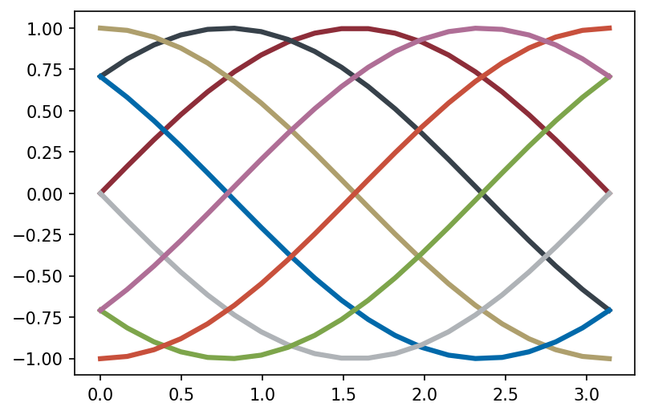
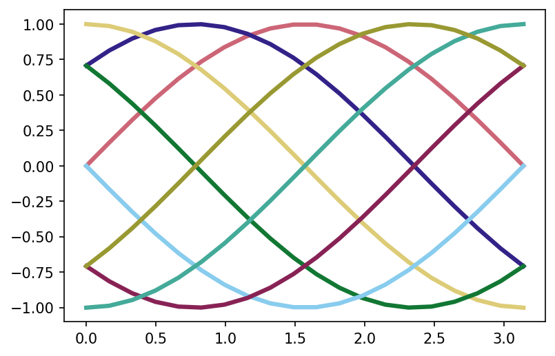
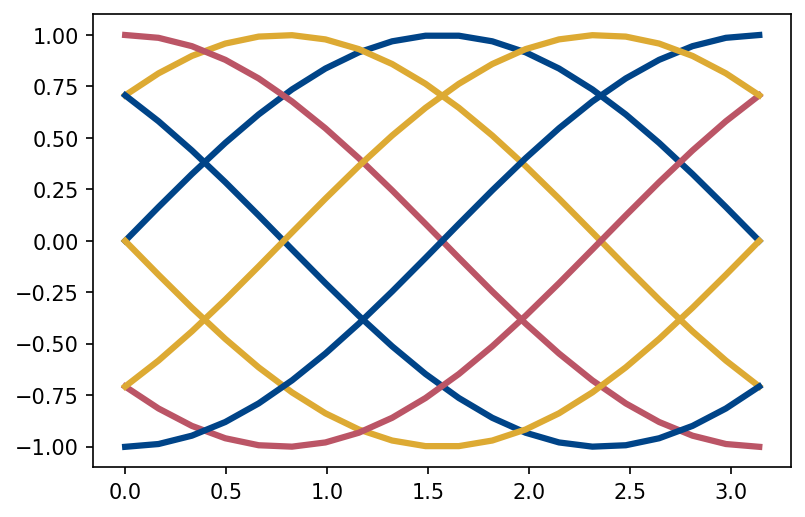
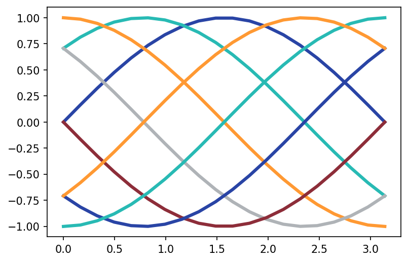
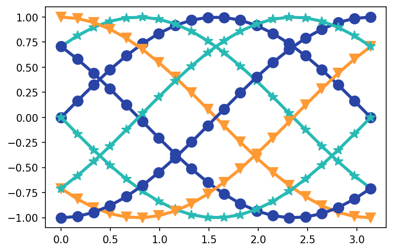
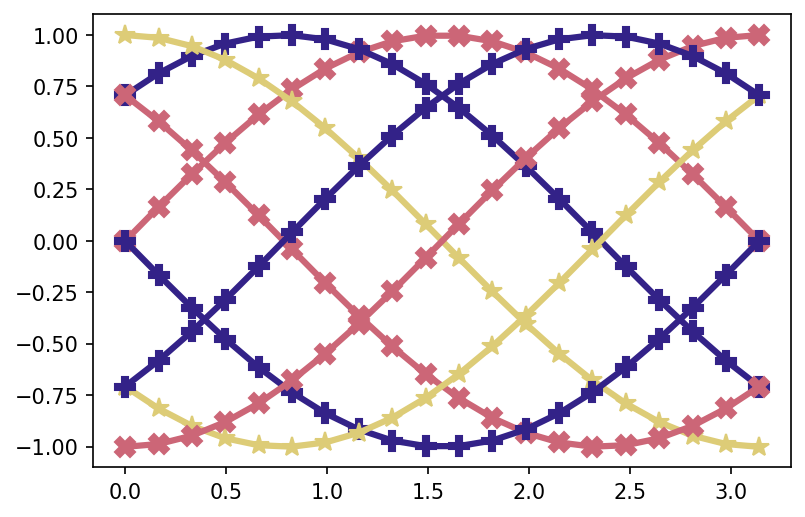
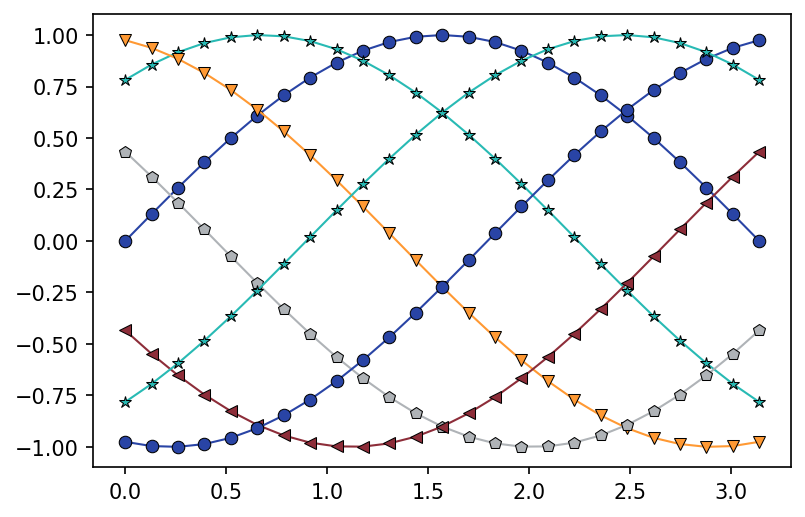
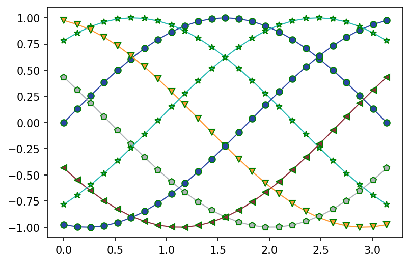

Python<br />一个好用的Python绘图拓展工具-TUEplots，可以帮助使用者轻松将绘图结果调整成符合出版级别的可视化结果。<br />**TUEplots** 是 matplotlib 的一个轻量级扩展绘图工具，可将图形尺寸调整为更适合科学出版物的格式。它能生成与 matplotlib的rcParams兼容的配置，并为多种出版物格式提供字体、图形大小、字号、配色方案等。除此之外，TUEplots还捆绑了一些期刊的预设图形样式，如下：

- Conference on Neural Information Processing Systems (NeurIPS)
- International Conference on Artificial Intelligence and Statistics (AISTATS)
- International Conference on Learning Representations (ICLR)
- International Conference on Machine Learning (ICML)
- Conference on Uncertainty in Artificial Intelligence (UAI)
- Journal of Machine Learning Research (JMLR)
<a name="HkWoy"></a>
## 安装
可使用pip对TUEplots包进行安装。如下：
```bash
pip install tueplots
```
安装最新版本可使用如下语句：
```bash
pip install git+https://github.com/pnkraemer/tueplots.git
```
<a name="W0cMC"></a>
## 绘图案例
<a name="qbx1V"></a>
### 子图样式
可通过如下语句对matplotlib子图样式进行修改：
```python
import matplotlib.pyplot as plt

plt.rcParams.update(axes.color(base="red"))
fig, ax = plt.subplots()
ax.plot([1.0, 2.0], [3.0, 4.0], label="ABC")
ax.set_xlabel("xlabel")
ax.set_ylabel("ylabel")
ax.set_title("title")
plt.grid()
plt.show()
```

<a name="kihZM"></a>
### 使用内置捆绑样式
```python
with plt.rc_context({**bundles.icml2022(), **axes.lines()}):
    fig, ax = plt.subplots()
    ax.plot([1.0, 2.0], [3.0, 4.0], label="p(x)")
    ax.set_title("Title")
    ax.set_xlabel("xlabel $\int f(x) dx$")
    ax.set_ylabel("ylabel $x \sim \mathcal{N}(x)$")
    plt.grid()
    plt.legend()
    plt.show()
```
图形样式")
<a name="B9aJd"></a>
### 颜色色系样式
通过tueplots包中的cycler、palettes等属性，可以轻松修改Matplotlib默认的色系：
```python
import matplotlib.pyplot as plt
import numpy as np

from tueplots import cycler
from tueplots.constants import markers
from tueplots.constants.color import palettes

# Increase the resolution of all the plots below
plt.rcParams.update({"figure.dpi": 150})

x = np.linspace(0, np.pi, 20)
offsets = np.linspace(0, 2 * np.pi, 8, endpoint=False)
yy = [np.sin(x + phi) for phi in offsets]
```
Matplotlib默认分类颜色色系样式如下：<br /><br /><br /><br /><br /><br />还可以添加散点样式类型，如下：<br /><br />
<a name="rlNlE"></a>
### 修改散点样式
通过引入tueplots包中的markers类中的各个属性，可以一键式修改绘图结果中的数据点样式及颜色，详细如下：
```python
import matplotlib.pyplot as plt
import numpy as np

from tueplots import cycler, markers
from tueplots.constants import markers as marker_constants
from tueplots.constants.color import palettes

# Increase the resolution of all the plots below
plt.rcParams.update({"figure.dpi": 150})

x = np.linspace(0, np.pi, 25)
offsets = np.linspace(0, 2 * np.pi, 7, endpoint=False)
yy = [np.sin(x + phi) for phi in offsets]

#修改样式
plt.rcParams.update(
    cycler.cycler(marker=marker_constants.o_sized[:5], color=palettes.pn[:5])
)

fig, ax = plt.subplots()
for y in yy:
    ax.plot(x, y, linewidth=1)
plt.show()
```

```python
plt.rcParams.update(markers.with_edge(edgecolor="green", edgewidth=1.0))

fig, ax = plt.subplots()
for y in yy:
    ax.plot(x, y, linewidth=1)
plt.show()
```
<br />其他如**画布(FIgure)大小、选择正确的字体**及**调整字体大小**等操作的介绍，读者可阅读，[**tueplots官网**](https://tueplots.readthedocs.io/en/latest/index.html)
<a name="YVJ5J"></a>
## 总结
tueplots可视化工具可以让使用者快速提供一个绘制出版级别可视化图形，节省后期图形修改的时间，大大节省时间，特别是针对某几个期刊要求的指定配图样式，喜欢的同学可以安装使用一下~~
<a name="YaK9m"></a>
## 参考资料
**tueplots官网:**[**https://tueplots.readthedocs.io/en/latest/index.html**](https://tueplots.readthedocs.io/en/latest/index.html)
