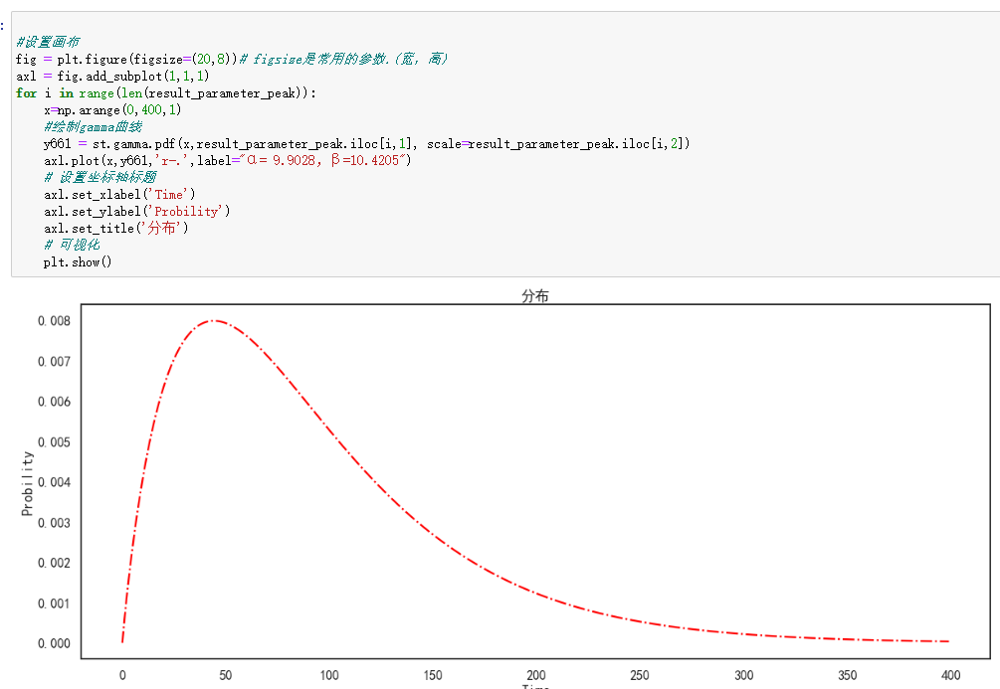
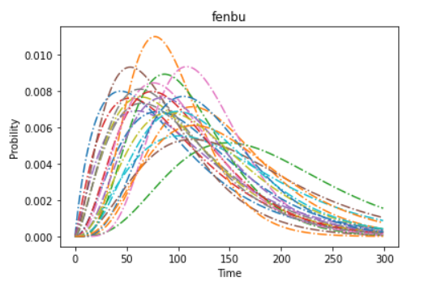
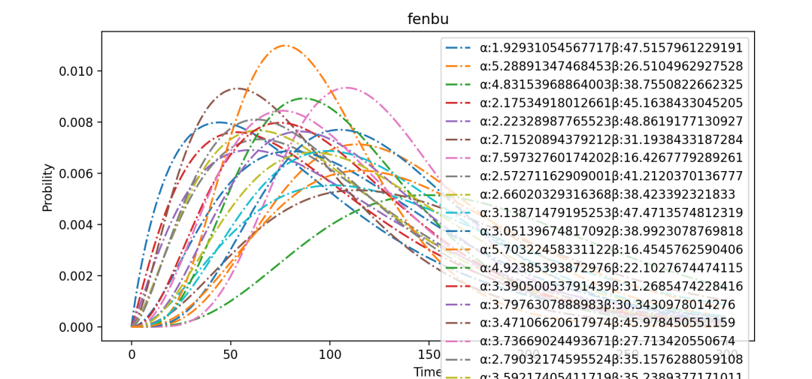

Python可视化
<a name="QKh5S"></a>
### 一、前言
原始绘图代码，如下所示：
```python
import pandas as pd
import numpy as np
import matplotlib.pyplot as plt
import scipy.stats as st

result_parameter_peak = pd.read_csv("result_parameter_peak.csv", encoding="utf_8_sig")

# 设置画布
fig = plt.figure(figsize=(20, 8))  # figsize是常用的参数.(宽，高)
axl = fig.add_subplot(1, 1, 1)

for i in range(len(result_parameter_peak)):
    x = np.arange(0, 400, 1)
    # 绘制gamma曲线
    y661 = st.gamma.pdf(x, result_parameter_peak.iloc[i, 1], scale=result_parameter_peak.iloc[i, 2])
    axl.plot(x, y661, 'r-.', label="α= 9.9028，β=10.4205")
    # 设置坐标轴标题
    axl.set_xlabel('Time')
    axl.set_ylabel('Probility')
    axl.set_title('分布')
# 可视化
plt.show()
```
得到的只是单个的图。<br />
<a name="fz9dD"></a>
### 二、实现过程
```python
import pandas as pd
import numpy as np
import matplotlib.pyplot as plt
import scipy.stats as st

result_parameter_peak = pd.read_csv("result_parameter_peak.csv", encoding="utf_8_sig")

plt.figure()
for i, alpha, beta in result_parameter_peak.itertuples():
    x = np.arange(0, 300, 1)
    # 绘制gamma曲线
    y661 = st.gamma.pdf(x, alpha, scale=beta)
    plt.plot(x, y661, '-.')
    # 设置坐标轴标题
    plt.xlabel('Time')
    plt.ylabel('Probility')
    plt.title('分布')

# 可视化
plt.show()
```
运行之后，结果如下图所示：<br /><br />给图加图注，看上去高大上一些，代码如下所示：
```python
import pandas as pd
import numpy as np
import matplotlib.pyplot as plt
import scipy.stats as st

result_parameter_peak = pd.read_csv("result_parameter_peak.csv", encoding="utf_8_sig")

plt.figure()
for i, alpha, beta in result_parameter_peak.itertuples():
    x = np.arange(0, 300, 1)
    # 绘制gamma曲线
    y661 = st.gamma.pdf(x, alpha, scale=beta)
    # plt.plot(x, y661, '-.')
    plt.plot(x, y661, '-.', label="α:" + str(alpha) + "β:" + str(beta))
    # 设置坐标轴标题
    plt.xlabel('Time')
    plt.ylabel('Probility')
    plt.title('fenbu')
    
# 可视化
plt.legend()
plt.show()
```
得到的效果图如下所示：<br />

