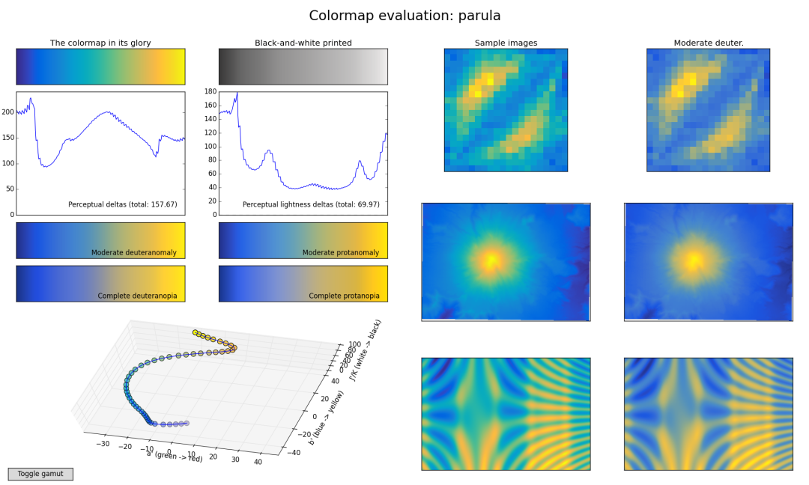

PythonMatplotlib<br />系统介绍一下优秀的关于Matplotlib颜色表(colormap) 第三方库。主要内容如下：

- **偏学术类型**
- **偏艺术类型**
<a name="t6GQc"></a>
## 偏学术类型
Python-Matplotlib的偏学术类型的colormap，介绍以下几个库，当然，还有MATLAB的颜色表
<a name="YAjea"></a>
### Python-scicomap包
Python-scicomap包可以说是专门为Matplotlib提供科学学术图表的配色，其含有单色系(sequential), 双单色系(bi-sequential), 双色渐变系(diverging)，循环色系(circular)，多色系(qualitative) 和混杂色系(miscellaneous) 颜色表。接下来列举下几个样例查看下：
<a name="YgyJb"></a>
#### 样例一
```python
import scicomap as sc
import matplotlib.pyplot as plt

# the thing that should not be
ugly_jet = plt.get_cmap("jet")
sc_map =  sc.ScicoMiscellaneous(cmap=ugly_jet)
f=sc_map.assess_cmap(figsize=(22,10))
f.set_facecolor("w")
```

<a name="HXrxP"></a>
#### 样例二：Comparing color maps
```python
c_l =  ["cividis", "inferno", "magma", "plasma", "viridis"]
f = sc.plot_colorblind_vision(ctype='sequential', 
                              cmap_list=c_l, 
                              figsize=(30, 4), 
                              n_colors=11, 
                              facecolor="black")
```

<a name="nJZFO"></a>
#### 样例三
```python
f = sc.compare_cmap(image="grmhd", 
                    ctype='sequential', 
                    ncols=15, 
                    uniformize=True, 
                    symmetrize=True, 
                    unif_kwargs={'lift': 20}, 
                    sym_kwargs={'bitonic': False, 'diffuse': True})
```

<a name="FMj1q"></a>
#### 样例四
```python
f = sc.compare_cmap(image="vortex", 
                    ctype='diverging', 
                    ncols=15, 
                    uniformize=True, 
                    symmetrize=True, 
                    unif_kwargs={'lift': None}, 
                    sym_kwargs={'bitonic': False, 'diffuse': True})
```
<br />更多关于scicomap颜色包详细内容，可参考：[**Python-scicomap包**](https://github.com/ThomasBury/scicomap)
<a name="rmSW5"></a>
### Python-colorcet包
colorcet包包含太多类型的颜色系了，这里也不过多赘述，直接上案例：
<a name="bZRdc"></a>
#### 样例一
```python
import holoviews as hv
import colorcet as cc
from colorcet.plotting import swatches, sine_combs

hv.notebook_extension("matplotlib")

swatches(group="linear")
```
 colormaps, for plotting magnitudes")
<a name="V9lsM"></a>
#### 样例二
```python
swatches(group='diverging')
```

<a name="KmNjn"></a>
#### 样例三
```python
swatches(group='nopic')
```

<a name="cql6i"></a>
#### 样例四
```python
misc = [name for name in cc.all_original_names() if "cyclic" in name or "isoluminant" in name or "rainbow" in name]
swatches(*misc)
```
<br />更多关于colorcet颜色包详细内容，大家可参考：[**Python-colorcet包**](https://colorcet.holoviz.org/)
<a name="bpHxc"></a>
### Python-cmasher包
Python-cmasher包也是为学术配色所设计出的一个Matplotlib颜色包，这里直接列举几个色系即可，如下：
<a name="v2w8a"></a>
#### 样例一：Sequential colormaps
<br /><br /><br />
<a name="JiYeJ"></a>
#### 样例二：Diverging colormaps
<br /><br /><br /><br />更多关于cmasher颜色包详细内容，大家可参考：[**Python-cmasher包**](https://cmasher.readthedocs.io/)
<a name="caGhq"></a>
### Python-viscm包
Python-viscm包是比较喜欢的一个，因为其提供了MATLAB的默认颜色主题，相信许多小伙伴还是蛮期待的，话不多说，直接列举样例，如下：
<a name="Kz67M"></a>
#### 样例一：PARULA

<a name="xLRTo"></a>
#### 样例二：PLASMA

<a name="qr40u"></a>
#### 样例三：VIRIDIS
<br />更多关于viscm颜色包详细内容，大家可参考：[**Python-viscm包**](https://bids.github.io/colormap/)
<a name="fcJWI"></a>
## 偏艺术类型
这一部分给出的是一个偏清新的颜色，也就是Python-vapeplot包，详细内容如下：
<a name="EwFas"></a>
### 样例一
```python
import vapeplot
%matplotlib inline
vapeplot.available()
```

<a name="r0Aid"></a>
### 样例二
```python
vapeplot.view_palette("cool",'sunset')
```

<a name="i7nO1"></a>
### 样例三：cool
<br />
<a name="jpBxm"></a>
### 样例四：avanti
<br /><br />更多关于vapeplot颜色包详细内容，大家可参考：[**Python-vapeplot包**](https://github.com/dantaki/vapeplot)
<a name="OdSdg"></a>
## 总结
列举了几个学术和商业Matplotlib颜色包，可以选择自己喜欢的学术配色进行论文的绘制~~
<a name="mMiu5"></a>
## 参考资料
**Python-scicomap包:**[**_https://github.com/ThomasBury/scicomap_**](https://github.com/ThomasBury/scicomap)<br />**Python-colorcet包:**[**_https://colorcet.holoviz.org/_**](https://colorcet.holoviz.org/)<br />**Python-cmasher包:**[**_https://cmasher.readthedocs.io/_**](https://cmasher.readthedocs.io/)<br />**Python-viscm包:**[**_https://bids.github.io/colormap/_**](https://bids.github.io/colormap/)<br />**Python-vapeplot包:**[**_https://github.com/dantaki/vapeplot_**](https://github.com/dantaki/vapeplot)
