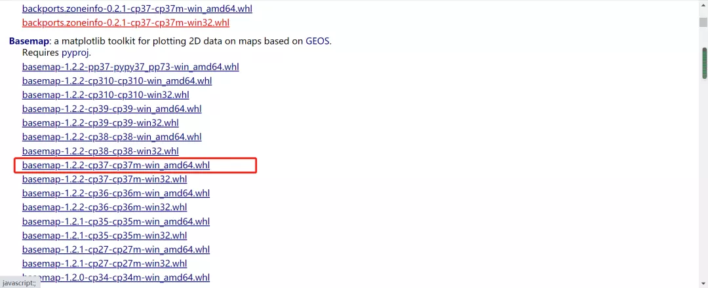
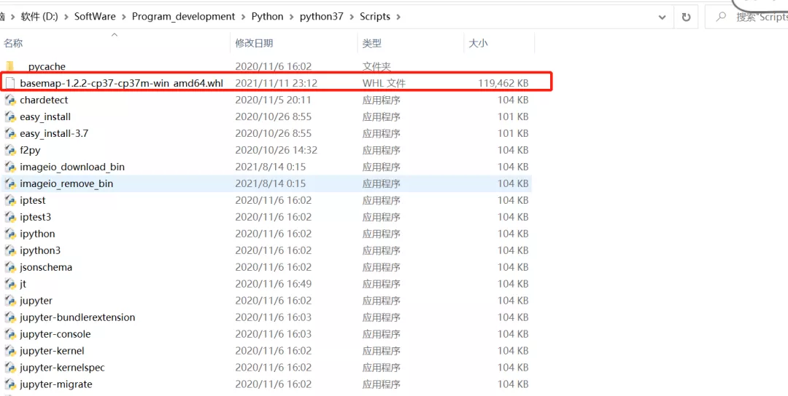
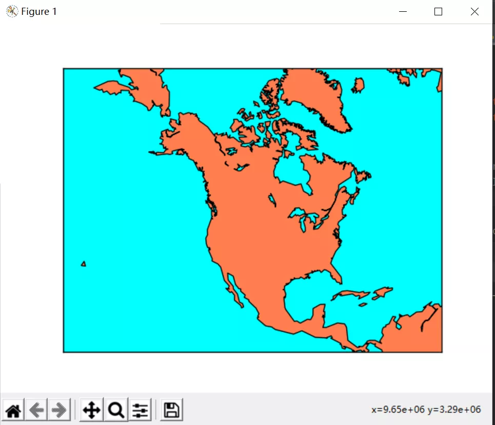

Python 可视化
<a name="cKrmV"></a>
### BaseMap 简介
其实 Basemap 工具包就是 Matplotlib 包的子包，一个用于在 Python 绘制 2D 数据至地图的库，它提供了将坐标转化为 25 种不同地图投影的功能，然后调用 Matplotlib 扩展包绘制轮廓、图像和坐标点等。<br />该扩展包提供了海岸线、河流、政治边界数据集以及绘制方法。其中 GEOS 库在内部用于将海岸线和边界特征剪切到所需的地图投影区域。下面给出官网的翻译示例，源地址：<br />[https://matplotlib.org/basemap/users/geography.html](https://matplotlib.org/basemap/users/geography.html)<br />Basemap 包括 GSSH（现在是GSHHG）海岸线数据集以及 GMT 格式的河流、州和国家边界的数据集。这些数据集可以用来以不同的分辨率绘制海岸线、河流和政治边界地图。相关方法如下：

- `drawcoastlines()`: 绘制海岸线。
- `fillcontinents()`: 通过填充海岸线多边形为地图着色。
- `drawcountries()`: 绘制国家边界。
- `drawstates()`: 在北美绘制状态边界。
- `drawrivers()`: 绘制河流。

此外，可以将图像用作地图背景，而不是绘制海岸线和政治边界。Basemap提供了以下几个选项：

- `drawlsmask()`: 绘制高分辨率的海陆图像，指定陆地和海洋的颜色，数据源于 GSHHS 海岸线。
- `bluemarble()`: 绘制 NASA 蓝色大理石图像作为地图背景。
- `shadedrelief()`: 绘制阴影浮雕图像作为地图背景。
- `etopo()`: 绘制一张 etopo 浮雕图像作为地图背景。
- `warpimage()`: 使用 abitrary 图像作为地图背景，必须是全球的，从国际日东线向东和南极以北覆盖世界。
<a name="ZtzNE"></a>
### Basemap 安装
Basemap 安装从非官网网站下载下面两个扩展包，安装包名称中的 cp37 表示 Python3.7 版本，这个根据 Python 版本安装对应的包即可，Windows下 64 位环境加 amd64，需要找到适合自己环境的文件。<br />basemap-1.2.2-cp37-cp37m-win_amd64.whl pyproj-3.0.1-cp37-cp37m-win_amd64.whl<br />下载地址为：<br />[https://www.lfd.uci.edu/~gohlke/pythonlibs/](https://www.lfd.uci.edu/~gohlke/pythonlibs/)<br />下载图片如下：<br /><br /><br />下载好后将下载的whl文件放入Python安装的 Script 文件夹下，如下图所示：<br /><br />安装语句如下：
```bash
pip install basemap-1.2.2-cp37-cp37m-win_amd64.whl
```
如下图即为安装成功。
<a name="NoHJH"></a>
### Basemap实例
<a name="Rp2ds"></a>
#### 绘制海岸线、填充海洋和陆地区域
```python
from mpl_toolkits.basemap import Basemap
import matplotlib.pyplot as plt

# 设置basemap-Lambert Conformal 
m = Basemap(width=12000000,height=9000000,projection='lcc',
            resolution='c',lat_1=45.,lat_2=55,lat_0=50,lon_0=-107.)
# 绘制海岸线

m.drawcoastlines()

# 在地图周围绘制边界并填充背景aqua（这个背景最终成为海洋的颜色）
# 将大洲绘制在最上面
m.drawmapboundary(fill_color='aqua')

# 填充大陆coral颜色,并设置湖泊颜色为 aqua
m.fillcontinents(color='coral',lake_color='aqua')
plt.show()
```
运行结果如下图：<br />
