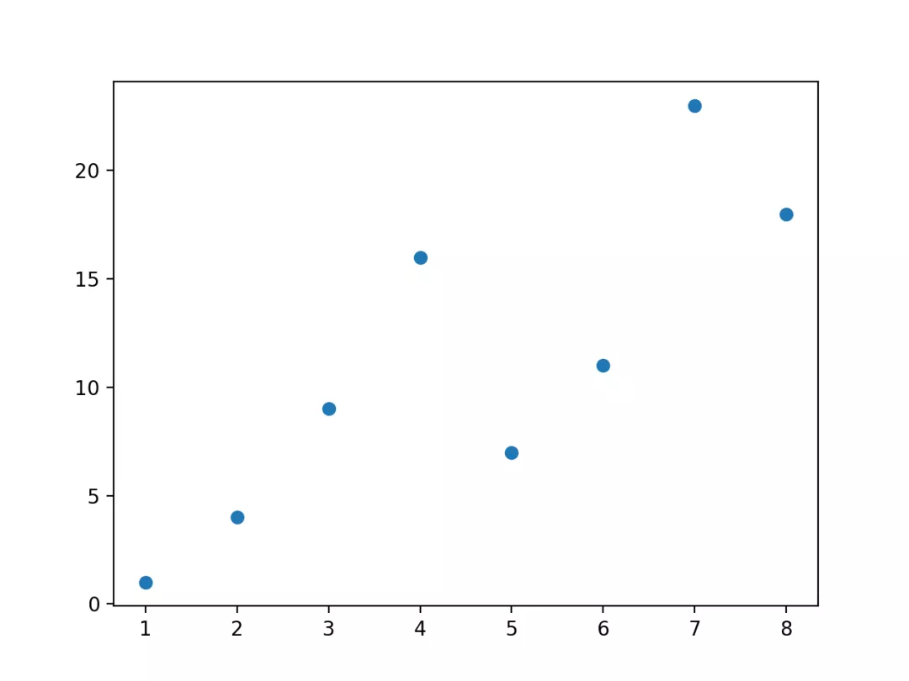
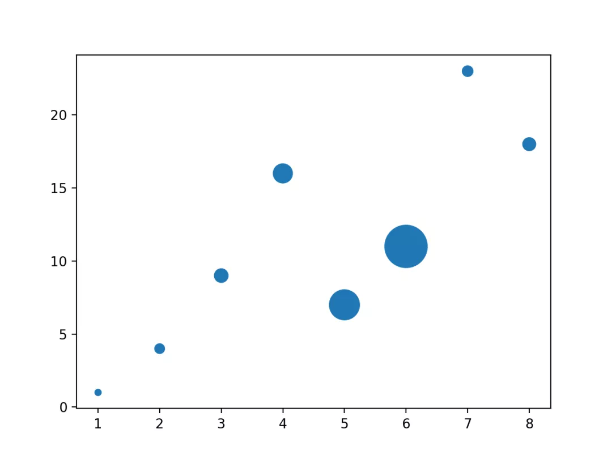
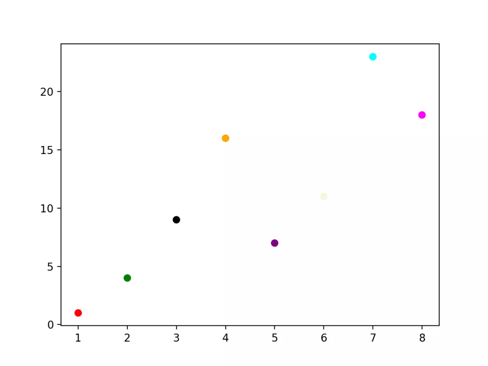
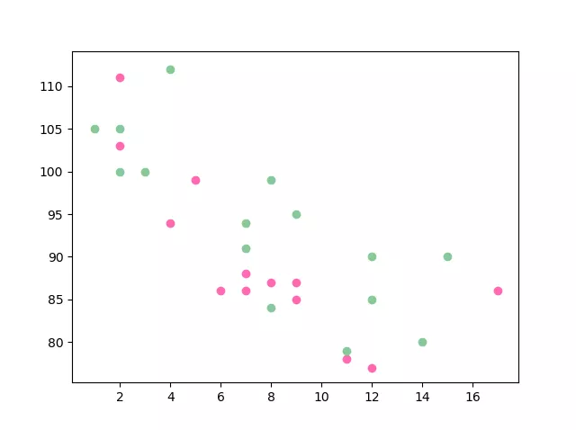
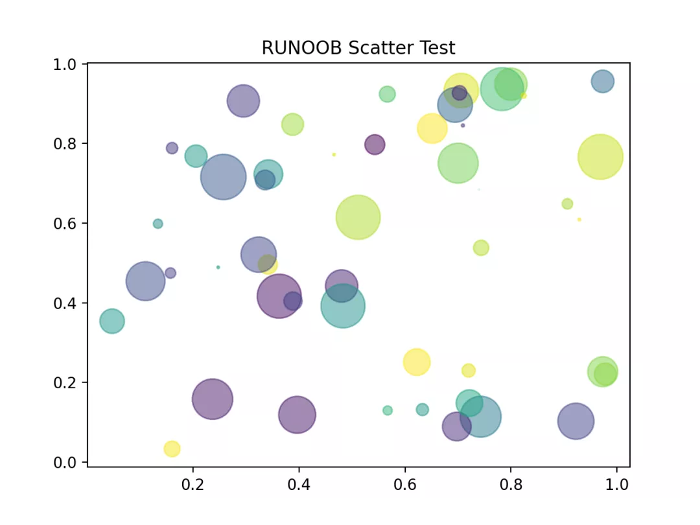
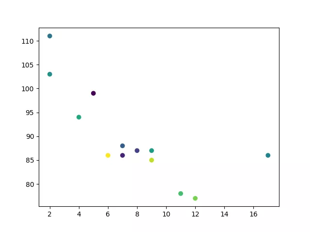
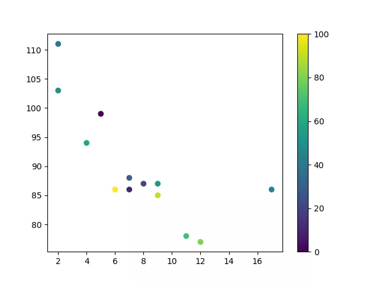
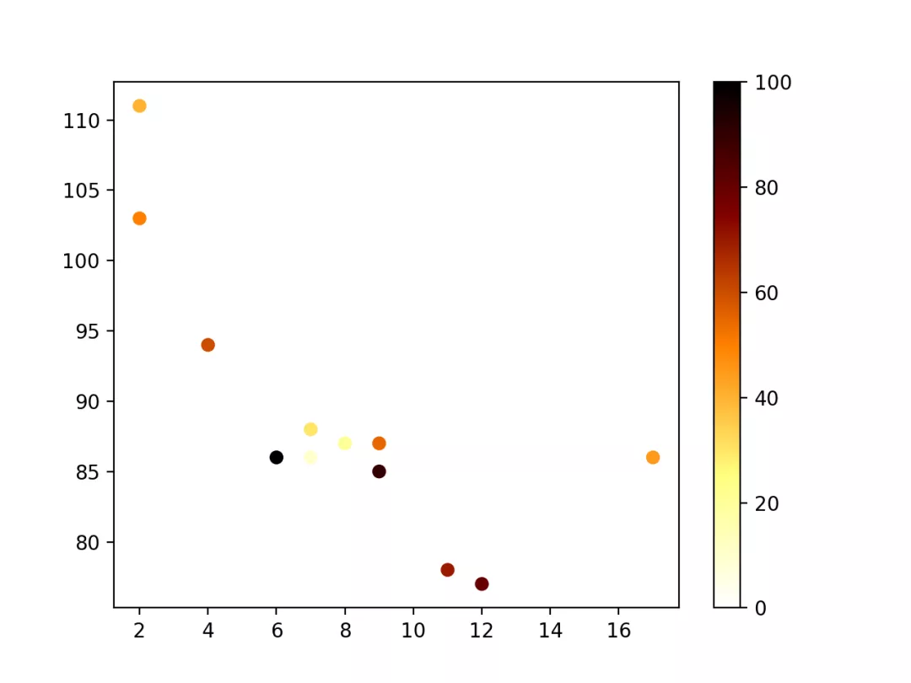

Python 可视化 Matplotlib<br />可以使用 pyplot 中的 `scatter()` 方法来绘制散点图。<br />`scatter()` 方法语法格式如下：
```python
matplotlib.pyplot.scatter(x, y, s=None, c=None, marker=None, cmap=None, norm=None, vmin=None, vmax=None, alpha=None, linewidths=None, *, edgecolors=None, plotnonfinite=False, data=None, **kwargs)
```
参数说明：<br />`x`，`y`：长度相同的数组，也就是即将绘制散点图的数据点，输入数据。<br />`s`：点的大小，默认 20，也可以是个数组，数组每个参数为对应点的大小。<br />`c`：点的颜色，默认蓝色 'b'，也可以是个 RGB 或 RGBA 二维行数组。<br />`marker`：点的样式，默认小圆圈 `'o'`。<br />`cmap`：Colormap，默认 None，标量或者是一个 colormap 的名字，只有 c 是一个浮点数数组的时才使用。如果没有申明就是 `image.cmap`。<br />`norm`：Normalize，默认 None，数据亮度在 0-1 之间，只有 c 是一个浮点数的数组的时才使用。<br />`vmin`，`vmax`：：亮度设置，在 norm 参数存在时会忽略。<br />`alpha`：：透明度设置，0-1 之间，默认 None，即不透明。<br />`linewidths`：：标记点的长度。<br />`edgecolors`：：颜色或颜色序列，默认为 `'face'`，可选值有 `'face'`, `'none'`, `None`。<br />`plotnonfinite`：：布尔值，设置是否使用非限定的 c ( inf, -inf 或 nan) 绘制点。<br />`**kwargs`：：其他参数。<br />以下实例 `scatter()` 函数接收长度相同的数组参数，一个用于 x 轴的值，另一个用于 y 轴上的值：
```python
import matplotlib.pyplot as plt
import numpy as np

x = np.array([1, 2, 3, 4, 5, 6, 7, 8])
y = np.array([1, 4, 9, 16, 7, 11, 23, 18])

plt.scatter(x, y)
plt.show()
```
显示结果如下：<br />
<a name="GQ6kf"></a>
### 设置图标大小
```python
import matplotlib.pyplot as plt
import numpy as np

x = np.array([1, 2, 3, 4, 5, 6, 7, 8])
y = np.array([1, 4, 9, 16, 7, 11, 23, 18])
sizes = np.array([20,50,100,200,500,1000,60,90])
plt.scatter(x, y, s=sizes)
plt.show()
```
显示结果如下：<br />
<a name="allVZ"></a>
### 自定义点的颜色
```python
import matplotlib.pyplot as plt
import numpy as np

x = np.array([1, 2, 3, 4, 5, 6, 7, 8])
y = np.array([1, 4, 9, 16, 7, 11, 23, 18])
colors = np.array(["red","green","black","orange","purple","beige","cyan","magenta"])

plt.scatter(x, y, c=colors)
plt.show()
```
显示结果如下：<br />
<a name="t016O"></a>
### 设置两组散点图
```python
import matplotlib.pyplot as plt
import numpy as np

x = np.array([5,7,8,7,2,17,2,9,4,11,12,9,6])
y = np.array([99,86,87,88,111,86,103,87,94,78,77,85,86])
plt.scatter(x, y, color = 'hotpink')

x = np.array([2,2,8,1,15,8,12,9,7,3,11,4,7,14,12])
y = np.array([100,105,84,105,90,99,90,95,94,100,79,112,91,80,85])
plt.scatter(x, y, color = '#88c999')

plt.show()
```
显示结果如下：<br />
<a name="O6k4Y"></a>
### 使用随机数来设置散点图
```python
import numpy as np
import matplotlib.pyplot as plt

# 随机数生成器的种子
np.random.seed(19680801)


N = 50
x = np.random.rand(N)
y = np.random.rand(N)
colors = np.random.rand(N)
area = (30 * np.random.rand(N))**2  # 0 to 15 point radii

plt.scatter(x, y, s=area, c=colors, alpha=0.5) # 设置颜色及透明度

plt.title("RUNOOB Scatter Test") # 设置标题

plt.show()
```
显示结果如下：<br />
<a name="mkgvb"></a>
### 颜色条 Colormap
Matplotlib 模块提供了很多可用的颜色条。<br />颜色条就像一个颜色列表，其中每种颜色都有一个范围从 0 到 100 的值。<br />下面是一个颜色条的例子：<br /><br />设置颜色条需要使用 `cmap` 参数，默认值为 `'viridis'`，之后颜色值设置为 0 到 100 的数组。
<a name="I5N3e"></a>
#### 实例
```python
import matplotlib.pyplot as plt
import numpy as np

x = np.array([5,7,8,7,2,17,2,9,4,11,12,9,6])
y = np.array([99,86,87,88,111,86,103,87,94,78,77,85,86])
colors = np.array([0, 10, 20, 30, 40, 45, 50, 55, 60, 70, 80, 90, 100])

plt.scatter(x, y, c=colors, cmap='viridis')

plt.colorbar()

plt.show()
```
显示结果如下：<br /><br />如果要显示颜色条，需要使用 `plt.colorbar()` 方法：
<a name="BZzCz"></a>
#### 实例
```python
import matplotlib.pyplot as plt
import numpy as np

x = np.array([5,7,8,7,2,17,2,9,4,11,12,9,6])
y = np.array([99,86,87,88,111,86,103,87,94,78,77,85,86])
colors = np.array([0, 10, 20, 30, 40, 45, 50, 55, 60, 70, 80, 90, 100])

plt.scatter(x, y, c=colors, cmap='viridis')

plt.colorbar()

plt.show()
```
显示结果如下：<br /><br />换个颜色条参数， cmap 设置为 `afmhot_r`：
<a name="Lc36s"></a>
#### 实例
```python
import matplotlib.pyplot as plt
import numpy as np

x = np.array([5,7,8,7,2,17,2,9,4,11,12,9,6])
y = np.array([99,86,87,88,111,86,103,87,94,78,77,85,86])
colors = np.array([0, 10, 20, 30, 40, 45, 50, 55, 60, 70, 80, 90, 100])

plt.scatter(x, y, c=colors, cmap='afmhot_r')
plt.colorbar()
plt.show()
```
显示结果如下：<br /><br />颜色条参数值可以是以下值：

| 颜色名称 | 保留关键字 |
| --- | --- |
| Accent | Accent_r |
| Blues | Blues_r |
| BrBG | BrBG_r |
| BuGn | BuGn_r |
| BuPu | BuPu_r |
| CMRmap | CMRmap_r |
| Dark2 | Dark2_r |
| GnBu | GnBu_r |
| Greens | Greens_r |
| Greys | Greys_r |
| OrRd | OrRd_r |
| Oranges | Oranges_r |
| PRGn | PRGn_r |
| Paired | Paired_r |
| Pastel1 | Pastel1_r |
| Pastel2 | Pastel2_r |
| PiYG | PiYG_r |
| PuBu | PuBu_r |
| PuBuGn | PuBuGn_r |
| PuOr | PuOr_r |
| PuRd | PuRd_r |
| Purples | Purples_r |
| RdBu | RdBu_r |
| RdGy | RdGy_r |
| RdPu | RdPu_r |
| RdYlBu | RdYlBu_r |
| RdYlGn | RdYlGn_r |
| Reds | Reds_r |
| Set1 | Set1_r |
| Set2 | Set2_r |
| Set3 | Set3_r |
| Spectral | Spectral_r |
| Wistia | Wistia_r |
| YlGn | YlGn_r |
| YlGnBu | YlGnBu_r |
| YlOrBr | YlOrBr_r |
| YlOrRd | YlOrRd_r |
| afmhot | afmhot_r |
| autumn | autumn_r |
| binary | binary_r |
| bone | bone_r |
| brg | brg_r |
| bwr | bwr_r |
| cividis | cividis_r |
| cool | cool_r |
| coolwarm | coolwarm_r |
| copper | copper_r |
| cubehelix | cubehelix_r |
| flag | flag_r |
| gist_earth | gist_earth_r |
| gist_gray | gist_gray_r |
| gist_heat | gist_heat_r |
| gist_ncar | gist_ncar_r |
| gist_rainbow | gist_rainbow_r |
| gist_stern | gist_stern_r |
| gist_yarg | gist_yarg_r |
| gnuplot | gnuplot_r |
| gnuplot2 | gnuplot2_r |
| gray | gray_r |
| hot | hot_r |
| hsv | hsv_r |
| inferno | inferno_r |
| jet | jet_r |
| magma | magma_r |
| nipy_spectral | nipy_spectral_r |
| ocean | ocean_r |
| pink | pink_r |
| plasma | plasma_r |
| prism | prism_r |
| rainbow | rainbow_r |
| seismic | seismic_r |
| spring | spring_r |
| summer | summer_r |
| tab10 | tab10_r |
| tab20 | tab20_r |
| tab20b | tab20b_r |
| tab20c | tab20c_r |
| terrain | terrain_r |
| twilight | twilight_r |
| twilight_shifted | twilight_shifted_r |
| viridis | viridis_r |
| winter | winter_r |

