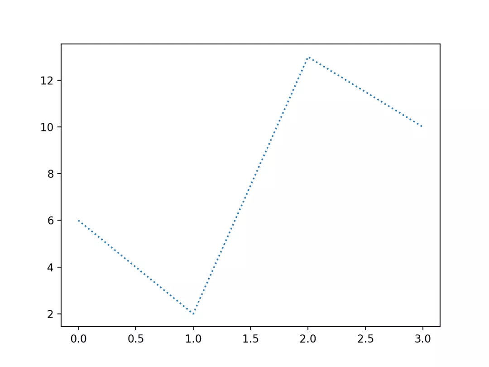
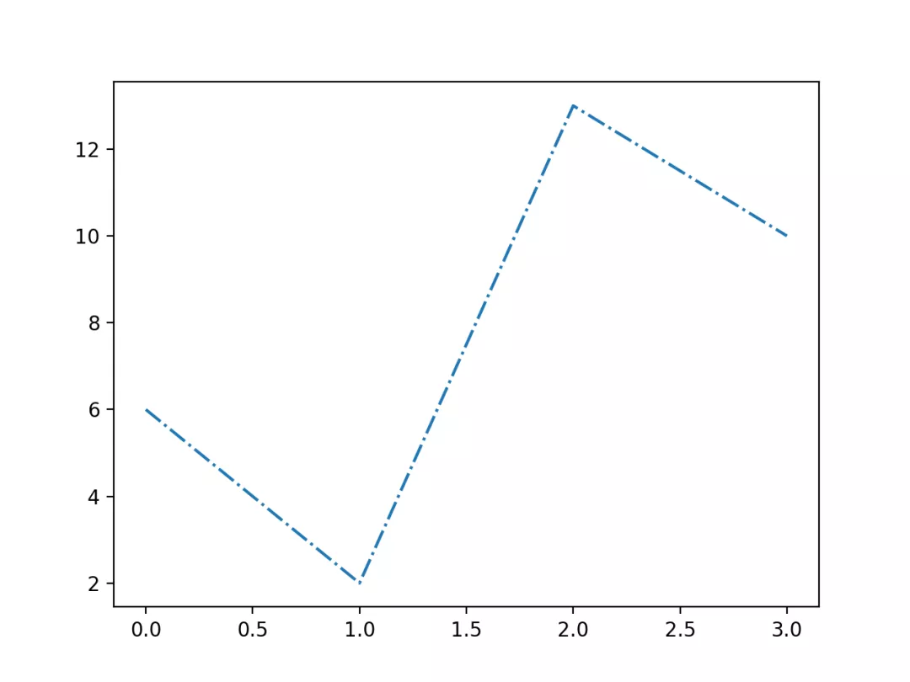
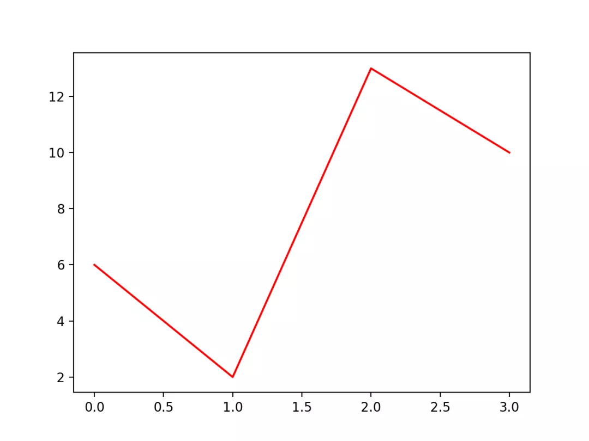
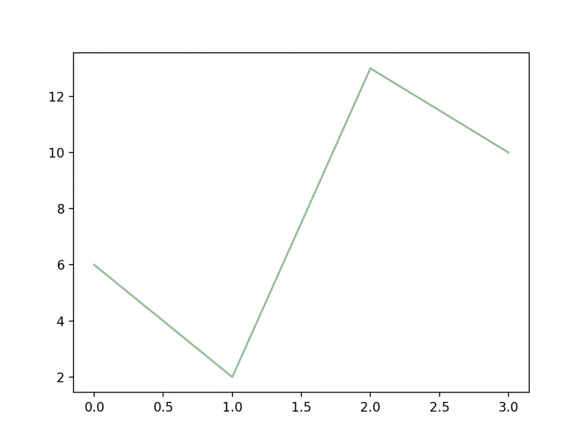
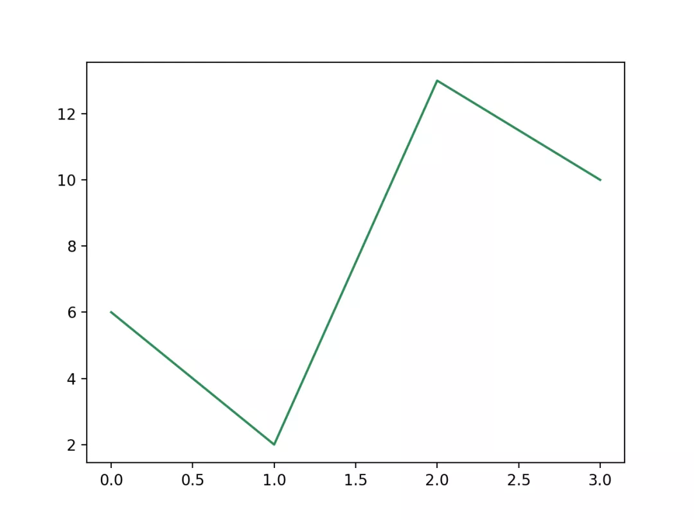
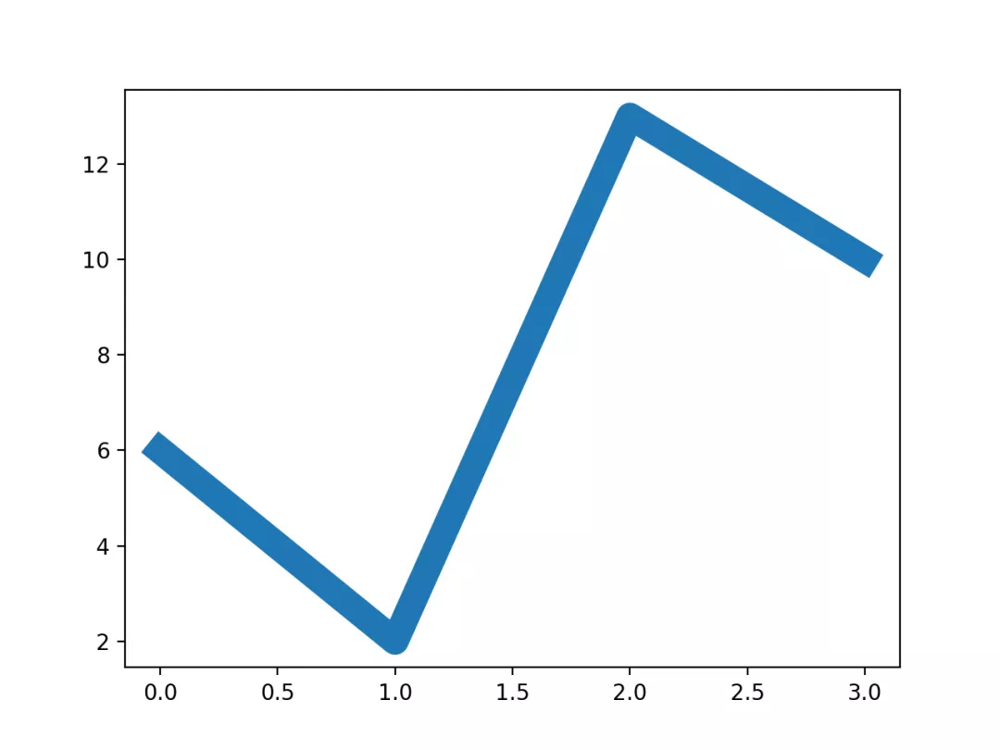
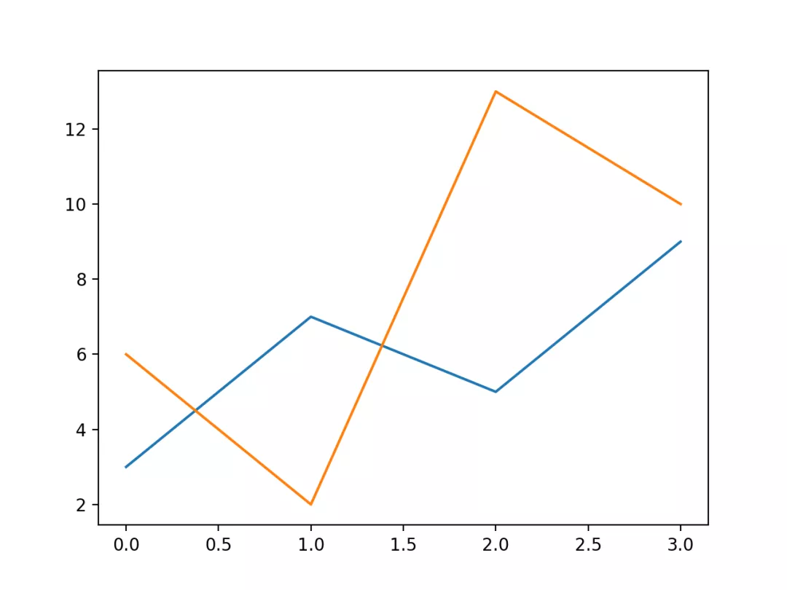

Python Matplotlib 可视化<br />绘图过程如果自定义线的样式，包括线的类型、颜色和大小等。
<a name="if4x5"></a>
## 线的类型
线的类型可以使用 `linestyle` 参数来定义，简写为 `ls`。

| 类型 | 简写 | 说明 |
| --- | --- | --- |
| 'solid' (默认) | '-' | 实线 |
| 'dotted' | ':' | 点虚线 |
| 'dashed' | '--' | 破折线 |
| 'dashdot' | '-.' | 点划线 |
| 'None' | '' 或 ' ' | 不画线 |

<a name="OukEE"></a>
### 实例
```python
import matplotlib.pyplot as plt
import numpy as np
ypoints = np.array([6, 2, 13, 10])
plt.plot(ypoints, linestyle = 'dotted')
plt.show()
```
显示结果如下：<br /><br />使用简写：
<a name="zgyXU"></a>
### 实例
```python
import matplotlib.pyplot as plt
import numpy as np
ypoints = np.array([6, 2, 13, 10])
plt.plot(ypoints, ls = '-.')
plt.show()
```
显示结果如下：<br />
<a name="qXX1r"></a>
## 线的颜色
线的颜色可以使用 `color` 参数来定义，简写为 c。<br />颜色类型：

| 颜色标记 | 描述 |
| --- | --- |
| 'r' | 红色 |
| 'g' | 绿色 |
| 'b' | 蓝色 |
| 'c' | 青色 |
| 'm' | 品红 |
| 'y' | 黄色 |
| 'k' | 黑色 |
| 'w' | 白色 |

当然也可以自定义颜色类型，例如：`SeaGreen`、`#8FBC8F` 等，完整样式可以参考 HTML 颜色值。
<a name="KzOko"></a>
### 实例
```python
import matplotlib.pyplot as plt
import numpy as np
ypoints = np.array([6, 2, 13, 10])
plt.plot(ypoints, color = 'r')
plt.show()
```
显示结果如下：<br />
<a name="p0lfh"></a>
### 实例
```python
import matplotlib.pyplot as plt
import numpy as np
ypoints = np.array([6, 2, 13, 10])
plt.plot(ypoints, c = '#8FBC8F')
plt.show()
```
显示结果如下：<br />
<a name="qDjpq"></a>
### 实例
```python
import matplotlib.pyplot as plt
import numpy as np
ypoints = np.array([6, 2, 13, 10])
plt.plot(ypoints, c = 'SeaGreen')
plt.show()
```
显示结果如下：<br />
<a name="dN0J0"></a>
## 线的宽度
线的宽度可以使用 `linewidth` 参数来定义，简写为 `lw`，值可以是浮点数，如：1、2.0、5.67 等。
<a name="lGG4H"></a>
### 实例
```python
import matplotlib.pyplot as plt
import numpy as np
ypoints = np.array([6, 2, 13, 10])
plt.plot(ypoints, linewidth = '12.5')
plt.show()
```
显示结果如下：<br />
<a name="Y7fay"></a>
## 多条线
`plot()` 方法中可以包含多对 x,y 值来绘制多条线。
<a name="vzoxV"></a>
### 实例
```python
import matplotlib.pyplot as plt
import numpy as np
y1 = np.array([3, 7, 5, 9])
y2 = np.array([6, 2, 13, 10])
plt.plot(y1)
plt.plot(y2)
plt.show()
```
从上图可以看出 x 的值默认设置为 [0, 1, 2, 3]。<br />显示结果如下：<br />也可以自己设置 x 坐标等值：<br />
<a name="ZqVlo"></a>
### 实例
```python
import matplotlib.pyplot as plt
import numpy as np
x1 = np.array([0, 1, 2, 3])
y1 = np.array([3, 7, 5, 9])
x2 = np.array([0, 1, 2, 3])
y2 = np.array([6, 2, 13, 10])
plt.plot(x1, y1, x2, y2)
plt.show()
```
显示结果如下：<br />
