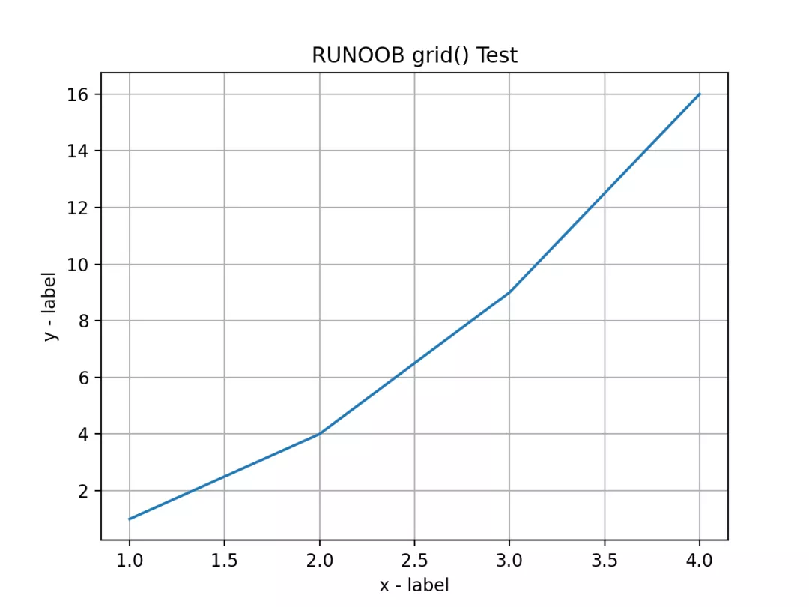
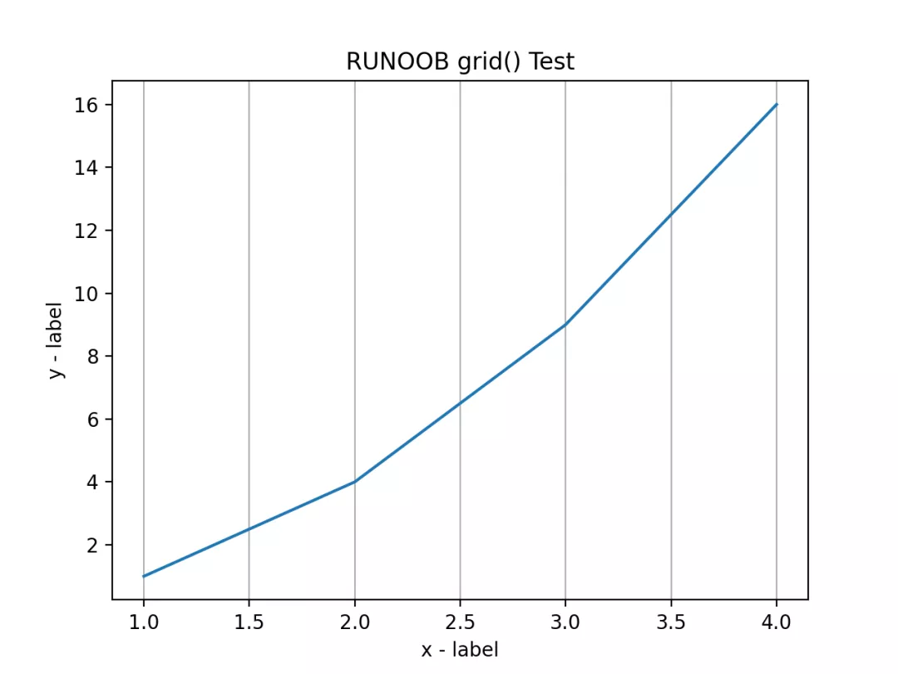
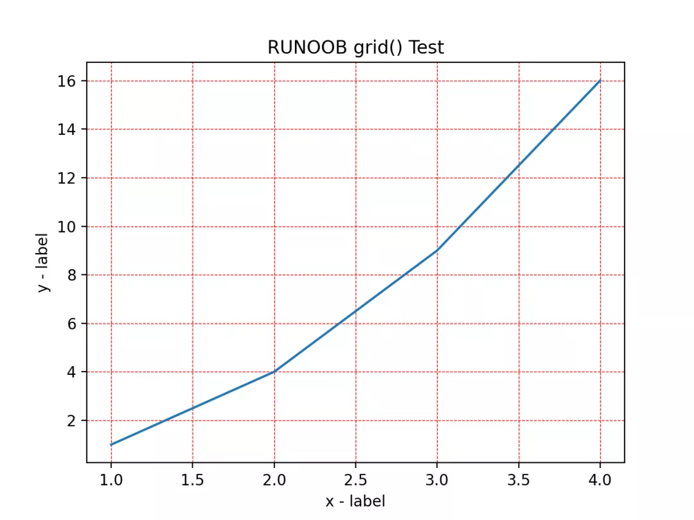

Python Matplotlib 可视化<br />可以使用 pyplot 中的 `grid()` 方法来设置图表中的网格线。<br />`grid()` 方法语法格式如下：
```python
matplotlib.pyplot.grid(b=None, which='major', axis='both', )
```
**参数说明：**

- `**b**`：可选，默认为 `None`，可以设置布尔值，`true` 为显示网格线，`false` 为不显示，如果设置 `**kwargs` 参数，则值为 `true`。
- `**which**`：可选，可选值有 `'major'`、`'minor'` 和 `'both'`，默认为 `'major'`，表示应用更改的网格线。
- `**axis**`：可选，设置显示哪个方向的网格线，可以是取 `'both'`（默认），`'x'` 或 `'y'`，分别表示两个方向，x 轴方向或 y 轴方向。
- `****kwargs**`：可选，设置网格样式，可以是 `color='r'`, `linestyle='-'` 和 `linewidth=2`，分别表示网格线的颜色，样式和宽度。

以下实例添加一个简单的网格线，参数使用默认值：
<a name="s9ACI"></a>
## 实例
```python
import numpy as np
import matplotlib.pyplot as plt
x = np.array([1, 2, 3, 4])
y = np.array([1, 4, 9, 16])

plt.title("RUNOOB grid() Test")
plt.xlabel("x - label")
plt.ylabel("y - label")
plt.plot(x, y)
plt.grid()
plt.show()
```
显示结果如下：<br /><br />以下实例添加一个简单的网格线，axis 参数使用 x，设置 x 轴方向显示网格线：
<a name="i0QbF"></a>
## 实例
```python
import numpy as np
import matplotlib.pyplot as plt
x = np.array([1, 2, 3, 4])
y = np.array([1, 4, 9, 16])

plt.title("RUNOOB grid() Test")
plt.xlabel("x - label")
plt.ylabel("y - label")
plt.plot(x, y)
plt.grid(axis='x') # 设置 y 就在轴方向显示网格线
plt.show()
```
显示结果如下：<br /><br />以下实例添加一个简单的网格线，并设置网格线的样式，格式如下：
```python
grid(color = 'color', linestyle = 'linestyle', linewidth = number)
```
**参数说明：**<br />`**color**`**：**`'b'` 蓝色，`'m'` 洋红色，`'g'` 绿色，`'y'` 黄色，`'r'` 红色，`'k'` 黑色，`'w'` 白色，`'c'` 青绿色，`'#008000'` RGB 颜色符串。<br />`**linestyle**`**：**`'‐'` 实线，`'‐‐'` 破折线，`'‐.'` 点划线，`':'` 虚线。<br />`**linewidth**`：设置线的宽度，可以设置一个数字。
<a name="PXjbd"></a>
## 实例
```python
import numpy as np
import matplotlib.pyplot as plt
x = np.array([1, 2, 3, 4])
y = np.array([1, 4, 9, 16])

plt.title("RUNOOB grid() Test")
plt.xlabel("x - label")
plt.ylabel("y - label")
plt.plot(x, y)
plt.grid(color = 'r', linestyle = '--', linewidth = 0.5)
plt.show()
```
显示结果如下：<br />
