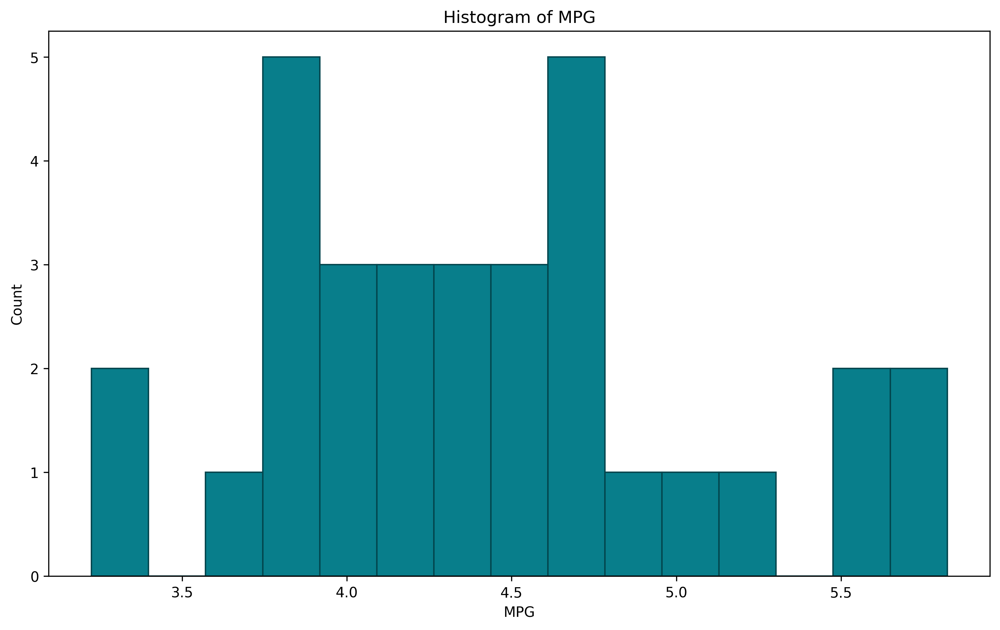
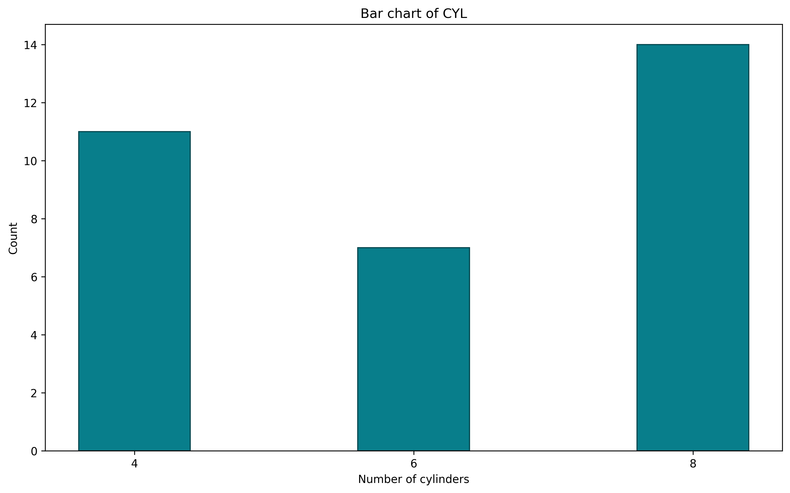
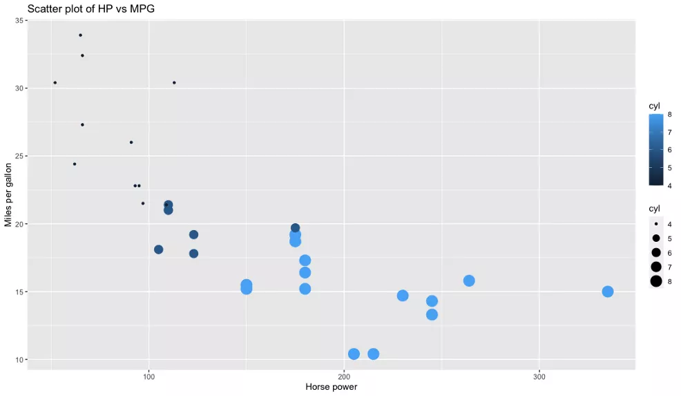
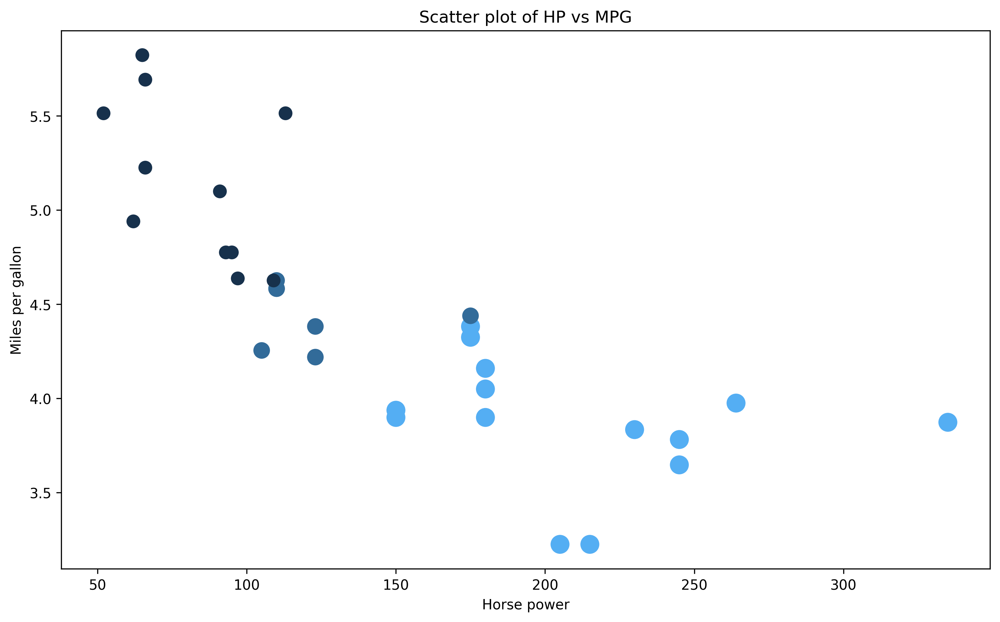
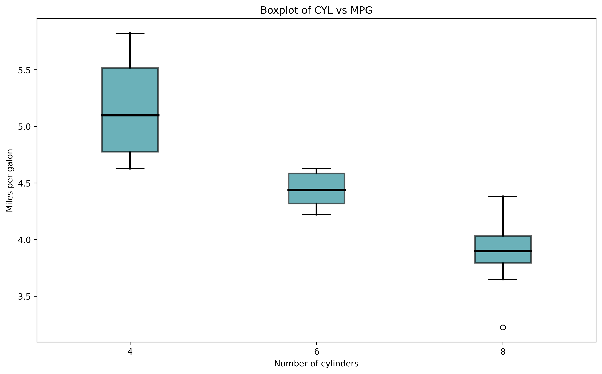
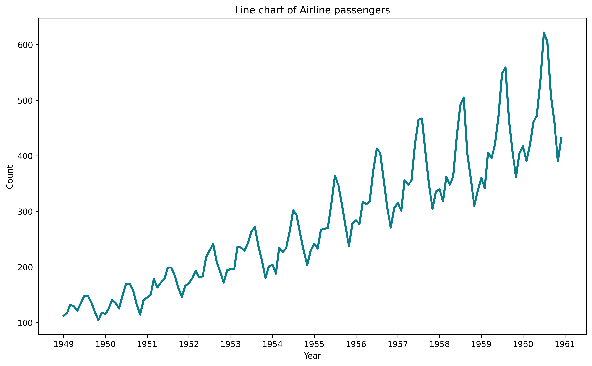

Matplotlib ggplot2<br />Matplotlib与R语言的ggplot2创建五个相同的图，进行代码和美学方面的对比。将使用两个著名的数据集：mtcars和航空乘客。可以通过导出CSV功能通过RStudio获得第一个，第二个在这里可用：[https://raw.githubusercontent.com/jbrownlee/Datasets/master/airline-passengers.csv](https://raw.githubusercontent.com/jbrownlee/Datasets/master/airline-passengers.csv)<br />[https://github.com/selva86/datasets/blob/master/mtcars.csv](https://github.com/selva86/datasets/blob/master/mtcars.csv)<br />以下是R和Python的库导入：
```python
R: 
library(ggplot2) 

Python: 
import pandas as pd 
import matplotlib.pyplot as plt 
import matplotlib.dates as mdates 
mtcars = pd.read_csv('mtcars.csv')
```
<a name="wmhK3"></a>
### 直方图
使用直方图来可视化给定变量的分布。这正是对mtcars数据集所做的——可视化MPG属性的分布。<br />以下是R的代码和结果：
```r
ggplot(mtcars, aes(x=mpg)) + 
geom_histogram(bins=15, fill='#087E8B', color='#02454d') +
ggtitle('Histogram of MPG') + xlab('MPG') + ylab('Count')
```
<br />Python也是这样：
```python
plt.figure(figsize=(12, 7)) 
plt.hist(mtcars['mpg'], bins=15, color='#087E8B', ec='#02454d')
plt.title('Histogram of MPG') 
plt.xlabel('MPG') 
plt.ylabel('Count');
plt.savefig('outbox_legend.png', dpi = 300, bbox_inches = 'tight', pad_inches = .1)
```
<br />默认情况下两者非常相似。即使需要编写的代码量也大致相同，所以很难在这里选择最喜欢的代码。Python的x轴是从0开始的，但在R中可以很容易地改变。另一方面，R中没有边界，但这也是Python中易于实现的东西。
<a name="jl5TI"></a>
### 条形图
条形图由不同高度的矩形组成，其中高度表示给定属性段的值。使用它们来比较不同数量的圆柱体（属性cyl）的计数。<br />以下是R的代码和结果：
```r
ggplot(mtcars, aes(x=cyl)) + 
geom_bar(fill='#087E8B', color='#02454d') + 
scale_x_continuous(breaks=seq(min(mtcars$cyl), max(mtcars$cyl), by=2)) + 
ggtitle('Bar chart of CYL') + 
xlab('Number of cylinders') + ylab('Count')
```
<br />Python也是一样：
```python
bar_x = mtcars['cyl'].value_counts().index 
bar_height = mtcars['cyl'].value_counts().values 
plt.figure(figsize=(12, 7)) 
plt.bar(x=bar_x, height=bar_height, color='#087E8B', ec='#02454d') 
plt.xticks([4, 6, 8]) 
plt.title('Bar chart of CYL') 
plt.xlabel('Number of cylinders') 
plt.ylabel('Count');
plt.savefig('outbox_legend.png', dpi = 300, bbox_inches = 'tight', pad_inches = .1)
```
<br />毫无疑问，R的代码更整洁、更简单，因为Python需要手动计算高度。从美学角度看，它们非常相似。<br />获胜者：ggplot2
<a name="tJATJ"></a>
### 散点图
散点图用于可视化两个变量之间的关系。这样做的目的是观察第二个变量随着第一个变量的变化（上升或下降）会发生什么。还可以通过对其他属性值的点着色来为二维图添加另一个“维度”。<br />将使用散点图来可视化HP和MPG属性之间的关系。<br />以下是R的代码和结果：
```r
ggplot(mtcars, aes(x=hp, y=mpg)) + 
geom_point(aes(size=cyl, color=cyl)) + 
ggtitle('Scatter plot of HP vs MPG') + 
xlab('Horse power') + ylab('Miles per gallon')
```
<br />Python也是一样：
```python
colors = [] 
for val in mtcars['cyl']: 
    if val == 4: colors.append('#17314c') 
    elif val == 6: colors.append('#326b99') 
    else: colors.append('#54aef3') 
plt.figure(figsize=(12, 7)) 
plt.scatter(x=mtcars['hp'], y=mtcars['mpg'], s=mtcars['cyl'] * 20, c=colors) 
plt.title('Scatter plot of HP vs MPG') 
plt.xlabel('Horse power') 
plt.ylabel('Miles per gallon');
plt.savefig('outbox_legend.png', dpi = 300, bbox_inches = 'tight', pad_inches = .1)
```
<br />代码方面，R和ggplot2的明显胜利。Matplotlib不提供一种简单的方法，通过第三个属性给数据点上色，必须手动执行该步骤。尺寸也有点怪。<br />获胜者：ggplot2
<a name="c2Di1"></a>
### 箱线图
箱线图用于通过四分位数可视化数据。它们通常会有线（胡须）从盒子里伸出来，这些线在上下四分位数之外显示出变化。中间的线是中值。顶部或底部显示的点被视为异常值。<br />我们将使用箱线图，通过不同的CYL值来可视化MPG。<br />以下是R的代码和结果：
```r
ggplot(mtcars, aes(x=as.factor(cyl), y=mpg)) + 
geom_boxplot(fill='#087E8B', alpha=0.6) + 
ggtitle('Boxplot of CYL vs MPG') + 
xlab('Number of cylinders') + ylab('Miles per gallon')
```
<br />Python也是一样：
```python
boxplot_data = [ 
    mtcars[mtcars['cyl'] == 4]['mpg'].tolist(), 
    mtcars[mtcars['cyl'] == 6]['mpg'].tolist(), 
    mtcars[mtcars['cyl'] == 8]['mpg'].tolist() 
] 
fig = plt.figure(1, figsize=(12, 7)) 
ax = fig.add_subplot(111) 
bp = ax.boxplot(boxplot_data, patch_artist=True) 
for box in bp['boxes']: 
    box.set(facecolor='#087E8B', alpha=0.6, linewidth=2) 
for whisker in bp['whiskers']: 
    whisker.set(linewidth=2) 
for median in bp['medians']: 
    median.set(color='black', linewidth=3) 
ax.set_title('Boxplot of CYL vs MPG') 
ax.set_xlabel('Number of cylinders') 
ax.set_ylabel('Miles per galon') 
ax.set_xticklabels([4, 6, 8]);
plt.savefig('outbox_legend.png', dpi = 300, bbox_inches = 'tight', pad_inches = .1)
```
<br />有一件事是立即可见的-Matplotlib需要大量的代码来生成一个外观不错的boxplot。ggplot2不是这样。到目前为止，R是这里明显的赢家。<br />获胜者：ggplot2
<a name="FF3T9"></a>
### 折线图
现在将从mtcars数据集转移到airline passengers数据集。使用它创建一个带有日期格式的x轴的简单折线图。<br />以下是R的代码和结果：
```r
ap <- read.csv('https://raw.githubusercontent.com/jbrownlee/Datasets/master/airline-passengers.csv') 
ap$Month <- as.Date(paste(ap$Month, '-01', sep='')) 
ggplot(ap, aes(x=Month, y=Passengers)) + 
geom_line(size=1.5, color='#087E8B') + 
scale_x_date(date_breaks='1 year', date_labels='%Y') + 
ggtitle('Line chart of Airline passengers') + 
xlab('Year') + ylab('Count')
```
<br />Python也是一样：
```python
ap = pd.read_csv('https://raw.githubusercontent.com/jbrownlee/Datasets/master/airline-passengers.csv') 
ap['Month'] = ap['Month'].apply(lambda x: pd.to_datetime(f'{x}-01')) 
fig = plt.figure(1, figsize=(12, 7)) 
ax = fig.add_subplot(111) 
line = ax.plot(ap['Month'], ap['Passengers'], lw=2.5, color='#087E8B') 
formatter = mdates.DateFormatter('%Y')
ax.xaxis.set_major_formatter(formatter) 
locator = mdates.YearLocator() 
ax.xaxis.set_major_locator(locator) 
ax.set_title('Line chart of Airline passengers') 
ax.set_xlabel('Year') 
ax.set_ylabel('Count');
plt.savefig('outbox_legend.png', dpi = 300, bbox_inches = 'tight', pad_inches = .1)
```
<br />从美学角度来看，这些图表几乎完全相同，但在代码量方面，ggplot2再次击败Matplotlib。与Python相比，R在X轴显示日期要容易得多。
