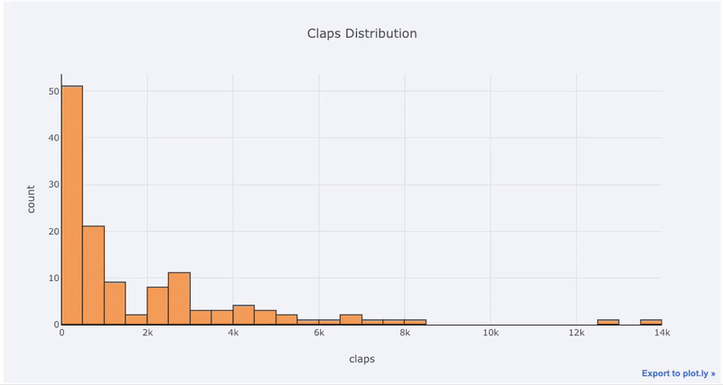
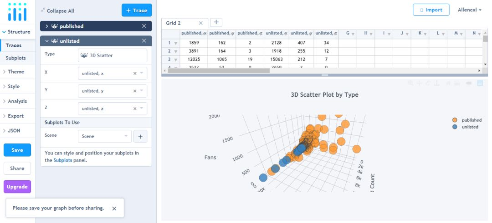
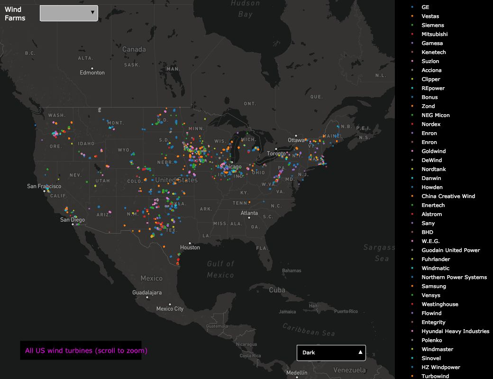

Python Plotly 可视化
<a name="oA30Y"></a>
## Plotly简要概述
plotly Python 包是一个构建在 plotly.js 上的开源库，而后者又是构建在 d3.js 上的。使用一个 plotly 的“包装器”——cufflinks，它可以 plotly 的使用变得更加简单。整个堆叠顺序是cufflinks>plotly>plotly.js>d3.js，意味着同时获得了 Python 的编程高效性和d3强大的图形交互能力。（毕竟d3.js是全世界公认的第一可视化框架！）<br />以下示例使用 plotly+cufflinks 在 Jupyter Notebook 中完成的。在开始前，需要使用 `pip install cufflinks plotly` 在 Python 环境中安装这两个包，然后在 jupyter notebook 中导入这两个包：
```python
# 导入plotly包
import plotly.plotly as py
import plotly.graph_objs as go
from plotly.offline import iplot,init_notebook_mode
# 使用离线模式的 plotly + cufflinks
import cufflinks
cufflinks.go_offline(connected=True)
```
<a name="C72ep"></a>
## Plotly示例
<a name="20832d7c"></a>
### 单变量分布：直方图和箱线图
单变量-单变量制图是开始一个数据分析的标准方法。直方图是绘制单变量分布的首选方式。在这里，先制作一个关于文章点赞次数的交互式直方图（df 是一个标准的 Pandas 数据结构）。
```python
df['claps'].iplot(kind='hist', xTitle='claps', yTitle='count', title='Claps Distribution')
```
<br />如果习惯使用matplotlib，所需要做的只是在原有代码的基础上添加一个字母，即把 plot 改为 iplot，就可以得到一个更加好看的交互式图标！可以通过鼠标的滑动获得更多的数据几节，还可以放大图的各个部分。<br />如果想要绘制重叠的直方图，这很简单：
```python
df[['time_started', 'time_published']].iplot(    
    kind='hist',    
    histnorm='percent',    
    barmode='overlay',    
    xTitle='Time of Day',    
    yTitle='(%) of Articles',    
    title='Time Started and Time Published')
```
<br />通过pandas 处理，还可以制作一个条形图：
```python
#重采样获得每月的均值 e Views and Reads')
df2 = df[['view','reads','published_date']].set_index('published_date').resample('M').mean()
df2.iplot(kind='bar', xTitle='Date', yTitle='Average',    
          title='Monthly Average Views and Reads')
```
<br />就像前面看到的那样，pandas+plotly+cufflinks 这一组合的功能非常强大。如果要绘制一个关于每篇文章粉丝数量在不同发表渠道的分布情况的箱线图，可以先使用 pandas 中DataFrame 的 pivot(透视表) 功能，然后再绘制图表，如下：
```python
df.pivot(columns='publication', values='fans').iplot(
    kind='box', yTitle='fans',title='Fans Distribution by Publication')
```
<br />交互式图表的好处就在于，可以尽情地探索图表中的数据。特别是在箱线图中，包含的信息很多，如果不能局部放大查看，可能会错过这些信息。
<a name="DLTVa"></a>
### 散点图
散点图是大多数分析的核心，它可以使看到变量随着时间的演变情况，也可以看到两种变量之间的关系。
<a name="cc464807"></a>
#### 时间序列
现实世界中的大部分数据都与时间相关。幸运的是，plotly + cufflinks 在设计之初就考虑到了时间序列的可视化。创建一个关于文章情况的 dataframe，看看它的各项指标是怎么随着时间变化的。
```python
#创建一个数据集，只包括发布在Towards Data Science渠道的文章
tds = df[df['publication'] == 'Towards Data Science']. set_index('published_date')
#将阅读时间作为时间序列
tds[['claps', 'fans', 'title']].iplot(
    y='claps', mode='lines+markers', secondary_y = 'fans',
    secondary_y_title='Fans', xTitle='Date', yTitle='Claps',
    text='title', title='Fans and Claps over Time')
```
<br />在一行代码里完成了很多不同的事情:<br />- 自动获得了格式友好的时间序列作为x轴<br />- 添加一个次坐标轴（第二y轴），因为上图中的两个变量的值范围不同。<br />- 添加文章的标题到每个数据点中（鼠标放上去可以显示文章名和变量值）<br />如果要从图表上了解更多的信息，还可以很容易地添加文本注释：
```python
tds_monthly_totals.iplot(mode='lines+markers+text', text=text, y='word_count', opacity=0.8,
                         xTitle='Date', yTitle='Word Count',title='Total Word Count by Month')
```
<br />对于由第三个分类变量着色的双变量散点图，使用：
```python
#read_time代表文章所需阅读时长，read_ratio代表阅读比例，即阅读文章的人数/点击查看的人数
df.iplot( x='read_time', y='read_ratio',
# 定义类别变量
categories='publication',xTitle='Read
Time',yTitle='Reading Percent', title='Reading Percent vs Read Ratio by Publication')
```
<br />如果要在图表中体现三个数值变量，还可以使用气泡图，如下图:横坐标、纵坐标、气泡的大小分别代表三个不同的变量——文章字数的对数、阅读数量、阅读比例。
```python
tds.iplot(x='word_count',y='reads', size='read_ratio',text=text, mode='markers',
# Log xaxis
layout=dict(xaxis=dict(type='log', title='Word Count'), yaxis=dict(title='Reads'),
            title='Reads vs Log Word Count Sized by Read Ratio'))
```
<br />再做一点工作，甚至可以在一个图表中体现四个变量！<br /><br />结合 pandas 对数据进行统计处理，可以得到很多非常有价值的图，比如下面这张关于不同文章发表渠道的读者点击查看数量的变化趋势图，显然名为Toward Data Science的发表渠道能给文章带来更多的点击量。<br />
<a name="iCEGo"></a>
### 更高级的图表
接下来所讲述的图表大家可能不会经常用到，但是非常酷炫，值得了解一下。同样，仍然只使用一行代码就可以完成这些超级图表。
<a name="uZwJt"></a>
#### 散点图矩阵
想要探索许多变量之间的关系时，散点图矩阵是非常好的选择。
```python
import plotly.figure_factory as ff
figure = ff.create_scatterplotmatrix(df[['claps', 'publication','views','read_ratio','word_count']],diag='histogram', index='publication')
```
<br />以上的散点矩阵图仍然是可以交互的，可以自由放大缩小，查看各个数据点的详细信息。
<a name="aLrRA"></a>
### 相关系数热力图
为了将数值型变量的相关性可视化，可以先计算相关系数，接着就可以创建一个带注释的热力图:
```python
corrs = df.corr()
figure = ff.create_annotated_heatmap(z=corrs.values,x=list(corrs.columns),y=list(corrs.index), annotation_text=corrs.round(2).values, showscale=True)
```
<br />还可以绘制非常酷炫的3D表面图和3D气泡图：<br />
<a name="JL3u6"></a>
### 云制图——Plotly Chart Studio
当使用 plotly 在 notebook 中绘制图表时，可能注意到了每幅图的右下角都有一个链接 “Export to plot.ly” 。如果点击该链接，就会跳转到名为chart studio的云制图平台[https://plot.ly/create/](https://plot.ly/create/)，然后就可以对自己的图标进行润色，添加注释、改改颜色、清理一些不必要的内容等等。<br /><br />还可以在线发布该图表，任何人可以直接通过链接访问到图表。（比如这个3D图，在浏览器中输入后方链接可直接抵达：[https://plot.ly/~Allencxl/3/](https://plot.ly/~Allencxl/3/)）<br />前面所述的内容还不算是这个库的所有功能，查看 plotly 和 cufflinks 的文档，肯定会有更多不可思议的神级可视化功能值得探索！<br /><br /><br />
