Python 可视化Plotly 热力图<br />Plotly中绘制热力图有3种方式：heatmap、imshow 和 figure_factory（Plotly的图形工厂函数）<br />官网学习地址：

- [https://plotly.com/python/heatmaps/](https://plotly.com/python/heatmaps/)
- [https://plotly.com/python/imshow/](https://plotly.com/python/imshow/)
- [https://plotly.com/python/annotated-heatmap/](https://plotly.com/python/annotated-heatmap/)


<a name="QlAGU"></a>
## 导入库
```python
import pandas as pd
import numpy as np

import plotly_express as px
import plotly.graph_objects as go
import plotly.figure_factory as ff  # 图形工厂
from plotly.subplots import make_subplots  # 绘制子图
```
<a name="S5wit"></a>
## 基于px展示imshow
Plotly中的imshow主要是用来展示图像数据，当然也可以用来显示热力图：
<a name="atvnP"></a>
### 展示RGB图形数据
```python
# 数据部分
rgb = np.array([[[105, 0, 0], [0, 255, 0], [0, 0, 55]],
                [[0, 250, 0], [0, 0, 205], [255, 0, 0]]], 
               dtype=np.uint8)

# 调用px
fig = px.imshow(rgb)
fig.show()
```
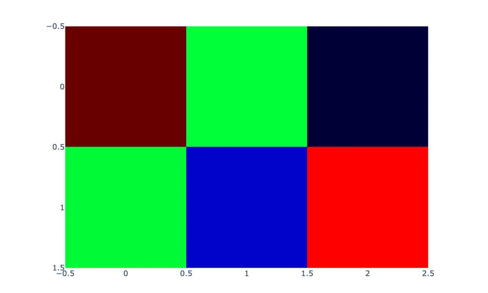
<a name="NsGSa"></a>
### 基于嵌套列表
```python
fig = px.imshow([[1, 20, 30],
                 [20, 1, 60]])

fig.show()
```
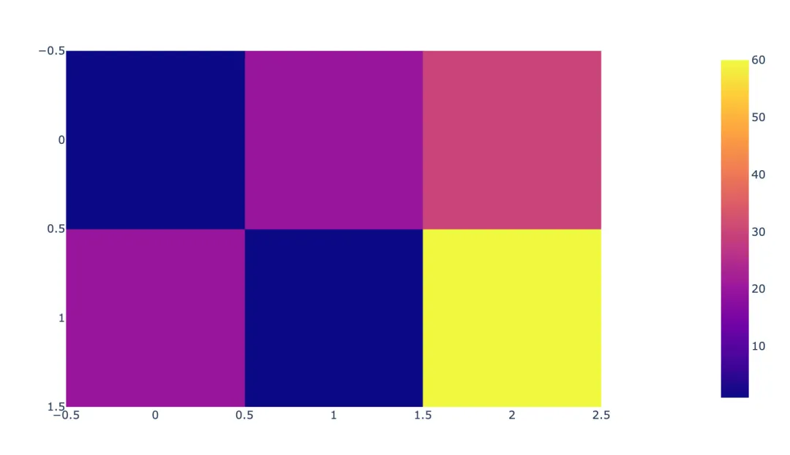
<a name="iQrTS"></a>
### 基于二维数组的数据
<a name="dCDII"></a>
#### 1、显示颜色棒及颜色
```python
data = np.arange(20).reshape(4,5) # 如何使用Numpy生成数据
fig = px.imshow(data)
fig.show()
```
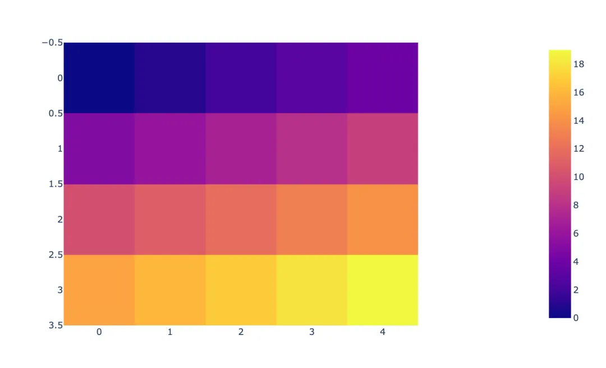
<a name="rmGRx"></a>
#### 2、不显示颜色棒+灰色
```python
data = np.arange(20).reshape(4,5)
fig = px.imshow(data,binary_string=True)  # 参数设置
fig.show()
```
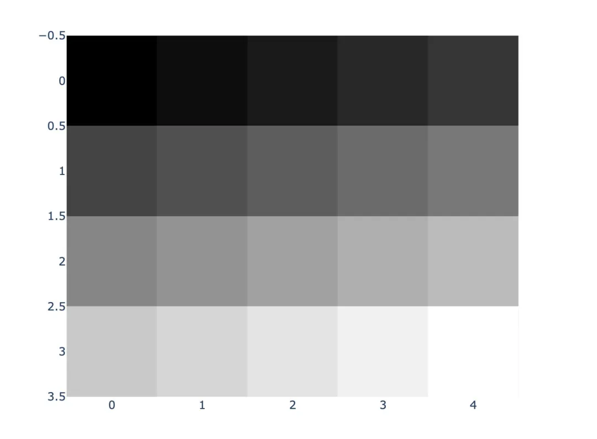
<a name="M4cfl"></a>
#### 3、显示灰色+颜色棒
```python
data = np.arange(20).reshape(4,5)
fig = px.imshow(data,color_continuous_scale="gray")  # 参数设置
fig.show()
```
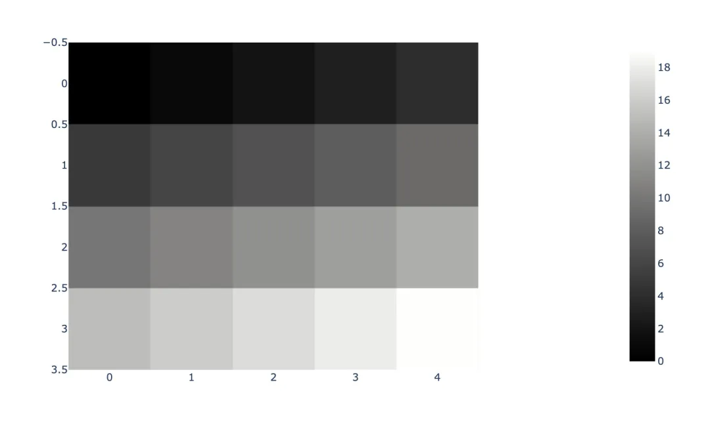
<a name="naWYe"></a>
### 基于图形文件中的数据
<a name="HJC4p"></a>
#### 1、基础图形
```python
# 从skimage中导入数据
from skimage import data  

# 导入指定图像数据
img = data.astronaut()

fig = px.imshow(img, 
                binary_format="jpeg", 
                binary_compression_level=0)
fig.show()
```

<a name="uZDY6"></a>
#### 2、不显示坐标轴刻度
```python
# 从skimage中导入数据
from skimage import data  

# 导入指定图像数据
img = data.astronaut()

fig = px.imshow(img, 
                binary_format="jpeg", 
                binary_compression_level=0)

# 不显示颜色范围和轴刻度
fig.update_layout(coloraxis_showscale=False)
fig.update_xaxes(showticklabels=False)
fig.update_yaxes(showticklabels=False)

fig.show()
```

<a name="eKPpP"></a>
### 自定义轴刻度值
```python
import plotly.express as px

data=[[1, 25, 30, 50, 100], 
      [20, 10, 60, 80, 30], 
      [13, 60, 31, 5, 20]]

fig = px.imshow(
    data,  # 传入数据
    # 轴标签设置
    labels=dict(x="Week", y="Time of Day", color="Productivity"),  
    # 轴刻度设置
    x=['星期一', '星期二', '星期三', '星期四', '星期五'],  
    y=['早', '中', '晚']
    )

# 轴位置调整
fig.update_xaxes(side="top")

fig.show()
```
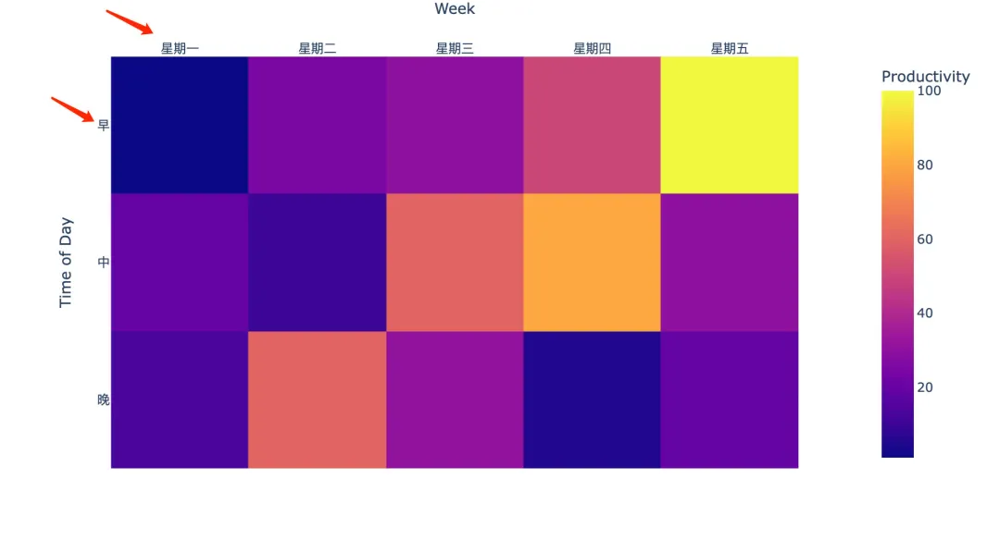
<a name="wSeEc"></a>
## 基于go展示imshow
graph_objects方法支持两种方法来绘制图像绘制：

- `go.Image`：仅支持多通道的图像数据
- `go.Heatmap`：支持单通道的图像数据
<a name="LiOmW"></a>
### 基于`go.Image`方法
```python
import plotly.graph_objects as go

# 2*3*3的列表
rgb = [[[200, 0, 0], [0, 200, 0], [0, 0, 255]],
       [[0, 255, 0], [0, 0, 205], [255, 0, 0]]]

fig = go.Figure(go.Image(z=rgb))

fig.show()
```
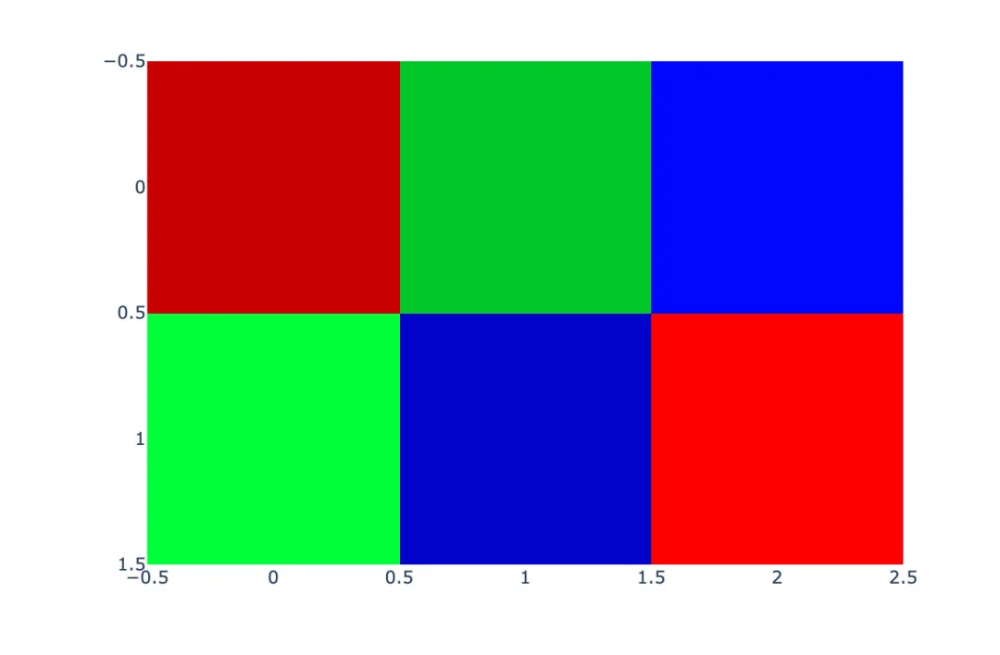
<a name="anOZ5"></a>
### 基于`go.heatMap`方法
```python
import plotly.graph_objects as go

fig = go.Figure(data=go.Heatmap(
                    z=[[10, 20, 30],
                      [20, 1, 60],
                      [30, 60, 10]]))

fig.update_layout(width=800,height=500)

fig.show()
```
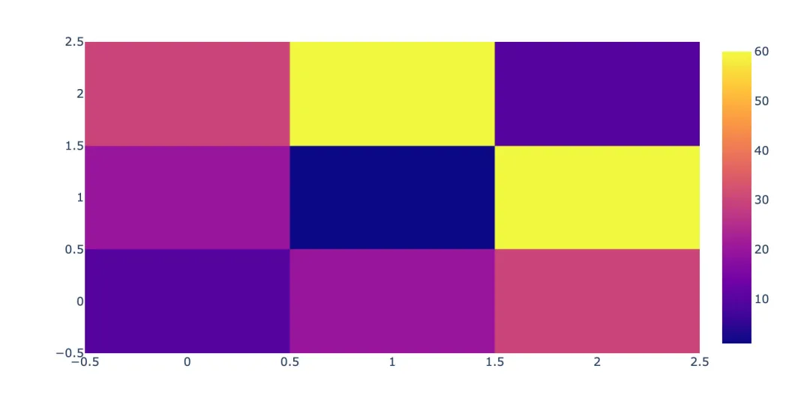
<a name="Wd1LP"></a>
### 缺失值处理
```python
import plotly.graph_objects as go

fig = go.Figure(data=go.Heatmap(
                   z=[[1, None, 30, 50, 1], [20, 1, 60, np.nan, 30], [30, 60, 1, -10, 20]],
                   x=['Monday', 'Tuesday', 'Wednesday', 'Thursday', 'Friday'],
                   y=['Morning', 'Afternoon', 'Evening'],
                   hoverongaps = False))  # 缺失值处理参数
fig.show()
```
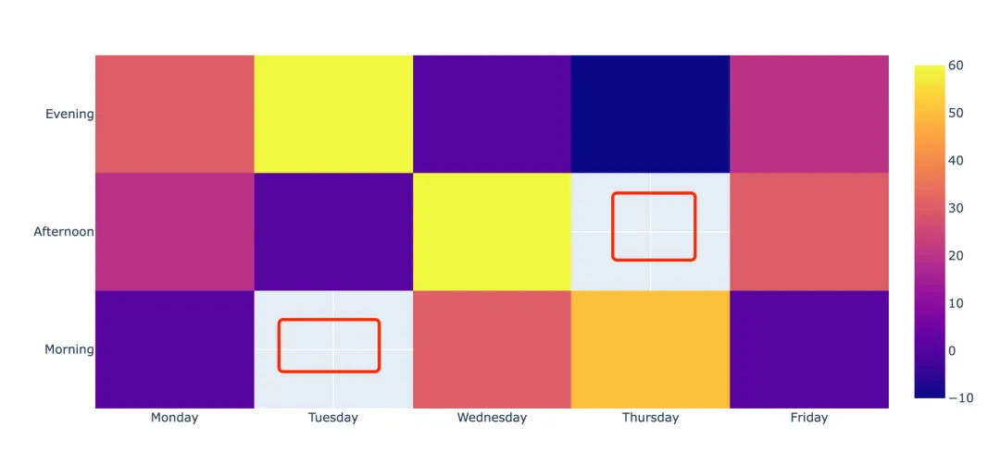
<a name="h85g6"></a>
## 基于图形工厂 figure_factory
figure_factory图形工厂一个重要的作用就是绘制带有标注的热力图。可以看到上面的各种图形都是没有标注的<br />基础图形<br />基于图形工长如何绘制基本待标注的基本图形：
```python
import plotly.figure_factory as ff

z = [[1.1, .3, .5, .7, .9],
     [1, .8, .6, .4, .2],
     [.2, 0, .5, .7, .9],
     [.9, .8, .4, .2, 0]]

fig = ff.create_annotated_heatmap(z)
fig.show()
```
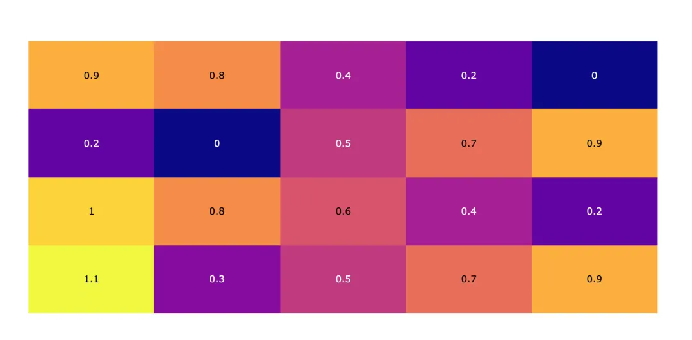
<a name="Ib4NQ"></a>
### 自定义颜色
```python
import plotly.figure_factory as ff

z = [[1.1, .3, .5, .7, .9],
     [1, .8, .6, .4, .2],
     [.2, 0, .5, .7, .9],
     [.9, .8, .4, .2, 0]]

# 添加参数：colorscale
fig = ff.create_annotated_heatmap(z,colorscale='Viridis')

fig.show()
```
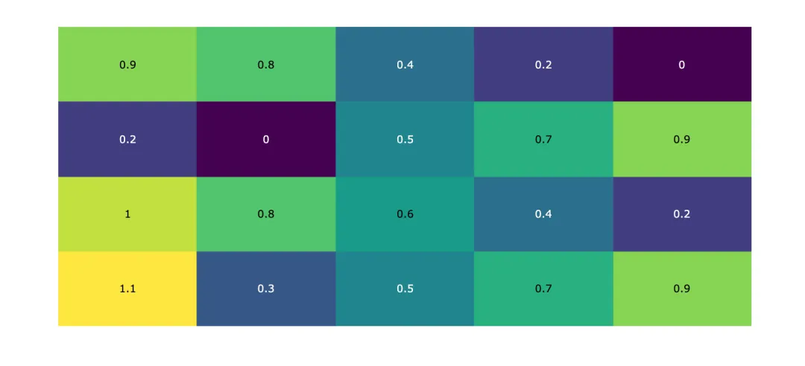<br />如何设置不同的颜色：
```python
import plotly.figure_factory as ff

z = [[.1, .3, .5, .7],
     [1.0, .8, .6, .4],
     [.6, .4, .2, 0.0],
     [.9, .7, .5, .3]]

# 这种写法通过嵌套列表来指定颜色的渐变，更加灵活
colorscale = [[0.0, 'green'],[0.5, 'blue'],[1, 'yellow']]

# 指定字体的颜色
font_colors = ['white', 'red']
# 传入字体和颜色参数
fig = ff.create_annotated_heatmap(z, colorscale=colorscale, font_colors=font_colors)
fig.show()
```
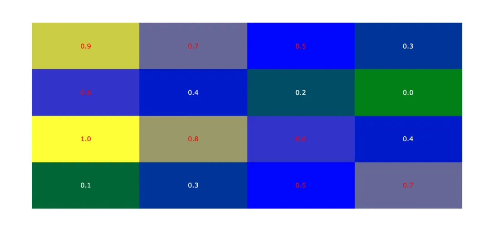
<a name="lnX9M"></a>
### 自定义XY轴
```python
import plotly.figure_factory as ff

# 显示的数据
z = [[101,131,95],
     [112,74,146]]

# 两个轴，可以任意指定
x = ["语文","数学","英语"]
y = ["小明","小红"]

# 待注释的数据，一般和z相同
z_text = [[101,131,95],
          [112,74,146]]

fig = ff.create_annotated_heatmap(
    z,
    x=x,
    y=y,
    annotation_text=z_text, # 标注文本内容
    colorscale='Viridis')

fig.show()
```
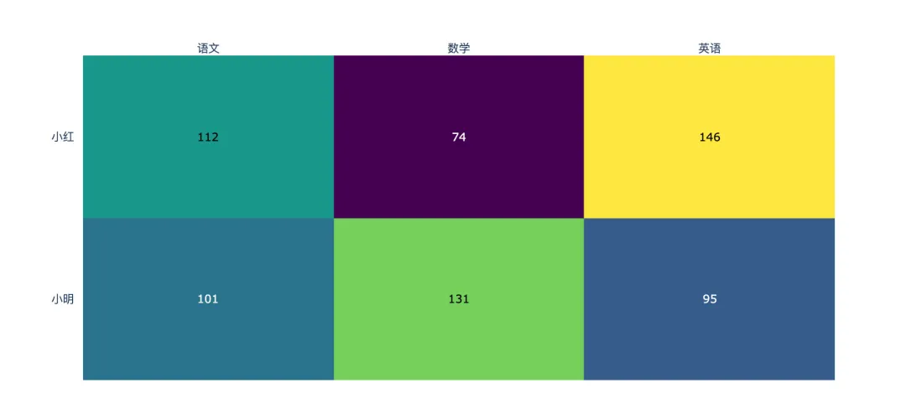
<a name="T0i2h"></a>
### 设置字体大小
有时候更改标准文本中字体的大小：
```python
import plotly.figure_factory as ff

# 显示的数据
z = [[101,131,95],
     [112,74,146]]

# 两个轴，可以任意指定
x = ["语文","数学","英语"]
y = ["小明","小红"]

# 待注释的数据，一般和z相同
z_text = [[101,131,95],
          [112,74,146]]

fig = ff.create_annotated_heatmap(
    z,
    x=x,
    y=y,
    annotation_text=z_text, # 标注文本内容
    colorscale='Viridis')

# 字体大小设置
for i in range(len(fig.layout.annotations)):
    fig.layout.annotations[i].font.size=20

fig.show()
```
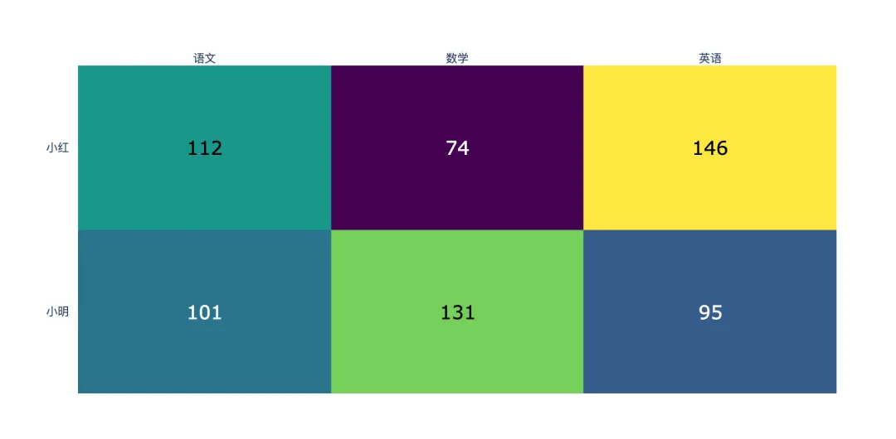
<a name="A4Thy"></a>
## 实战1：相关系数热力图
<a name="Id8CI"></a>
### 使用股票数据
采用的plotly_express内置的股票数据；通过相关系数函数corr函数求解出两两公司之间的相关系数
```python
stock = px.data.stocks()
stock.head()
```
Plotly中内置的一份关于股票的数据：<br />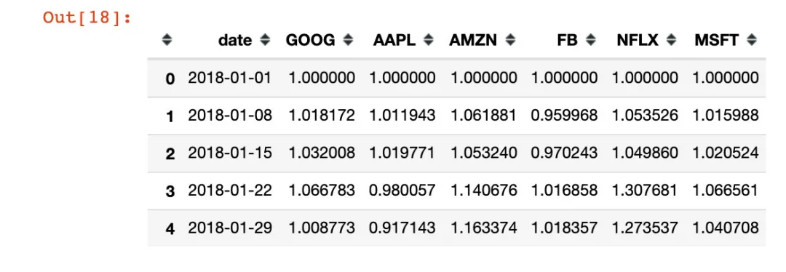
<a name="aUB2V"></a>
### 相关系数
生成相关系数矩阵，同时保留两位小数：<br />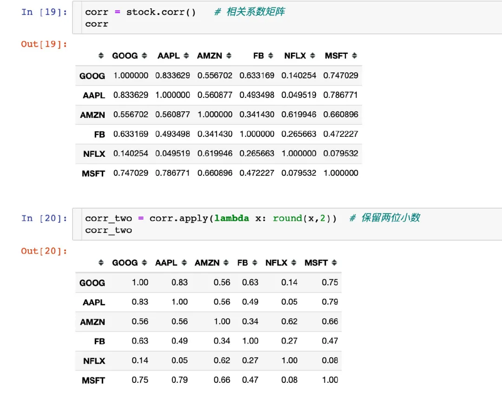
<a name="Qnows"></a>
### 坐标轴和绘图数据
生成坐标轴和待绘图的数据：<br />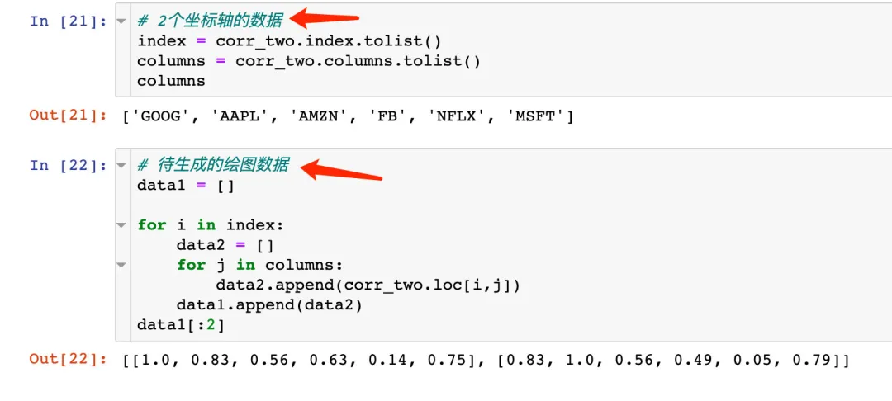
<a name="yEZrx"></a>
### 绘图
```python
import plotly.figure_factory as ff

# 显示的数据
z = data1

# 两个轴，可以任意指定
x = index
y = columns
# 显示的文本内容
z_text = data1

fig = ff.create_annotated_heatmap(
    z,  
    x=x,
    y=y,
    annotation_text=z_text, # 标注文本内容
    colorscale='Viridis',
    showscale=True
)

# 字体大小设置
for i in range(len(fig.layout.annotations)):
    fig.layout.annotations[i].font.size=12

fig.show()
```
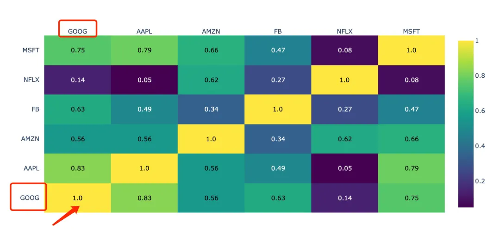
<a name="CIgqQ"></a>
## 案例2：绘制任意坐标轴热力图
这个案例是自己曾经遇到的一个问题的解决过程，就是当坐标轴中出现了数值和字符串两种类型如何解决。
<a name="OZA6H"></a>
### 官网类似案例
两个轴指定的都是字符串类型的数据
```python
import plotly.figure_factory as ff

z = [[101,131,95],
     [112,74,146]]

# 重点：都是字符串类型
x = ['Team A', 'Team B', 'Team C']
y = ['Game Two', 'Game One']

z_text = [[101,131,95],
          [112,74,146]]

fig = ff.create_annotated_heatmap(
    z,
    x=x,
    y=y,
    annotation_text=z_text, # 标注文本内容
    colorscale='Viridis')

fig.show()
```
下面是可以出图的：<br />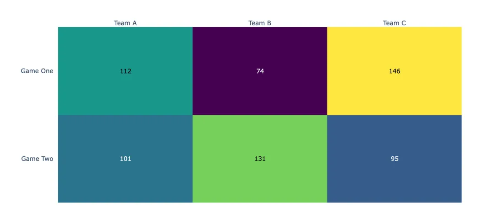
<a name="jso7B"></a>
### 改变坐标轴数据
在坐标轴的数据中，同时使用数值和字符串：<br />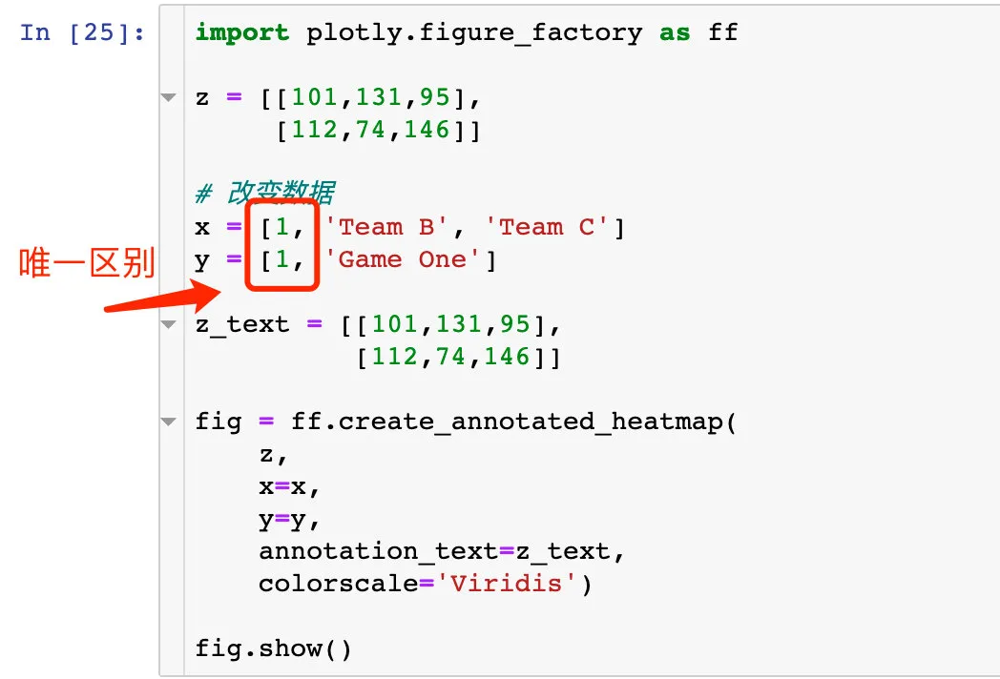<br />这样子就不能出图：问题到底出在哪里呢？<br />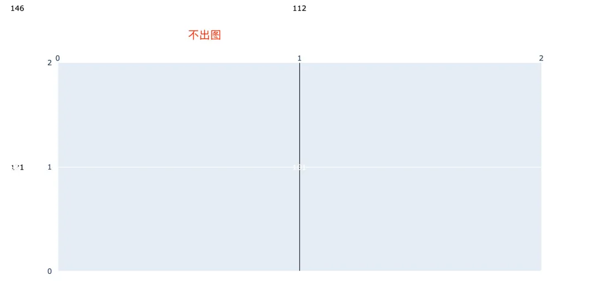<br />如何解决？介绍两种方法:
<a name="cyc5n"></a>
### 方法1：通过参数设置
```python
import plotly.figure_factory as ff

z = [[101,131,95],
     [112,74,146]]

# 1、设置坐标轴数据，统一用数据格式
x = list(range(0,3))
y = list(range(0,2))

z_text = [[101,131,95],
          [112,74,146]]

fig = ff.create_annotated_heatmap(
    z,
    x=x,
    y=y,
    annotation_text=z_text, 
    colorscale='Viridis')

# 解决方法
# 实际坐标轴
xticks=[1, 'Team B', 'Team C']  
yticks=[1, 'Game One']  

# 修改坐标轴：将x用xticks来代替，y轴类似
fig.update_xaxes(tickvals=x, ticktext=xticks)
fig.update_yaxes(tickvals=y, ticktext=yticks)
fig.show()
```

<a name="yX8Wy"></a>
### 方法2：自定义函数
```python
import plotly.figure_factory as ff

z = [[101,131,95],
     [112,74,146]]

x = [1, 'Team B', 'Team C']
y = [1, 'Game One']

# 待显示的数据
z_text = z

# 关键函数：修改坐标轴
def hm_axis(l):
    return [f"{chr(0)+str(i)+chr(0)}" for i in l]

fig = ff.create_annotated_heatmap(
  z, 
  x=hm_axis(x), 
  y=hm_axis(y), 
  annotation_text=z_text, 
  colorscale='Viridis')
fig.show()
```
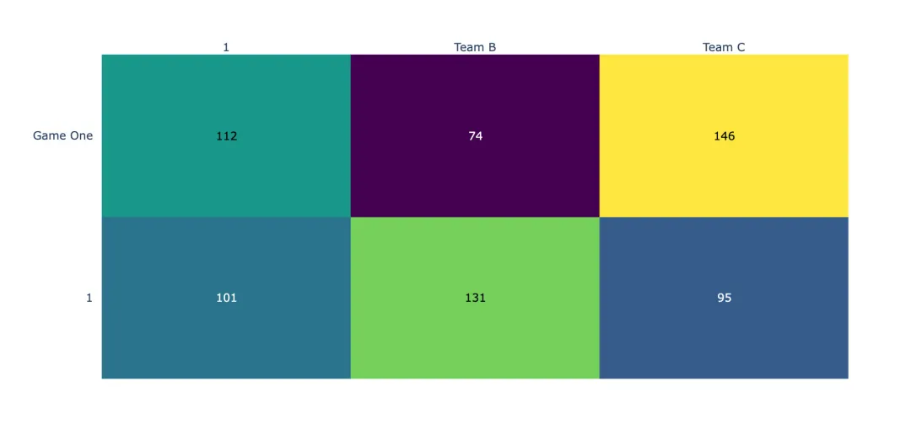
