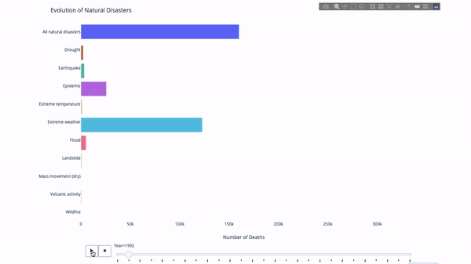
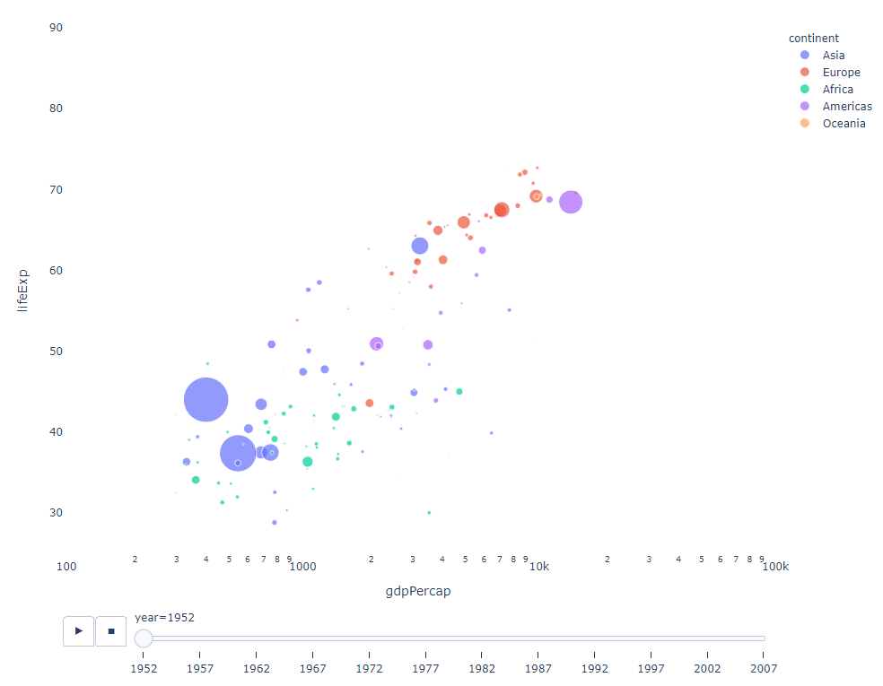
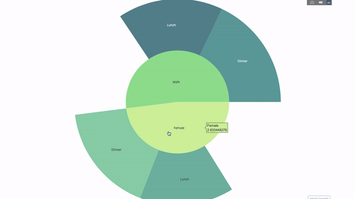
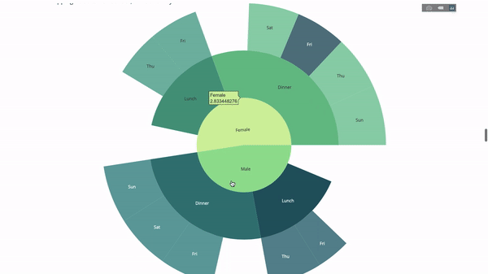
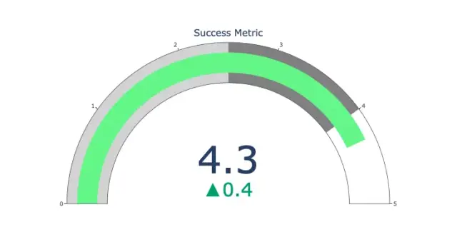
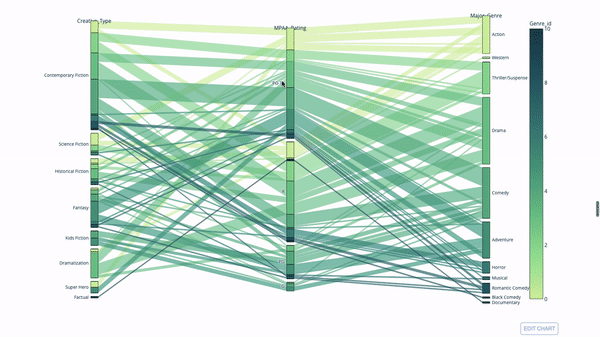
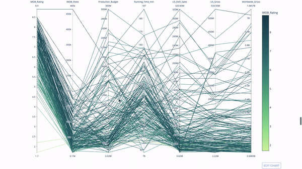

Python Plotly
<a name="Pk2IO"></a>
### 安装模块
如果还没安装 Plotly，只需在终端运行以下命令即可完成安装：
```bash
pip install plotly
```
<a name="pH95m"></a>
### 可视化动态图
在研究这个或那个指标的演变时，常涉及到时间数据。Plotly动画工具仅需一行代码就能让人观看数据随时间的变化情况，如下图所示：<br /><br />代码如下
```python
import plotly.express as px
from vega_datasets import data
df = data.disasters()
df = df[df.Year > 1990]
fig = px.bar(df,
             y="Entity",
             x="Deaths",
             animation_frame="Year",
             orientation='h',
             range_x=[0, df.Deaths.max()],
             color="Entity")
# improve aesthetics (size, grids etc.)
fig.update_layout(width=1000,
                  height=800,
                  xaxis_showgrid=False,
                  yaxis_showgrid=False,
                  paper_bgcolor='rgba(0,0,0,0)',
                  plot_bgcolor='rgba(0,0,0,0)',
                  title_text='Evolution of Natural Disasters',
                  showlegend=False)
fig.update_xaxes(title_text='Number of Deaths')
fig.update_yaxes(title_text='')
fig.show()
```
只要有一个时间变量来过滤，那么几乎任何图表都可以做成动画。下面是一个制作散点图动画的例子：<br />
```python
import plotly.express as px
df = px.data.gapminder()
fig = px.scatter(
    df,
    x="gdpPercap",
    y="lifeExp",
    animation_frame="year",
    size="pop",
    color="continent",
    hover_name="country",
    log_x=True,
    size_max=55,
    range_x=[100, 100000],
    range_y=[25, 90],

    #   color_continuous_scale=px.colors.sequential.Emrld
)
fig.update_layout(width=1000,
                  height=800,
                  xaxis_showgrid=False,
                  yaxis_showgrid=False,
                  paper_bgcolor='rgba(0,0,0,0)',
                  plot_bgcolor='rgba(0,0,0,0)')
```
<a name="urRyE"></a>
### 太阳图
太阳图（sunburst chart）是一种可视化`group by`语句的好方法。如果想通过一个或多个类别变量来分解一个给定的量，那就用太阳图吧。<br />假设想根据性别和每天的时间分解平均小费数据，那么相较于表格，这种双重`group by`语句可以通过可视化来更有效地展示。<br /><br />这个图表是交互式的，可以自己点击并探索各个类别。只需要定义所有类别，并声明它们之间的层次结构（见以下代码中的`parents`参数）并分配对应的值即可，这在案例中即为`group by`语句的输出。
```python
import plotly.graph_objects as go
import plotly.express as px
import numpy as np
import pandas as pd
df = px.data.tips()
fig = go.Figure(go.Sunburst(
    labels=["Female", "Male", "Dinner", "Lunch", 'Dinner ', 'Lunch '],
    parents=["", "", "Female", "Female", 'Male', 'Male'],
    values=np.append(
        df.groupby('sex').tip.mean().values,
        df.groupby(['sex', 'time']).tip.mean().values),
    marker=dict(colors=px.colors.sequential.Emrld)),
                layout=go.Layout(paper_bgcolor='rgba(0,0,0,0)',
                                 plot_bgcolor='rgba(0,0,0,0)'))

fig.update_layout(margin=dict(t=0, l=0, r=0, b=0),
                  title_text='Tipping Habbits Per Gender, Time and Day')
fig.show()
```
现在向这个层次结构再添加一层：<br /><br />为此，再添加另一个涉及三个类别变量的`group by`语句的值
```python
import plotly.graph_objects as go
import plotly.express as px
import pandas as pd
import numpy as np
df = px.data.tips()
fig = go.Figure(go.Sunburst(labels=[
    "Female", "Male", "Dinner", "Lunch", 'Dinner ', 'Lunch ', 'Fri', 'Sat',
    'Sun', 'Thu', 'Fri ', 'Thu ', 'Fri  ', 'Sat  ', 'Sun  ', 'Fri   ', 'Thu   '
],
                            parents=[
                                "", "", "Female", "Female", 'Male', 'Male',
                                'Dinner', 'Dinner', 'Dinner', 'Dinner',
                                'Lunch', 'Lunch', 'Dinner ', 'Dinner ',
                                'Dinner ', 'Lunch ', 'Lunch '
                            ],
                            values=np.append(
                                np.append(
                                    df.groupby('sex').tip.mean().values,
                                    df.groupby(['sex',
                                                'time']).tip.mean().values,
                                ),
                                df.groupby(['sex', 'time',
                                            'day']).tip.mean().values),
                            marker=dict(colors=px.colors.sequential.Emrld)),
                layout=go.Layout(paper_bgcolor='rgba(0,0,0,0)',
                                 plot_bgcolor='rgba(0,0,0,0)'))
fig.update_layout(margin=dict(t=0, l=0, r=0, b=0),
                  title_text='Tipping Habbits Per Gender, Time and Day')

fig.show()
```
<a name="vyS6i"></a>
### 指针图
指针图仅仅是为了好看。在报告 KPI 等成功指标并展示其与目标的距离时，可以使用这种图表。<br />
```python
import plotly.graph_objects as go
fig = go.Figure(go.Indicator(
    domain = {'x': [0, 1], 'y': [0, 1]},
    value = 4.3,
    mode = "gauge+number+delta",
    title = {'text': "Success Metric"},
    delta = {'reference': 3.9},
    gauge = {'bar': {'color': "lightgreen"},
        'axis': {'range': [None, 5]},
             'steps' : [
                 {'range': [0, 2.5], 'color': "lightgray"},
                 {'range': [2.5, 4], 'color': "gray"}],
          }))
fig.show()
```
<a name="wLhMp"></a>
### 桑基图
另一种探索类别变量之间关系的方法是以下这种平行坐标图。可以随时拖放、高亮和浏览值，非常适合演示时使用。<br /><br />代码如下
```python
import plotly.express as px
from vega_datasets import data
import pandas as pd
df = data.movies()
df = df.dropna()
df['Genre_id'] = df.Major_Genre.factorize()[0]
fig = px.parallel_categories(
    df,
    dimensions=['MPAA_Rating', 'Creative_Type', 'Major_Genre'],
    color="Genre_id",
    color_continuous_scale=px.colors.sequential.Emrld,
)
fig.show()
```
<a name="ErJvX"></a>
### 平行坐标图
平行坐标图是上面的图表的衍生版本。这里，每一根弦都代表单个观察。这是一种可用于识别离群值（远离其它数据的单条线）、聚类、趋势和冗余变量（比如如果两个变量在每个观察上的值都相近，那么它们将位于同一水平线上，表示存在冗余）的好用工具。<br /><br />代码如下
```python
import plotly.express as px
from vega_datasets import data
import pandas as pd
df = data.movies()
df = df.dropna()
df['Genre_id'] = df.Major_Genre.factorize()[0]
fig = px.parallel_coordinates(
    df,
    dimensions=[
        'IMDB_Rating', 'IMDB_Votes', 'Production_Budget', 'Running_Time_min',
        'US_Gross', 'Worldwide_Gross', 'US_DVD_Sales'
    ],
    color='IMDB_Rating',
    color_continuous_scale=px.colors.sequential.Emrld)
fig.show()
```
