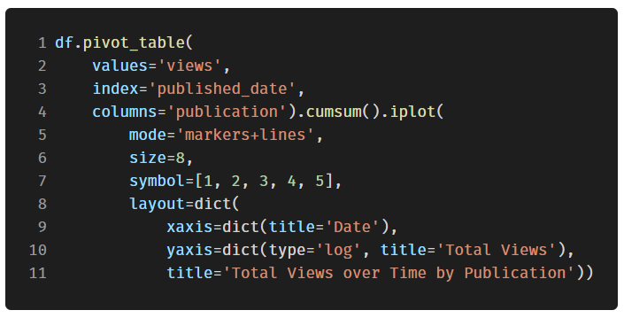

## Plotly 概述
plotly 的 Python 软件包是一个开源的代码库，它基于 plot.js，而后者基于 d3.js。实际使用的则是一个对 plotly 进行封装的库，名叫 cufflinks，它能让你更方便地使用 plotly 和 Pandas 数据表协同工作。
> _*注：Plotly 本身是一个拥有多个不同产品和开源工具集的可视化技术公司。Plotly 的 Python 库是可以免费使用的，在离线模式可以创建数量不限的图表，在线模式因为用到了 Plotly 的共享服务，只能生成并分享 25 张图表。_

本文中的所有可视化图表都是在 Jupyter Notebook 中使用离线模式的 plotly + cufflinks 库完成的。在使用 `pip install cufflinks plotly` 完成安装后，可以用下面这样的代码在 Jupyter 里完成导入：  **单变量分布：柱状图和箱形图** 单变量分析图往往是开始数据分析时的标准做法，而柱状图基本上算是单变量分布分析时必备的图表之一（虽然它还有一些不足）。 就拿博客文章点赞总数为例做一个简单的交互式柱状图：   对于已经习惯 matplotlib 的同学，只需要多打一个字母（把 .plot 改成 .iplot ），就能获得看起来更加美观的交互式图表！点击图片上的元素就能显示出详细信息、随意缩放，还带有（接下来会提到的）高亮筛选某些部分等超棒功能。 如果想绘制堆叠柱状图，也只需要这样：   对 pandas 数据表进行简单的处理，并生成条形图：   就像上面展示的那样，**可以将 plotly + cufflinks 和 pandas 的能力整合在一起**。比如，可以先用 `.pivot()` 进行数据透视表分析，然后再生成条形图。 比如统计不同发表渠道中，每篇文章带来的新增粉丝数：  

交互式图表带来的好处是，可以随意探索数据、拆分子项进行分析。箱型图能提供大量的信息，但如果看不到具体数值，很可能会错过其中的一大部分！

## 散点图
散点图是大多数分析的核心内容，它能让我们看出一个变量随着时间推移的变化情况，或是两个（或多个）变量之间的关系变化情况。

## 时序列分析
在现实世界中，相当部分的数据都带有时间元素。幸运的是，plotly + cufflinks 天生就带有支持时间序列可视化分析的功能。 以在“Towards Data Science”网站上发表的文章数据为例，以发布时间为索引构建一个数据集，看看文章热度的变化情况：   在上图中，用一行代码完成了几件事情：

- 自动生成美观的时间序列 X 轴
- 增加第二条 Y 轴，因为两个变量的范围并不一致
- 把文章标题放在鼠标悬停时显示的标签中

为了显示更多数据，可以方便地添加文本注释：   下面的代码中，将一个双变量散点图按第三个分类变量进行着色：   接下来要玩点复杂的：对数坐标轴。通过指定 plotly 的布局（layout）参数来实现这一点（关于不同的布局，请参考官方文档 [https://plot.ly/python/reference/](https://plot.ly/python/reference/) ），同时把点的尺寸（size参数）和一个数值变量 read_ratio （阅读比例）绑定，数字越大，泡泡的尺寸也越大。   如果想要更复杂一些（详见 Github 的源代码），甚至可以在一张图里塞进 4 个变量！（然而并不推荐真的这么搞）  和前面一样，可以将 pandas 和 plotly+cufflinks 结合起来，实现许多有用的图表：   建议查看官方文档，或者源代码，里面有更多的范例和函数实例。只需要简单的一两行代码，就可以为图表加上文字注释，辅助线，最佳拟合线等有用的元素，并且保持原有的各种交互式功能。

## 高级绘图功能
接下来，要详细介绍几种特殊的图表，平时可能并不会很经常用到它们，但只要用好了它们，一定能让人刮目相看。要用到 plotly 的 figure_factory 模块，只需要一行代码，就能生成超棒的图表！

## 散点图矩阵
假如要探索许多不同变量之间的关系，散点图矩阵（也被称为SPLOM）就是个很棒的选择：   即使是这样复杂的图形，也是完全可交互的，能更详尽地对数据进行探索。

## 关系热图
为了体现多个数值变量间的关系，可以计算它们的相关性，然后用带标注热度图的形式进行可视化：  

## 自定义主题
除了层出不穷的各种图表外，Cufflinks 还提供了许多不同的着色主题，方便轻松切换各种不同的图表风格。下面两张图分别是“太空”主题和“ggplot”主题：   此外，还有 3D 图表（曲面和泡泡）：   对有兴趣研究的用户来说，做张饼图也不是什么难事： 

## 在 Plotly 图表工坊（Plotly Chart Studio）里编辑
当在 Jupyter Notebook 里生成了这些图表之后，会发现图表的右下角出现了一个小小的链接，写着“Export to plot.ly（发布到 plot.ly）”。如果点击这个链接，将会跳转到一个“图表工坊”（https://plot.ly/create/）。 在这里，可以在最终展示之前进一步修改和润色图表。可以添加标注，选择某些元素的颜色，把一切都整理清楚，生成一个超棒的图表。之后，还可以将它发布到网络上，生成一个供其他人查阅的链接。 下面两张图是在图表工坊里制作的：   限于篇幅，有些更棒的图表和范例，只好请大家访问 plotly 和 cufflinks 的官方文档去一一查看。 
