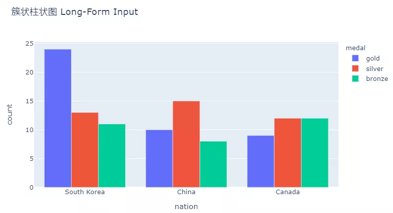

Python 可视化 Plotly
<a name="Infsu"></a>
## 准备工作
这边是在jupyterlab中演示的plotly图表，如果只安装plotly是无法正常显示图表的（会显示为空白），需要进行以下准备(以下命令均在cmd下操作即可)：
```bash
# 安装plotly库及plotly-orca库
pip install plotly
pip install plotly plotly-orca

# Basic JupyterLab renderer support
jupyter labextension install jupyterlab-plotly

# OPTIONAL: Jupyter widgets extension for FigureWidget support
jupyter labextension install @jupyter-widgets/jupyterlab-manager plotlywidget
```
参考：[https://github.com/plotly/plotly.py](https://github.com/plotly/plotly.py)<br />plotly有两种绘图方式，其一是原始`graph_objects`，其二是Plotly Express。这里用到的是后者，至于其中的区别，大概就是后者是高级版本，封装了很多后者的复杂操作，可以直接用`pandas.Dataframe`类型，是现在主推的。
<a name="EnJsO"></a>
## 1、柱状图
在excel插入图表的时候，柱状图一般可选堆叠柱状图和簇状柱状图。
<a name="vHpgR"></a>
### 柱状图：
```python
# 自带数据集 gapminder
data = px.data.gapminder()
data.head()
```

```python
# 柱状图
import plotly.express as px
data_canada = px.data.gapminder().query("country == 'Canada'")
fig = px.bar(
    data_canada, # 数据集
    x='year', # x轴
    y='pop', # y轴
)
fig.show()
```

<a name="wOfXn"></a>
### 堆叠柱状图：
```python
# 自带数据集 medals_long（长表数据）
long_df = px.data.medals_long()
long_df.head()
```

```python
# 堆叠柱状图 （使用长表数据，这种数据excel无法直接绘制堆叠图）
import plotly.express as px

long_df = px.data.medals_long()
fig = px.bar(
    long_df,  # 数据集
    x="nation",  # x轴
    y="count",  # y轴
    color="medal",  # 图例颜色（这种情况下需要设定该参数根据medal类型才区分，否则同色）
    title="堆叠柱状图 Long-Form Input", # 图表标题
)
fig.show()
```

```python
# 自带数据集 medals_long（宽表数据）
wide_df = px.data.medals_wide()
wide_df.head()
```

```python
# 堆叠柱状图 （使用长表数据，这种数据excel可以直接绘制堆叠图）
import plotly.express as px

wide_df = px.data.medals_wide()
fig = px.bar(wide_df, x="nation", 
             y=["gold", "silver", "bronze"], 
             title="堆叠柱状图 Wide-Form Input")
fig.show()
```

<a name="rKfpj"></a>
### 簇状柱状图：
```python
# 簇状柱状图
import plotly.express as px

long_df = px.data.medals_long()
fig = px.bar(
    long_df,  
    x="nation",  
    y="count",  
    color="medal",  
    title="簇状柱状图 Long-Form Input", 
    barmode='group', # barmode 设置为 group则为簇状柱形图，可选 stack(叠加)、group(并列)、overlay(覆盖)、relative(相对)
)
fig.show() 
```

<a name="n6non"></a>
### 类似于excel里柱状图填充色中依据数据点着色：
```python
# 类似于excel里柱状图填充色中依据数据点着色
import plotly.express as px

data = px.data.gapminder()
data_canada = data[data.country == 'Canada']
fig = px.bar(data_canada, x='year', y='pop',
             hover_data=['lifeExp', 'gdpPercap'], 
             color='lifeExp', # 指定柱状图颜色根据 lifeExp字段数值大小自动着色
             labels={'pop':'population of Canada'}, 
             height=400, # 图表高度
            )
fig.show()
```

<a name="KIPYD"></a>
## 2、条形图
条形图其实就是柱状图转个90度，横着显示呗。所以，本质上是一样的，唯一的区别：在 Bar 函数中设置`orientation='h'`，其余参数与柱状图相同。
```python
# 在plotly绘图中，条形图与柱状图唯一的区别：在 Bar 函数中设置orientation='h'，其余参数与柱状图相同
import plotly.express as px
data = px.data.gapminder()

data_canada = data[data.country == 'Canada']
fig = px.bar(data_canada, y='year', x='pop',
             hover_data=['lifeExp', 'gdpPercap'], 
             color='lifeExp', # 指定柱状图颜色根据 lifeExp字段数值大小自动着色
             labels={'pop':'population of Canada'}, 
             height=600, # 图表高度
             width=800, # 图表宽度
             orientation='h' # 条形图设置参数
            )
fig.show()
```

<a name="HflnZ"></a>
## 3、折线图
折线图大致可以是画一个折线图或多条折线图。
<a name="Z1VmE"></a>
### 单个折线图：
```python
# 折线图
import plotly.express as px

df = px.data.gapminder().query("country=='Canada'")
fig = px.line(df, x="year", y="lifeExp", title='Life expectancy in Canada',
              text='lifeExp', # 数据点显示值
              line_shape='linear', # 共有6种插值方式：'linear'、'spline'、'hv'、'vh'、'hvh'和'vhv。
             )
fig.update_traces(
    texttemplate='%{text:.2f}', # 数据点显示值的格式
    textposition='top center', # 数据点显示的位置：'top left', 'top center', 'top right', 'middle left','middle center', 'middle right', 'bottom left', 'bottom center', 'bottom right'
) 
fig.show()
```

<a name="oS8xa"></a>
### 多折线图：
```python
# 多折线图
import plotly.express as px

# 比如绘制大洋洲（有澳大利亚和新西兰）
df = px.data.gapminder().query("continent=='Oceania'")
fig = px.line(df, x="year", y="lifeExp", 
              color='country', # 按照国家区分
             )
fig.show()
```

<a name="rkoRL"></a>
### 分组多折线图：
```python
# 分组多折线图
import plotly.express as px

# 绘制各大洲每个国家人均寿命随着时间变化曲线
df = px.data.gapminder().query("continent != 'Asia'") # remove Asia for visibility
fig = px.line(df, x="year", y="lifeExp", 
              color="continent",
              line_group="country", 
              hover_name="country")
fig.show()
```

<a name="KAZoX"></a>
## 4、面积图
```python
import plotly.express as px

# 比如绘制大洋洲（有澳大利亚和新西兰）
df = px.data.gapminder().query("continent=='Oceania'")
fig = px.area(df, x="year", y="pop", 
              color='country', # 按照国家区分
             )
fig.show()
```

<a name="Gw5Gg"></a>
## 5、饼图与圆环图
在用excel绘制饼图的时候，可以选择既定配色方案，还可以自定义每个色块的颜色。用plotly绘制的时候，这些自定义操作也是支持的。
```python
# 饼图
import plotly.express as px

# 筛选2007年欧洲数据
df = px.data.gapminder().query("year == 2007").query("continent == 'Europe'")
# 将小于200万的国家标记为其他
df.loc[df['pop'] < 2.e6, 'country'] = 'Other countries' 
# 绘制饼图
fig = px.pie(df, values='pop', names='country', title='Population of European continent')
fig.show()
```

<a name="LLBFc"></a>
### 字段多条数据自动处理：
```python
# 自带数据集 tips,字段day下是星期，存在多条
df = px.data.tips()
df.head()
```
<br />可以看到，在tips数据集中，day字段是星期，包含很多同星期的数据。在进行饼图绘制的时候，以day字段做分类，可以自动实际聚合求和操作。
```python
# 如果 分类 标签下有很多数据，则会自动进行分组求和
import plotly.express as px

# This dataframe has 244 lines, but 4 distinct values for `day`
df = px.data.tips()
fig = px.pie(df, values='tip', names='day')
fig.show()
```

<a name="a5c4S"></a>
### 设置配色方案：
```python
# 设置配色方案
import plotly.express as px

df = px.data.tips()
fig = px.pie(df, values='tip', names='day', 
             color_discrete_sequence=px.colors.sequential.RdBu, # 设置配色方案
            )
fig.show()
```

<a name="jqmbt"></a>
### 也可以自定义每个色块颜色：
```python
# 自定义配色
import plotly.express as px

df = px.data.tips()
fig = px.pie(df, values='tip', names='day', color='day',
             color_discrete_map={'Thur':'lightcyan',
                                 'Fri':'cyan',
                                 'Sat':'royalblue',
                                 'Sun':'darkblue'})
fig.show()
```

<a name="wiXyX"></a>
### 在饼图上显示数据标签：
```python
# 在饼图上显示数据标签
import plotly.express as px

df = px.data.gapminder().query("year == 2007").query("continent == 'Asia'")
fig = px.pie(df, values='pop', names='country',
             title='Population of American continent',
             hover_data=['lifeExp'], 
             labels={'lifeExp':'life expectancy'}
            )
fig.update_traces(textposition='inside', 
                  textinfo='percent+label' # 数据标签显示的内容
                 )
fig.show()
```

<a name="INvaJ"></a>
### 圆环图：
圆环图是指饼图中间一定半径的圆部分为空白，设置参数`hole=int`即可（0-1）。
```python
# 圆环图
import plotly.express as px

df = px.data.tips()
fig = px.pie(df, values='tip', names='day', 
             color_discrete_sequence=px.colors.sequential.RdBu,
             hole=.3, # 设置空心半径比例
            )
fig.show()
```

<a name="yOgYT"></a>
## 6、散点图
散点图是x和y均为数字列表情况下的坐标点图。
<a name="zCA28"></a>
### x轴和y轴均是列表的形式：
```python
# x轴和y轴均是列表的形式
import plotly.express as px

fig = px.scatter(x=[0, 1, 2, 3, 4], y=[0, 1, 4, 9, 16])
fig.show()
```

<a name="kjpd6"></a>
### 给定pd.Dataframe类型数据：
```python
# 自带数据集 iris
df = px.data.iris()
df.head()
```
<br />
```python
# 设置数据点颜色和大小
import plotly.express as px
df = px.data.iris()
fig = px.scatter(df, x="sepal_width", y="sepal_length", 
                 color="species", # 根据species字段区分颜色
                 size='petal_length', # 根据sepal_length设置大小
                 hover_data=['petal_width'],
                )
fig.show()
```

<a name="OO60Q"></a>
### 做个三角函数的图：
```python
import plotly.express as px
import numpy as np

t = np.linspace(0, 2*np.pi, 100)

fig = px.scatter(x=t, y=np.cos(t), labels={'x':'t', 'y':'cos(t)'})
fig.show()
```
")
<a name="uFWWI"></a>
## 7、气泡图
```python
# 气泡图
import plotly.express as px

df = px.data.gapminder()

fig = px.scatter(df.query("year==2007"), x="gdpPercap", y="lifeExp",
                 size="pop",  # 设置气泡大小依据字段pop
                 color="continent",
                 hover_name="country", 
                 log_x=True, 
                 size_max=60, #设置最大气泡
                )
fig.show()
```

<a name="jLBU0"></a>
## 8、极坐标(雷达图)
极坐标下，可以用点或线进行构图，绘制点则用`px.scatter_polar`，绘制线则用`px.line_polar`。
```python
# 自带数据集 wind
df = px.data.wind()
df.head()
```

```python
import plotly.express as px

df = px.data.wind()
fig = px.scatter_polar(df, 
                       r="frequency", # 半径
                       theta="direction", # 类型
                      )
fig.show()
```

<a name="edpLI"></a>
### 着色和分组标识：
```python
import plotly.express as px

df = px.data.wind()
fig = px.scatter_polar(df, r="frequency", theta="direction",
                       color="strength",  # 颜色根据strength着色
                       symbol="strength",  # 符号根据strength区分
                       size="frequency", # 大小根据 frequency 区分
                       color_discrete_sequence=px.colors.sequential.Plasma_r, # 设置配色方案
                      )
fig.show()
```

<a name="ZPRvV"></a>
### 雷达图：
```python
# 雷达图
import plotly.express as px

df = px.data.wind()
fig = px.line_polar(df, r="frequency", 
                    theta="direction", 
                    color="strength", 
                    line_close=True, # 线条是否闭环
                    color_discrete_sequence=px.colors.sequential.Plasma_r,
                    template="plotly_dark", # 主题模板 
                   )
fig.show()
```

<a name="hzWut"></a>
### 扇形区域图：
```python
# 扇形图区域
import plotly.express as px

fig = px.scatter_polar(r=range(0,90,10), theta=range(0,90,10),
                       range_theta=[0,90], # 设定区域
                       start_angle=0, 
                       direction="counterclockwise", # 方位：'counterclockwise' 逆时针 ，'clockwise'顺时针 
                      )
fig.show()
```

