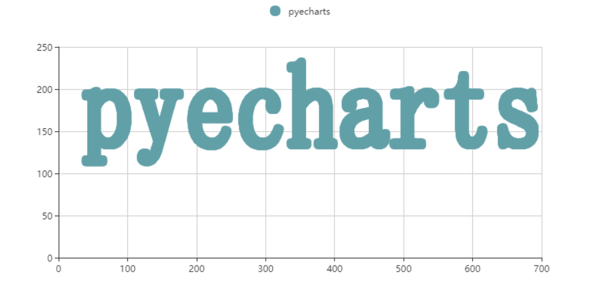
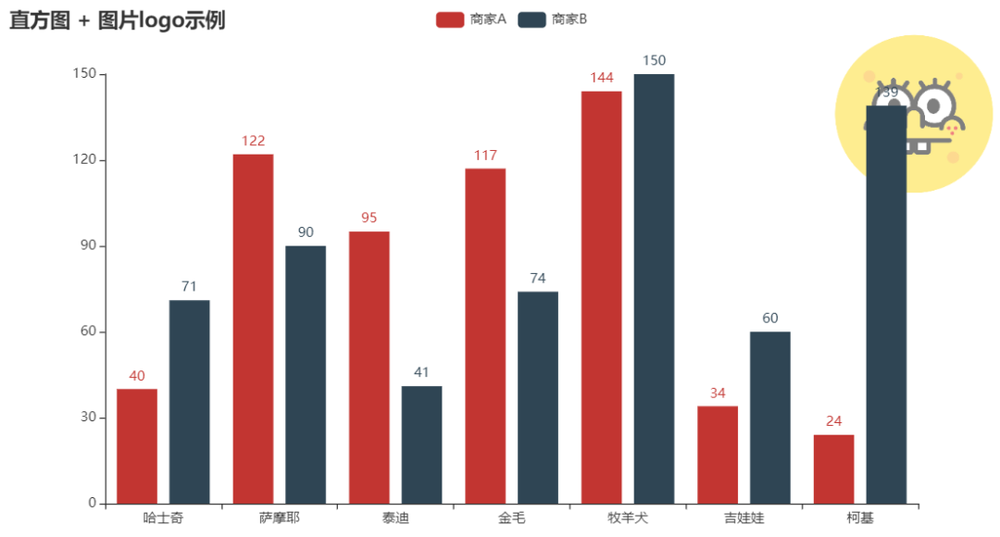
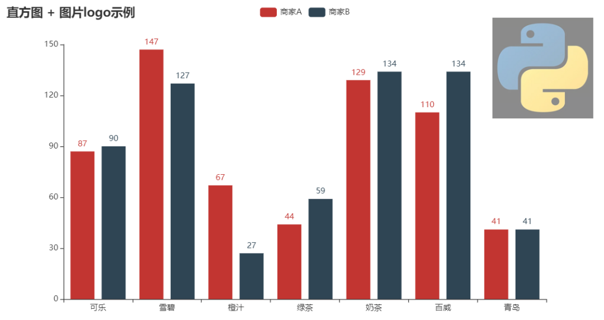
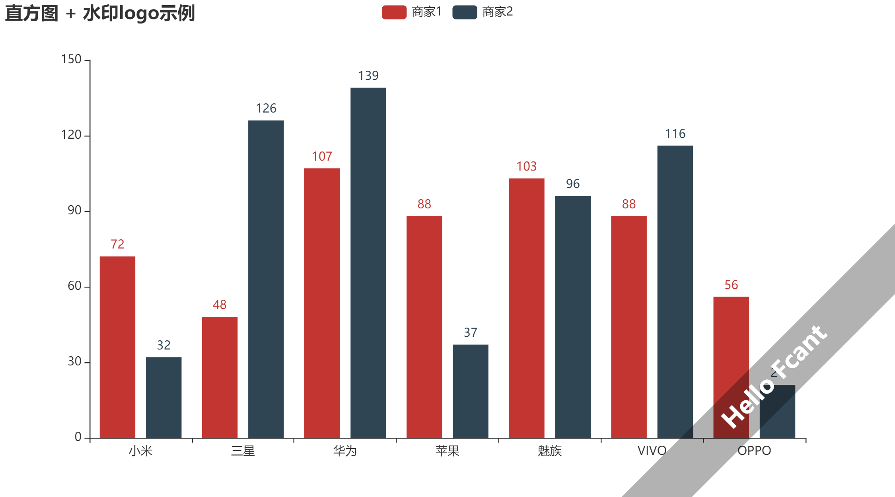
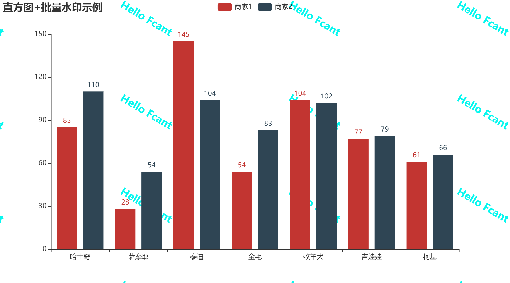
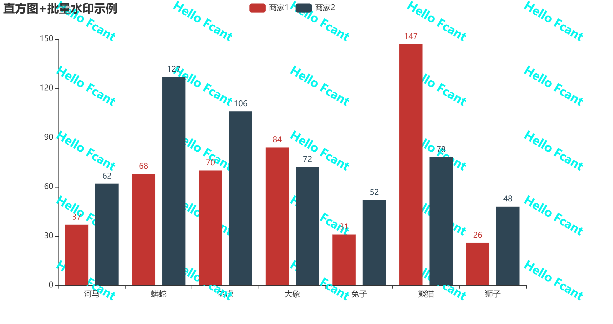

Python 可视化 Pyecharts<br /><br />pyecharts当中的Graphic组件主要用于已经绘制的图表增添图片作为背景logo，或者自定义文字来作为图表的水印，来看一个简单的例子，代码如下
```python
c = (
    Bar()
    .add_xaxis(Faker.choose())
    .add_yaxis("商家A", Faker.values())
    .add_yaxis("商家B", Faker.values())
    .set_global_opts(
        title_opts=opts.TitleOpts(title="直方图 + 图片logo示例"),
        graphic_opts=[
            opts.GraphicImage(
                graphic_item=opts.GraphicItem(
                    id_="logo", right=20, top=20, z=-10, bounding="raw", origin=[75, 75]
                ),
                graphic_imagestyle_opts=opts.GraphicImageStyleOpts(
                    image="https://user-images.githubusercontent.com/19553554/71825144-2d568180-30d6-11ea-8ee0-63c849cfd934.png",
                    width=150,
                    height=150,
                    opacity=0.5,
                ),
            )
        ],
    )
    .render("graphic_image_test.html")
)
```
<br />可以看到绘制的直方图的图表右上角有图片logo，同时也能看到参数如**“width”**以及**“height”**等等**用来设置图片的高度与宽度**，同时参数**“right”**和**“top”**是**用来调整图片的位置的**，读者可以自己私底下自己去练习，除了引用网上的图片之外，也可以使用本地的图片来作为logo，代码如下
```python

c = (
    Bar()
    .add_xaxis(Faker.choose())
    .add_yaxis("商家A", Faker.values())
    .add_yaxis("商家B", Faker.values())
    .set_global_opts(
        title_opts=opts.TitleOpts(title="直方图 + 图片logo示例"),
        graphic_opts=[
            opts.GraphicImage(
                graphic_item=opts.GraphicItem(
                    id_="logo", right=20, top=20, z=-10, bounding="raw", origin=[75, 75]
                ),
                graphic_imagestyle_opts=opts.GraphicImageStyleOpts(
                    image="图片路径//python1.png",
                    width=150,
                    height=150,
                    opacity=0.5,
                ),
            )
        ],
    )
    .render("graphic_image_test.html")
)
```
出来的结果如下图所示<br /><br />也可以添加文字来制作logo，代码如下
```python

c = (
    Bar()
    .add_xaxis(Faker.choose())
    .add_yaxis("商家1", Faker.values())
    .add_yaxis("商家2", Faker.values())
    .set_global_opts(
        title_opts=opts.TitleOpts(title="直方图 + 水印logo示例"),
        graphic_opts=["代码太多了，写不下了，具体想看源码的，后台发送“pyecharts水印”"]
    )
    .render("graphic_rect_bar_test.html")
)
```
<br />出来的结果如下，可以看到在图片的右下角的地方有文字“**关于数据分析与可视化**”作为水印logo，为此也可以批量的生成文字水印，不过会影响到图表的整体的美观程度，代码如下
```python
nums = 3
right_pos = [pos for pos in range(0, 90, int(90/nums))]
right_pos = [pos for pos in right_pos]
top_pos = [pos for pos in range(0, 90, int(90/nums))]
top_pos = [pos for pos in top_pos]
pos_tur = [item for item in itertools.product(right_pos,top_pos)]

def graphics(pos):
    return opts.GraphicGroup(
                graphic_item=opts.GraphicItem(
                    rotation=100,
                    right=f'{pos[0]}%', top=f'{pos[1]}%', z=1),
                children=[
                    opts.GraphicText(
                        graphic_item=opts.GraphicItem(
                            left="center", top="middle", z=1
                        ),
                        graphic_textstyle_opts=opts.GraphicTextStyleOpts(
                            text="Hello Fcant",
                            font=f"bold 15px Microsoft YaHei",
                            graphic_basicstyle_opts=opts.GraphicBasicStyleOpts(
                                fill="#05f7ef"
                            ),
                        ),
                    ),
                ],
            )
            
graphics_lst = [graphics(i) for i in pos_tur]
c = (
    Bar()
    .add_xaxis(Faker.choose())
    .add_yaxis("商家1", Faker.values())
    .add_yaxis("商家2", Faker.values())
    .set_global_opts(
        title_opts=opts.TitleOpts(title="直方图+批量水印示例"),
        graphic_opts=graphics_lst,
    )
)
c.render("watermark1.html")
```
<br />可以将上面的代码拆开来一个一个看，首先
```python
graphic_item=opts.GraphicItem(
    rotation=100,
    right=xxx%,
    top=xxx%,
    z=1),
```
这部分的代码主要来**设定水印的位置**，**旋转的角度**等等，其次是
```python
graphic_textstyle_opts=opts.GraphicTextStyleOpts(
    text="Hello Fcant",
    font=f"bold 20px Microsoft YaHei",
    graphic_basicstyle_opts=opts.GraphicBasicStyleOpts(
        fill="#05f7ef"
    ),
),
```
“**text**”部分表示的是**水印的文字内容**，而“**font**”代表的明显是**字体以及字体大小咯**，然后“**fill**”代表的是**文字的颜色**
```python
nums = 3
right_pos = [pos for pos in range(0, 90, int(90/nums))]
right_pos = [pos for pos in right_pos]
top_pos = [pos for pos in range(0, 90, int(90/nums))]
top_pos = [pos for pos in top_pos]
pos_tur = [item for item in itertools.product(right_pos,top_pos)]
```
这部分的代码表示的是**文字logo生成的数量**，要是将“nums”改成5，那么就会生成更多的文字水印，如下图，进一步影响图表的美观程度，估计有密集恐惧症的人会些许感觉到不适。
```python
nums = 5
right_pos = [pos for pos in range(0, 100, int(100/nums))]
right_pos = [pos for pos in right_pos]
top_pos = [pos for pos in range(0, 100, int(100/nums))]
top_pos = [pos for pos in top_pos]
pos_tur = [item for item in itertools.product(right_pos,top_pos)]
```

<a name="p7eP6"></a>
## 附录——源代码
[pyecharts_watermark.py](https://www.yuque.com/attachments/yuque/0/2021/txt/396745/1633656438019-2511c011-5f6a-4038-ba23-c8611b8cae57.txt?_lake_card=%7B%22src%22%3A%22https%3A%2F%2Fwww.yuque.com%2Fattachments%2Fyuque%2F0%2F2021%2Ftxt%2F396745%2F1633656438019-2511c011-5f6a-4038-ba23-c8611b8cae57.txt%22%2C%22name%22%3A%22pyecharts_watermark.py%22%2C%22size%22%3A3703%2C%22type%22%3A%22text%2Fplain%22%2C%22ext%22%3A%22txt%22%2C%22status%22%3A%22done%22%2C%22taskId%22%3A%22u68d15055-6c06-48cc-966b-a354fec9269%22%2C%22taskType%22%3A%22upload%22%2C%22id%22%3A%22u55d8b2f3%22%2C%22card%22%3A%22file%22%7D)
