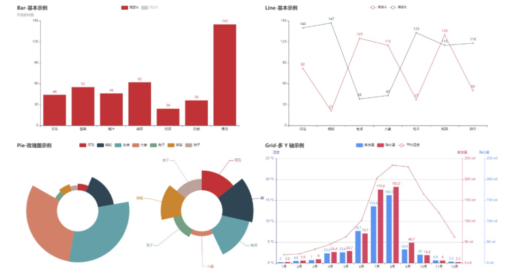
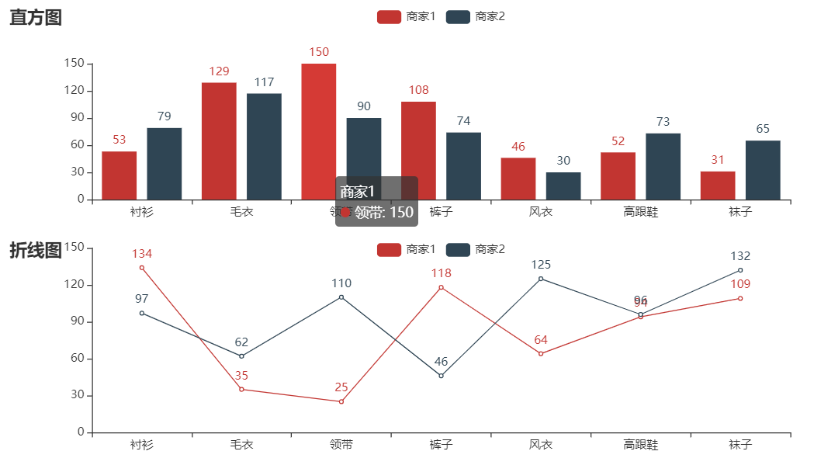
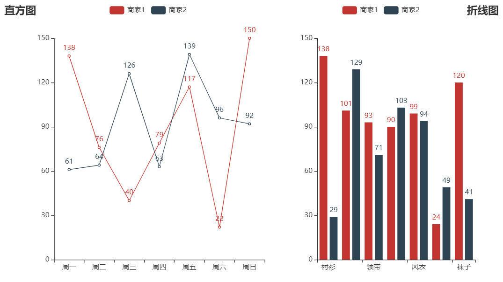
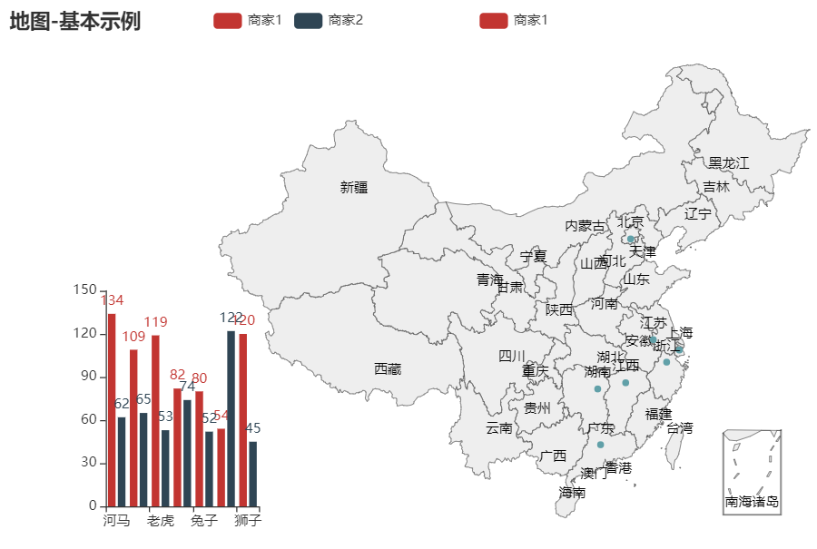
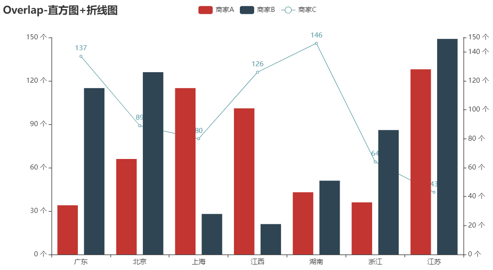
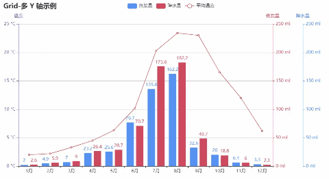
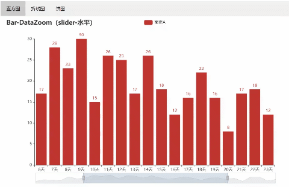
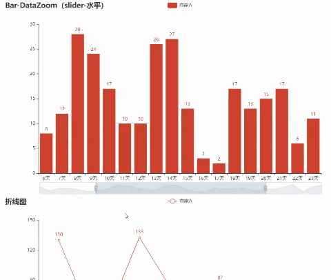

Python 可视化 Pyecharts<br />
<a name="jFThQ"></a>
## Grid组件
首先介绍Pyecharts模块当中的Grid组件，使用Grid组件可以很好地将多张图无论是上下组合还是左右组合，都能够很好地拼接起来，先来看第一个例子
```python
bar = (
    Bar()
    .add_xaxis(Faker.choose())
    .add_yaxis("商家1", Faker.values())
    .add_yaxis("商家2", Faker.values())
    .set_global_opts(title_opts=opts.TitleOpts(title="直方图"))
)
line = (
    Line()
    .add_xaxis(Faker.choose())
    .add_yaxis("商家1", Faker.values())
    .add_yaxis("商家2", Faker.values())
    .set_global_opts(
        title_opts=opts.TitleOpts(title="折线图", pos_top="48%"),
        legend_opts=opts.LegendOpts(pos_top="48%"),
    )
)

grid = (
    Grid()
    .add(bar, grid_opts=opts.GridOpts(pos_bottom="60%"))
    .add(line, grid_opts=opts.GridOpts(pos_top="50%"))
    .render("水平组合图_test.html")
)
```
<br />可以看到两张图表被以上下组合的方式拼接起来，当然除了上下的拼接以外，还可以**左右**来拼接，代码如下
```python
bar = (
    Bar()
    .add_xaxis(Faker.choose())
    .add_yaxis("商家1", Faker.values())
    .add_yaxis("商家2", Faker.values())
    .set_global_opts(title_opts=opts.TitleOpts(title="直方图"),legend_opts=opts.LegendOpts(pos_left="20%"),)
)
line = (
    Line()
    .add_xaxis(Faker.choose())
    .add_yaxis("商家1", Faker.values())
    .add_yaxis("商家2", Faker.values())
    .set_global_opts(
        title_opts=opts.TitleOpts(title="折线图", pos_right="5%"),
        legend_opts=opts.LegendOpts(pos_right="20%"),
    )
)

grid = (
    Grid()
    .add(bar, grid_opts=opts.GridOpts(pos_left="60%"))
    .add(line, grid_opts=opts.GridOpts(pos_right="50%"))
    .render("垂直组合图_test.html")
)
```
<br />可以看到无论是想上下拼接还是左右拼接，都可以通过调整参数“`**pos_left**`”、“`pos_right`”、“`pos_top`”以及“`**pos_bottom**`”这几个参数来实现们再来看一下下面这个例子们也可以将地图和直方图两者拼接起来
```python
bar = (
    Bar()
    .add_xaxis(Faker.choose())
    .add_yaxis("商家1", Faker.values())
    .add_yaxis("商家2", Faker.values())
    .set_global_opts(legend_opts=opts.LegendOpts(pos_left="20%"))
)

map = (
    Map()
    .add("商家1", [list(z) for z in zip(Faker.provinces, Faker.values())], "china")
    .set_global_opts(title_opts=opts.TitleOpts(title="地图-基本示例"))
)

grid = (
    Grid()
    .add(bar, grid_opts=opts.GridOpts(pos_top="50%", pos_right="75%"))
    .add(map, grid_opts=opts.GridOpts(pos_left="60%"))
    .render("地图+直方图.html")
)
```

<a name="DzOW7"></a>
## Overlap组件
英文单词“overlap”的意思是重叠，那么放在这里，也就指的是可以**将多张图合并成一张**，那么该怎么结合才好呢？来看一下下面这个例子，将直方图和折线图通过overlap组件组合到一起
```python
v1 = Faker.values()
v2 = Faker.values()
v3 = Faker.values()

bar = (
    Bar()
    .add_xaxis(Faker.provinces)
    .add_yaxis("商家A", v1)
    .add_yaxis("商家B", v2)
    .extend_axis(
        yaxis=opts.AxisOpts(
            axislabel_opts=opts.LabelOpts(formatter="{value} 个"), interval=20
        )
    )
    .set_series_opts(label_opts=opts.LabelOpts(is_show=False))
    .set_global_opts(
        title_opts=opts.TitleOpts(title="Overlap-bar+line"),
        yaxis_opts=opts.AxisOpts(axislabel_opts=opts.LabelOpts(formatter="{value} 个")),
    )
)

line = Line().add_xaxis(Faker.provinces).add_yaxis("商家C", v3, yaxis_index=1)
bar.overlap(line)
bar.render("直方图+折线图Overlap.html")
```
<br />除此之外，也可以将散点图和折线图合并在一张图上面，在代码上就只要将直方图的代码替换成散点图的就行，这边也就具体不做演示
<a name="qk17I"></a>
## Grid组件 + Overlap组件相结合
也可以将上面提高的两个组件结合起来使用，以此来绘制多条Y轴的直方图图表，代码如下
```python
Bar()
    .add_xaxis(x_data)
    .add_yaxis(
        "A",
        [具体相关的数据],
        yaxis_index=0,
        color="#d14a61",
    )
    .add_yaxis(
        "B",
        [具体相关的数据],
        yaxis_index=1,
        color="#5793f3",
    )
    .直方图的全局配置代码....
    
line = (
    Line()
    .add_xaxis(x_data)
    .add_yaxis(
        "C",
        [具体相关的数据],
        yaxis_index=2,
        color="#675bba",
        label_opts=opts.LabelOpts(is_show=False),
    )
)

bar.overlap(line)
grid = Grid()
grid.add(bar, opts.GridOpts(pos_left="5%", pos_right="20%"), is_control_axis_index=True)
grid.render("test.html")
```

<a name="yAH9E"></a>
## 分页组件Tab
在用Pyecharts绘制了多张图表之后，可以直接Tab组件将多张图表连起来，一页放一张图表，具体看下面的例子和代码，
```python
def bar_datazoom_slider() -> Bar:
    c = (
        Bar()
        .add_xaxis(Faker.days_attrs)
        .add_yaxis("商家A", Faker.days_values)
        .set_global_opts(
            title_opts=opts.TitleOpts(title="Bar-DataZoom（slider-水平）"),
            datazoom_opts=[opts.DataZoomOpts()],
        )
    )
    return c

def line_markpoint() -> Line:
    c = (
        Line()
        .add_xaxis(Faker.choose())
        .add_yaxis(
            "商家A",
            Faker.values(),
            markpoint_opts=opts.MarkPointOpts(data=[opts.MarkPointItem(type_="min")]),
        )
        .set_global_opts(title_opts=opts.TitleOpts(title="折线图"))
    )
    return c

def pie_rosetype() -> Pie:
    v = Faker.choose()
    c = (
        Pie()
        .add(
            "",
            [list(z) for z in zip(v, Faker.values())],
            radius=["30%", "75%"],
            center=["25%", "50%"],
            rosetype="radius",
            label_opts=opts.LabelOpts(is_show=False),
        )
        .set_global_opts(title_opts=opts.TitleOpts(title="饼图-玫瑰图示例"))
    )
    return c
    
tab = Tab()
tab.add(bar_datazoom_slider(), "直方图")
tab.add(line_markpoint(), "折线图")
tab.add(pie_rosetype(), "饼图")
tab.render("tab_base.html")
```
<br />分别将所绘制的三张图表放置在三个页面当中，通过pyecharts库当中的tab串联起来
<a name="tDkMj"></a>
## Page组件
和上面Tab组件不一样的是，Tab组件是一页放一张图表，**有几张图表就分成几页**，而Page组件则是**将绘制完成的多张图表统统放在一张页面里面**，代码的改动上面也十分的简单，只要将上面代码的Tab部分改成Page()即可，如下
```python
def bar_datazoom_slider() -> Bar:
    c = (
        Bar()
        .add_xaxis(Faker.days_attrs)
        .add_yaxis("商家A", Faker.days_values)
        .set_global_opts(
            title_opts=opts.TitleOpts(title="Bar-DataZoom（slider-水平）"),
            datazoom_opts=[opts.DataZoomOpts()],
        )
    )
    return c

def line_markpoint() -> Line:
    c = (
        Line()
        .add_xaxis(Faker.choose())
        .add_yaxis(
            "商家A",
            Faker.values(),
            markpoint_opts=opts.MarkPointOpts(data=[opts.MarkPointItem(type_="min")]),
        )
        .set_global_opts(title_opts=opts.TitleOpts(title="折线图"))
    )
    return c

def pie_rosetype() -> Pie:
    v = Faker.choose()
    c = (
        Pie()
        .add(
            "",
            [list(z) for z in zip(v, Faker.values())],
            radius=["30%", "75%"],
            center=["25%", "50%"],
            rosetype="radius",
            label_opts=opts.LabelOpts(is_show=False),
        )
        .set_global_opts(title_opts=opts.TitleOpts(title="饼图-玫瑰图示例"))
    )
    return c
    
page = Page(layout=Page.SimplePageLayout)
page.add(
    bar_datazoom_slider(),
    line_markpoint(),
    pie_rosetype(),
)
page.render("page_simple_layout.html")
```
<br />上图所示的图表在页面当中是不能被挪动的，在`Page()`组件当中还能够**使得图表按照所想的那样随意的挪动**
```python
## 上面的代码都一样，
page = Page(layout=Page.DraggablePageLayout)
page.add(
    bar_datazoom_slider(),
    line_markpoint(),
    pie_rosetype(),
)
page.render("page_draggable_layout.html")
```

