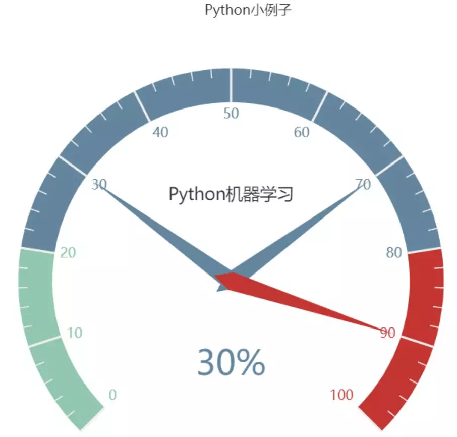
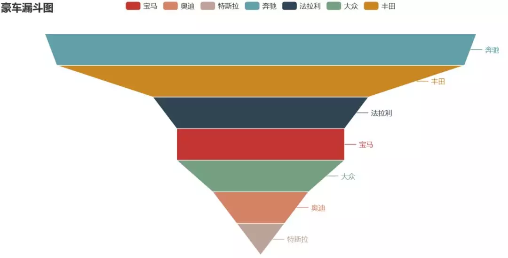
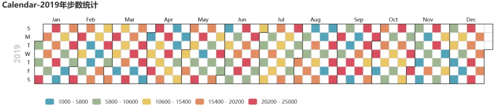
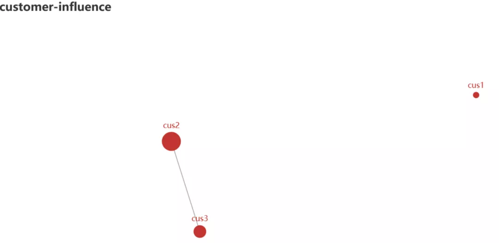
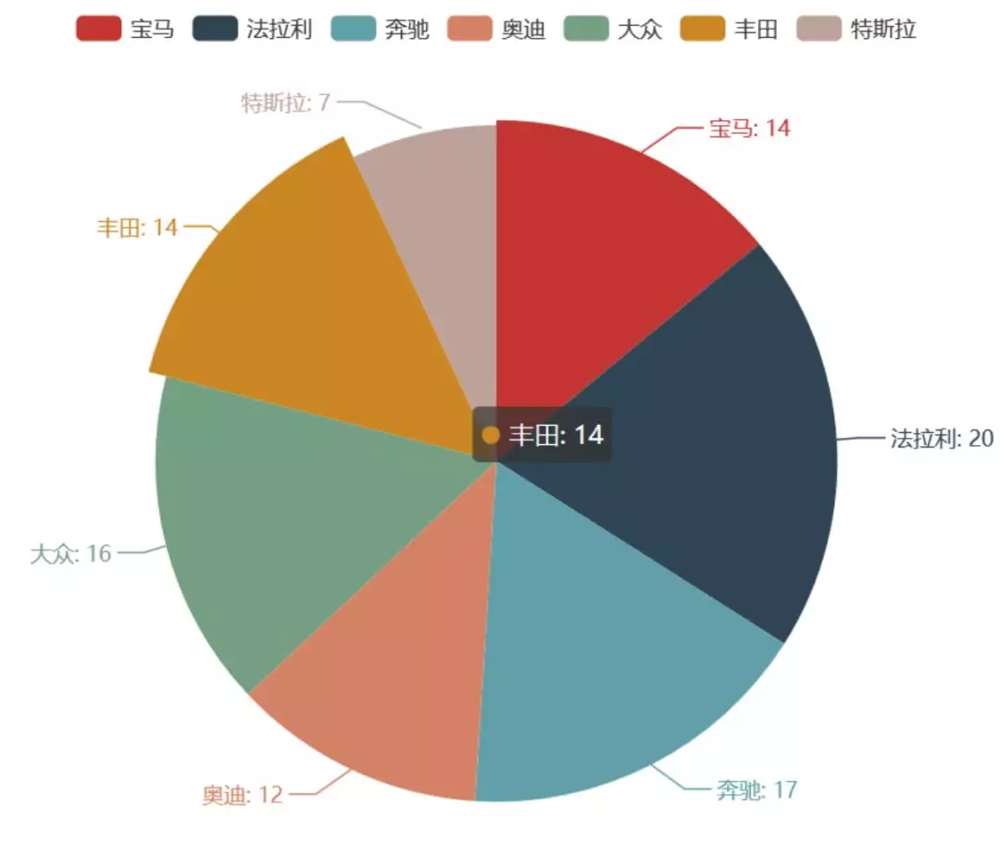
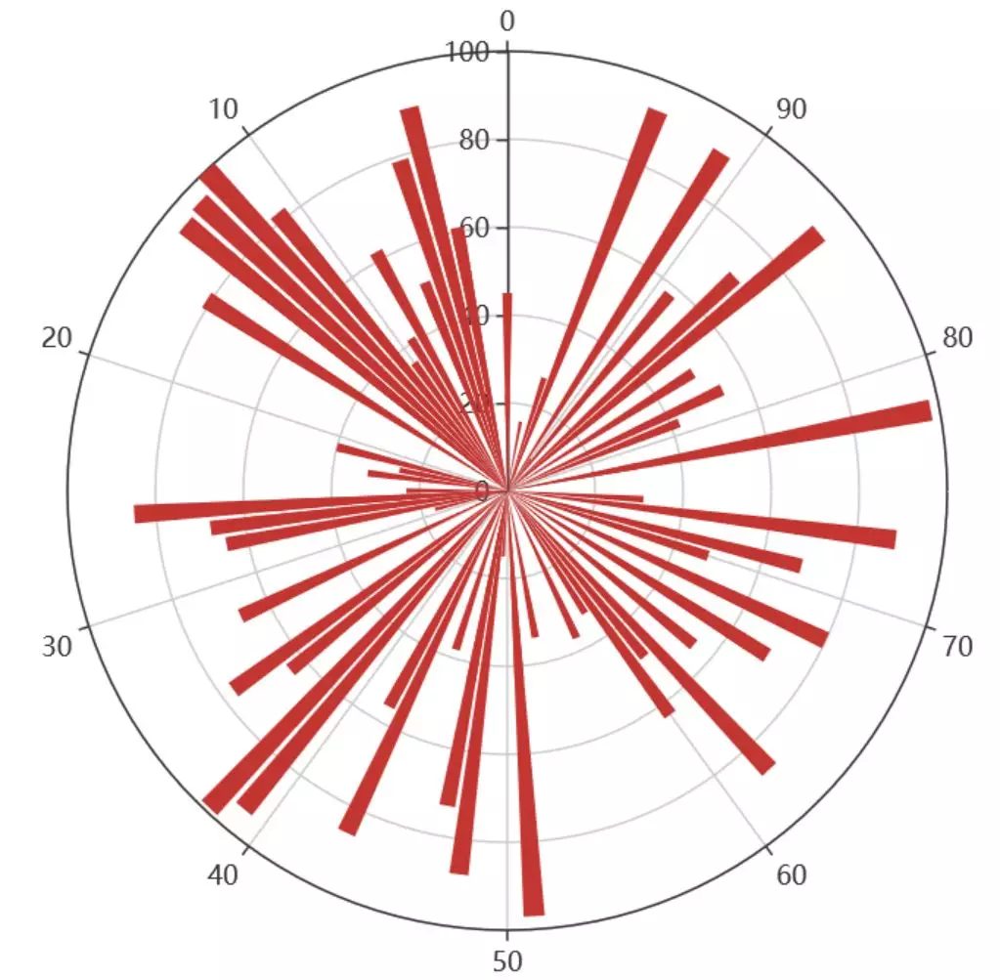
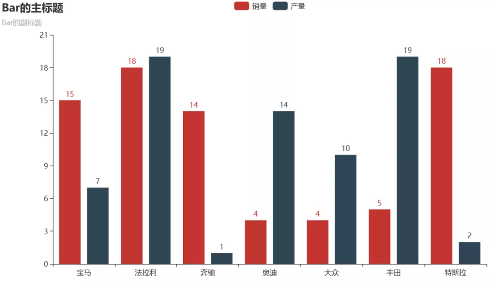
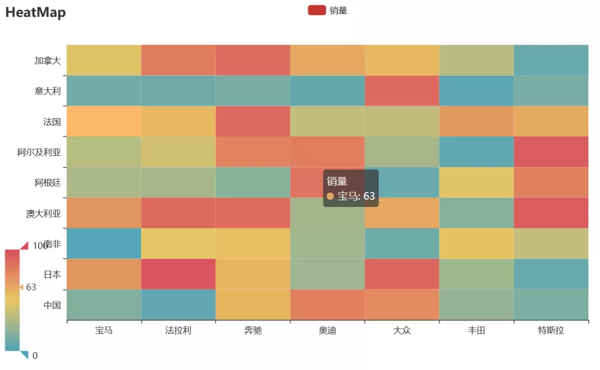

Python Pyecharts<br />使用`pip install pyecharts` 安装，安装后的版本为 v1.6<br />pyecharts几行代码就能绘制出有特色的的图形，绘图API链式调用，使用方便。
<a name="M4LgQ"></a>
### 1、仪表盘
```python
from pyecharts import charts

# 仪表盘
gauge = charts.Gauge()
gauge.add('Python小例子', [('Python机器学习', 30), ('Python基础', 70.),
                        ('Python正则', 90)])
gauge.render(path="./data/仪表盘.html")
print('ok')
```
仪表盘中共展示三项，每项的比例为30%,70%,90%，如下图默认名称显示第一项：Python机器学习，完成比例为30%<br />
<a name="P5k4T"></a>
### 2、漏斗图
```python
from pyecharts import options as opts
from pyecharts.charts import Funnel, Page
from random import randint

def funnel_base() -> Funnel:
    c = (
        Funnel()
        .add("豪车", [list(z) for z in zip(['宝马', '法拉利', '奔驰', '奥迪', '大众', '丰田', '特斯拉'],
                                         [randint(1, 20) for _ in range(7)])])
        .set_global_opts(title_opts=opts.TitleOpts(title="豪车漏斗图"))
    )
    return c
    
funnel_base().render('./img/car_funnel.html')
print('ok')
```

以7种车型及某个属性值绘制的漏斗图，属性值大越靠近漏斗的大端。<br />
<a name="CgoLZ"></a>
### 3、日历图
```python
import datetime
import random

from pyecharts import options as opts
from pyecharts.charts import Calendar


def calendar_interval_1() -> Calendar:
    begin = datetime.date(2019, 1, 1)
    end = datetime.date(2019, 12, 27)
    data = [
        [str(begin + datetime.timedelta(days=i)), random.randint(1000, 25000)]
        for i in range(0, (end - begin).days + 1, 2)  # 隔天统计
    ]

    calendar = (
        Calendar(init_opts=opts.InitOpts(width="1200px")).add(
            "", data, calendar_opts=opts.CalendarOpts(range_="2019"))
        .set_global_opts(
            title_opts=opts.TitleOpts(title="Calendar-2019年步数统计"),
            visualmap_opts=opts.VisualMapOpts(
                max_=25000,
                min_=1000,
                orient="horizontal",
                is_piecewise=True,
                pos_top="230px",
                pos_left="100px",
            ),
        )
    )
    return calendar


calendar_interval_1().render('./img/calendar.html')
print('ok')
```
绘制2019年1月1日到12月27日的步行数，官方给出的图形宽度900px不够，只能显示到9月份，本例使用`opts.InitOpts(width="1200px")`做出微调，并且visualmap显示所有步数，每隔一天显示一次：<br />
<a name="yPyCt"></a>
### 4、图(graph)
```python
import json
import os

from pyecharts import options as opts
from pyecharts.charts import Graph, Page


def graph_base() -> Graph:
    nodes = [
        {"name": "cus1", "symbolSize": 10},
        {"name": "cus2", "symbolSize": 30},
        {"name": "cus3", "symbolSize": 20}
    ]
    links = []
    for i in nodes:
        if i.get('name') == 'cus1':
            continue
        for j in nodes:
            if j.get('name') == 'cus1':
                continue
            links.append({"source": i.get("name"), "target": j.get("name")})
    c = (
        Graph()
        .add("", nodes, links, repulsion=8000)
        .set_global_opts(title_opts=opts.TitleOpts(title="customer-influence"))
    )
    return c
```
构建图，其中客户点1与其他两个客户都没有关系(link)，也就是不存在有效边：<br />
<a name="Fj2va"></a>
### 5、水球图
```python
from pyecharts import options as opts
from pyecharts.charts import Liquid, Page
from pyecharts.globals import SymbolType


def liquid() -> Liquid:
    c = (
        Liquid()
        .add("lq", [0.67, 0.30, 0.15])
        .set_global_opts(title_opts=opts.TitleOpts(title="Liquid"))
    )
    return c


liquid().render('./img/liquid.html')
```
水球图的取值[0.67, 0.30, 0.15]表示下图中的三个波浪线，一般代表三个百分比:<br />
<a name="lmSRx"></a>
### 6、饼图
```python
from pyecharts import options as opts
from pyecharts.charts import Pie
from random import randint

def pie_base() -> Pie:
    c = (
        Pie()
        .add("", [list(z) for z in zip(['宝马', '法拉利', '奔驰', '奥迪', '大众', '丰田', '特斯拉'],
                                       [randint(1, 20) for _ in range(7)])])
        .set_global_opts(title_opts=opts.TitleOpts(title="Pie-基本示例"))
        .set_series_opts(label_opts=opts.LabelOpts(formatter="{b}: {c}"))
    )
    return c

pie_base().render('./img/pie_pyecharts.html')
```

<a name="jCtEW"></a>
### 7、极坐标
```python
import random
from pyecharts import options as opts
from pyecharts.charts import Page, Polar

def polar_scatter0() -> Polar:
    data = [(alpha, random.randint(1, 100)) for alpha in range(101)] # r = random.randint(1, 100)
    print(data)
    c = (
        Polar()
        .add("", data, type_="bar", label_opts=opts.LabelOpts(is_show=False))
        .set_global_opts(title_opts=opts.TitleOpts(title="Polar"))
    )
    return c


polar_scatter0().render('./img/polar.html')
```
极坐标表示为(夹角,半径)，如(6,94)表示"夹角"为6，半径94的点：<br />
<a name="aRTyW"></a>
### 8、词云图
```python
from pyecharts import options as opts
from pyecharts.charts import Page, WordCloud
from pyecharts.globals import SymbolType


words = [
    ("Python", 100),
    ("C++", 80),
    ("Java", 95),
    ("R", 50),
    ("JavaScript", 79),
    ("C", 65)
]


def wordcloud() -> WordCloud:
    c = (
        WordCloud()
        # word_size_range: 单词字体大小范围
        .add("", words, word_size_range=[20, 100], shape='cardioid')
        .set_global_opts(title_opts=opts.TitleOpts(title="WordCloud"))
    )
    return c


wordcloud().render('./img/wordcloud.html')
```
("C",65)表示在本次统计中C语言出现65次<br />
<a name="ONM8a"></a>
### 9、系列柱状图
```python
from pyecharts import options as opts
from pyecharts.charts import Bar
from random import randint


def bar_series() -> Bar:
    c = (
        Bar()
        .add_xaxis(['宝马', '法拉利', '奔驰', '奥迪', '大众', '丰田', '特斯拉'])
        .add_yaxis("销量", [randint(1, 20) for _ in range(7)])
        .add_yaxis("产量", [randint(1, 20) for _ in range(7)])
        .set_global_opts(title_opts=opts.TitleOpts(title="Bar的主标题", subtitle="Bar的副标题"))
    )
    return c


bar_series().render('./img/bar_series.html')
```

<a name="BqWhh"></a>
### 10、热力图
```python
import random
from pyecharts import options as opts
from pyecharts.charts import HeatMap


def heatmap_car() -> HeatMap:
    x = ['宝马', '法拉利', '奔驰', '奥迪', '大众', '丰田', '特斯拉']
    y = ['中国','日本','南非','澳大利亚','阿根廷','阿尔及利亚','法国','意大利','加拿大']
    value = [[i, j, random.randint(0, 100)]
             for i in range(len(x)) for j in range(len(y))]
    c = (
        HeatMap()
        .add_xaxis(x)
        .add_yaxis("销量", y, value)
        .set_global_opts(
            title_opts=opts.TitleOpts(title="HeatMap"),
            visualmap_opts=opts.VisualMapOpts(),
        )
    )
    return c

heatmap_car().render('./img/heatmap_pyecharts.html')
```

